# JVM

理解及深入JVM

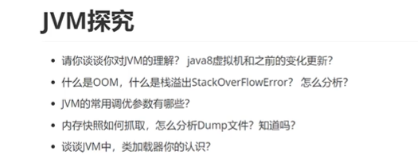	1.

1.jvm

运行在操作系统之上运行的虚拟机,跑的是java程序,使用C编写的

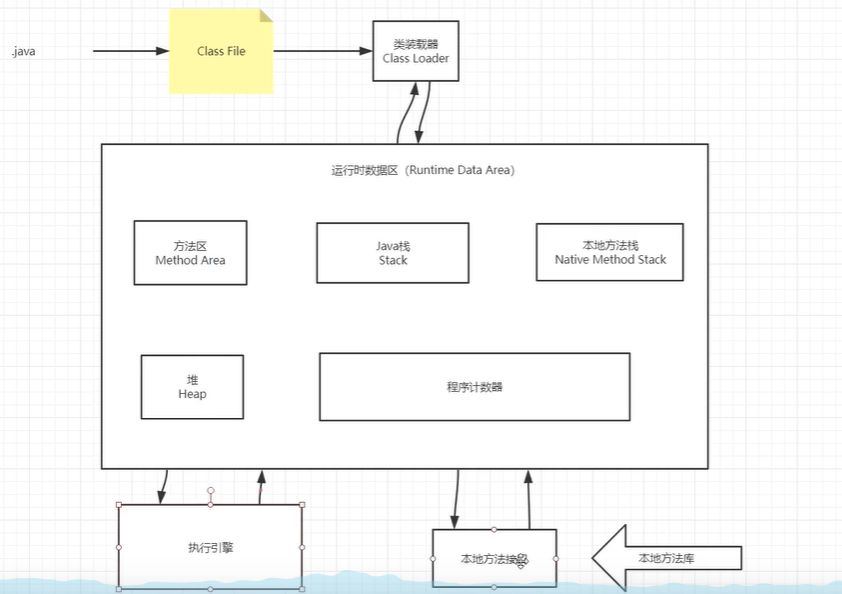


jvm架构图

 


## 3.类加载器

作用

​	加载class文件

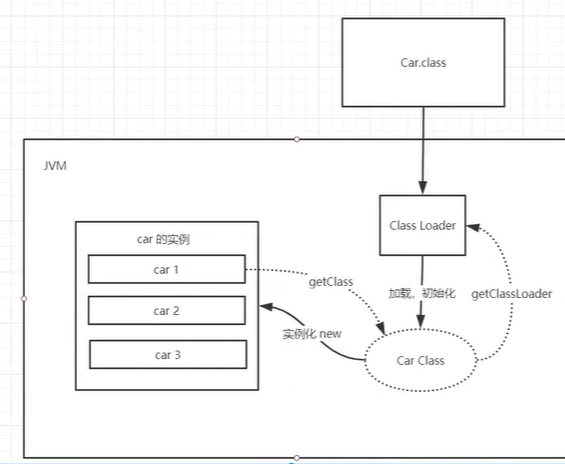


虚拟机自带的加载器

启动类(根)加载器

扩展类加载器

应用程序加载器

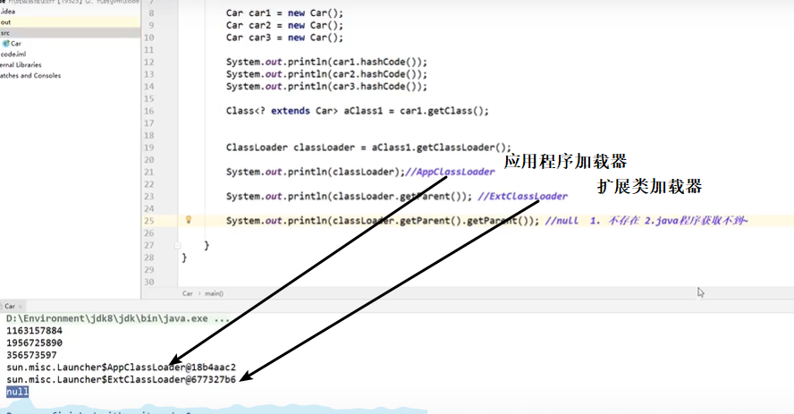


new对象的时候  引用放在栈里边 具体的实例放在堆里边

<<<<<<< HEAD
###  类加载器加载类的流程

```
1.类加载器收到类加载的请求
2.将这个请求向上委托给父类加载器去完成,一直向上委托,直到找到启动类加载器
3.启动类加载器检查是否能加在当前的这个类,能加载就结束,使用当前加载器,否则抛出异常,通知子加载器进行加载
4.重复步骤3
```

4.沙箱安全机制

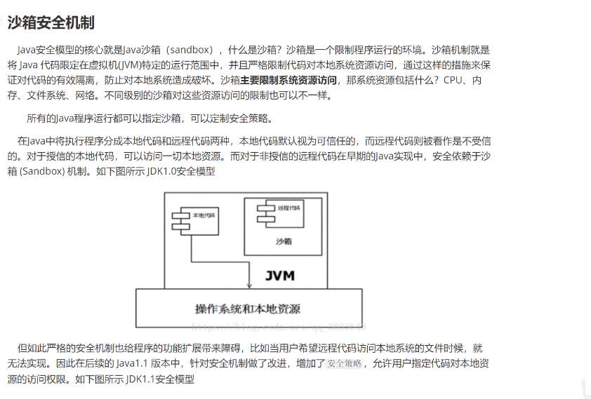

native和JNI

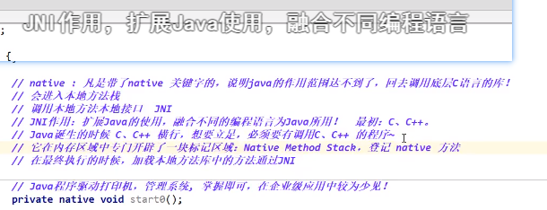

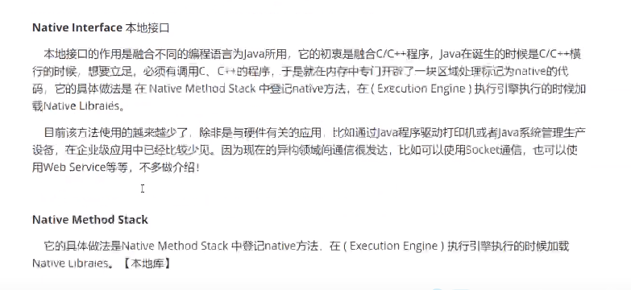


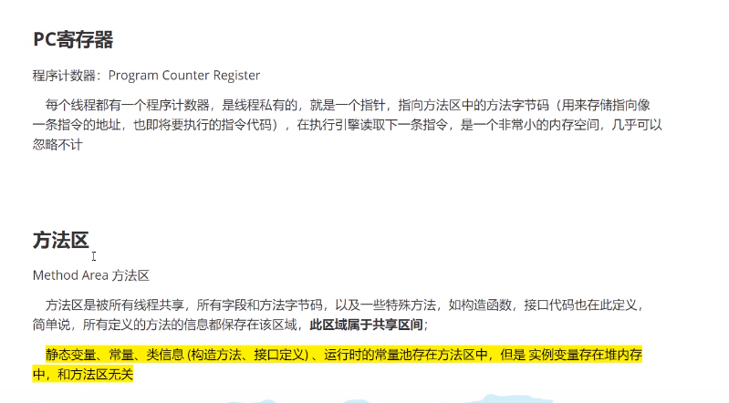
=======


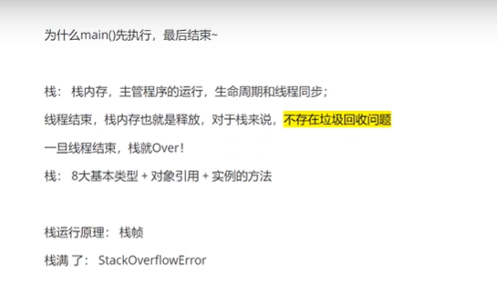


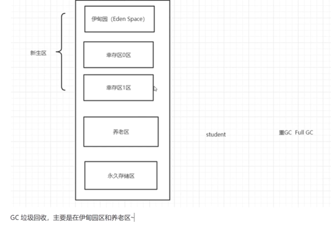

jdk1.8之后把去除永久区 以元空间替代


# 回顾

jdk  java 开发工具包

jre  java  运行环境

jvm  java虚拟机

## 编译型和解释性

方法的重载

函数名相同,参数不同,根据入参去匹配执行的函数

数组

静态初始化

```
int[] a = {1, 4, 6, 7}
大小固定
```

动态初始化

```
int[] a = null;
a = new int[10];
```

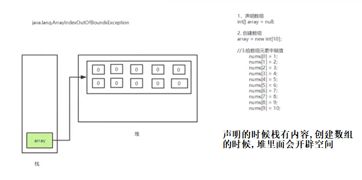

数组的方法   tostring  sort

Arrays.toString(a)   Arrays.Sort(a)

创建对象的内存分析

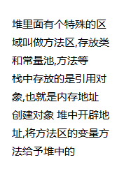


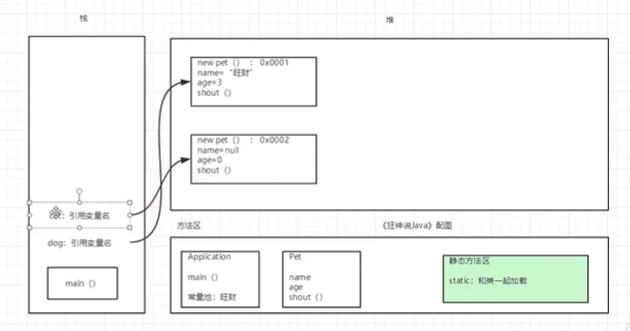


类与对象

类是一个模板,抽象,对象是类的一个具体的实例

方法  定义 调用

基本类型和引用类型  基本类型8种,除了基本就是引用

面向对象的三大特征

(封装继承多态)

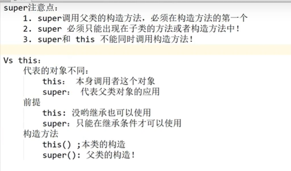


重写和重载

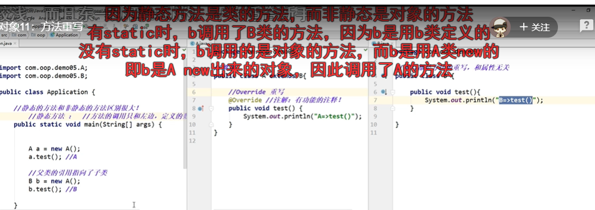


重写 


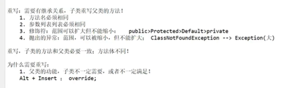


多态

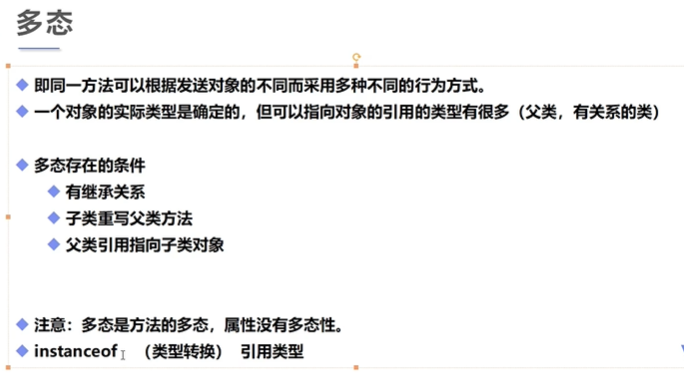

static

加了static静态变量

不加  成员变量

方法中的变量  局部变量

非静态方法可以调静态方法,静态方法不能调非静

匿名代码块和静态代码块

加static是静态代码块 只会执行一次  不加每次创建对象都会执行


# 注解和反射深入学习


## 框架底层实现机制就是注解和反射

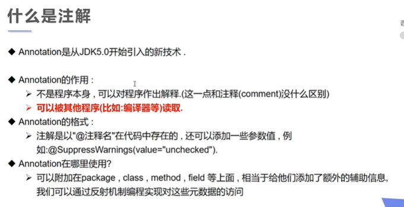

三个内置注解

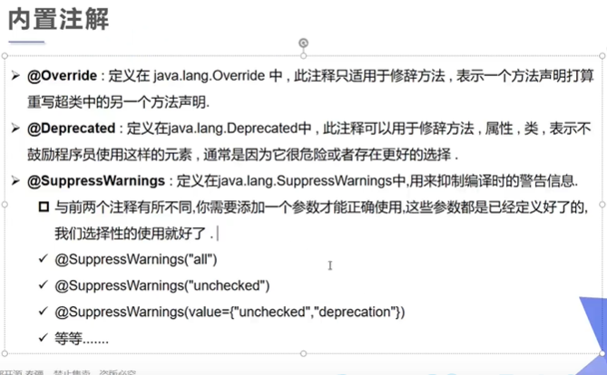


## 元注解

```

/**
 * 元注解是由sun公司提供的，用在自定义注解上的注解    元注解是注解自定义注解的
 * <p>
 * 元注解有两个
 *
 * @Target:约束自定义注解只能在哪里使用 默认可以在类，方法构造器，成员变量使用
 * @Retention申明注解的生命周期 申明注解的作用范围 编译时 运行时
 * @Target 作用 用来标识注解的使用位置 如果没有使用该注解，则自定义注解可以使用在任何位置
 * 可使用的值定义在ElementType枚举类中，
 * Type  类 接口
 * Field  成员变量
 * Method 成员方法
 * PARAMETER  方法参数
 * constructor  构造器
 * Local_variable局部变量
 * @Retention 作用  用来标识注解的生命周期
 * 常使用的
 * source作用在源码阶段。生成的字节码文件不可用
 * class 作用在源码字节码文件 运行时不可用
 * RUNTIME  注解作用在源码阶段，字节码文件阶段 运行阶段
 */
//@Book(name = "hht")  报错 因为只能注解在方法上
public class AnnotationDemo1 {
    @Book(name = "ly")
    public static void main(String[] args) {

    }
}

@Target(ElementType.METHOD)
@Retention(RetentionPolicy.RUNTIME)
        //申明注解从写代码到运行一直存在
@interface Book {
    String name();
}
```

## 自定义注解

```

@Book(value = "《mysql从删库到跑路》", price = 99.2, authors = {"ly", "ht"})
class BookStore {
    @Book(value = "《mysql从删库到跑路再回来》", price = 99.6, authors = {"ly1", "ht"})
    public void run() {

    }

}


@Target({ElementType.METHOD, ElementType.TYPE}) //在类和方法中使用
@Retention(RetentionPolicy.RUNTIME)
        //注解永久存活
@interface Book {
    String value();

    double price();

    String[] authors();
}

例子2

public class Test02 {

    @myAnnotation(value = "lyy", id = 2)
    public void test(){

    }
}


//自定义注解

@Target({ElementType.TYPE,ElementType.METHOD})
@Retention(RetentionPolicy.RUNTIME)
@interface myAnnotation{
    //不是一个方法,是一个参数
    String value();

    //定义有默认值的注解
    int id() default -1;
}

自定义注解的情况  可以设置默认值 
```

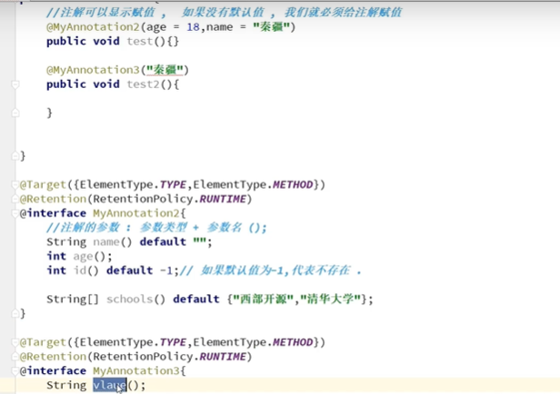


# 反射(重点)

java Reflection

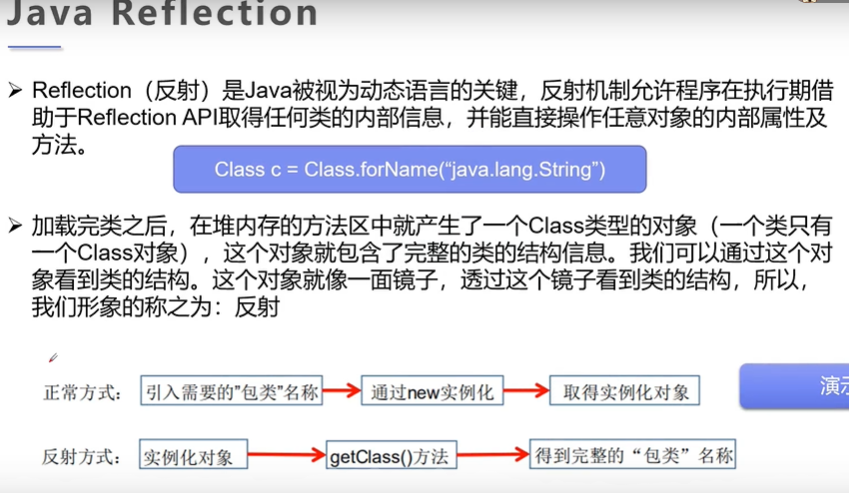

## 1.Class类

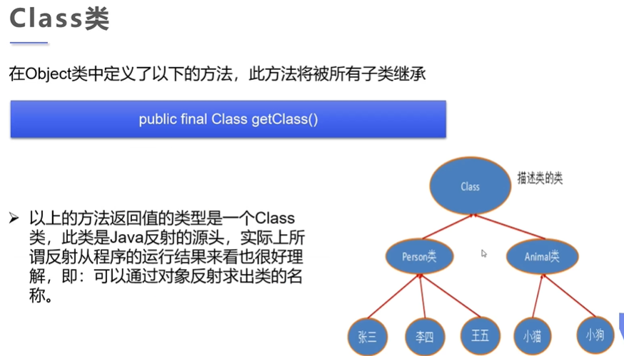

一个类在内存中只有一个class对象,一个类被加载后,类的整个结构都会被封装在Class对象中

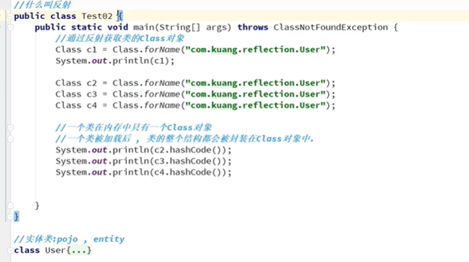

## 2.通过反射可以得到class类,通过class类的API

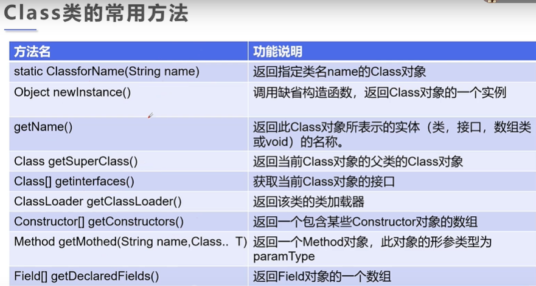


## 3.获取Class类的实例

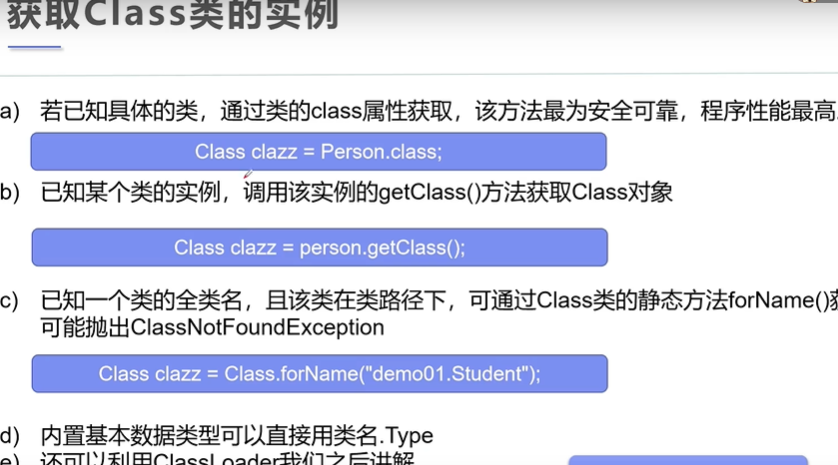

## 4.哪些类型可以有class对象

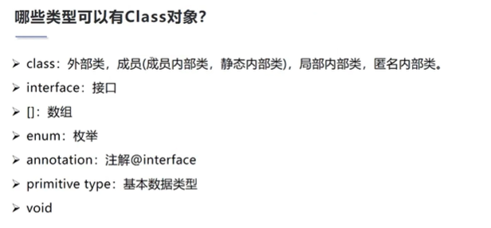


>>>>>>> e77ae00e89a1807cd56c2a2e4510a24c7d9439a7


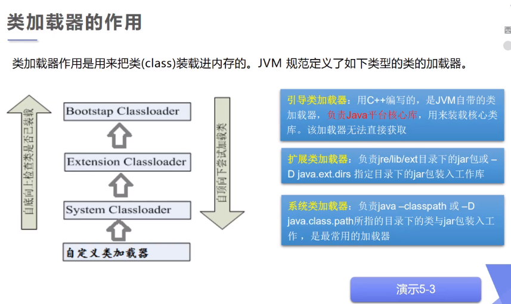

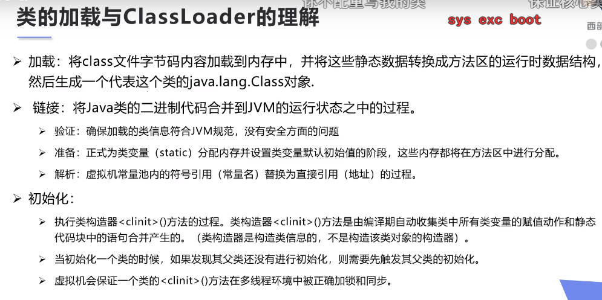

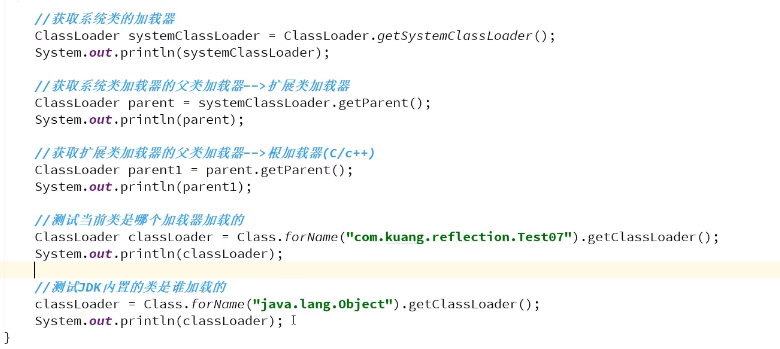