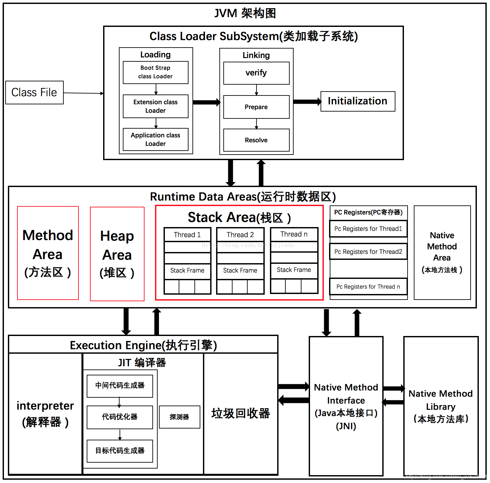

# JVM

理解及深入JVM

	1.

1.jvm

运行在操作系统之上运行的虚拟机,跑的是java程序,使用C编写的


jvm架构图

 


## 3.类加载器

作用

​	加载class文件


虚拟机自带的加载器

启动类(根)加载器

扩展类加载器

应用程序加载器


new对象的时候  引用放在栈里边 具体的实例放在堆里边

###  类加载器加载类的流程

```
1.类加载器收到类加载的请求
2.将这个请求向上委托给父类加载器去完成,一直向上委托,直到找到启动类加载器
3.启动类加载器检查是否能加在当前的这个类,能加载就结束,使用当前加载器,否则抛出异常,通知子加载器进行加载
4.重复步骤3
```

4.沙箱安全机制


native和JNI


