# Spring

## spring快速入门

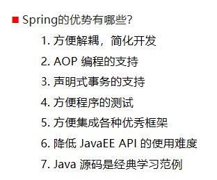	1.方便解耦，简化开发

spring的体系结构

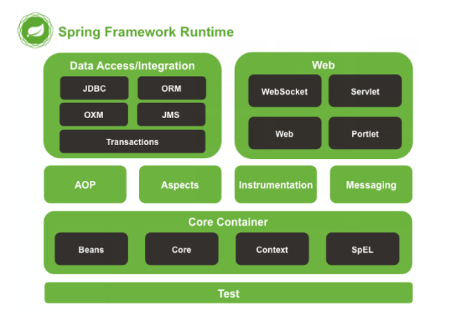

Core Container核心容器

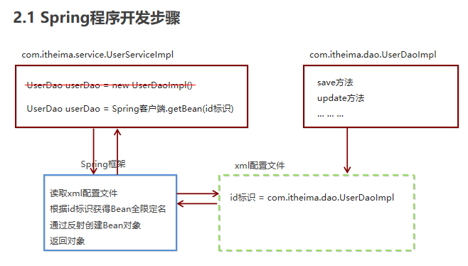

使用Spring容器配置文件为了解耦

spring程序开发的步骤

​	

```
1.导入Spring开发的基本包坐标
2.编写dao接口和实现类
3.创建Spring 核心配置XML文件
4.在Spring配置文件中配置UserDaoImpl
5.使用Spring的客户端APi获取对象
```

## spring配置文件

```
<bean id="userDao" class="cn.gsxt.dao.impl.userDaoImpl"></bean>
```

这种配置写法默认调用的是类中的无参构造函数，如果没有无参构造函数则不能创建成功

### 基本属性   

​		id  Bean实例在容器中的唯一标识

​		class  Bean的全限名

​		scope

​			singleton 默认的，单例的

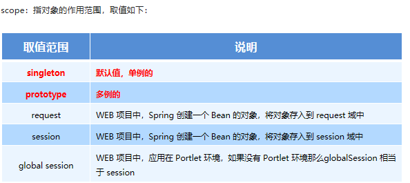

​			singleton  容器中存在唯一一个对象

​			prototype  容器存在多个对象

### 对象Bean的创建时机

​	singleton  配置文件加载的时候，创建Spring容器的时候，就创建Bean对象

​	prototype 在使用容器getBean获取对象的时候才创建

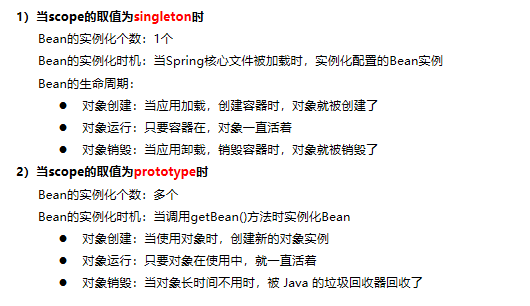


### Bean的生命周期

init-method属性    destory-method属性

```
init-method  初始化方法
destory     销毁方法

public class userDaoImpl implements userDao {
    public userDaoImpl() {
        System.out.println("userDaoImpl创建...");
    }

    public void init(){
        System.out.println("初始化方法");
    }

    public void save() {
        System.out.println("save running");
    }

    public void destory(){
        System.out.println("销毁方法");
    }
}
```


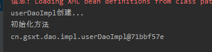


### Bean实例化的三种方式

无参构造方法实例化

工厂静态方法实例化   factoryMethod = “工厂类的静态方法名” 属性  Spring解析的时候找到这个属性会解析这个工厂静态方法（下面的两种一般用于无法自己直接new对象的情况，无法通过无参构造获取）

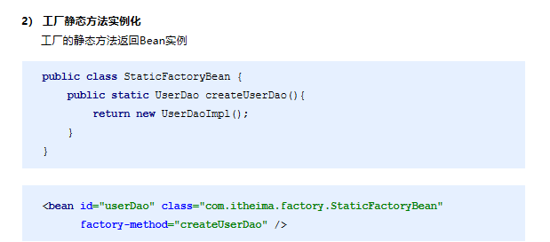

工厂实例方法

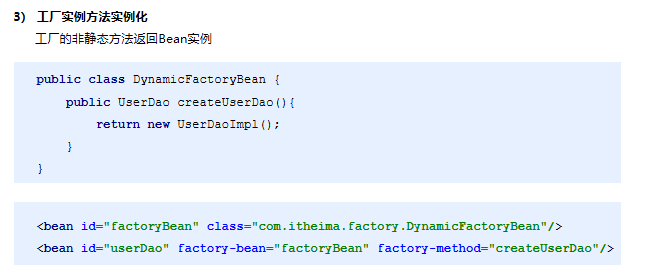

## bean的依赖注入

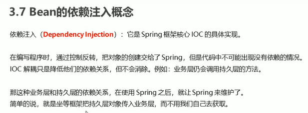

### 依赖注入的两种方式

set 方法

```
 <bean id="userDao" class="cn.gsxt.dao.impl.userDaoImpl"></bean>
 <bean id="userService" class="cn.gsxt.service.impl.UserServiceImpl">
  	<property name="userDao" ref="userDao"></property>
 </bean>
 
 把容器内部的userDao通过UserService中的setUserDAO方法注给service,name指的是set方法的属性值，ref指要注入的对象在配置文件中的唯一标识ID
```

有参构造

```
 <bean id="userDao" class="cn.gsxt.dao.impl.userDaoImpl"></bean>
 <bean id="userService" class="cn.gsxt.service.impl.UserServiceImpl">
  	<constructor-arg name="userDao" ref="userDao"></constructor-arg>
  </bean>
  name为构造方法的参数名，ref为xml中bean的唯一标识id
```

### Bean的依赖注入的数据类型

除了对象的引用可以注入，普通数据类型，集合等都可以在容器中进行注入

普通数据类型

xml文件property标签中用value来接收值

引用数据类型

集合数据类型

Spring的重点配置

```
<bean>标签
	id属性 在容器中Bean实例的唯一标识，不允许重复
	class属性  在容器中Bean实例的全路径名
	scope属性  Bean实例的作用范围 Singleton(默认) prototype
	<proterty>标签 属性注入 set方法的依赖注入
		name属性:属性名称  set方法后面的值的第一个字母小写
		value属性 注入的普通属性值
		ref属性 注入的对象的引用值
		<list>标签
		<map>标签
		<properties> 标签
	<constructor-arg>  有参构造方法设置依赖注入
		name属性:属性名称  set方法后面的值的第一个字母小写
		value属性 注入的普通属性值
		ref属性 注入的对象的引用值
		<list>标签
		<map>标签
		<properties> 标签
	<import>标签 导入其他spring的分配置文件
	
	
	
```

Spring相关的API

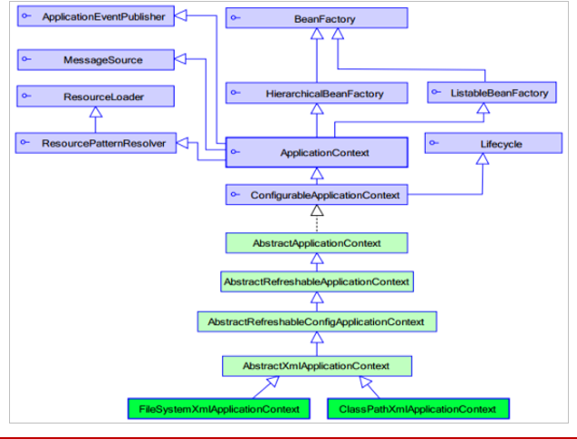

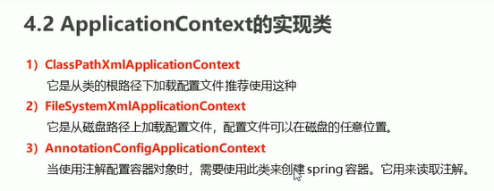

### getBean方法

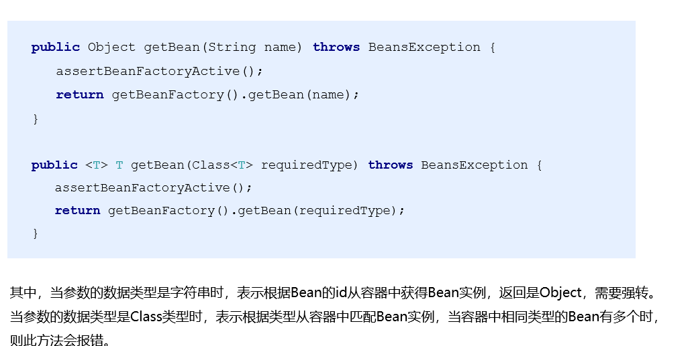

## spring容器加载配置文件

```
context命名空间下的
<context:property-placeholder location="classpath:jdbc.properties"></context:property-placeholder>
```

# spring注解开发

是一种趋势,提高开发效率

## 原始注解


  使用xml配置的方式,setattr方法需要写,因为是spring通过反射调用,注解配置不需要,通过反射直接为属性赋值


@VALUE属性

```
 @Value("${jdbc.driver}") //xml配置文件已加载properties
  private String lyy;
  从容器中获取jdbc.driver对应的值注入给lyy
```

## spring新注解

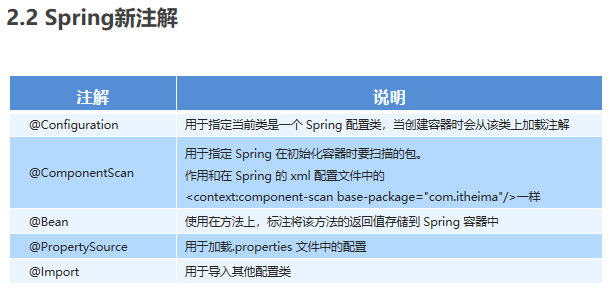

## Spring集成junit单元测试

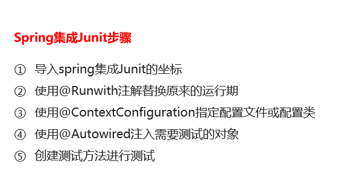

# AOP

​	什么是aop

​	

```
面向切面编程，通过预编译方式和运行期动态代理实现程序功能的统一维护的一种技术，利用AOP可以对业务逻辑的各个部分进行隔离，降低耦合度，提高代码重用性，提高开发效率
作用
	在程序运行期间，不修改源码的情况下对方法进行增强
优势
	减少重复代码，提高开发效率
```

AOP的相关概念

```
spring的AOP的实现底层就是对动态代理实现的代码进行封装
```

AOP的相关术语

Target （目标对象）代理的目标对象

Proxy   (代理)一个类被AOP织入增强后，产生一个结果代理类

JointPoint（连接点） 指被拦截到的点，在spring中，这些点指的是方法，因为spring只支持方法类型的连接点。（拦截到这些方法，才能增强     可以被增强的方法才可以叫做连接点）

### 重点

#### PointCut(切入点)     

要对哪些JoinPoint进行拦截的定义

##### Advice(通知，增强)   

拦截到JoinPoint之后要做的事情就是通知

##### Aspect (切面)   

切入点和通知的结合

Weaving(织入) 是指把增强应用到 目标对象 来创建新的代理对象的过程     切点和通知结合的过程

### Aop开发

1.需要编写的内容

​	

```
编写核心业务代码（目标类的目标方法）
编写切面类，切面类中有通知（增强功能方法）
在配置文件中，配置织入关系，将哪些通知（增强）与哪些连接点（被拦截的方法）进行结合

```

AOP技术实现的内容

Spring框架监控切入点方法的执行，一旦监控到切入点的方法被执行，使用代理机制，动态创建m目标对象的代理对象，根据通知类别，在代理对象的对应位置，将通知对应的功能织入，完成完整的代码逻辑运行

代理使用

Spring会根据目标类是否实现了接口来决定采用哪种动态代理的方式（jdk or Cglib）


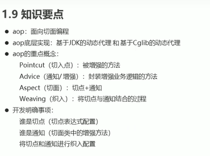


```
<!--    配置织入 高速spring框架哪些方法(切点)需要进行哪些增强(前置,后置)-->
    <aop:config>
<!--&lt;!&ndash;        aop:aspect  告诉spring框架 &ndash;&gt;-->
        <aop:aspect ref="myAspect" >
            <aop:before method="before" pointcut="execution(public void cn.gsxt.aop.impl.targetImpl.save())"/>
        </aop:aspect>
    </aop:config>
```


#### 2.2 XML 配置 AOP 详解

##### 1) 切点表达式的写法

表达式语法：

```java
execution([修饰符] 返回值类型 包名.类名.方法名(参数))
```

- 访问修饰符可以省略
- 返回值类型、包名、类名、方法名可以使用星号*  代表任意
- 包名与类名之间一个点 . 代表当前包下的类，两个点 .. 表示当前包及其子包下的类
- 参数列表可以使用两个点 .. 表示任意个数，任意类型的参数列表

例如：

```xml
execution(public void com.itheima.aop.Target.method())	
execution(void com.itheima.aop.Target.*(..))
execution(* com.itheima.aop.*.*(..))
execution(* com.itheima.aop..*.*(..))
execution(* *..*.*(..))
```

##### 2) 通知的类型

通知的配置语法：

```xml
<aop:通知类型 method=“切面类中方法名” pointcut=“切点表达式"></aop:通知类型>
```

-Spring/day03_%20AOP%E7%AE%80%E4%BB%8B/%E7%AC%94%E8%AE%B0/img/%E5%9B%BE%E7%89%875.png)

##### 

切点表达式的抽取

当多个增强的切点表达式相同时,可以将切点表达式进行抽取,在增强中使用pointcut-ref来引用抽取后的切点表达式

注解配置AOP开发


```
1.创建目标接口和目标类(内部有切点)
2.创建切面类(内部有增强方法)
3.将目标类和切面类的对象创建权交给spring
4.在切面类中使用注解配置织入关系
5.在配置文件中开启组件扫描和AOP自动代理
6.测试
```


事务的隔离级别

事务并发可能会脏读，不可重复读 续读

事物的传播行为

REQUIRED  如果当前没有事务，就新建一个事务，如果已经存在一个事务，就加入到这个事务默认值


事务的超时时间，是否只读


声明式事务控制（xml和注解）

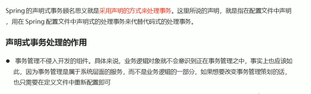

事务的命名空间

```
xmlns:tx="http://www.springframework.org/schema/tx"

```

切点方法的事务参数的配置

```
<!--通知,事物的增强-->
    <tx:advice id="txAdvice" transaction-manager="transactionManger">
<!--        设置事务的属性信息-->
        <tx:attributes>
<!--        可以配置多个,对不同的方法进行不同的事务控制    <tx:method name="transfer"/>-->
<!--            <tx:method name="transfer" isolation="REPEATABLE_READ" timeout="-1"/>-->
            <tx:method name="*"/>
        </tx:attributes>
    </tx:advice>
```

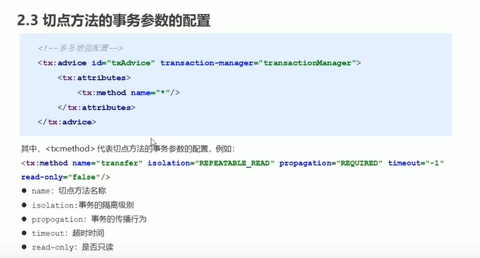


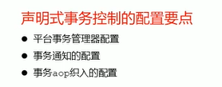

```
<?xml version="1.0" encoding="UTF-8"?>
<beans xmlns="http://www.springframework.org/schema/beans"
       xmlns:xsi="http://www.w3.org/2001/XMLSchema-instance"
       xmlns:aop="http://www.springframework.org/schema/aop"
       xmlns:tx="http://www.springframework.org/schema/tx"
       xsi:schemaLocation="
       http://www.springframework.org/schema/beans http://www.springframework.org/schema/beans/spring-beans.xsd
       http://www.springframework.org/schema/aop http://www.springframework.org/schema/aop/spring-aop.xsd
       http://www.springframework.org/schema/tx http://www.springframework.org/schema/tx/spring-tx.xsd
">

    <bean id="dataSource" class="com.mchange.v2.c3p0.ComboPooledDataSource">
        <property name="driverClass" value="com.mysql.jdbc.Driver"/>
        <property name="jdbcUrl" value="jdbc:mysql://localhost:3306/spring_test"/>
        <property name="user" value="root"/>
        <property name="password" value="123"/>
    </bean>

    <bean id="jdbcTemplate" class="org.springframework.jdbc.core.JdbcTemplate">
        <property name="dataSource" ref="dataSource"/>
    </bean>

    <bean id="accountDao" class="cn.gsxt.dao.impl.AccountDaoImpl">
        <property name="jdbcTemplate" ref="jdbcTemplate"/>
    </bean>

<!--        目标对象,内部的方法就是切点-->
    <bean id="accountService" class="cn.gsxt.service.impl.AccountServiceImpl">
        <property name="accountDao" ref="accountDao"/>
    </bean>
<!--    配置平台事务管理器
transactionManger 底层会从DataSource拿一个连接来进行事务控制
-->
    <bean id="transactionManger" class="org.springframework.jdbc.datasource.DataSourceTransactionManager">
        <property name="dataSource" ref="dataSource"/>
    </bean>
<!--通知,事物的增强-->
    <tx:advice id="txAdvice" transaction-manager="transactionManger">
<!--        设置事务的属性信息-->
        <tx:attributes>
<!--        可以配置多个,对不同的方法进行不同的事务控制    <tx:method name="transfer"/>-->
<!--            <tx:method name="transfer" isolation="REPEATABLE_READ" timeout="-1"/>-->
            <tx:method name="*"/>
        </tx:attributes>
    </tx:advice>

<!--    需要配置事务的AOP注入-->
    <aop:config>
<!--        事务增强用advice-->
        <aop:advisor advice-ref="txAdvice" pointcut="execution(* cn.gsxt.service.impl.*.*(..))"></aop:advisor>
    </aop:config>


</beans>
```

注解配置的知识要点

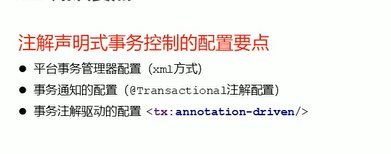

```

```

