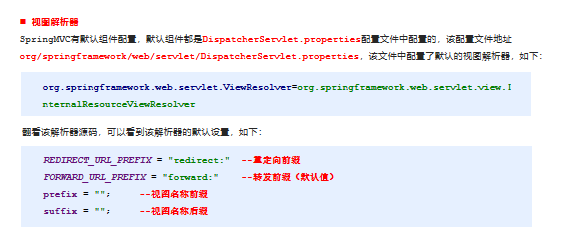
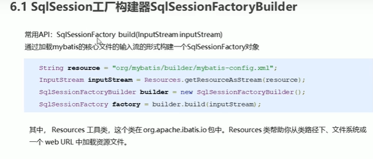

# Spring

## spring快速入门

	1.方便解耦，简化开发

spring的体系结构


Core Container核心容器


使用Spring容器配置文件为了解耦

spring程序开发的步骤

​	

```
1.导入Spring开发的基本包坐标
2.编写dao接口和实现类
3.创建Spring 核心配置XML文件
4.在Spring配置文件中配置UserDaoImpl
5.使用Spring的客户端APi获取对象
```

## spring配置文件

```
<bean id="userDao" class="cn.gsxt.dao.impl.userDaoImpl"></bean>
```

这种配置写法默认调用的是类中的无参构造函数，如果没有无参构造函数则不能创建成功

### 基本属性   

​		id  Bean实例在容器中的唯一标识

​		class  Bean的全限名

​		scope

​			singleton 默认的，单例的


​			singleton  容器中存在唯一一个对象

​			prototype  容器存在多个对象

### 对象Bean的创建时机

​	singleton  配置文件加载的时候，创建Spring容器的时候，就创建Bean对象

​	prototype 在使用容器getBean获取对象的时候才创建


### Bean的生命周期

init-method属性    destory-method属性

```
init-method  初始化方法
destory     销毁方法

public class userDaoImpl implements userDao {
    public userDaoImpl() {
        System.out.println("userDaoImpl创建...");
    }

    public void init(){
        System.out.println("初始化方法");
    }

    public void save() {
        System.out.println("save running");
    }

    public void destory(){
        System.out.println("销毁方法");
    }
}
```


### Bean实例化的三种方式

无参构造方法实例化

工厂静态方法实例化   factoryMethod = “工厂类的静态方法名” 属性  Spring解析的时候找到这个属性会解析这个工厂静态方法（下面的两种一般用于无法自己直接new对象的情况，无法通过无参构造获取）


工厂实例方法


## bean的依赖注入


### 依赖注入的两种方式

set 方法

```
 <bean id="userDao" class="cn.gsxt.dao.impl.userDaoImpl"></bean>
 <bean id="userService" class="cn.gsxt.service.impl.UserServiceImpl">
  	<property name="userDao" ref="userDao"></property>
 </bean>
 
 把容器内部的userDao通过UserService中的setUserDAO方法注给service,name指的是set方法的属性值，ref指要注入的对象在配置文件中的唯一标识ID
```

有参构造

```
 <bean id="userDao" class="cn.gsxt.dao.impl.userDaoImpl"></bean>
 <bean id="userService" class="cn.gsxt.service.impl.UserServiceImpl">
  	<constructor-arg name="userDao" ref="userDao"></constructor-arg>
  </bean>
  name为构造方法的参数名，ref为xml中bean的唯一标识id
```

### Bean的依赖注入的数据类型

除了对象的引用可以注入，普通数据类型，集合等都可以在容器中进行注入

普通数据类型

xml文件property标签中用value来接收值

引用数据类型

集合数据类型

Spring的重点配置

```
<bean>标签
	id属性 在容器中Bean实例的唯一标识，不允许重复
	class属性  在容器中Bean实例的全路径名
	scope属性  Bean实例的作用范围 Singleton(默认) prototype
	<proterty>标签 属性注入 set方法的依赖注入
		name属性:属性名称  set方法后面的值的第一个字母小写
		value属性 注入的普通属性值
		ref属性 注入的对象的引用值
		<list>标签
		<map>标签
		<properties> 标签
	<constructor-arg>  有参构造方法设置依赖注入
		name属性:属性名称  set方法后面的值的第一个字母小写
		value属性 注入的普通属性值
		ref属性 注入的对象的引用值
		<list>标签
		<map>标签
		<properties> 标签
	<import>标签 导入其他spring的分配置文件
	
	
	
```

Spring相关的API


### getBean方法


## spring容器加载配置文件

```
context命名空间下的
<context:property-placeholder location="classpath:jdbc.properties"></context:property-placeholder>
```

# spring注解开发

是一种趋势,提高开发效率

## 原始注解


  使用xml配置的方式,setattr方法需要写,因为是spring通过反射调用,注解配置不需要,通过反射直接为属性赋值


@VALUE属性

```
 @Value("${jdbc.driver}") //xml配置文件已加载properties
  private String lyy;
  从容器中获取jdbc.driver对应的值注入给lyy
```

## spring新注解


## Spring集成junit单元测试


# AOP

​	什么是aop

​	

```
面向切面编程，通过预编译方式和运行期动态代理实现程序功能的统一维护的一种技术，利用AOP可以对业务逻辑的各个部分进行隔离，降低耦合度，提高代码重用性，提高开发效率
作用
	在程序运行期间，不修改源码的情况下对方法进行增强
优势
	减少重复代码，提高开发效率
```

AOP的相关概念

```
spring的AOP的实现底层就是对动态代理实现的代码进行封装
```

AOP的相关术语

Target （目标对象）代理的目标对象

Proxy   (代理)一个类被AOP织入增强后，产生一个结果代理类

JointPoint（连接点） 指被拦截到的点，在spring中，这些点指的是方法，因为spring只支持方法类型的连接点。（拦截到这些方法，才能增强     可以被增强的方法才可以叫做连接点）

### 重点

#### PointCut(切入点)     

要对哪些JoinPoint进行拦截的定义

##### Advice(通知，增强)   

拦截到JoinPoint之后要做的事情就是通知

##### Aspect (切面)   

切入点和通知的结合

Weaving(织入) 是指把增强应用到 目标对象 来创建新的代理对象的过程     切点和通知结合的过程

### Aop开发

1.需要编写的内容

​	

```
编写核心业务代码（目标类的目标方法）
编写切面类，切面类中有通知（增强功能方法）
在配置文件中，配置织入关系，将哪些通知（增强）与哪些连接点（被拦截的方法）进行结合

```

AOP技术实现的内容

Spring框架监控切入点方法的执行，一旦监控到切入点的方法被执行，使用代理机制，动态创建m目标对象的代理对象，根据通知类别，在代理对象的对应位置，将通知对应的功能织入，完成完整的代码逻辑运行

代理使用

Spring会根据目标类是否实现了接口来决定采用哪种动态代理的方式（jdk or Cglib）


```
<!--    配置织入 高速spring框架哪些方法(切点)需要进行哪些增强(前置,后置)-->
    <aop:config>
<!--&lt;!&ndash;        aop:aspect  告诉spring框架 &ndash;&gt;-->
        <aop:aspect ref="myAspect" >
            <aop:before method="before" pointcut="execution(public void cn.gsxt.aop.impl.targetImpl.save())"/>
        </aop:aspect>
    </aop:config>
```


#### 2.2 XML 配置 AOP 详解

##### 1) 切点表达式的写法

表达式语法：

```java
execution([修饰符] 返回值类型 包名.类名.方法名(参数))
```

- 访问修饰符可以省略
- 返回值类型、包名、类名、方法名可以使用星号*  代表任意
- 包名与类名之间一个点 . 代表当前包下的类，两个点 .. 表示当前包及其子包下的类
- 参数列表可以使用两个点 .. 表示任意个数，任意类型的参数列表

例如：

```xml
execution(public void com.itheima.aop.Target.method())	
execution(void com.itheima.aop.Target.*(..))
execution(* com.itheima.aop.*.*(..))
execution(* com.itheima.aop..*.*(..))
execution(* *..*.*(..))
```

##### 2) 通知的类型

通知的配置语法：

```xml
<aop:通知类型 method=“切面类中方法名” pointcut=“切点表达式"></aop:通知类型>
```

-Spring/day03_%20AOP%E7%AE%80%E4%BB%8B/%E7%AC%94%E8%AE%B0/img/%E5%9B%BE%E7%89%875.png)

##### 

切点表达式的抽取

当多个增强的切点表达式相同时,可以将切点表达式进行抽取,在增强中使用pointcut-ref来引用抽取后的切点表达式

注解配置AOP开发


```
1.创建目标接口和目标类(内部有切点)
2.创建切面类(内部有增强方法)
3.将目标类和切面类的对象创建权交给spring
4.在切面类中使用注解配置织入关系
5.在配置文件中开启组件扫描和AOP自动代理
6.测试
```


事务的隔离级别

事务并发可能会脏读，不可重复读 续读

事物的传播行为

REQUIRED  如果当前没有事务，就新建一个事务，如果已经存在一个事务，就加入到这个事务默认值


事务的超时时间，是否只读


声明式事务控制（xml和注解）


事务的命名空间

```
xmlns:tx="http://www.springframework.org/schema/tx"

```

切点方法的事务参数的配置

```
<!--通知,事物的增强-->
    <tx:advice id="txAdvice" transaction-manager="transactionManger">
<!--        设置事务的属性信息-->
        <tx:attributes>
<!--        可以配置多个,对不同的方法进行不同的事务控制    <tx:method name="transfer"/>-->
<!--            <tx:method name="transfer" isolation="REPEATABLE_READ" timeout="-1"/>-->
            <tx:method name="*"/>
        </tx:attributes>
    </tx:advice>
```


```
<?xml version="1.0" encoding="UTF-8"?>
<beans xmlns="http://www.springframework.org/schema/beans"
       xmlns:xsi="http://www.w3.org/2001/XMLSchema-instance"
       xmlns:aop="http://www.springframework.org/schema/aop"
       xmlns:tx="http://www.springframework.org/schema/tx"
       xsi:schemaLocation="
       http://www.springframework.org/schema/beans http://www.springframework.org/schema/beans/spring-beans.xsd
       http://www.springframework.org/schema/aop http://www.springframework.org/schema/aop/spring-aop.xsd
       http://www.springframework.org/schema/tx http://www.springframework.org/schema/tx/spring-tx.xsd
">

    <bean id="dataSource" class="com.mchange.v2.c3p0.ComboPooledDataSource">
        <property name="driverClass" value="com.mysql.jdbc.Driver"/>
        <property name="jdbcUrl" value="jdbc:mysql://localhost:3306/spring_test"/>
        <property name="user" value="root"/>
        <property name="password" value="123"/>
    </bean>

    <bean id="jdbcTemplate" class="org.springframework.jdbc.core.JdbcTemplate">
        <property name="dataSource" ref="dataSource"/>
    </bean>

    <bean id="accountDao" class="cn.gsxt.dao.impl.AccountDaoImpl">
        <property name="jdbcTemplate" ref="jdbcTemplate"/>
    </bean>

<!--        目标对象,内部的方法就是切点-->
    <bean id="accountService" class="cn.gsxt.service.impl.AccountServiceImpl">
        <property name="accountDao" ref="accountDao"/>
    </bean>
<!--    配置平台事务管理器
transactionManger 底层会从DataSource拿一个连接来进行事务控制
-->
    <bean id="transactionManger" class="org.springframework.jdbc.datasource.DataSourceTransactionManager">
        <property name="dataSource" ref="dataSource"/>
    </bean>
<!--通知,事物的增强-->
    <tx:advice id="txAdvice" transaction-manager="transactionManger">
<!--        设置事务的属性信息-->
        <tx:attributes>
<!--        可以配置多个,对不同的方法进行不同的事务控制    <tx:method name="transfer"/>-->
<!--            <tx:method name="transfer" isolation="REPEATABLE_READ" timeout="-1"/>-->
            <tx:method name="*"/>
        </tx:attributes>
    </tx:advice>

<!--    需要配置事务的AOP注入-->
    <aop:config>
<!--        事务增强用advice-->
        <aop:advisor advice-ref="txAdvice" pointcut="execution(* cn.gsxt.service.impl.*.*(..))"></aop:advisor>
    </aop:config>


</beans>
```

注解配置的知识要点


```

```

web.xml配置的全局初始化参数

```
 <!--全局初始化参数-->
    <context-param>
        <param-name>contextConfigLocation</param-name>
        <param-value>classpath:applicationContext.xml</param-value>
    </context-param>
```

读取web.xml的全局参数

```
 //读取web.xml中的全局参数
String contextConfigLocation = servletContext.getInitParameter("contextConfigLocation");

```

# SpringMvc

## Spring集成web环境

```
1.pom.xml文件中导入相关web坐标
2.配置ContextServletListener监听器
	spring提供的该监听器内部加载Spring配置文件，创建应用上下文对象，并存储到ServletContext域中，提供了一个客户端工具WebApplicationContextUtils供使用者获得应用上下文对象。
	web.xml文件中
	<listener>
		<listener-class>
			org.springframework.web.context.ContextLoaderListener
		</listener-class>
	</listener>
	配置全局参数，
	<context-param>
    	<param-name>contextConfigLocation</param-name>
        <param-value>classpath:applicationContext.xml</param-value>
     </context-param>
3.使用时可以通过提供的WebApplicationContextUtils获取上下文对象
	 WebApplicationContextUtils.getWebApplicationContext(servletContext);
	
			
```

SpringMVC 是一种基于Java实现的MVC设计模型的请求驱动框架，通过注解，让一个简单的类

成为处理请求的控制器

Spring快速入门的开发步骤

```
1.导入MVC相关坐标
2.在web.xml中配置springmvc的核心控制器DispathServlet
3.创建Controller类和视图页面
4.使用注解配置Controller业务方法的映射地址
5.配置核心文件Spring-mvc.xml      扫描器


```


注解配置


springmvc组建解析和执行流程（熟悉，了解）


@RequestMapping()





# Spring请求和数据响应

## 数据响应

1.页面跳转

​	1.直接返回字符串

​	

```
<!--配置内部资源视图解析器-->
    <bean id="viewResolver" class="org.springframework.web.servlet.view.InternalResourceViewResolver">
        <!--  /jsp/success.jsp  -->
        <property name="prefix" value="/jsp/"></property>
        <property name="suffix" value=".jsp"></property>
    </bean>
```

​	这种方式在返回视图的时候直接返回字符串   例如直接 return "success";  springMvc底层会给我们

将返回的字符串和视图解析器的前后缀拼接后跳转    /jsp/success.jsp	

2.通过ModelAndView对象返回

2.回写数据

​	1.直接返回字符串

​	2.返回对象或者集合


## spring获得请求参数

服务器要获得请求的参数,有时还需要对数据进行封装

1.基本数据类型

2.POJO类型参数

3.数组类型参数

4.集合类型参数


基本类型参数

Controller中的业务方法的参数名称要与请求参数的name一致,参数值会自动映射匹配

Restful规范 


## 

## 

### 01-SpringMVC的数据响应-数据响应方式(理解)

1)	页面跳转

直接返回字符串

通过ModelAndView对象返回

2） 回写数据 

直接返回字符串

返回对象或集合    

### 02-SpringMVC的数据响应-页面跳转-返回字符串形式（应用）


### 03-SpringMVC的数据响应-页面跳转-返回ModelAndView形式1(应用)

在Controller中方法返回ModelAndView对象，并且设置视图名称

```java
@RequestMapping(value="/quick2")
    public ModelAndView save2(){
        /*
            Model:模型 作用封装数据
            View：视图 作用展示数据
         */
        ModelAndView modelAndView = new ModelAndView();
        //设置模型数据
        modelAndView.addObject("username","itcast");
        //设置视图名称
        modelAndView.setViewName("success");

        return modelAndView;
    }
```

### 04-SpringMVC的数据响应-页面跳转-返回ModelAndView形式2(应用)

n在Controller中方法形参上直接声明ModelAndView，无需在方法中自己创建，在方法中直接使用该对象设置视图，同样可以跳转页面

```java
 @RequestMapping(value="/quick3")
    public ModelAndView save3(ModelAndView modelAndView){
        modelAndView.addObject("username","itheima");
        modelAndView.setViewName("success");
        return modelAndView;
    }
@RequestMapping(value="/quick4")
    public String save4(Model model){
        model.addAttribute("username","博学谷");
        return "success";
    }
```

### 05-SpringMVC的数据响应-页面跳转-返回ModelAndView3(应用)

在Controller方法的形参上可以直接使用原生的HttpServeltRequest对象，只需声明即可

```java
@RequestMapping(value="/quick5")
    public String save5(HttpServletRequest request){
        request.setAttribute("username","酷丁鱼");
        return "success";
    }
```

### 06-SpringMVC的数据响应-回写数据-直接回写字符串(应用)

通过SpringMVC框架注入的response对象，使用response.getWriter().print(“hello world”) 回写数据，此时不需要视图跳转，业务方法返回值为void

将需要回写的字符串直接返回，但此时需要通过@ResponseBody注解告知SpringMVC框架，方法返回的字符串不是跳转是直接在http响应体中返回

```java
@RequestMapping(value="/quick7")
    @ResponseBody  //告知SpringMVC框架 不进行视图跳转 直接进行数据响应
    public String save7() throws IOException {
        return "hello itheima";
    }

    @RequestMapping(value="/quick6")
    public void save6(HttpServletResponse response) throws IOException {
        response.getWriter().print("hello itcast");
    }
```

### 07-SpringMVC的数据响应-回写数据-直接回写json格式字符串(应用)

```java
@RequestMapping(value="/quick8")
    @ResponseBody
    public String save8() throws IOException {
        return "{\"username\":\"zhangsan\",\"age\":18}";
    }
```

手动拼接json格式字符串的方式很麻烦，开发中往往要将复杂的java对象转换成json格式的字符串，我们可以使用web阶段学习过的json转换工具jackson进行转换,通过jackson转换json格式字符串，回写字符串

```java
@RequestMapping(value="/quick9")
    @ResponseBody
    public String save9() throws IOException {
        User user = new User();
        user.setUsername("lisi");
        user.setAge(30);
        //使用json的转换工具将对象转换成json格式字符串在返回
        ObjectMapper objectMapper = new ObjectMapper();
        String json = objectMapper.writeValueAsString(user);

        return json;
    }
```

### 08-SpringMVC的数据响应-回写数据-返回对象或集合(应用)

通过SpringMVC帮助我们对对象或集合进行json字符串的转换并回写，为处理器适配器配置消息转换参数，指定使用jackson进行对象或集合的转换，因此需要在spring-mvc.xml中进行如下配置：

```xml
<bean class="org.springframework.web.servlet.mvc.method.annotation.RequestMappingHandlerAdapter">
        <property name="messageConverters">
            <list>
                <bean class="org.springframework.http.converter.json.MappingJackson2HttpMessageConverter"/>
            </list>
        </property>
    </bean>
```

```java
@RequestMapping(value="/quick10")
    @ResponseBody
    //期望SpringMVC自动将User转换成json格式的字符串
    public User save10() throws IOException {
        User user = new User();
        user.setUsername("lisi2");
        user.setAge(32);
        return user;
    }
```


### 09-SpringMVC的数据响应-回写数据-返回对象或集合2(应用)

在方法上添加@ResponseBody就可以返回json格式的字符串，但是这样配置比较麻烦，配置的代码比较多，因此，我们可以使用mvc的注解驱动代替上述配置

```xml
<mvc:annotation-driven/>
```

在 SpringMVC 的各个组件中，处理器映射器、处理器适配器、视图解析器称为 SpringMVC 的三大组件。

使用`<mvc:annotation-driven />`自动加载 RequestMappingHandlerMapping（处理映射器）和

RequestMappingHandlerAdapter（ 处 理 适 配 器 ），可用在Spring-xml.xml配置文件中使用

`<mvc:annotation-driven />`替代注解处理器和适配器的配置。

同时使用`<mvc:annotation-driven />`

默认底层就会集成jackson进行对象或集合的json格式字符串的转换

### 10-SpringMVC的数据响应-知识要点小结(理解，记忆)

1） 页面跳转

直接返回字符串

通过ModelAndView对象返回

2） 回写数据 

直接返回字符串

HttpServletResponse 对象直接写回数据，HttpServletRequest对象带回数据，Model对象带回数据或者@ResponseBody将字符串数据写回

返回对象或集合 

@ResponseBody+`<mvc:annotation-driven/>   `

## SpringMVC的请求

### 11-SpringMVC的请求-获得请求参数-请求参数类型(理解)

客户端请求参数的格式是：name=value&name=value……

服务器端要获得请求的参数，有时还需要进行数据的封装，SpringMVC可以接收如下类型的参数

基本类型参数

POJO类型参数

数组类型参数

集合类型参数

### 12-SpringMVC的请求-获得请求参数-获得基本类型参数(应用)

Controller中的业务方法的参数名称要与请求参数的name一致，参数值会自动映射匹配。并且能自动做类型转换；

自动的类型转换是指从String向其他类型的转换

`http://localhost:8080/itheima_springmvc1/quick9?username=zhangsan&age=12`

```java
@RequestMapping(value="/quick11")
    @ResponseBody
    public void save11(String username,int age) throws IOException {
        System.out.println(username);
        System.out.println(age);
    }
```


### 13-SpringMVC的请求-获得请求参数-获得POJO类型参数(应用)

Controller中的业务方法的POJO参数的属性名与请求参数的name一致，参数值会自动映射匹配。

```java
package com.itheima.domain;

public class User {

    private String username;
    private int age;

    public String getUsername() {
        return username;
    }

    public void setUsername(String username) {
        this.username = username;
    }

    public int getAge() {
        return age;
    }

    public void setAge(int age) {
        this.age = age;
    }

    @Override
    public String toString() {
        return "User{" +
                "username='" + username + '\'' +
                ", age=" + age +
                '}';
    }
}

```

```java
@RequestMapping(value="/quick12")
    @ResponseBody
    public void save12(User user) throws IOException {
        System.out.println(user);
    }
```


### 14-SpringMVC的请求-获得请求参数-获得数组类型参数(应用)

Controller中的业务方法数组名称与请求参数的name一致，参数值会自动映射匹配。

```java
@RequestMapping(value="/quick13")
    @ResponseBody
    public void save13(String[] strs) throws IOException {
        System.out.println(Arrays.asList(strs));
    }
```


### 15-SpringMVC的请求-获得请求参数-获得集合类型参数1(应用)

获得集合参数时，要将集合参数包装到一个POJO中才可以。

```jsp
<form action="${pageContext.request.contextPath}/user/quick14" method="post">
        <%--表明是第一个User对象的username age--%>
        <input type="text" name="userList[0].username"><br/>
        <input type="text" name="userList[0].age"><br/>
        <input type="text" name="userList[1].username"><br/>
        <input type="text" name="userList[1].age"><br/>
        <input type="submit" value="提交">
    </form>
```

```java
package com.itheima.domain;

import java.util.List;

public class VO {

    private List<User> userList;

    public List<User> getUserList() {
        return userList;
    }

    public void setUserList(List<User> userList) {
        this.userList = userList;
    }

    @Override
    public String toString() {
        return "VO{" +
                "userList=" + userList +
                '}';
    }
}

```

```java
@RequestMapping(value="/quick14")
    @ResponseBody
    public void save14(VO vo) throws IOException {
        System.out.println(vo);
    }
```


### 16-SpringMVC的请求-获得请求参数-获得集合类型参数2(应用)

当使用ajax提交时，可以指定contentType为json形式，那么在方法参数位置使用@RequestBody可以直接接收集合数据而无需使用POJO进行包装

```jsp
<script src="${pageContext.request.contextPath}/js/jquery-3.3.1.js"></script>
    <script>
        var userList = new Array();
        userList.push({username:"zhangsan",age:18});
        userList.push({username:"lisi",age:28});

        $.ajax({
            type:"POST",
            url:"${pageContext.request.contextPath}/user/quick15",
            data:JSON.stringify(userList),
            contentType:"application/json;charset=utf-8"
        });

    </script>
```

```java
@RequestMapping(value="/quick15")
    @ResponseBody
    public void save15(@RequestBody List<User> userList) throws IOException {
        System.out.println(userList);
    }
```


### 17-SpringMVC的请求-获得请求参数-静态资源访问的开启(应用)

当有静态资源需要加载时，比如jquery文件，通过谷歌开发者工具抓包发现，没有加载到jquery文件，原因是SpringMVC的前端控制器DispatcherServlet的url-pattern配置的是/,代表对所有的资源都进行过滤操作，我们可以通过以下两种方式指定放行静态资源：

•在spring-mvc.xml配置文件中指定放行的资源

​     `<mvc:resources mapping="/js/**"location="/js/"/> `

•使用`<mvc:default-servlet-handler/>`标签

```xml
<!--开发资源的访问-->
    <!--<mvc:resources mapping="/js/**" location="/js/"/>
    <mvc:resources mapping="/img/**" location="/img/"/>-->

    <mvc:default-servlet-handler/>
```

### 18-SpringMVC的请求-获得请求参数-配置全局乱码过滤器(应用)

当post请求时，数据会出现乱码，我们可以设置一个过滤器来进行编码的过滤。

```xml
<!--配置全局过滤的filter-->
    <filter>
        <filter-name>CharacterEncodingFilter</filter-name>
        <filter-class>org.springframework.web.filter.CharacterEncodingFilter</filter-class>
        <init-param>
            <param-name>encoding</param-name>
            <param-value>UTF-8</param-value>
        </init-param>
    </filter>
    <filter-mapping>
        <filter-name>CharacterEncodingFilter</filter-name>
        <url-pattern>/*</url-pattern>
    </filter-mapping>
```


### 19-SpringMVC的请求-获得请求参数-参数绑定注解@RequestParam(应用)

当请求的参数名称与Controller的业务方法参数名称不一致时，就需要通过@RequestParam注解显示的绑定

```html
<form action="${pageContext.request.contextPath}/quick16" method="post">
    <input type="text" name="name"><br>
    <input type="submit" value="提交"><br>
</form>

```

```java
@RequestMapping(value="/quick16")
    @ResponseBody
    public void save16(@RequestParam(value="name",required = false,defaultValue = "itcast") String username) throws IOException {
        System.out.println(username);
    }
```


### 20-SpringMVC的请求-获得请求参数-Restful风格的参数的获取(应用)

Restful是一种软件架构风格、设计风格，而不是标准，只是提供了一组设计原则和约束条件。主要用于客户端和服务器交互类的软件，基于这个风格设计的软件可以更简洁，更有层次，更易于实现缓存机制等。

Restful风格的请求是使用“url+请求方式”表示一次请求目的的，HTTP 协议里面四个表示操作方式的动词如下：

GET：用于获取资源

POST：用于新建资源

PUT：用于更新资源

DELETE：用于删除资源  

例如：

/user/1    GET ：       得到 id = 1 的 user

/user/1   DELETE：  删除 id = 1 的 user

/user/1    PUT：       更新 id = 1 的 user

/user       POST：      新增 user

上述url地址/user/1中的1就是要获得的请求参数，在SpringMVC中可以使用占位符进行参数绑定。地址/user/1可以写成/user/{id}，占位符{id}对应的就是1的值。在业务方法中我们可以使用@PathVariable注解进行占位符的匹配获取工作。

`http://localhost:8080/itheima_springmvc1/quick17/zhangsan`

```java
@RequestMapping(value="/quick17/{name}")
@ResponseBody
 public void save17(@PathVariable(value="name") String username) throws IOException {
        System.out.println(username);
 }
```

### 21-SpringMVC的请求-获得请求参数-自定义类型转换器(应用)

SpringMVC 默认已经提供了一些常用的类型转换器，例如客户端提交的字符串转换成int型进行参数设置。

但是不是所有的数据类型都提供了转换器，没有提供的就需要自定义转换器，例如：日期类型的数据就需要自定义转换器。

```java
public class DateConverter implements Converter<String, Date> {
    public Date convert(String dateStr) {
        //将日期字符串转换成日期对象 返回
        SimpleDateFormat format = new SimpleDateFormat("yyyy-MM-dd");
        Date date = null;
        try {
            date = format.parse(dateStr);
        } catch (ParseException e) {
            e.printStackTrace();
        }
        return date;
    }
}
```

```java
@RequestMapping(value="/quick18")
    @ResponseBody
    public void save18(Date date) throws IOException {
        System.out.println(date);
    }
```


### 22-SpringMVC的请求-获得请求参数-获得Servlet相关API(应用)

SpringMVC支持使用原始ServletAPI对象作为控制器方法的参数进行注入，常用的对象如下：

HttpServletRequest

HttpServletResponse

HttpSession

```java
@RequestMapping(value="/quick19")
    @ResponseBody
    public void save19(HttpServletRequest request, HttpServletResponse response, HttpSession session) throws IOException {
        System.out.println(request);
        System.out.println(response);
        System.out.println(session);
    }
```


### 23-SpringMVC的请求-获得请求参数-获得请求头信息(应用)

使用@RequestHeader可以获得请求头信息，相当于web阶段学习的request.getHeader(name)

@RequestHeader注解的属性如下：

value：请求头的名称

required：是否必须携带此请求头

```java
@RequestMapping(value="/quick20")
    @ResponseBody
    public void save20(@RequestHeader(value = "User-Agent",required = false) String user_agent) throws IOException {
        System.out.println(user_agent);
    }
```

使用@CookieValue可以获得指定Cookie的值

@CookieValue注解的属性如下：

value：指定cookie的名称

required：是否必须携带此cookie

```java
 @RequestMapping(value="/quick21")
    @ResponseBody
    public void save21(@CookieValue(value = "JSESSIONID") String jsessionId) throws IOException {
        System.out.println(jsessionId);
    }
```

# Spring-mvc拦截器


```xml
 <mvc:interceptors>
        <mvc:interceptor>
<!--            对哪些方法执行拦截操作-->
            <mvc:mapping path="/**"/>
            <bean class="cn.gsxt.interceptor.MyInterceptor1"/>
        </mvc:interceptor>
    </mvc:interceptors>
```

自定义拦截器继承   HandlerInterceptor 

```

public class MyInterceptor1 implements HandlerInterceptor {
    @Override
    //在目标方法执行之前
    public boolean preHandle(HttpServletRequest request, HttpServletResponse response, Object handler) throws Exception {
        System.out.println("之前执行");
        String param = request.getParameter("param");
        if("yes".equals(param)){
            return true;
        }else{
            request.getRequestDispatcher("/jsp/error.jsp").forward(request, response);
            return false;
        }
      //代表之后的要不要放行,true放行,是否允许访问目标资源
    }

    @Override
    //目标方法执行之后,视图对象返回之前执行
    public void postHandle(HttpServletRequest request, HttpServletResponse response, Object handler, ModelAndView modelAndView) throws Exception {
        System.out.println("之后执行");
        modelAndView.addObject("name","lyyhht");
    }

    @Override
    //整个流程都执行完之后执行
    public void afterCompletion(HttpServletRequest request, HttpServletResponse response, Object handler, Exception ex) throws Exception {
        System.out.println("最后执行");
    }
}
```


存储用户的状态(登录)

集群  可以将数据存在redis中(数据共享)  不做集群 存在session

SpringMvc的两种异常处理方式

1.使用SpringMvc提供的简单异常处理器SimpleMappingExceptionResolver

​	异常和要跳转页面的简单映射关系

2.实现spring的异常处理接口HandlerExceptionResolver自定义自己的异常处理器


spring-mvc异常处理

异常处理方式

​	1.配置简单异常处理器

​	2.自定义异常处理器

自定义异常处理步骤

​	

```
1.创建异常处理器实现HandlerExceptionResolver
2.配置异常处理器
3.编写异常页面
4.测试跳转异常
```

# Mybaits


Mybaits开发步骤

1.添加坐标    mysql 和Mybatis  junit  log4j

2.创建user表

3.user实体类

4.编写映射文件UserMapper.xml   实体类和数据库表之间的映射关系

5.编写核心文件  配置mybatis核心内容     数据源环境    加载映射文件

6.编写测试类

​	获得核心配置文件

## Mybatis映射文件的概述


nameSpace  命名空间

resultType  User的全路径名Mybatis 会自动通过反射创建user对象,将结果集封装到user对象中

## 插入操作

paramterType  指定插入的参数的类型


## 修改和删除操作

修改update  删除delete

delete   id=#{xxx}  xxx位置可以写任何数据    parameterType  写根据的条件可以是String   也可以是user对象  

```
<!--   删除操作-->
    <delete id="delete" parameterType="int">
        delete from user where id=#{id}
    </delete>
```

### 增删改查结论


## Mybatis核心配置文件

```
configuration配置
	properties 属性
	settings 设置
	typeAliases 类型别名
	typeHandlers类型处理器
	objextFactory对象工厂
	plugins 插件
	environments环境
		environment环境变量
			transcationManager 事务管理器
			dataSource 数据源
	mapperss映射器
	
```

enviroments标签


properties标签   加载外部的properties文件

```
<properties resource="jdbc.properties"></properties>

```


typeAliases标签

Mybatis把一些常用的类型都已经定义好别名了  我们也可以自定义别名


```
<!--    配置别名-->
    <typeAliases>
        <typeAlias type="cn.gsxt.domain.User" alias="user"></typeAlias>
    </typeAliases>
```

核心配置文件常用配置


Mybatis的常用API



sqlSession工厂 sqlSessionFactoryBuilder工厂构建器生成


sqlSessionFactory来创建sqlSession实例

sqlSessionFactory有两个方法创建sqlsession实例


MybatisDao层的实现

两种实现方式

1.手动dao层实现

代理方式dao层实现


## Mybatis映射文件的深入

动态Sql

例如根据多个条件查询,动态变化的sql

### 动态sql之if标签

```
  <select id="findByCondition" resultType="user" parameterType="user">
            select * from user
            <where>
                <if test="id!=0">
                    and id=#{id}
                </if>
                <if test="username!=null">
                    and username=#{username}
                </if>
                <if test="password!=null">
                    and password=#{password}
                </if>
            </where>
        </select>
```

## 动态sql之foreach


```
<select id="findByIds" resultType="user" parameterType="list">
        select * from user
        <where>
            <foreach collection="list" open="id in(" close=")" item="id" separator=",">
                #{id}
            </foreach>
        </where>
    </select>
```


### sql片段的抽取

```
<sql id="selectUser">select * from user</sql>
<select id="findByCondition" resultType="user" parameterType="user">
    <include refid="selectUser"></include>
```


## Mybatis核心配置文件深入


mybatis核心配置文件之常用标签

```
1.properties   加载外部的properties文件
2.typeAliases  设置类型别名
3.enivroments  数据源环境配置标签
4.typeHandlers 配置自定义类型处理器
5.plugins      配置mybatis使用的第三方插件
6.mappers      加载mybatis的映射文件
```

## 缓存和自定义插件

## mybatis多表查询

### 一对一关系(order  里有个属性 user  属于哪一个用户)

```
 <resultMap id="orderMap" type="order">
<!--        手动去指定字段与实体属性之间的关系
        column  数据库字段的名称
         property 实体的属性名称
-->
        <id column="oid" property="id"/>
        <result column="ordertime" property="ordertime"/>
        <result column="total" property="total"/>
        <result column="uid" property="user.id"/>
        <result column="username" property="user.username"/>
        <result column="password" property="user.password"/>
        <result column="birthday" property="user.birthday"/>

    </resultMap>
    <select id="findAll" resultMap="orderMap">
        select *,o.id oid from orders o, user u where o.uid=u.id
    </select>
```

另一种方式

```
 <resultMap id="orderMap" type="order">
<!--        手动去指定字段与实体属性之间的关系
        column  数据库字段的名称
         property 实体的属性名称
-->
        <id column="oid" property="id"/>
        <result column="ordertime" property="ordertime"/>
        <result column="total" property="total"/>
<!--        property指属性名称(order中的属性  private User user)       javaType代表类型  当前实体中属性 的类型（User）-->
         <association property="user" javaType="user">
            <id column="uid" property="id"/>
            <result column="username" property="username"/>
            <result column="password" property="password"/>
            <result column="birthday" property="birthday"/>
        </association>
    </resultMap>
    <select id="findAll" resultMap="orderMap">
        select *,o.id oid from orders o, user u where o.uid=u.id
    </select>
```

### 一对多的配置

```
<resultMap id="userMap" type="user">
        <id column="uid" property="id"/>
        <result column="username" property="username"/>
        <result column="password" property="password"/>
        <result column="birthday" property="birthday"/>
<!--        配置集合信息
        property  user中定义的集合属性名称  orderList
        ofType  当前集合中的数据类型   order
-->
        <collection property="orderList" ofType="order">
            <id column="oid" property="id"/>
            <id column="ordertime" property="ordertime"/>
            <id column="total" property="total"/>
        </collection>
    </resultMap>
    <select id="findAll" resultMap="userMap">
        select *,o.id oid from user u ,orders o where u.id=o.uid
    </select>
```

### 多对多的关系(和一对多类似  只是sql语句不同)

```
<!--        查询用户还有自己的角色-->
    <resultMap id="userRoleMap" type="user">
        <id column="userId" property="id"/>
        <result column="username" property="username"/>
        <result column="password" property="password"/>
        <result column="birthday" property="birthday"/>
<!--        封装roleList-->
        <collection property="roleList" ofType="role">
            <id column="roleId" property="id"/>
            <result column="rolename" property="roleName"/>
            <result column="roledesc" property="roleDesc"/>
        </collection>
    </resultMap>
    <select id="findUserAndRoleAll" resultMap="userRoleMap">
        select * from user u, sys_user_role ur, sys_role r where u.id=ur.userid and ur.roleid=r.id
    </select>
```


## 注解配置单表查询


```
package cn.gsxt.mapper;

import cn.gsxt.domain.User;
import org.apache.ibatis.annotations.Delete;
import org.apache.ibatis.annotations.Insert;
import org.apache.ibatis.annotations.Select;
import org.apache.ibatis.annotations.Update;

import java.util.List;

public interface UserMapper {
    @Insert("insert into user values(#{id},#{username},#{password},#{birthday})")
    public void save(User user);

    @Update("update user set username=#{username}, password=#{password} where id =#{id}")
    public void update(User user);

    @Delete("delete from user where id=#{id}")
    public void delete(int id);

    @Select("select * from user where id=#{id}}")
    public User findById(int id);

    @Select("select * from user")
    public List<User> findAll();
}

```

### 在mybatis的配置文件中

加载映射关系

```
<!--    加载注解配置的映射关系-->
    <mappers>
<!--        指定接口所在的包  加载映射关系-->
        <package name="cn.gsxt.mapper"/>
    </mappers>
```

## 注解配置多表

### 一对一

```

public interface OrderMapper {
    @Select("select *, o.id oid from orders o, user u where o.uid = u.id")
    @Results({
            @Result(column = "oid", property = "id"),
            @Result(column = "ordertime", property = "ordertime"),
            @Result(column = "total", property = "total"),
            @Result(column = "uid", property = "user.id"),
            @Result(column = "username", property = "user.username"),
            @Result(column = "password", property = "user.password"),
            @Result(column = "birthday", property = "user.birthday")
    })
    public List<Order> findAll();
```

一对一的另一种方式

```
@Select("select * from orders")
    @Results({
            @Result(column = "id", property = "id"),
            @Result(column = "ordertime", property = "ordertime"),
            @Result(column = "total", property = "total"),
            @Result(
                    property = "user",   //要封装的属性名称
                    column = "uid",    //根据当前查询结果的哪个字段去user表查询
                    javaType = User.class,   //要封装的实体的类型
                    // select 代表查询哪个接口的方法获得数据
                    one=@One(select = "cn.gsxt.mapper.UserMapper.findById")
            )
    })
    public List<Order> findAll();

```

一对多

```
UserMapper下查询user  可能有多个订单信息
@Select("select * from user")
    @Results({
            @Result(column = "id", property = "id"),
            @Result(column = "username", property = "username"),
            @Result(column = "password", property = "password"),
            @Result(
                    property = "orderList",//要封装的属性名称
                    column = "id",   //根据当前查询结果的哪个字段去user表查询
                    javaType = List.class, //要封装的实体的类型
                    // select代表查询哪个接口的方法获得数据
                    many = @Many(select = "cn.gsxt.mapper.OrderMapper.findByUid")
            )
    })
    public List<User> findUserAndOrder();
    
orderMapper下根据uid来查询订单

    @Select("select * from orders where uid=#{uid}")
    public List<Order> findByUid(int uid);

```


多对多查询   查询多个用户每个用户对应多个角色


```

```


