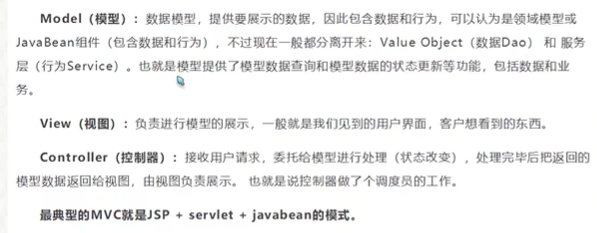
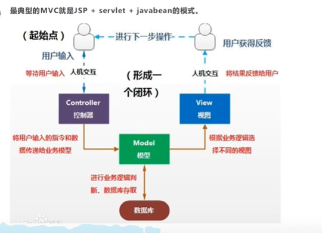
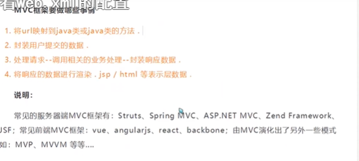
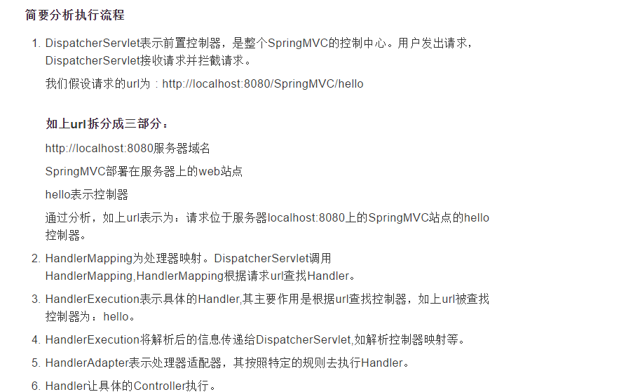
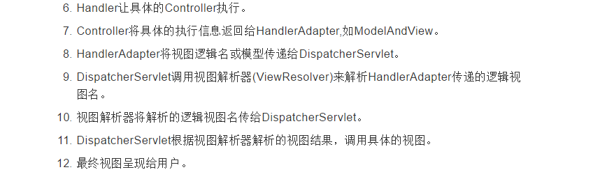
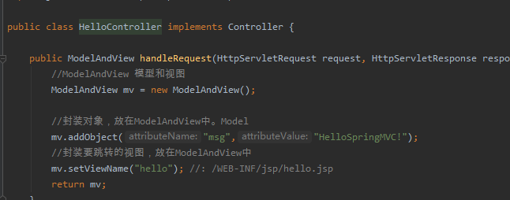
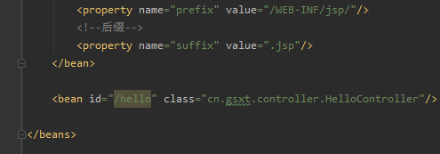
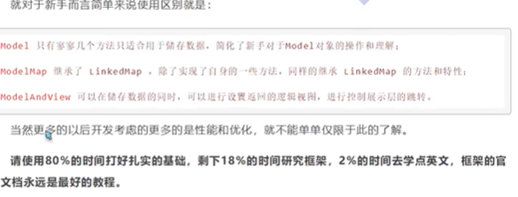

# springMvc

MVC(模型视图控制器)  软件设计规范

model  (dao+service)

view (jsp和前端)

controller (servlet)





MVC需要做的事情




1.spring-mvc的经典配置

```

<!--    配置Controller的组件扫描-->
    <context:component-scan base-package="cn.gsxt.controller"/>
    <!--    配置MVC的注解驱动-->
    <mvc:annotation-driven/>
    <!--    配置读取静态文件   开发资源的访问  过滤静态资源Css js之类的-->
    <mvc:default-servlet-handler/>
    <!--配置内部资源视图解析器(对默认的进行增强)-->
    <bean class="org.springframework.web.servlet.view.InternalResourceViewResolver">
        <property name="prefix" value="/WEB-INF/jsp/"></property>
        <property name="suffix" value=".jsp"></property>
    </bean>
```


1.springMvc的执行流程




**


```
<!--    配置MVC的注解驱动
spring中一般采用RequestMapping注解来完成映射关系  要想使RequestMapping生效
必须向上下文注册DefaultAnnotationHandlerMapping和AnnotationMethodHandlerAdapter实例
这两个实例分别在类级别和方法级别进行处理
annotation-driven配置帮助我们自动完成这两个实例的注入
-->
<mvc:annotation-driven/>
```

```
<dependency>
    <groupId>junit</groupId>
    <artifactId>junit</artifactId>
    <version>4.12</version>
</dependency>
<dependency>
    <groupId>org.springframework</groupId>
    <artifactId>spring-webmvc</artifactId>
    <version>5.1.9.RELEASE</version>
</dependency>
<dependency>
    <groupId>javax.servlet</groupId>
    <artifactId>javax.servlet-api</artifactId>
    <version>2.5</version>
</dependency>
<dependency>
    <groupId>javax.servlet.jsp</groupId>
    <artifactId>javax.servlet.jsp-api</artifactId>
    <version>2.2</version>
</dependency>
<dependency>
  <groupId>javax.servlet</groupId>
  <artifactId>jstl</artifactId>
  <version>1.2</version>
</dependency>


 <dependency>
            <groupId>javax.servlet</groupId>
            <artifactId>javax.servlet-api</artifactId>
            <version>2.5</version>
        </dependency>
        <dependency>
            <groupId>javax.servlet.jsp</groupId>
            <artifactId>jsp-api</artifactId>
            <version>2.2</version>
        </dependency>
```


@Controller 

原始的方法是我们写一个类继承controller,然后重写方法 在spring-mvc.xml中定义这个bean






@Controller代表这个类会被spring容器托管,被这个注解标注的类中的方法如果返回值是string并且有具体页面可以跳转,就会被视图解析器解析


# Restful风格的规范

根据请求方式来实现相同url的不同操作

# 接收请求参数及数据回显

@RequestParam  限制前端的请求参数必须是value的值

```
//    http://localhost:8080/spring_mvc_web/user/quick17?name=zhangsan
//    将url请求的参数  name绑定为当前方法形参的username
    //required=false   url请求的参数name可以不写  配置default默认参数为lyy
    public void save17(@RequestParam(value = "name", required = false, defaultValue = "lyy") String username) throws Exception {
```

@RequestBody

作用：

主要用来接收**前端传递给后端**的**json字符串中的数据的**(请求体中的数据的)；

@PathVariable

```
//    http://localhost:8080/spring_mvc_web/user/quick17/zhangsan   使用restful规范
    //@PathVariable("username") 获取到restful的requestMapping的username
    public void save18(@PathVariable("username") String username) throws Exception {
```

@RestController   ==  @controller  +  ResponseBody

model  modelAndView  modelMap




全局过滤器解决乱码问题

get请求乱码问题tomcat已经帮我们解决 post请求可以设置全局过滤器

```
<!--配置全局过滤的filter-->
    <filter>
        <filter-name>CharacterEncodingFilter</filter-name>
        <filter-class>org.springframework.web.filter.CharacterEncodingFilter</filter-class>
        <init-param>
            <param-name>encoding</param-name>
            <param-value>UTF-8</param-value>
        </init-param>
    </filter>
    <filter-mapping>
        <filter-name>CharacterEncodingFilter</filter-name>
        <url-pattern>/*</url-pattern>
    </filter-mapping>
```


json

fastjson  阿里巴巴的工具

```
<dependency>
            <groupId>com.fasterxml.jackson.core</groupId>
            <artifactId>jackson-core</artifactId>
            <version>2.10.0</version>
        </dependency>
        <dependency>
            <groupId>com.fasterxml.jackson.core</groupId>
            <artifactId>jackson-databind</artifactId>
            <version>2.10.0</version>
        </dependency>
        <dependency>
            <groupId>com.fasterxml.jackson.core</groupId>
            <artifactId>jackson-annotations</artifactId>
            <version>2.10.0</version>
        </dependency>
```


# SSM框架的整合