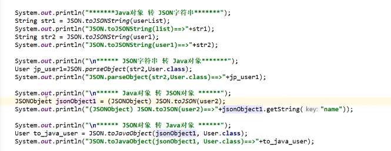
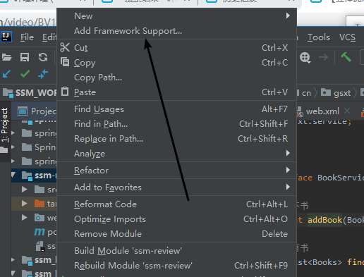
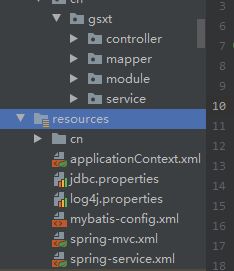

# springMvc

MVC(模型视图控制器)  软件设计规范

model  (dao+service)

view (jsp和前端)

controller (servlet)


MVC需要做的事情


1.spring-mvc的经典配置

```

<!--    配置Controller的组件扫描-->
    <context:component-scan base-package="cn.gsxt.controller"/>
    <!--    配置MVC的注解驱动-->
    <mvc:annotation-driven/>
    <!--    配置读取静态文件   开发资源的访问  过滤静态资源Css js之类的-->
    <mvc:default-servlet-handler/>
    <!--配置内部资源视图解析器(对默认的进行增强)-->
    <bean class="org.springframework.web.servlet.view.InternalResourceViewResolver">
        <property name="prefix" value="/WEB-INF/jsp/"></property>
        <property name="suffix" value=".jsp"></property>
    </bean>
```


1.springMvc的执行流程


**


```
<!--    配置MVC的注解驱动
spring中一般采用RequestMapping注解来完成映射关系  要想使RequestMapping生效
必须向上下文注册DefaultAnnotationHandlerMapping和AnnotationMethodHandlerAdapter实例
这两个实例分别在类级别和方法级别进行处理
annotation-driven配置帮助我们自动完成这两个实例的注入
-->
<mvc:annotation-driven/>
```

```
<dependency>
    <groupId>junit</groupId>
    <artifactId>junit</artifactId>
    <version>4.12</version>
</dependency>
<dependency>
    <groupId>org.springframework</groupId>
    <artifactId>spring-webmvc</artifactId>
    <version>5.1.9.RELEASE</version>
</dependency>
<dependency>
    <groupId>javax.servlet</groupId>
    <artifactId>javax.servlet-api</artifactId>
    <version>2.5</version>
</dependency>
<dependency>
    <groupId>javax.servlet.jsp</groupId>
    <artifactId>javax.servlet.jsp-api</artifactId>
    <version>2.2</version>
</dependency>
<dependency>
  <groupId>javax.servlet</groupId>
  <artifactId>jstl</artifactId>
  <version>1.2</version>
</dependency>


 <dependency>
            <groupId>javax.servlet</groupId>
            <artifactId>javax.servlet-api</artifactId>
            <version>2.5</version>
        </dependency>
        <dependency>
            <groupId>javax.servlet.jsp</groupId>
            <artifactId>jsp-api</artifactId>
            <version>2.2</version>
        </dependency>
```


@Controller 

原始的方法是我们写一个类继承controller,然后重写方法 在spring-mvc.xml中定义这个bean


@Controller代表这个类会被spring容器托管,被这个注解标注的类中的方法如果返回值是string并且有具体页面可以跳转,就会被视图解析器解析


# Restful风格的规范

根据请求方式来实现相同url的不同操作

# 接收请求参数及数据回显

@RequestParam  限制前端的请求参数必须是value的值

```
//    http://localhost:8080/spring_mvc_web/user/quick17?name=zhangsan
//    将url请求的参数  name绑定为当前方法形参的username
    //required=false   url请求的参数name可以不写  配置default默认参数为lyy
    public void save17(@RequestParam(value = "name", required = false, defaultValue = "lyy") String username) throws Exception {
```

@RequestBody

作用：

主要用来接收**前端传递给后端**的**json字符串中的数据的**(请求体中的数据的)；

@PathVariable

```
//    http://localhost:8080/spring_mvc_web/user/quick17/zhangsan   使用restful规范
    //@PathVariable("username") 获取到restful的requestMapping的username
    public void save18(@PathVariable("username") String username) throws Exception {
```

@RestController   ==  @controller  +  ResponseBody

model  modelAndView  modelMap


全局过滤器解决乱码问题

get请求乱码问题tomcat已经帮我们解决 post请求可以设置全局过滤器

```
<!--配置全局过滤的filter-->
    <filter>
        <filter-name>CharacterEncodingFilter</filter-name>
        <filter-class>org.springframework.web.filter.CharacterEncodingFilter</filter-class>
        <init-param>
            <param-name>encoding</param-name>
            <param-value>UTF-8</param-value>
        </init-param>
    </filter>
    <filter-mapping>
        <filter-name>CharacterEncodingFilter</filter-name>
        <url-pattern>/*</url-pattern>
    </filter-mapping>
```


json

# fastjson  阿里巴巴的工具




# SSM框架的整合()

1.建立项目(直接使用骨架参考博客园)

​	不使用骨架需要项目右键添加web



2.创建基本结构



3.mybatis层

mybatis的xml配置

```
<?xml version="1.0" encoding="UTF-8" ?>
<!DOCTYPE mapper
        PUBLIC "-//mybatis.org//DTD Mapper 3.0//EN"
        "http://mybatis.org/dtd/mybatis-3-mapper.dtd">

<mapper namespace="cn.gsxt.mapper.BookMapper">

    <!--增加一个Book-->
    <insert id="addBook" parameterType="Books">
      insert into ssmbuild.books(bookName,bookCounts,detail)
      values (#{bookName}, #{bookCounts}, #{detail})
   </insert>

    <!--根据id删除一个Book-->
    <delete id="deleteBooksById" parameterType="int">
      delete from ssmbuild.books where bookID=#{bookID}
   </delete>

    <!--更新Book-->
    <update id="updateBook" parameterType="Books">
      update ssmbuild.books
      set bookName = #{bookName},bookCounts = #{bookCounts},detail = #{detail}
      where bookID = #{bookID}
   </update>

    <!--根据id查询,返回一个Book-->
    <select id="findBookById" resultType="Books">
      select * from ssmbuild.books
      where bookID = #{bookID}
   </select>

    <!--查询全部Book-->
    <select id="findAllBooks" resultType="Books">
      SELECT * from ssmbuild.books
   </select>

</mapper>
```

mybatis的配置文件

```
<?xml version="1.0" encoding="UTF-8" ?>
<!DOCTYPE configuration
        PUBLIC "-//mybatis.org//DTD Config 3.0//EN"
        "http://mybatis.org/dtd/mybatis-3-config.dtd">
<configuration>
    <!-- 配置数据源 交给spring去做    -->
    <!-- 实体类取别名   -->
    <typeAliases>
        <package name="cn.gsxt.module"/>
    </typeAliases>
</configuration>
```

spring       service层的的配置文件(可以来进行事务控制)

```
<?xml version="1.0" encoding="UTF-8"?>
<beans xmlns="http://www.springframework.org/schema/beans"
       xmlns:xsi="http://www.w3.org/2001/XMLSchema-instance"
       xmlns:context="http://www.springframework.org/schema/context"
       xmlns:aop="http://www.springframework.org/schema/aop"
       xsi:schemaLocation="
        http://www.springframework.org/schema/context
        http://www.springframework.org/schema/context/spring-context.xsd
        http://www.springframework.org/schema/aop
        http://www.springframework.org/schema/aop/spring-aop.xsd
        http://www.springframework.org/schema/beans
        http://www.springframework.org/schema/beans/spring-beans.xsd">
    <!-- 配置声明式事务     -->
    <bean id="transactionManager" class="org.springframework.jdbc.datasource.DataSourceTransactionManager">
        <!-- 注入数据源       -->
        <property name="dataSource" ref="dataSource"/>
    </bean>

    <!-- aop事务支持   -->

</beans>
```


spring-mvc的配置文件


```
<?xml version="1.0" encoding="UTF-8"?>
<beans xmlns="http://www.springframework.org/schema/beans"
       xmlns:xsi="http://www.w3.org/2001/XMLSchema-instance"
       xmlns:mvc="http://www.springframework.org/schema/mvc"
       xmlns:context="http://www.springframework.org/schema/context"
       xsi:schemaLocation="
                        http://www.springframework.org/schema/beans http://www.springframework.org/schema/beans/spring-beans.xsd
                        http://www.springframework.org/schema/mvc http://www.springframework.org/schema/mvc/spring-mvc.xsd
                        http://www.springframework.org/schema/context http://www.springframework.org/schema/context/spring-context.xsd">

    <!--    配置Controller的组件扫描-->
    <context:component-scan base-package="cn.gsxt.controller"/>
    <!--    配置MVC的注解驱动-->
    <mvc:annotation-driven/>
    <!--    配置读取静态文件   开发资源的访问  过滤静态资源Css js之类的-->
    <mvc:default-servlet-handler/>
    <!--配置内部资源视图解析器(对默认的进行增强)-->
    <bean class="org.springframework.web.servlet.view.InternalResourceViewResolver">
        <property name="prefix" value="/WEB-INF/jsp/"></property>
        <property name="suffix" value=".jsp"></property>
    </bean>
</beans>
```

spring的全局配置文件

```
<?xml version="1.0" encoding="UTF-8"?>
<beans xmlns="http://www.springframework.org/schema/beans"
        xmlns:xsi="http://www.w3.org/2001/XMLSchema-instance"
        xmlns:context="http://www.springframework.org/schema/context"
        xmlns:aop="http://www.springframework.org/schema/aop"
        xsi:schemaLocation="
        http://www.springframework.org/schema/context
        http://www.springframework.org/schema/context/spring-context.xsd
        http://www.springframework.org/schema/aop
        http://www.springframework.org/schema/aop/spring-aop.xsd
        http://www.springframework.org/schema/beans
        http://www.springframework.org/schema/beans/spring-beans.xsd">
    <!--  导入其他层配置文件   -->
    <import resource="classpath:spring-service.xml"/>
    <import resource="classpath:spring-mvc.xml"/>
    <!--    配置组件扫描-->
    <context:component-scan base-package="cn.gsxt">
        <!--        &lt;!&ndash;   排除controller的扫描   因为controller是由spring-mvc负责控制的     &ndash;&gt;-->
        <context:exclude-filter type="annotation" expression="org.springframework.stereotype.Controller"/>
    </context:component-scan>
    <!--  加载properties文件  -->
    <context:property-placeholder location="classpath:jdbc.properties"/>
    <!--    配置数据源-->
    <bean id="dataSource" class="com.alibaba.druid.pool.DruidDataSource">
        <property name="driverClassName" value="${jdbc.driver}"/>
        <property name="url" value="${jdbc.url}"/>
        <property name="username" value="${jdbc.username}"/>
        <property name="password" value="${jdbc.password}"/>
    </bean>
    <!--  配置mybatis层要使用的sqlSessionFactory  -->
    <bean id="sqlSessionFactory" class="org.mybatis.spring.SqlSessionFactoryBean">
        <!--  spring帮助我们创建sqlsessionFactory工厂  内部需要数据源 需要mybatis的核心配置文件-->
        <property name="dataSource" ref="dataSource"/>
        <!-- 加载绑定mybatis的核心文件  因为SqlSessionFactoryBean 本质上是操作mybatis层的-->
        <property name="configLocation" value="classpath:mybatis-config.xml"/>
    </bean>
    <!--    加载mapper所在的包 为mapper创建实现类,放入spring容器中 我们需要使用的时候,
    直接注入  不用再sqlSession获取mapper-->
    <bean class="org.mybatis.spring.mapper.MapperScannerConfigurer">
        <!-- 注入sqlSessionFactory       -->
        <property name="sqlSessionFactoryBeanName" value="sqlSessionFactory"/>
        <property name="basePackage" value="cn.gsxt.mapper"/>
    </bean>

</beans>
```

web.xml的配置文件

```
<?xml version="1.0" encoding="UTF-8"?>
<web-app xmlns="http://xmlns.jcp.org/xml/ns/javaee"
         xmlns:xsi="http://www.w3.org/2001/XMLSchema-instance"
         xsi:schemaLocation="http://xmlns.jcp.org/xml/ns/javaee http://xmlns.jcp.org/xml/ns/javaee/web-app_4_0.xsd"
         version="4.0">
    <!-- 配置spring的全局扫描    -->
    <servlet>
        <servlet-name>DispatcherServlet</servlet-name>
        <servlet-class>org.springframework.web.servlet.DispatcherServlet</servlet-class>
        <init-param>
            <param-name>contextConfigLocation</param-name>
            <param-value>classpath:applicationContext.xml</param-value>
        </init-param>
        <load-on-startup>1</load-on-startup>
    </servlet>
    <servlet-mapping>
        <servlet-name>DispatcherServlet</servlet-name>
        <url-pattern>/</url-pattern>
    </servlet-mapping>

    <!--配置全局过滤的filter  post请求乱码问题的解决   get请求tomcat8.5以经默认解决-->
    <filter>
        <filter-name>CharacterEncodingFilter</filter-name>
        <filter-class>org.springframework.web.filter.CharacterEncodingFilter</filter-class>
        <init-param>
            <param-name>encoding</param-name>
            <param-value>UTF-8</param-value>
        </init-param>
    </filter>
    <filter-mapping>
        <filter-name>CharacterEncodingFilter</filter-name>
        <url-pattern>/*</url-pattern>
    </filter-mapping>

    <!--session过期时间    -->
    <session-config>
        <session-timeout>15</session-timeout>
    </session-config>
</web-app>
```


拦截器是AOP思想的应用

拦截器+redis实现用户登录拦截

用户登录之后生成一个token放在redis数据库中,设置拦截器查询redis数据库


文件下载


