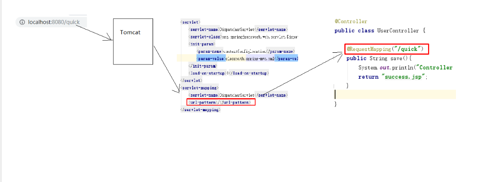
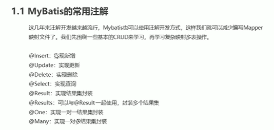
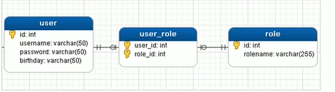

# spring整理老师笔记

# 1. spring概述

### 1.1 Spring是什么（理解）

Spring是分层的 Java SE/EE应用 full-stack 轻量级开源框架，以 IoC（Inverse Of Control：反转控制）和 AOP（Aspect Oriented Programming：面向切面编程）为内核。

提供了展现层 SpringMVC和持久层 Spring JDBCTemplate以及业务层事务管理等众多的企业级应用技术，还能整合开源世界众多著名的第三方框架和类库，逐渐成为使用最多的Java EE 企业应用开源框架

### 1.2 Spring发展历程 （了解）

Rod Johnson （ Spring 之父）

2017  年
9 月份发布了 Spring 的最新版本 Spring5.0
通用版（GA）

### 1.3 Spring的优势（理解）

方便解耦，简化开发

AOP 编程的支持

声明式事务的支持

方便程序的测试

### 1.4 Spring的体系结构（了解）

-Spring/day01_Spring%E7%AE%80%E4%BB%8B%E5%92%8C%E9%85%8D%E7%BD%AE/%E7%AC%94%E8%AE%B0/img/%E5%9B%BE%E7%89%8729.png)


## 2. spring快速入门

### 2.1 Spring程序开发步骤

①导入 Spring 开发的基本包坐标

②编写 Dao 接口和实现类

③创建 Spring 核心配置文件

④在 Spring 配置文件中配置 UserDaoImpl

⑤使用 Spring 的 API 获得 Bean 实例

### 2.2 导入Spring开发的基本包坐标

```xml
<properties>
	<spring.version>5.0.5.RELEASE</spring.version>
</properties>
<!--导入spring的context坐标，context依赖core、beans、expression-->
<dependencies> 
    <dependency>  
        <groupId>org.springframework</groupId> 
        <artifactId>spring-context</artifactId> 
        <version>${spring.version}</version>
    </dependency>
</dependencies>

```

### 2.3 编写Dao接口和实现类

```java
public interface UserDao {  
    public void save();
}

public class UserDaoImpl implements UserDao {  
        @Override  
        public void save() {
        	System.out.println("UserDao save method running....");
	}
}
```

### 2.4 创建Spring核心配置文件

在类路径下（resources）创建applicationContext.xml配置文件

```java
<?xml version="1.0" encoding="UTF-8" ?>
<beans xmlns="http://www.springframework.org/schema/beans"             		   xmlns:xsi="http://www.w3.org/2001/XMLSchema-instance"
xsi:schemaLocation="
    http://www.springframework.org/schema/beans      	             http://www.springframework.org/schema/beans/spring-beans.xsd">
</beans>
```

### 2.5 在Spring配置文件中配置UserDaoImpl

```xml
<?xml version="1.0" encoding="UTF-8" ?>
<beans xmlns="http://www.springframework.org/schema/beans"             		   xmlns:xsi="http://www.w3.org/2001/XMLSchema-instance"
xsi:schemaLocation="
    http://www.springframework.org/schema/beans      	             http://www.springframework.org/schema/beans/spring-beans.xsd">
   <bean id="userDao" class="com.itheima.dao.impl.UserDaoImpl"></bean>
</beans>

```

### 2.6 使用Spring的API获得Bean实例

```java
@Test
public void test1(){
		ApplicationContext applicationContext = new  
             ClassPathXmlApplicationContext("applicationContext.xml");
             UserDao userDao = (UserDao) applicationContext.getBean("userDao");   				 userDao.save();
 }
```


## 3. Spring配置文件

### 3.1 Bean标签基本配置

用于配置对象交由Spring 来创建。

默认情况下它调用的是类中的无参构造函数，如果没有无参构造函数则不能创建成功。

基本属性：

id：Bean实例在Spring容器中的唯一标识

class：Bean的全限定名称

### 3.2 Bean标签范围配置

scope:指对象的作用范围，取值如下： 

| 取值范围         | 说明                                                         |
| ---------------- | ------------------------------------------------------------ |
| singleton        | 默认值，单例的                                               |
| prototype        | 多例的                                                       |
| request          | WEB   项目中，Spring   创建一个   Bean   的对象，将对象存入到   request   域中 |
| session          | WEB   项目中，Spring   创建一个   Bean   的对象，将对象存入到   session   域中 |
| global   session | WEB   项目中，应用在   Portlet   环境，如果没有   Portlet   环境那么globalSession   相当于   session |

1）当scope的取值为singleton时

​      Bean的实例化个数：1个

​      Bean的实例化时机：当Spring核心文件被加载时，实例化配置的Bean实例

​      Bean的生命周期：

对象创建：当应用加载，创建容器时，对象就被创建了

对象运行：只要容器在，对象一直活着

对象销毁：当应用卸载，销毁容器时，对象就被销毁了

2）当scope的取值为prototype时

​      Bean的实例化个数：多个

​      Bean的实例化时机：当调用getBean()方法时实例化Bean

对象创建：当使用对象时，创建新的对象实例

对象运行：只要对象在使用中，就一直活着

对象销毁：当对象长时间不用时，被 Java 的垃圾回收器回收了

### 3.3 Bean生命周期配置

init-method：指定类中的初始化方法名称

destroy-method：指定类中销毁方法名称

### 3.4 Bean实例化三种方式

1） 使用无参构造方法实例化

​      它会根据默认无参构造方法来创建类对象，如果bean中没有默认无参构造函数，将会创建失败

```xml
<bean id="userDao" class="com.itheima.dao.impl.UserDaoImpl"/>
```

2） 工厂静态方法实例化

​      工厂的静态方法返回Bean实例

```java
public class StaticFactoryBean {
    public static UserDao createUserDao(){    
    return new UserDaoImpl();
    }
}
```

```xml
<bean id="userDao" class="com.itheima.factory.StaticFactoryBean" 
      factory-method="createUserDao" />
```

3） 工厂实例方法实例化

​      工厂的非静态方法返回Bean实例

```java
public class DynamicFactoryBean {  
	public UserDao createUserDao(){        
		return new UserDaoImpl(); 
	}
}
```

```xml
<bean id="factoryBean" class="com.itheima.factory.DynamicFactoryBean"/>
<bean id="userDao" factory-bean="factoryBean" factory-method="createUserDao"/>
```

### 3.5 Bean的依赖注入入门

①创建 UserService，UserService 内部在调用 UserDao的save() 方法

```java
public class UserServiceImpl implements UserService {
	@Override
	public void save() {
         ApplicationContext applicationContext = new 
                 ClassPathXmlApplicationContext("applicationContext.xml");       	           UserDao userDao = (UserDao) applicationContext.getBean("userDao");	
          userDao.save();
 	}
 }
```

②将 UserServiceImpl 的创建权交给 Spring

```xml
<bean id="userService" class="com.itheima.service.impl.UserServiceImpl"/>
```

③从 Spring 容器中获得 UserService 进行操作

```java
ApplicationContext applicationContext = new ClassPathXmlApplicationContext("applicationContext.xml");
UserService userService = (UserService) applicationContext.getBean("userService");
userService.save();
```

### 3.6 Bean的依赖注入概念

依赖注入（Dependency Injection）：它是 Spring 框架核心 IOC 的具体实现。

在编写程序时，通过控制反转，把对象的创建交给了 Spring，但是代码中不可能出现没有依赖的情况。

IOC 解耦只是降低他们的依赖关系，但不会消除。例如：业务层仍会调用持久层的方法。

那这种业务层和持久层的依赖关系，在使用 Spring 之后，就让 Spring 来维护了。

简单的说，就是坐等框架把持久层对象传入业务层，而不用我们自己去获取

### 3.7 Bean的依赖注入方式

①构造方法

​      创建有参构造

```java
public class UserServiceImpl implements UserService {
@Override
public void save() {
ApplicationContext applicationContext = new 
                 ClassPathXmlApplicationContext("applicationContext.xml");       UserDao userDao = (UserDao) applicationContext.getBean("userDao");    
          userDao.save();
    }
 }
```

​      配置Spring容器调用有参构造时进行注入

```xml
<bean id="userDao" class="com.itheima.dao.impl.UserDaoImpl"/>
<bean id="userService" class="com.itheima.service.impl.UserServiceImpl">      		   	<constructor-arg name="userDao" ref="userDao"></constructor-arg>
</bean>
```

②set方法

​      在UserServiceImpl中添加setUserDao方法

```java
public class UserServiceImpl implements UserService {
    private UserDao userDao;
    public void setUserDao(UserDao userDao) {
        this.userDao = userDao;  
        } 
    @Override    
    public void save() {      
   		 userDao.save();
	}
}
```

​      配置Spring容器调用set方法进行注入

```xml
<bean id="userDao" class="com.itheima.dao.impl.UserDaoImpl"/>
<bean id="userService" class="com.itheima.service.impl.UserServiceImpl">
	<property name="userDao" ref="userDao"/>
</bean>
```

set方法:P命名空间注入

​      P命名空间注入本质也是set方法注入，但比起上述的set方法注入更加方便，主要体现在配置文件中，如下：

​      首先，需要引入P命名空间：

```xml
xmlns:p="http://www.springframework.org/schema/p"
```

其次，需要修改注入方式

```xml
<bean id="userService" class="com.itheima.service.impl.UserServiceImpl" p:userDao-
 ref="userDao"/>
```

### 3.8 Bean的依赖注入的数据类型

上面的操作，都是注入的引用Bean，处了对象的引用可以注入，普通数据类型，集合等都可以在容器中进行注入。

注入数据的三种数据类型 

普通数据类型

引用数据类型

集合数据类型

其中引用数据类型，此处就不再赘述了，之前的操作都是对UserDao对象的引用进行注入的，下面将以set方法注入为例，演示普通数据类型和集合数据类型的注入。

**Bean的依赖注入的数据类型**

（1）普通数据类型的注入

```java
public class UserDaoImpl implements UserDao {
private String company;
    private int age;
    public void setCompany(String company) {
        this.company = company;
    }
    public void setAge(int age) {
        this.age = age;
    }
    public void save() {
        System.out.println(company+"==="+age);
        System.out.println("UserDao save method running....");   
    }
}

```

```xml
<bean id="userDao" class="com.itheima.dao.impl.UserDaoImpl">
    <property name="company" value="传智播客"></property>
    <property name="age" value="15"></property>
</bean>
```

（2）集合数据类型（List<String>）的注入

```java
public class UserDaoImpl implements UserDao {
	private List<String> strList;
	public void setStrList(List<String> strList) {
		this.strList = strList;
	}
	public void save() {
        System.out.println(strList);
        System.out.println("UserDao save method running....");
	}
}
```

```xml
<bean id="userDao" class="com.itheima.dao.impl.UserDaoImpl">
    <property name="strList">
        <list>
            <value>aaa</value>
            <value>bbb</value>
            <value>ccc</value>
        </list>
    </property>
</bean>
```

（3）集合数据类型（List<User>）的注入

```java
public class UserDaoImpl implements UserDao {
	private List<User> userList;
	public void setUserList(List<User> userList) {
	this.userList = userList;  
 }
public void save() {
	System.out.println(userList);
	System.out.println("UserDao save method running....");
	}
}
```

```xml
<bean id="u1" class="com.itheima.domain.User"/>
<bean id="u2" class="com.itheima.domain.User"/>
<bean id="userDao" class="com.itheima.dao.impl.UserDaoImpl">
    <property name="userList">
        <list>
            <bean class="com.itheima.domain.User"/>
            <bean class="com.itheima.domain.User"/>
            <ref bean="u1"/>
            <ref bean="u2"/>       
        </list>
    </property>
</bean>
```

（4）集合数据类型（ Map<String,User> ）的注入

```java
public class UserDaoImpl implements UserDao {
    private Map<String,User> userMap;
    public void setUserMap(Map<String, User> userMap) {
    this.userMap = userMap;
    }    
public void save() {      
	System.out.println(userMap);
	System.out.println("UserDao save method running....");
	}
}
```

```xml
<bean id="u1" class="com.itheima.domain.User"/>
<bean id="u2" class="com.itheima.domain.User"/>
<bean id="userDao" class="com.itheima.dao.impl.UserDaoImpl">
    <property name="userMap">
        <map>            
            <entry key="user1" value-ref="u1"/>
            <entry key="user2" value-ref="u2"/>
        </map>
    </property>
</bean>
```

（5）集合数据类型（Properties）的注入

```java
public class UserDaoImpl implements UserDao {
    private Properties properties;
    public void setProperties(Properties properties) {
        this.properties = properties;
    }
	public void save() {
		System.out.println(properties);
		System.out.println("UserDao save method running....");
	}
}
```

```xml
<bean id="userDao" class="com.itheima.dao.impl.UserDaoImpl">
    <property name="properties">
        <props>
            <prop key="p1">aaa</prop>
            <prop key="p2">bbb</prop> 
            <prop key="p3">ccc</prop>
        </props>
    </property>
</bean>
```

### 3.9 引入其他配置文件（分模块开发）

实际开发中，Spring的配置内容非常多，这就导致Spring配置很繁杂且体积很大，所以，可以将部分配置拆解到其他配置文件中，而在Spring主配置文件通过import标签进行加载

```xml
<import resource="applicationContext-xxx.xml"/>
```

## 4. spring相关API

### 4.1 ApplicationContext的继承体系

applicationContext：接口类型，代表应用上下文，可以通过其实例获得 Spring 容器中的 Bean 对象

### 4.2 ApplicationContext的实现类

1）ClassPathXmlApplicationContext 

​      它是从类的根路径下加载配置文件 推荐使用这种

2）FileSystemXmlApplicationContext 

​      它是从磁盘路径上加载配置文件，配置文件可以在磁盘的任意位置。

3）AnnotationConfigApplicationContext

​      当使用注解配置容器对象时，需要使用此类来创建 spring 容器。它用来读取注解。

### 4.3 getBean()方法使用

```java
public Object getBean(String name) throws BeansException {  
	assertBeanFactoryActive();   
	return getBeanFactory().getBean(name);
}
public <T> T getBean(Class<T> requiredType) throws BeansException {   			    	assertBeanFactoryActive();
	return getBeanFactory().getBean(requiredType);
}
```

其中，当参数的数据类型是字符串时，表示根据Bean的id从容器中获得Bean实例，返回是Object，需要强转。

当参数的数据类型是Class类型时，表示根据类型从容器中匹配Bean实例，当容器中相同类型的Bean有多个时，则此方法会报错

**getBean()方法使用**

```java
ApplicationContext applicationContext = new 
            ClassPathXmlApplicationContext("applicationContext.xml");
  UserService userService1 = (UserService) applicationContext.getBean("userService");
  UserService userService2 = applicationContext.getBean(UserService.class);
```

## spring容器加载配置文件

```
context命名空间下的
<context:property-placeholder location="classpath:jdbc.properties"></context:property-placeholder>
```

# spring注解开发

是一种趋势,提高开发效率

## 原始注解


  使用xml配置的方式,setattr方法需要写,因为是spring通过反射调用,注解配置不需要,通过反射直接为属性赋值


@VALUE属性

```
 @Value("${jdbc.driver}") //xml配置文件已加载properties
  private String lyy;
  从容器中获取jdbc.driver对应的值注入给lyy
```

## spring新注解


## Spring集成junit单元测试


# 1.Spring 的 AOP 简介

#### 1.1 什么是 AOP

AOP 为 Aspect Oriented Programming 的缩写，意思为面向切面编程，是通过预编译方式和运行期动态代理实现程序功能的统一维护的一种技术。

AOP 是 OOP 的延续，是软件开发中的一个热点，也是Spring框架中的一个重要内容，是函数式编程的一种衍生范型。利用AOP可以对业务逻辑的各个部分进行隔离，从而使得业务逻辑各部分之间的耦合度降低，提高程序的可重用性，同时提高了开发的效率。

#### 1.2 AOP 的作用及其优势

作用：在程序运行期间，在不修改源码的情况下对方法进行功能增强

优势：减少重复代码，提高开发效率，并且便于维护

#### 1.3 AOP 的底层实现

实际上，AOP 的底层是通过 Spring 提供的的动态代理技术实现的。在运行期间，Spring通过动态代理技术动态的生成代理对象，代理对象方法执行时进行增强功能的介入，在去调用目标对象的方法，从而完成功能的增强。

#### 1.4 AOP 的动态代理技术

常用的动态代理技术

JDK 代理 : 基于接口的动态代理技术

cglib 代理：基于父类的动态代理技术

-Spring/day03_%20AOP%E7%AE%80%E4%BB%8B/%E7%AC%94%E8%AE%B0/img/%E5%9B%BE%E7%89%871.png)

#### 1.5 JDK 的动态代理

①目标类接口

```java
public interface TargetInterface {
    public void method();
}
```

②目标类

```java
public class Target implements TargetInterface {
    @Override
    public void method() {
        System.out.println("Target running....");
    }
}
```

③动态代理代码

```java
Target target = new Target(); //创建目标对象
//创建代理对象
TargetInterface proxy = (TargetInterface) Proxy.newProxyInstance(target.getClass()
.getClassLoader(),target.getClass().getInterfaces(),new InvocationHandler() {
            @Override
            public Object invoke(Object proxy, Method method, Object[] args) 
            throws Throwable {
                System.out.println("前置增强代码...");
                Object invoke = method.invoke(target, args);
                System.out.println("后置增强代码...");
                return invoke;
            }
        }
);
```

④  调用代理对象的方法测试

```java
// 测试,当调用接口的任何方法时，代理对象的代码都无序修改
proxy.method();
```

-Spring/day03_%20AOP%E7%AE%80%E4%BB%8B/%E7%AC%94%E8%AE%B0/img/%E5%9B%BE%E7%89%872.png)

#### 1.6 cglib 的动态代理

①目标类

```java
public class Target {
    public void method() {
        System.out.println("Target running....");
    }
}
```

②动态代理代码

```java
Target target = new Target(); //创建目标对象
Enhancer enhancer = new Enhancer();   //创建增强器
enhancer.setSuperclass(Target.class); //设置父类
enhancer.setCallback(new MethodInterceptor() { //设置回调
    @Override
    public Object intercept(Object o, Method method, Object[] objects, 
    MethodProxy methodProxy) throws Throwable {
        System.out.println("前置代码增强....");
        Object invoke = method.invoke(target, objects);
        System.out.println("后置代码增强....");
        return invoke;
    }
});
Target proxy = (Target) enhancer.create(); //创建代理对象

```

③调用代理对象的方法测试

```java
//测试,当调用接口的任何方法时，代理对象的代码都无序修改
proxy.method();
```

-Spring/day03_%20AOP%E7%AE%80%E4%BB%8B/%E7%AC%94%E8%AE%B0/img/%E5%9B%BE%E7%89%873.png)

#### 1.7 AOP 相关概念

Spring 的 AOP 实现底层就是对上面的动态代理的代码进行了封装，封装后我们只需要对需要关注的部分进行代码编写，并通过配置的方式完成指定目标的方法增强。

在正式讲解 AOP 的操作之前，我们必须理解 AOP 的相关术语，常用的术语如下：

- Target（目标对象）：代理的目标对象
- Proxy （代理）：一个类被 AOP 织入增强后，就产生一个结果代理类
- Joinpoint（连接点）：所谓连接点是指那些被拦截到的点。在spring中,这些点指的是方法，因为spring只支持方法类型的连接点
- Pointcut（切入点）：所谓切入点是指我们要对哪些 Joinpoint 进行拦截的定义
- Advice（通知/ 增强）：所谓通知是指拦截到 Joinpoint 之后所要做的事情就是通知
- Aspect（切面）：是切入点和通知（引介）的结合
- Weaving（织入）：是指把增强应用到目标对象来创建新的代理对象的过程。spring采用动态代理织入，而AspectJ采用编译期织入和类装载期织入

1.8 AOP 开发明确的事项

1.8 AOP 开发明确的事项

#### 1.8 AOP 开发明确的事项

##### 1)需要编写的内容

- 编写核心业务代码（目标类的目标方法）
- 编写切面类，切面类中有通知(增强功能方法)
- 在配置文件中，配置织入关系，即将哪些通知与哪些连接点进行结合

##### 2）AOP 技术实现的内容

Spring 框架监控切入点方法的执行。一旦监控到切入点方法被运行，使用代理机制，动态创建目标对象的代理对象，根据通知类别，在代理对象的对应位置，将通知对应的功能织入，完成完整的代码逻辑运行。

##### 3）AOP 底层使用哪种代理方式

在 spring 中，框架会根据目标类是否实现了接口来决定采用哪种动态代理的方式。

#### 1.9 知识要点

- aop：面向切面编程

- aop底层实现：基于JDK的动态代理 和 基于Cglib的动态代理

- aop的重点概念：

  ```
  Pointcut（切入点）：被增强的方法
  
  Advice（通知/ 增强）：封装增强业务逻辑的方法
  
  Aspect（切面）：切点+通知
  
  Weaving（织入）：将切点与通知结合的过程
  ```

- 开发明确事项：

  ```
  谁是切点（切点表达式配置）
  
  谁是通知（切面类中的增强方法）
  
  将切点和通知进行织入配置
  ```

### 2. 基于 XML 的 AOP 开发

#### 2.1 快速入门

①导入 AOP 相关坐标

②创建目标接口和目标类（内部有切点）

③创建切面类（内部有增强方法）

④将目标类和切面类的对象创建权交给 spring

⑤在 applicationContext.xml 中配置织入关系

⑥测试代码


①导入 AOP 相关坐标

```xml
<!--导入spring的context坐标，context依赖aop-->
<dependency>
  <groupId>org.springframework</groupId>
  <artifactId>spring-context</artifactId>
  <version>5.0.5.RELEASE</version>
</dependency>
<!-- aspectj的织入 -->
<dependency>
  <groupId>org.aspectj</groupId>
  <artifactId>aspectjweaver</artifactId>
  <version>1.8.13</version>
</dependency>
```

②创建目标接口和目标类（内部有切点）

```java
public interface TargetInterface {
    public void method();
}

public class Target implements TargetInterface {
    @Override
    public void method() {
        System.out.println("Target running....");
    }
}
```

③创建切面类（内部有增强方法）

```java
public class MyAspect {
    //前置增强方法
    public void before(){
        System.out.println("前置代码增强.....");
    }
}
```

④将目标类和切面类的对象创建权交给 spring

```xml
<!--配置目标类-->
<bean id="target" class="com.itheima.aop.Target"></bean>
<!--配置切面类-->
<bean id="myAspect" class="com.itheima.aop.MyAspect"></bean>

```

⑤在 applicationContext.xml 中配置织入关系

导入aop命名空间

```xml
<beans xmlns="http://www.springframework.org/schema/beans"
       xmlns:xsi="http://www.w3.org/2001/XMLSchema-instance"
       xmlns:context="http://www.springframework.org/schema/context"
       xmlns:aop="http://www.springframework.org/schema/aop"
       xsi:schemaLocation="
        http://www.springframework.org/schema/context
        http://www.springframework.org/schema/context/spring-context.xsd
        http://www.springframework.org/schema/aop
        http://www.springframework.org/schema/aop/spring-aop.xsd
        http://www.springframework.org/schema/beans
        http://www.springframework.org/schema/beans/spring-beans.xsd">

```

⑤在 applicationContext.xml 中配置织入关系

配置切点表达式和前置增强的织入关系

```xml
<aop:config>
    <!--引用myAspect的Bean为切面对象-->
    <aop:aspect ref="myAspect">
        <!--配置Target的method方法执行时要进行myAspect的before方法前置增强-->
        <aop:before method="before" pointcut="execution(public void com.itheima.aop.Target.method())"></aop:before>
    </aop:aspect>
</aop:config>
```

⑥测试代码

```java
@RunWith(SpringJUnit4ClassRunner.class)
@ContextConfiguration("classpath:applicationContext.xml")
public class AopTest {
    @Autowired
    private TargetInterface target;
    @Test
    public void test1(){
        target.method();
    }
}
```

⑦测试结果

-Spring/day03_%20AOP%E7%AE%80%E4%BB%8B/%E7%AC%94%E8%AE%B0/img/%E5%9B%BE%E7%89%874.png)

#### 2.2 XML 配置 AOP 详解

##### 1) 切点表达式的写法

表达式语法：

```java
execution([修饰符] 返回值类型 包名.类名.方法名(参数))
```

- 访问修饰符可以省略
- 返回值类型、包名、类名、方法名可以使用星号*  代表任意
- 包名与类名之间一个点 . 代表当前包下的类，两个点 .. 表示当前包及其子包下的类
- 参数列表可以使用两个点 .. 表示任意个数，任意类型的参数列表

例如：

```xml
execution(public void com.itheima.aop.Target.method())	
execution(void com.itheima.aop.Target.*(..))
execution(* com.itheima.aop.*.*(..))
execution(* com.itheima.aop..*.*(..))
execution(* *..*.*(..))
```

##### 2) 通知的类型

通知的配置语法：

```xml
<aop:通知类型 method=“切面类中方法名” pointcut=“切点表达式"></aop:通知类型>
```

-Spring/day03_%20AOP%E7%AE%80%E4%BB%8B/%E7%AC%94%E8%AE%B0/img/%E5%9B%BE%E7%89%875.png)

##### 3) 切点表达式的抽取

当多个增强的切点表达式相同时，可以将切点表达式进行抽取，在增强中使用 pointcut-ref 属性代替 pointcut 属性来引用抽取后的切点表达式。

```xml
<aop:config>
    <!--引用myAspect的Bean为切面对象-->
    <aop:aspect ref="myAspect">
        <aop:pointcut id="myPointcut" expression="execution(* com.itheima.aop.*.*(..))"/>
        <aop:before method="before" pointcut-ref="myPointcut"></aop:before>
    </aop:aspect>
</aop:config>
```

#### 2.3 知识要点

- aop织入的配置

```xml
<aop:config>
    <aop:aspect ref=“切面类”>
        <aop:before method=“通知方法名称” pointcut=“切点表达式"></aop:before>
    </aop:aspect>
</aop:config>
```

- 通知的类型：前置通知、后置通知、环绕通知、异常抛出通知、最终通知
- 切点表达式的写法：

```xml
execution([修饰符] 返回值类型 包名.类名.方法名(参数))
```

### 3.基于注解的 AOP 开发

#### 3.1 快速入门

基于注解的aop开发步骤：

①创建目标接口和目标类（内部有切点）

②创建切面类（内部有增强方法）

③将目标类和切面类的对象创建权交给 spring

④在切面类中使用注解配置织入关系

⑤在配置文件中开启组件扫描和 AOP 的自动代理

⑥测试


①创建目标接口和目标类（内部有切点）

```java
public interface TargetInterface {
    public void method();
}

public class Target implements TargetInterface {
    @Override
    public void method() {
        System.out.println("Target running....");
    }
}
```

②创建切面类（内部有增强方法)

```java
public class MyAspect {
    //前置增强方法
    public void before(){
        System.out.println("前置代码增强.....");
    }
}
```

③将目标类和切面类的对象创建权交给 spring

```java
@Component("target")
public class Target implements TargetInterface {
    @Override
    public void method() {
        System.out.println("Target running....");
    }
}
@Component("myAspect")
public class MyAspect {
    public void before(){
        System.out.println("前置代码增强.....");
    }
}
```

④在切面类中使用注解配置织入关系

```java
@Component("myAspect")
@Aspect
public class MyAspect {
    @Before("execution(* com.itheima.aop.*.*(..))")
    public void before(){
        System.out.println("前置代码增强.....");
    }
}
```

⑤在配置文件中开启组件扫描和 AOP 的自动代理

```xml
<!--组件扫描-->
<context:component-scan base-package="com.itheima.aop"/>

<!--aop的自动代理-->
<aop:aspectj-autoproxy></aop:aspectj-autoproxy>

```

⑥测试代码

```java
@RunWith(SpringJUnit4ClassRunner.class)
@ContextConfiguration("classpath:applicationContext.xml")
public class AopTest {
    @Autowired
    private TargetInterface target;
    @Test
    public void test1(){
        target.method();
    }
}
```

⑦测试结果

-Spring/day03_%20AOP%E7%AE%80%E4%BB%8B/%E7%AC%94%E8%AE%B0/img/%E5%9B%BE%E7%89%876.png)

#### 3.2 注解配置 AOP 详解

##### 1) 注解通知的类型

通知的配置语法：@通知注解(“切点表达式")

-Spring/day03_%20AOP%E7%AE%80%E4%BB%8B/%E7%AC%94%E8%AE%B0/img/%E5%9B%BE%E7%89%877.png)

##### 2) 切点表达式的抽取

同 xml配置
aop 一样，我们可以将切点表达式抽取。抽取方式是在切面内定义方法，在该方法上使用@Pointcut注解定义切点表达式，然后在在增强注解中进行引用。具体如下：

```java
@@Component("myAspect")
@Aspect
public class MyAspect {
    @Before("MyAspect.myPoint()")
    public void before(){
        System.out.println("前置代码增强.....");
    }
    @Pointcut("execution(* com.itheima.aop.*.*(..))")
    public void myPoint(){}
}
```

#### 3.3 知识要点

- 注解aop开发步骤

①使用@Aspect标注切面类

②使用@通知注解标注通知方法

③在配置文件中配置aop自动代理<aop:aspectj-autoproxy/>


- 通知注解类型

-Spring/day03_%20AOP%E7%AE%80%E4%BB%8B/%E7%AC%94%E8%AE%B0/img/%E5%9B%BE%E7%89%878.png)


​    

# JdbcTemplate基本使用

## 01-JdbcTemplate基本使用-概述(了解)

JdbcTemplate是spring框架中提供的一个对象，是对原始繁琐的Jdbc API对象的简单封装。spring框架为我们提供了很多的操作模板类。例如：操作关系型数据的JdbcTemplate和HibernateTemplate，操作nosql数据库的RedisTemplate，操作消息队列的JmsTemplate等等。

## 02-JdbcTemplate基本使用-开发步骤(理解)

①导入spring-jdbc和spring-tx坐标

②创建数据库表和实体

③创建JdbcTemplate对象

④执行数据库操作

## 03-JdbcTemplate基本使用-快速入门代码实现(应用)

导入spring-jdbc和spring-tx坐标

```xml
<?xml version="1.0" encoding="UTF-8"?>

<project xmlns="http://maven.apache.org/POM/4.0.0" xmlns:xsi="http://www.w3.org/2001/XMLSchema-instance"
  xsi:schemaLocation="http://maven.apache.org/POM/4.0.0 http://maven.apache.org/xsd/maven-4.0.0.xsd">
  <modelVersion>4.0.0</modelVersion>
  <groupId>com.itheima</groupId>
  <artifactId>itheima_spring_jdbc</artifactId>
  <version>1.0-SNAPSHOT</version>
  <packaging>war</packaging>

  <name>itheima_spring_jdbc Maven Webapp</name>
  <!-- FIXME change it to the project's website -->
  <url>http://www.example.com</url>
  <dependencies>
    <dependency>
      <groupId>mysql</groupId>
      <artifactId>mysql-connector-java</artifactId>
      <version>5.1.32</version>
    </dependency>
    <dependency>
      <groupId>c3p0</groupId>
      <artifactId>c3p0</artifactId>
      <version>0.9.1.2</version>
    </dependency>
    <dependency>
      <groupId>com.alibaba</groupId>
      <artifactId>druid</artifactId>
      <version>1.1.10</version>
    </dependency>
    <dependency>
      <groupId>junit</groupId>
      <artifactId>junit</artifactId>
      <version>4.12</version>
    </dependency>
    <dependency>
      <groupId>org.springframework</groupId>
      <artifactId>spring-context</artifactId>
      <version>5.0.5.RELEASE</version>
    </dependency>
    <dependency>
      <groupId>org.springframework</groupId>
      <artifactId>spring-test</artifactId>
      <version>5.0.5.RELEASE</version>
    </dependency>
    <dependency>
      <groupId>org.springframework</groupId>
      <artifactId>spring-web</artifactId>
      <version>5.0.5.RELEASE</version>
    </dependency>
    <dependency>
      <groupId>org.springframework</groupId>
      <artifactId>spring-webmvc</artifactId>
      <version>5.0.5.RELEASE</version>
    </dependency>
    <dependency>
      <groupId>javax.servlet</groupId>
      <artifactId>javax.servlet-api</artifactId>
      <version>3.0.1</version>
      <scope>provided</scope>
    </dependency>
    <dependency>
      <groupId>javax.servlet.jsp</groupId>
      <artifactId>javax.servlet.jsp-api</artifactId>
      <version>2.2.1</version>
      <scope>provided</scope>
    </dependency>
    <dependency>
      <groupId>com.fasterxml.jackson.core</groupId>
      <artifactId>jackson-core</artifactId>
      <version>2.9.0</version>
    </dependency>
    <dependency>
      <groupId>com.fasterxml.jackson.core</groupId>
      <artifactId>jackson-databind</artifactId>
      <version>2.9.0</version>
    </dependency>
    <dependency>
      <groupId>com.fasterxml.jackson.core</groupId>
      <artifactId>jackson-annotations</artifactId>
      <version>2.9.0</version>
    </dependency>
    <dependency>
      <groupId>commons-fileupload</groupId>
      <artifactId>commons-fileupload</artifactId>
      <version>1.3.1</version>
    </dependency>
    <dependency>
      <groupId>commons-io</groupId>
      <artifactId>commons-io</artifactId>
      <version>2.3</version>
    </dependency>
    <dependency>
      <groupId>org.springframework</groupId>
      <artifactId>spring-jdbc</artifactId>
      <version>5.0.5.RELEASE</version>
    </dependency>
    <dependency>
      <groupId>org.springframework</groupId>
      <artifactId>spring-tx</artifactId>
      <version>5.0.5.RELEASE</version>
    </dependency>
  </dependencies>
</project>

```

创建数据库表和实体

-Spring/day04_%20JdbcTemplate%E5%9F%BA%E6%9C%AC%E4%BD%BF%E7%94%A8/%E7%AC%94%E8%AE%B0/img/1.png)

```java
package com.itheima.domain;

public class Account {

    private String name;
    private double money;

    public String getNa me() {
        return name;
    }

    public void setName(String name) {
        this.name = name;
    }

    public double getMoney() {
        return money;
    }

    public void setMoney(double money) {
        this.money = money;
    }

    @Override
    public String toString() {
        return "Account{" +
                "name='" + name + '\'' +
                ", money=" + money +
                '}';
    }
}

```

创建JdbcTemplate对象

执行数据库操作

```java
@Test
    //测试JdbcTemplate开发步骤
    public void test1() throws PropertyVetoException {
        //创建数据源对象
        ComboPooledDataSource dataSource = new ComboPooledDataSource();
        dataSource.setDriverClass("com.mysql.jdbc.Driver");
        dataSource.setJdbcUrl("jdbc:mysql://localhost:3306/test");
        dataSource.setUser("root");
        dataSource.setPassword("root");

        JdbcTemplate jdbcTemplate = new JdbcTemplate();
        //设置数据源对象  知道数据库在哪
        jdbcTemplate.setDataSource(dataSource);
        //执行操作
        int row = jdbcTemplate.update("insert into account values(?,?)", "tom", 5000);
        System.out.println(row);

    }
```


## 04-JdbcTemplate基本使用-spring产生模板对象分析(理解)

我们可以将JdbcTemplate的创建权交给Spring，将数据源DataSource的创建权也交给Spring，在Spring容器内部将数据源DataSource注入到JdbcTemplate模版对象中,然后通过Spring容器获得JdbcTemplate对象来执行操作。

## 05-JdbcTemplate基本使用-spring产生模板对象代码实现(应用)

配置如下：

```xml
<!--数据源对象-->
    <bean id="dataSource" class="com.mchange.v2.c3p0.ComboPooledDataSource">
        <property name="driverClass" value="com.mysql.jdbc.Driver"></property>
        <property name="jdbcUrl" value="jdbc:mysql:///test"></property>
        <property name="user" value="root"></property>
        <property name="password" value="root"></property>
    </bean>

    <!--jdbc模板对象-->
    <bean id="jdbcTemplate" class="org.springframework.jdbc.core.JdbcTemplate">
        <property name="dataSource" ref="dataSource"/>
    </bean>

```

测试代码

```java
 @Test
    //测试Spring产生jdbcTemplate对象
    public void test2() throws PropertyVetoException {
        ApplicationContext app = new ClassPathXmlApplicationContext("applicationContext.xml");
        JdbcTemplate jdbcTemplate = app.getBean(JdbcTemplate.class);
        int row = jdbcTemplate.update("insert into account values(?,?)", "lisi", 5000);
        System.out.println(row);
    }
```

## 06-JdbcTemplate基本使用-spring产生模板对象代码实现（抽取jdbc.properties）(应用)

将数据库的连接信息抽取到外部配置文件中，和spring的配置文件分离开，有利于后期维护

```properties
jdbc.driver=com.mysql.jdbc.Driver
jdbc.url=jdbc:mysql://localhost:3306/test
jdbc.username=root
jdbc.password=root
```

配置文件修改为:

```xml
<?xml version="1.0" encoding="UTF-8"?>
<beans xmlns="http://www.springframework.org/schema/beans"
       xmlns:xsi="http://www.w3.org/2001/XMLSchema-instance"
       xmlns:context="http://www.springframework.org/schema/context"
       xsi:schemaLocation="
       http://www.springframework.org/schema/beans http://www.springframework.org/schema/beans/spring-beans.xsd
       http://www.springframework.org/schema/context http://www.springframework.org/schema/context/spring-context.xsd
">

    <!--加载jdbc.properties-->
    <context:property-placeholder location="classpath:jdbc.properties"/>

    <!--数据源对象-->
    <bean id="dataSource" class="com.mchange.v2.c3p0.ComboPooledDataSource">
        <property name="driverClass" value="${jdbc.driver}"/>
        <property name="jdbcUrl" value="${jdbc.url}"/>
        <property name="user" value="${jdbc.username}"/>
        <property name="password" value="${jdbc.password}"/>
    </bean>

    <!--jdbc模板对象-->
    <bean id="jdbcTemplate" class="org.springframework.jdbc.core.JdbcTemplate">
        <property name="dataSource" ref="dataSource"/>
    </bean>

</beans>
```

## 07-JdbcTemplate基本使用-常用操作-更新操作(应用)

```java
package com.itheima.test;

import com.itheima.domain.Account;
import org.junit.Test;
import org.junit.runner.RunWith;
import org.springframework.beans.factory.annotation.Autowired;
import org.springframework.jdbc.core.BeanPropertyRowMapper;
import org.springframework.jdbc.core.JdbcTemplate;
import org.springframework.test.context.ContextConfiguration;
import org.springframework.test.context.junit4.SpringJUnit4ClassRunner;

import java.util.List;

@RunWith(SpringJUnit4ClassRunner.class)
@ContextConfiguration("classpath:applicationContext.xml")
public class JdbcTemplateCRUDTest {

    @Autowired
    private JdbcTemplate jdbcTemplate;
    
	//修改更新
    @Test
    public void testUpdate(){
        jdbcTemplate.update("update account set money=? where name=?",10000,"tom");
    }
	//删除
    @Test
    public void testDelete(){
        jdbcTemplate.update("delete from account where name=?","tom");
    }

}

```


## 08-JdbcTemplate基本使用-常用操作-查询操作(应用)

```java
package com.itheima.test;

import com.itheima.domain.Account;
import org.junit.Test;
import org.junit.runner.RunWith;
import org.springframework.beans.factory.annotation.Autowired;
import org.springframework.jdbc.core.BeanPropertyRowMapper;
import org.springframework.jdbc.core.JdbcTemplate;
import org.springframework.test.context.ContextConfiguration;
import org.springframework.test.context.junit4.SpringJUnit4ClassRunner;

import java.util.List;

@RunWith(SpringJUnit4ClassRunner.class)
@ContextConfiguration("classpath:applicationContext.xml")
public class JdbcTemplateCRUDTest {

    @Autowired
    private JdbcTemplate jdbcTemplate;
    
	//聚合查询
    @Test
    public void testQueryCount(){
        Long count = jdbcTemplate.queryForObject("select count(*) from account", Long.class);
        System.out.println(count);
    }
	//查询一个
    @Test
    public void testQueryOne(){
        Account account = jdbcTemplate.queryForObject("select * from account where name=?", new BeanPropertyRowMapper<Account>(Account.class), "tom");
        System.out.println(account);
    }
	//查询所有
    @Test
    public void testQueryAll(){
        List<Account> accountList = jdbcTemplate.query("select * from account", new BeanPropertyRowMapper<Account>(Account.class));
        System.out.println(accountList);
    }

}
```

## 09-JdbcTemplate基本使用-知识要点(理解，记忆)

①导入spring-jdbc和spring-tx坐标

②创建数据库表和实体

③创建JdbcTemplate对象

```
		JdbcTemplate jdbcTemplate = newJdbcTemplate();
```

   		       jdbcTemplate.setDataSource(dataSource);

④执行数据库操作

```
更新操作：

    jdbcTemplate.update (sql,params)

查询操作：

    jdbcTemplate.query (sql,Mapper,params)

jdbcTemplate.queryForObject(sql,Mapper,params)
```

# 声明式事务控制

## 1. 编程式事务控制相关对象

### 1.1 PlatformTransactionManager

PlatformTransactionManager 接口是 spring 的事务管理器，它里面提供了我们常用的操作事务的方法。

-Spring/day04_%20JdbcTemplate%E5%9F%BA%E6%9C%AC%E4%BD%BF%E7%94%A8/%E7%AC%94%E8%AE%B0/img/2.png)

注意：

PlatformTransactionManager 是接口类型，不同的 Dao 层技术则有不同的实现类，例如：Dao 层技术是jdbc 或 mybatis 时：org.springframework.jdbc.datasource.DataSourceTransactionManager 

Dao 层技术是hibernate时：org.springframework.orm.hibernate5.HibernateTransactionManager

### 1.2 TransactionDefinition

TransactionDefinition 是事务的定义信息对象，里面有如下方法：

-Spring/day04_%20JdbcTemplate%E5%9F%BA%E6%9C%AC%E4%BD%BF%E7%94%A8/%E7%AC%94%E8%AE%B0/img/3.png)

#### 1. 事务隔离级别

设置隔离级别，可以解决事务并发产生的问题，如脏读、不可重复读和虚读。

- ISOLATION_DEFAULT
- ISOLATION_READ_UNCOMMITTED
- ISOLATION_READ_COMMITTED
- ISOLATION_REPEATABLE_READ
- ISOLATION_SERIALIZABLE

#### 2. 事务传播行为

- **REQUIRED：如果当前没有事务，就新建一个事务，如果已经存在一个事务中，加入到这个事务中。一般的选择（默认值）**
- **SUPPORTS：支持当前事务，如果当前没有事务，就以非事务方式执行（没有事务）**
- MANDATORY：使用当前的事务，如果当前没有事务，就抛出异常
- REQUERS_NEW：新建事务，如果当前在事务中，把当前事务挂起。
- NOT_SUPPORTED：以非事务方式执行操作，如果当前存在事务，就把当前事务挂起
- NEVER：以非事务方式运行，如果当前存在事务，抛出异常
- NESTED：如果当前存在事务，则在嵌套事务内执行。如果当前没有事务，则执行 REQUIRED 类似的操作
- 超时时间：默认值是-1，没有超时限制。如果有，以秒为单位进行设置
- 是否只读：建议查询时设置为只读

### 1.3 TransactionStatus

TransactionStatus 接口提供的是事务具体的运行状态，方法介绍如下。

-Spring/day04_%20JdbcTemplate%E5%9F%BA%E6%9C%AC%E4%BD%BF%E7%94%A8/%E7%AC%94%E8%AE%B0/img/4.png)

### 1.4 知识要点

编程式事务控制三大对象

- PlatformTransactionManager
- TransactionDefinition
- TransactionStatus

## 2 基于 XML 的声明式事务控制

### 2.1 什么是声明式事务控制

Spring 的声明式事务顾名思义就是采用声明的方式来处理事务。这里所说的声明，就是指在配置文件中声明，用在 Spring 配置文件中声明式的处理事务来代替代码式的处理事务。

**声明式事务处理的作用**

- 事务管理不侵入开发的组件。具体来说，业务逻辑对象就不会意识到正在事务管理之中，事实上也应该如此，因为事务管理是属于系统层面的服务，而不是业务逻辑的一部分，如果想要改变事务管理策划的话，也只需要在定义文件中重新配置即可
- 在不需要事务管理的时候，只要在设定文件上修改一下，即可移去事务管理服务，无需改变代码重新编译，这样维护起来极其方便

**注意：Spring 声明式事务控制底层就是AOP。**


### 2.2 声明式事务控制的实现

声明式事务控制明确事项：

- 谁是切点？
- 谁是通知？
- 配置切面？

①引入tx命名空间

```xml
<beans xmlns="http://www.springframework.org/schema/beans"
       xmlns:xsi="http://www.w3.org/2001/XMLSchema-instance"
       xmlns:context="http://www.springframework.org/schema/context"
       xmlns:aop="http://www.springframework.org/schema/aop"
       xmlns:tx="http://www.springframework.org/schema/tx"
       xsi:schemaLocation="
        http://www.springframework.org/schema/context
        http://www.springframework.org/schema/context/spring-context.xsd
        http://www.springframework.org/schema/aop
        http://www.springframework.org/schema/aop/spring-aop.xsd
        http://www.springframework.org/schema/tx 
        http://www.springframework.org/schema/tx/spring-tx.xsd
        http://www.springframework.org/schema/beans
        http://www.springframework.org/schema/beans/spring-beans.xsd">


```

②配置事务增强

```xml
<!--平台事务管理器-->
<bean id="transactionManager" class="org.springframework.jdbc.datasource.DataSourceTransactionManager">
    <property name="dataSource" ref="dataSource"></property>
</bean>

<!--事务增强配置-->
<tx:advice id="txAdvice" transaction-manager="transactionManager">
    <tx:attributes>
        <tx:method name="*"/>
    </tx:attributes>
</tx:advice>
```

③配置事务 AOP 织入

```xml
<!--事务的aop增强-->
<aop:config>
    <aop:pointcut id="myPointcut" expression="execution(* com.itheima.service.impl.*.*(..))"/>
    <aop:advisor advice-ref="txAdvice" pointcut-ref="myPointcut"></aop:advisor>
</aop:config>
```

④测试事务控制转账业务代码

```java
@Override
public void transfer(String outMan, String inMan, double money) {
    accountDao.out(outMan,money);
    int i = 1/0;
    accountDao.in(inMan,money);
}
```

### 2.3 切点方法的事务参数的配置

```xml
<!--事务增强配置-->
<tx:advice id="txAdvice" transaction-manager="transactionManager">
    <tx:attributes>
        <tx:method name="*"/>
    </tx:attributes>
</tx:advice>
```

其中，<tx:method> 代表切点方法的事务参数的配置，例如：

```xml
<tx:method name="transfer" isolation="REPEATABLE_READ" propagation="REQUIRED" timeout="-1" read-only="false"/>
```

- name：切点方法名称
- isolation:事务的隔离级别
- propogation：事务的传播行为
- timeout：超时时间
- read-only：是否只读

### 2.4 知识要点

**声明式事务控制的配置要点**

- 平台事务管理器配置
- 事务通知的配置
- 事务aop织入的配置

## 3 基于注解的声明式事务控制

### 3.1 使用注解配置声明式事务控制

1. 编写 AccoutDao

```java
@Repository("accountDao")
public class AccountDaoImpl implements AccountDao {
    @Autowired
    private JdbcTemplate jdbcTemplate;
    public void out(String outMan, double money) {
        jdbcTemplate.update("update account set money=money-? where name=?",money,outMan);
    }
    public void in(String inMan, double money) {
        jdbcTemplate.update("update account set money=money+? where name=?",money,inMan);
    }
}
```

1. 编写 AccoutService

```java
@Service("accountService")
@Transactional
public class AccountServiceImpl implements AccountService {
    @Autowired
    private AccountDao accountDao;
    @Transactional(isolation = Isolation.READ_COMMITTED,propagation = Propagation.REQUIRED)
    public void transfer(String outMan, String inMan, double money) {
        accountDao.out(outMan,money);
        int i = 1/0;
        accountDao.in(inMan,money);
    }
}
```

1. 编写 applicationContext.xml 配置文件

```xml
<!—之前省略datsSource、jdbcTemplate、平台事务管理器的配置-->
<!--组件扫描-->
<context:component-scan base-package="com.itheima"/>
<!--事务的注解驱动-->
<tx:annotation-driven/>
```

### 3.2 注解配置声明式事务控制解析

①使用 @Transactional 在需要进行事务控制的类或是方法上修饰，注解可用的属性同 xml 配置方式，例如隔离级别、传播行为等。

②注解使用在类上，那么该类下的所有方法都使用同一套注解参数配置。

③使用在方法上，不同的方法可以采用不同的事务参数配置。

④Xml配置文件中要开启事务的注解驱动<tx:annotation-driven />

### 3.3 知识要点

**注解声明式事务控制的配置要点**

- 平台事务管理器配置（xml方式）
- 事务通知的配置（@Transactional注解配置）
- 事务注解驱动的配置 <tx:annotation-driven/>


   

# SpringMVC

## 1. Spring与Web环境集成

### 1.1 ApplicationContext应用上下文获取方式

应用上下文对象是通过new ClasspathXmlApplicationContext(spring配置文件) 方式获取的，但是每次从容器中获得Bean时都要编写new ClasspathXmlApplicationContext(spring配置文件) ，这样的弊端是配置文件加载多次，应用上下文对象创建多次。

在Web项目中，可以使用ServletContextListener监听Web应用的启动，我们可以在Web应用启动时，就加载Spring的配置文件，创建应用上下文对象ApplicationContext，在将其存储到最大的域servletContext域中，这样就可以在任意位置从域中获得应用上下文ApplicationContext对象了。

### 1.2 Spring提供获取应用上下文的工具

上面的分析不用手动实现，Spring提供了一个监听器ContextLoaderListener就是对上述功能的封装，该监听器内部加载Spring配置文件，创建应用上下文对象，并存储到ServletContext域中，提供了一个客户端工具WebApplicationContextUtils供使用者获得应用上下文对象。

所以我们需要做的只有两件事：

①在web.xml中配置ContextLoaderListener监听器（导入spring-web坐标）

②使用WebApplicationContextUtils获得应用上下文对象ApplicationContext

### 1.3 导入Spring集成web的坐标

```xml
<dependency>
    <groupId>org.springframework</groupId>
    <artifactId>spring-web</artifactId>
    <version>5.0.5.RELEASE</version>
</dependency>
```

### 1.4 配置ContextLoaderListener监听器

```xml
<!--全局参数-->
<context-param>
    <param-name>contextConfigLocation</param-name>
    <param-value>classpath:applicationContext.xml</param-value>
</context-param>
<!--Spring的监听器-->
<listener>
	<listener-class>
       org.springframework.web.context.ContextLoaderListener
   </listener-class>
 </listener>
```

### 1.5 通过工具获得应用上下文对象

```java
ApplicationContext applicationContext =    
    WebApplicationContextUtils.getWebApplicationContext(servletContext);
    Object obj = applicationContext.getBean("id");
```

**知识要点**

Spring集成web环境步骤

​      ①配置ContextLoaderListener监听器

​      ②使用WebApplicationContextUtils获得应用上下文

## 2. SpringMVC的简介

### 2.1 SpringMVC概述

SpringMVC 是一种基于 Java 的实现 MVC 设计模型的请求驱动类型的轻量级 Web 框架，属于SpringFrameWork 的后续产品，已经融合在 Spring Web Flow 中。

SpringMVC 已经成为目前最主流的MVC框架之一，并且随着Spring3.0 的发布，全面超越 Struts2，成为最优秀的 MVC 框架。它通过一套注解，让一个简单的 Java 类成为处理请求的控制器，而无须实现任何接口。同时它还支持 RESTful 编程风格的请求。

### 2.3 SpringMVC快速入门

需求：客户端发起请求，服务器端接收请求，执行逻辑并进行视图跳转。

**开发步骤**

①导入SpringMVC相关坐标

②配置SpringMVC核心控制器DispathcerServlet

③创建Controller类和视图页面

④使用注解配置Controller类中业务方法的映射地址

⑤配置SpringMVC核心文件 spring-mvc.xml

⑥客户端发起请求测试

**代码实现**

①导入Spring和SpringMVC的坐标、导入Servlet和Jsp的坐标

```xml
 <!--Spring坐标-->
 <dependency>
     <groupId>org.springframework</groupId>
     <artifactId>spring-context</artifactId>
     <version>5.0.5.RELEASE</version>
 </dependency>
 <!--SpringMVC坐标-->
 <dependency>
     <groupId>org.springframework</groupId>
     <artifactId>spring-webmvc</artifactId>
     <version>5.0.5.RELEASE</version>
 </dependency>
<!--Servlet坐标-->
<dependency>
    <groupId>javax.servlet</groupId>
    <artifactId>servlet-api</artifactId>
    <version>2.5</version>
</dependency>
<!--Jsp坐标-->
<dependency>
    <groupId>javax.servlet.jsp</groupId>
    <artifactId>jsp-api</artifactId>
    <version>2.0</version>
</dependency>
```

②在web.xml配置SpringMVC的核心控制器

```xml
<servlet>
    <servlet-name>DispatcherServlet</servlet-name>
    <servlet-class>org.springframework.web.servlet.DispatcherServlet</servlet-class>  
    <init-param>
        <param-name>contextConfigLocation</param-name>
        <param-value>classpath:spring-mvc.xml</param-value>
    </init-param>
	<load-on-startup>1</load-on-startup>
</servlet>
<servlet-mapping>   
    <servlet-name>DispatcherServlet</servlet-name>
    <url-pattern>/</url-pattern>
</servlet-mapping>

```

③创建Controller和业务方法

```java
public class QuickController {
	public String quickMethod(){
		System.out.println("quickMethod running.....");
		return "index";
	}
}
```

③创建视图页面index.jsp

```jsp
<html>
<body>
    <h2>Hello SpringMVC!</h2>
</body>
</html>
```

④配置注解

```java
@Controller
public class QuickController {
	@RequestMapping("/quick")
	public String quickMethod(){
		System.out.println("quickMethod running.....");
			return "index";
	}
}
```

⑤创建spring-mvc.xml

```xml
<beans xmlns="http://www.springframework.org/schema/beans"  
    xmlns:mvc="http://www.springframework.org/schema/mvc"
    xmlns:context="http://www.springframework.org/schema/context" 
    xmlns:xsi="http://www.w3.org/2001/XMLSchema-instance"
    xsi:schemaLocation="http://www.springframework.org/schema/beans 
    http://www.springframework.org/schema/beans/spring-beans.xsd 
    http://www.springframework.org/schema/mvc   
    http://www.springframework.org/schema/mvc/spring-mvc.xsd  
    http://www.springframework.org/schema/context   
    http://www.springframework.org/schema/context/spring-context.xsd">
    <!--配置注解扫描-->
    <context:component-scan base-package="com.itheima"/>
</beans>
```

⑥访问测试地址

```xml
http://localhost:8080/itheima_springmvc1/quick 
```


### 2.3 SpringMVC流程图示



### 2.4 知识要点

SpringMVC的开发步骤 

   ①导入SpringMVC相关坐标

   ②配置SpringMVC核心控制器DispathcerServlet

   ③创建Controller类和视图页面

   ④使用注解配置Controller类中业务方法的映射地址

   ⑤配置SpringMVC核心文件 spring-mvc.xml

   ⑥客户端发起请求测试

## 3. SpringMVC的组件解析

### 3.1 SpringMVC的执行流程


①用户发送请求至前端控制器DispatcherServlet。

②DispatcherServlet收到请求调用HandlerMapping处理器映射器。

③处理器映射器找到具体的处理器(可以根据xml配置、注解进行查找)，生成处理器对象及处理器拦截器(如果有则生成)一并返回给DispatcherServlet。

④DispatcherServlet调用HandlerAdapter处理器适配器。

⑤HandlerAdapter经过适配调用具体的处理器(Controller，也叫后端控制器)。

⑥Controller执行完成返回ModelAndView。

⑦HandlerAdapter将controller执行结果ModelAndView返回给DispatcherServlet。

⑧DispatcherServlet将ModelAndView传给ViewReslover视图解析器。

⑨ViewReslover解析后返回具体View。

⑩DispatcherServlet根据View进行渲染视图（即将模型数据填充至视图中）。DispatcherServlet响应用户。

### 3.2 SpringMVC组件解析

1. **前端控制器：DispatcherServlet**

​    用户请求到达前端控制器，它就相当于 MVC 模式中的 C，DispatcherServlet 是整个流程控制的中心，由

它调用其它组件处理用户的请求，DispatcherServlet 的存在降低了组件之间的耦合性。

1. **处理器映射器：HandlerMapping**

​    HandlerMapping 负责根据用户请求找到 Handler 即处理器，SpringMVC 提供了不同的映射器实现不同的

映射方式，例如：配置文件方式，实现接口方式，注解方式等。

1. **处理器适配器：HandlerAdapter**

​    通过 HandlerAdapter 对处理器进行执行，这是适配器模式的应用，通过扩展适配器可以对更多类型的处理

器进行执行。

1. **处理器：Handler**

​    它就是我们开发中要编写的具体业务控制器。由 DispatcherServlet 把用户请求转发到 Handler。由

Handler 对具体的用户请求进行处理。

1. **视图解析器：View Resolver**

​    View Resolver 负责将处理结果生成 View 视图，View Resolver 首先根据逻辑视图名解析成物理视图名，即具体的页面地址，再生成 View 视图对象，最后对 View 进行渲染将处理结果通过页面展示给用户。

1. **视图：View**

​    SpringMVC 框架提供了很多的 View 视图类型的支持，包括：jstlView、freemarkerView、pdfView等。最常用的视图就是 jsp。一般情况下需要通过页面标签或页面模版技术将模型数据通过页面展示给用户，需要由程序员根据业务需求开发具体的页面

### 3.3 SpringMVC注解解析

@RequestMapping

作用：用于建立请求 URL 和处理请求方法之间的对应关系

位置：

​      类上，请求URL 的第一级访问目录。此处不写的话，就相当于应用的根目录

​      方法上，请求 URL 的第二级访问目录，与类上的使用@ReqquestMapping标注的一级目录一起组成访问虚拟路径

属性：

​      value：用于指定请求的URL。它和path属性的作用是一样的

​      method：用于指定请求的方式

​      params：用于指定限制请求参数的条件。它支持简单的表达式。要求请求参数的key和value必须和配置的一模一样

例如：

​      params = {"accountName"}，表示请求参数必须有accountName

​      params = {"moeny!100"}，表示请求参数中money不能是100

1.mvc命名空间引入

```xml
命名空间：xmlns:context="http://www.springframework.org/schema/context"
        xmlns:mvc="http://www.springframework.org/schema/mvc"
约束地址：http://www.springframework.org/schema/context
        http://www.springframework.org/schema/context/spring-context.xsd
        http://www.springframework.org/schema/mvc 
        http://www.springframework.org/schema/mvc/spring-mvc.xsd
```

2.
组件扫描

SpringMVC基于Spring容器，所以在进行SpringMVC操作时，需要将Controller存储到Spring容器中，如果使用@Controller注解标注的话，就需要使用<context:component-scan base-package=“com.itheima.controller"/>进行组件扫描。

### 3.4 SpringMVC的XML配置解析

SpringMVC有默认组件配置，默认组件都是DispatcherServlet.properties配置文件中配置的，该配置文件地址org/springframework/web/servlet/DispatcherServlet.properties，该文件中配置了默认的视图解析器，如下：

```properties
org.springframework.web.servlet.ViewResolver=org.springframework.web.servlet.view.InternalResourceViewResolver
```

翻看该解析器源码，可以看到该解析器的默认设置，如下：

```properties
REDIRECT_URL_PREFIX = "redirect:"  --重定向前缀
FORWARD_URL_PREFIX = "forward:"    --转发前缀（默认值）
prefix = "";     --视图名称前缀
suffix = "";     --视图名称后缀
```

1. 视图解析器

我们可以通过属性注入的方式修改视图的的前后缀

```xml
<!--配置内部资源视图解析器-->
<bean class="org.springframework.web.servlet.view.InternalResourceViewResolver">
  <property name="prefix" value="/WEB-INF/views/"></property>
  <property name="suffix" value=".jsp"></property>
</bean>
```

### 3.5 知识要点

**SpringMVC的相关组件** 

前端控制器：DispatcherServlet

处理器映射器：HandlerMapping

处理器适配器：HandlerAdapter

处理器：Handler

视图解析器：View Resolver

视图：View

**SpringMVC的注解和配置** 

请求映射注解：@RequestMapping

视图解析器配置：

REDIRECT_URL_PREFIX = "redirect:"  

FORWARD_URL_PREFIX = "forward:"    

prefix = "";     

suffix = "";     


# SpringMVC的请求和响应

## SpringMVC的数据响应

### 01-SpringMVC的数据响应-数据响应方式(理解)

1)	页面跳转

直接返回字符串

通过ModelAndView对象返回

2） 回写数据 

直接返回字符串

返回对象或集合    

### 02-SpringMVC的数据响应-页面跳转-返回字符串形式（应用）

-SpringMVC/day02_SpringMVC%E7%9A%84%E6%95%B0%E6%8D%AE%E5%93%8D%E5%BA%94/%E7%AC%94%E8%AE%B0/img/1.jpg)

### 03-SpringMVC的数据响应-页面跳转-返回ModelAndView形式1(应用)

在Controller中方法返回ModelAndView对象，并且设置视图名称

```java
@RequestMapping(value="/quick2")
    public ModelAndView save2(){
        /*
            Model:模型 作用封装数据
            View：视图 作用展示数据
         */
        ModelAndView modelAndView = new ModelAndView();
        //设置模型数据
        modelAndView.addObject("username","itcast");
        //设置视图名称
        modelAndView.setViewName("success");

        return modelAndView;
    }
```

### 04-SpringMVC的数据响应-页面跳转-返回ModelAndView形式2(应用)

n在Controller中方法形参上直接声明ModelAndView，无需在方法中自己创建，在方法中直接使用该对象设置视图，同样可以跳转页面

```java
 @RequestMapping(value="/quick3")
    public ModelAndView save3(ModelAndView modelAndView){
        modelAndView.addObject("username","itheima");
        modelAndView.setViewName("success");
        return modelAndView;
    }
@RequestMapping(value="/quick4")
    public String save4(Model model){
        model.addAttribute("username","博学谷");
        return "success";
    }
```

### 05-SpringMVC的数据响应-页面跳转-返回ModelAndView3(应用)

在Controller方法的形参上可以直接使用原生的HttpServeltRequest对象，只需声明即可

```java
@RequestMapping(value="/quick5")
    public String save5(HttpServletRequest request){
        request.setAttribute("username","酷丁鱼");
        return "success";
    }
```

### 06-SpringMVC的数据响应-回写数据-直接回写字符串(应用)

通过SpringMVC框架注入的response对象，使用response.getWriter().print(“hello world”) 回写数据，此时不需要视图跳转，业务方法返回值为void

将需要回写的字符串直接返回，但此时需要通过@ResponseBody注解告知SpringMVC框架，方法返回的字符串不是跳转是直接在http响应体中返回

```java
@RequestMapping(value="/quick7")
    @ResponseBody  //告知SpringMVC框架 不进行视图跳转 直接进行数据响应
    public String save7() throws IOException {
        return "hello itheima";
    }

    @RequestMapping(value="/quick6")
    public void save6(HttpServletResponse response) throws IOException {
        response.getWriter().print("hello itcast");
    }
```

### 07-SpringMVC的数据响应-回写数据-直接回写json格式字符串(应用)

```java
@RequestMapping(value="/quick8")
    @ResponseBody
    public String save8() throws IOException {
        return "{\"username\":\"zhangsan\",\"age\":18}";
    }
```

手动拼接json格式字符串的方式很麻烦，开发中往往要将复杂的java对象转换成json格式的字符串，我们可以使用web阶段学习过的json转换工具jackson进行转换,通过jackson转换json格式字符串，回写字符串

```java
@RequestMapping(value="/quick9")
    @ResponseBody
    public String save9() throws IOException {
        User user = new User();
        user.setUsername("lisi");
        user.setAge(30);
        //使用json的转换工具将对象转换成json格式字符串在返回
        ObjectMapper objectMapper = new ObjectMapper();
        String json = objectMapper.writeValueAsString(user);

        return json;
    }
```

### 08-SpringMVC的数据响应-回写数据-返回对象或集合(应用)

通过SpringMVC帮助我们对对象或集合进行json字符串的转换并回写，为处理器适配器配置消息转换参数，指定使用jackson进行对象或集合的转换，因此需要在spring-mvc.xml中进行如下配置：

```xml
<bean class="org.springframework.web.servlet.mvc.method.annotation.RequestMappingHandlerAdapter">
        <property name="messageConverters">
            <list>
                <bean class="org.springframework.http.converter.json.MappingJackson2HttpMessageConverter"/>
            </list>
        </property>
    </bean>
```

```java
@RequestMapping(value="/quick10")
    @ResponseBody
    //期望SpringMVC自动将User转换成json格式的字符串
    public User save10() throws IOException {
        User user = new User();
        user.setUsername("lisi2");
        user.setAge(32);
        return user;
    }
```


### 09-SpringMVC的数据响应-回写数据-返回对象或集合2(应用)

在方法上添加@ResponseBody就可以返回json格式的字符串，但是这样配置比较麻烦，配置的代码比较多，因此，我们可以使用mvc的注解驱动代替上述配置

```xml
<mvc:annotation-driven/>
```

在 SpringMVC 的各个组件中，处理器映射器、处理器适配器、视图解析器称为 SpringMVC 的三大组件。

使用`<mvc:annotation-driven />`自动加载 RequestMappingHandlerMapping（处理映射器）和

RequestMappingHandlerAdapter（ 处 理 适 配 器 ），可用在Spring-xml.xml配置文件中使用

`<mvc:annotation-driven />`替代注解处理器和适配器的配置。

同时使用`<mvc:annotation-driven />`

默认底层就会集成jackson进行对象或集合的json格式字符串的转换

### 10-SpringMVC的数据响应-知识要点小结(理解，记忆)

1） 页面跳转

直接返回字符串

通过ModelAndView对象返回

2） 回写数据 

直接返回字符串

HttpServletResponse 对象直接写回数据，HttpServletRequest对象带回数据，Model对象带回数据或者@ResponseBody将字符串数据写回

返回对象或集合 

@ResponseBody+`<mvc:annotation-driven/>   `

### SpringMVC的请求

### 11-SpringMVC的请求-获得请求参数-请求参数类型(理解)

客户端请求参数的格式是：name=value&name=value……

服务器端要获得请求的参数，有时还需要进行数据的封装，SpringMVC可以接收如下类型的参数

基本类型参数

POJO类型参数

数组类型参数

集合类型参数

### 12-SpringMVC的请求-获得请求参数-获得基本类型参数(应用)

Controller中的业务方法的参数名称要与请求参数的name一致，参数值会自动映射匹配。并且能自动做类型转换；

自动的类型转换是指从String向其他类型的转换

`http://localhost:8080/itheima_springmvc1/quick9?username=zhangsan&age=12`

```java
@RequestMapping(value="/quick11")
    @ResponseBody
    public void save11(String username,int age) throws IOException {
        System.out.println(username);
        System.out.println(age);
    }
```


### 13-SpringMVC的请求-获得请求参数-获得POJO类型参数(应用)

Controller中的业务方法的POJO参数的属性名与请求参数的name一致，参数值会自动映射匹配。

```java
package com.itheima.domain;

public class User {

    private String username;
    private int age;

    public String getUsername() {
        return username;
    }

    public void setUsername(String username) {
        this.username = username;
    }

    public int getAge() {
        return age;
    }

    public void setAge(int age) {
        this.age = age;
    }

    @Override
    public String toString() {
        return "User{" +
                "username='" + username + '\'' +
                ", age=" + age +
                '}';
    }
}

```

```java
@RequestMapping(value="/quick12")
    @ResponseBody
    public void save12(User user) throws IOException {
        System.out.println(user);
    }
```


### 14-SpringMVC的请求-获得请求参数-获得数组类型参数(应用)

Controller中的业务方法数组名称与请求参数的name一致，参数值会自动映射匹配。

```java
@RequestMapping(value="/quick13")
    @ResponseBody
    public void save13(String[] strs) throws IOException {
        System.out.println(Arrays.asList(strs));
    }
```


### 15-SpringMVC的请求-获得请求参数-获得集合类型参数1(应用)

获得集合参数时，要将集合参数包装到一个POJO中才可以。

```jsp
<form action="${pageContext.request.contextPath}/user/quick14" method="post">
        <%--表明是第一个User对象的username age--%>
        <input type="text" name="userList[0].username"><br/>
        <input type="text" name="userList[0].age"><br/>
        <input type="text" name="userList[1].username"><br/>
        <input type="text" name="userList[1].age"><br/>
        <input type="submit" value="提交">
    </form>
```

```java
package com.itheima.domain;

import java.util.List;

public class VO {

    private List<User> userList;

    public List<User> getUserList() {
        return userList;
    }

    public void setUserList(List<User> userList) {
        this.userList = userList;
    }

    @Override
    public String toString() {
        return "VO{" +
                "userList=" + userList +
                '}';
    }
}

```

```java
@RequestMapping(value="/quick14")
    @ResponseBody
    public void save14(VO vo) throws IOException {
        System.out.println(vo);
    }
```


### 16-SpringMVC的请求-获得请求参数-获得集合类型参数2(应用)

当使用ajax提交时，可以指定contentType为json形式，那么在方法参数位置使用@RequestBody可以直接接收集合数据而无需使用POJO进行包装

```jsp
<script src="${pageContext.request.contextPath}/js/jquery-3.3.1.js"></script>
    <script>
        var userList = new Array();
        userList.push({username:"zhangsan",age:18});
        userList.push({username:"lisi",age:28});

        $.ajax({
            type:"POST",
            url:"${pageContext.request.contextPath}/user/quick15",
            data:JSON.stringify(userList),
            contentType:"application/json;charset=utf-8"
        });

    </script>
```

```java
@RequestMapping(value="/quick15")
    @ResponseBody
    public void save15(@RequestBody List<User> userList) throws IOException {
        System.out.println(userList);
    }
```


### 17-SpringMVC的请求-获得请求参数-静态资源访问的开启(应用)

当有静态资源需要加载时，比如jquery文件，通过谷歌开发者工具抓包发现，没有加载到jquery文件，原因是SpringMVC的前端控制器DispatcherServlet的url-pattern配置的是/,代表对所有的资源都进行过滤操作，我们可以通过以下两种方式指定放行静态资源：

•在spring-mvc.xml配置文件中指定放行的资源

​     `<mvc:resources mapping="/js/**"location="/js/"/> `

•使用`<mvc:default-servlet-handler/>`标签

```xml
<!--开发资源的访问-->
    <!--<mvc:resources mapping="/js/**" location="/js/"/>
    <mvc:resources mapping="/img/**" location="/img/"/>-->

    <mvc:default-servlet-handler/>
```

### 18-SpringMVC的请求-获得请求参数-配置全局乱码过滤器(应用)

当post请求时，数据会出现乱码，我们可以设置一个过滤器来进行编码的过滤。

```xml
<!--配置全局过滤的filter-->
    <filter>
        <filter-name>CharacterEncodingFilter</filter-name>
        <filter-class>org.springframework.web.filter.CharacterEncodingFilter</filter-class>
        <init-param>
            <param-name>encoding</param-name>
            <param-value>UTF-8</param-value>
        </init-param>
    </filter>
    <filter-mapping>
        <filter-name>CharacterEncodingFilter</filter-name>
        <url-pattern>/*</url-pattern>
    </filter-mapping>
```


### 19-SpringMVC的请求-获得请求参数-参数绑定注解@RequestParam(应用)

当请求的参数名称与Controller的业务方法参数名称不一致时，就需要通过@RequestParam注解显示的绑定

```html
<form action="${pageContext.request.contextPath}/quick16" method="post">
    <input type="text" name="name"><br>
    <input type="submit" value="提交"><br>
</form>

```

```java
@RequestMapping(value="/quick16")
    @ResponseBody
    public void save16(@RequestParam(value="name",required = false,defaultValue = "itcast") String username) throws IOException {
        System.out.println(username);
    }
```


### 20-SpringMVC的请求-获得请求参数-Restful风格的参数的获取(应用)

Restful是一种软件架构风格、设计风格，而不是标准，只是提供了一组设计原则和约束条件。主要用于客户端和服务器交互类的软件，基于这个风格设计的软件可以更简洁，更有层次，更易于实现缓存机制等。

Restful风格的请求是使用“url+请求方式”表示一次请求目的的，HTTP 协议里面四个表示操作方式的动词如下：

GET：用于获取资源

POST：用于新建资源

PUT：用于更新资源

DELETE：用于删除资源  

例如：

/user/1    GET ：       得到 id = 1 的 user

/user/1   DELETE：  删除 id = 1 的 user

/user/1    PUT：       更新 id = 1 的 user

/user       POST：      新增 user

上述url地址/user/1中的1就是要获得的请求参数，在SpringMVC中可以使用占位符进行参数绑定。地址/user/1可以写成/user/{id}，占位符{id}对应的就是1的值。在业务方法中我们可以使用@PathVariable注解进行占位符的匹配获取工作。

`http://localhost:8080/itheima_springmvc1/quick17/zhangsan`

```java
@RequestMapping(value="/quick17/{name}")
@ResponseBody
 public void save17(@PathVariable(value="name") String username) throws IOException {
        System.out.println(username);
 }
```

### 21-SpringMVC的请求-获得请求参数-自定义类型转换器(应用)

SpringMVC 默认已经提供了一些常用的类型转换器，例如客户端提交的字符串转换成int型进行参数设置。

但是不是所有的数据类型都提供了转换器，没有提供的就需要自定义转换器，例如：日期类型的数据就需要自定义转换器。

```java
public class DateConverter implements Converter<String, Date> {
    public Date convert(String dateStr) {
        //将日期字符串转换成日期对象 返回
        SimpleDateFormat format = new SimpleDateFormat("yyyy-MM-dd");
        Date date = null;
        try {
            date = format.parse(dateStr);
        } catch (ParseException e) {
            e.printStackTrace();
        }
        return date;
    }
}
```

```java
@RequestMapping(value="/quick18")
    @ResponseBody
    public void save18(Date date) throws IOException {
        System.out.println(date);
    }
```


### 22-SpringMVC的请求-获得请求参数-获得Servlet相关API(应用)

SpringMVC支持使用原始ServletAPI对象作为控制器方法的参数进行注入，常用的对象如下：

HttpServletRequest

HttpServletResponse

HttpSession

```java
@RequestMapping(value="/quick19")
    @ResponseBody
    public void save19(HttpServletRequest request, HttpServletResponse response, HttpSession session) throws IOException {
        System.out.println(request);
        System.out.println(response);
        System.out.println(session);
    }
```


### 23-SpringMVC的请求-获得请求参数-获得请求头信息(应用)

使用@RequestHeader可以获得请求头信息，相当于web阶段学习的request.getHeader(name)

@RequestHeader注解的属性如下：

value：请求头的名称

required：是否必须携带此请求头

```java
@RequestMapping(value="/quick20")
    @ResponseBody
    public void save20(@RequestHeader(value = "User-Agent",required = false) String user_agent) throws IOException {
        System.out.println(user_agent);
    }
```

使用@CookieValue可以获得指定Cookie的值

@CookieValue注解的属性如下：

value：指定cookie的名称

required：是否必须携带此cookie

```java
 @RequestMapping(value="/quick21")
    @ResponseBody
    public void save21(@CookieValue(value = "JSESSIONID") String jsessionId) throws IOException {
        System.out.println(jsessionId);
    }
```


# SpringMVC的文件上传

### 1-SpringMVC的请求-文件上传-客户端表单实现(应用)

文件上传客户端表单需要满足：

表单项type=“file”

表单的提交方式是post  

表单的enctype属性是多部分表单形式，及enctype=“multipart/form-data”

```jsp
<form action="${pageContext.request.contextPath}/user/quick22" method="post" enctype="multipart/form-data">
        名称<input type="text" name="username"><br/>
        文件1<input type="file" name="uploadFile"><br/>
        <input type="submit" value="提交">
    </form>
```

### 2-SpringMVC的请求-文件上传-文件上传的原理(理解)

-SpringMVC/day03_SpringMVC%E7%9A%84%E6%96%87%E4%BB%B6%E4%B8%8A%E4%BC%A0/%E7%AC%94%E8%AE%B0/img/5.jpg)


### 3-SpringMVC的请求-文件上传-单文件上传的代码实现1(应用)

添加依赖

```xml
<dependency>
      <groupId>commons-fileupload</groupId>
      <artifactId>commons-fileupload</artifactId>
      <version>1.3.1</version>
    </dependency>
    <dependency>
      <groupId>commons-io</groupId>
      <artifactId>commons-io</artifactId>
      <version>2.3</version>
    </dependency>
```

配置多媒体解析器

```xml
<!--配置文件上传解析器-->
    <bean id="multipartResolver" class="org.springframework.web.multipart.commons.CommonsMultipartResolver">
        <property name="defaultEncoding" value="UYF-8"/>
        <property name="maxUploadSize" value="500000"/>
    </bean>
```

后台程序

```java
@RequestMapping(value="/quick22")
    @ResponseBody
    public void save22(String username, MultipartFile uploadFile) throws IOException {
        System.out.println(username);
       	System.out.println(uploadFile);
    }
```

### 4-SpringMVC的请求-文件上传-单文件上传的代码实现2(应用)

完成文件上传

```java
@RequestMapping(value="/quick22")
    @ResponseBody
    public void save22(String username, MultipartFile uploadFile) throws IOException {
        System.out.println(username);
        //获得上传文件的名称
        String originalFilename = uploadFile.getOriginalFilename();
        uploadFile.transferTo(new File("C:\\upload\\"+originalFilename));
    }
```


### 5-SpringMVC的请求-文件上传-多文件上传的代码实现(应用)

多文件上传，只需要将页面修改为多个文件上传项，将方法参数MultipartFile类型修改为MultipartFile[]即可

```jsp
<form action="${pageContext.request.contextPath}/user/quick23" method="post" enctype="multipart/form-data">
        名称<input type="text" name="username"><br/>
        文件1<input type="file" name="uploadFile"><br/>
        文件2<input type="file" name="uploadFile"><br/>
        <input type="submit" value="提交">
    </form>
```

```java
@RequestMapping(value="/quick23")
    @ResponseBody
    public void save23(String username, MultipartFile[] uploadFile) throws IOException {
        System.out.println(username);
        for (MultipartFile multipartFile : uploadFile) {
            String originalFilename = multipartFile.getOriginalFilename();
            multipartFile.transferTo(new File("C:\\upload\\"+originalFilename));
        }
    }
```

### 6-SpringMVC的请求-知识要点(理解，记忆)

-SpringMVC/day03_SpringMVC%E7%9A%84%E6%96%87%E4%BB%B6%E4%B8%8A%E4%BC%A0/%E7%AC%94%E8%AE%B0/img/6.jpg)


# SpringMVC的拦截器

## 01-SpringMVC拦截器-拦截器的作用(理解)

Spring MVC 的拦截器类似于 Servlet  开发中的过滤器 Filter，用于对处理器进行预处理和后处理。

将拦截器按一定的顺序联结成一条链，这条链称为拦截器链（InterceptorChain）。在访问被拦截的方法或字段时，拦截器链中的拦截器就会按其之前定义的顺序被调用。拦截器也是AOP思想的具体实现。

## 02-SpringMVC拦截器-interceptor和filter区别(理解，记忆)

关于interceptor和filter的区别，如图所示：

-SpringMVC/day03_SpringMVC%E7%9A%84%E6%96%87%E4%BB%B6%E4%B8%8A%E4%BC%A0/%E7%AC%94%E8%AE%B0/img/1.png)

## 03-SpringMVC拦截器-快速入门(应用)

自定义拦截器很简单，只有如下三步：

①创建拦截器类实现HandlerInterceptor接口

②配置拦截器

③测试拦截器的拦截效果


编写拦截器：

```java
public class MyInterceptor1 implements HandlerInterceptor {
    //在目标方法执行之前 执行
    public boolean preHandle(HttpServletRequest request, HttpServletResponse response, Object handler) throws ServletException, IOException {
        System.out.println("preHandle.....");
}
    //在目标方法执行之后 视图对象返回之前执行
    public void postHandle(HttpServletRequest request, HttpServletResponse response, Object handler, ModelAndView modelAndView) {
System.out.println("postHandle...");
    }
    //在流程都执行完毕后 执行
    public void afterCompletion(HttpServletRequest request, HttpServletResponse response, Object handler, Exception ex) {
        System.out.println("afterCompletion....");
    }
}

```

配置：在SpringMVC的配置文件中配置

```xml
<!--配置拦截器-->
    <mvc:interceptors>
        <mvc:interceptor>
            <!--对哪些资源执行拦截操作-->
            <mvc:mapping path="/**"/>
            <bean class="com.itheima.interceptor.MyInterceptor1"/>
        </mvc:interceptor>
    </mvc:interceptors>

```

编写测试程序测试：

编写Controller,发请求到controller,跳转页面

```java
@Controller
public class TargetController {

    @RequestMapping("/target")
    public ModelAndView show(){
        System.out.println("目标资源执行......");
        ModelAndView modelAndView = new ModelAndView();
        modelAndView.addObject("name","itcast");
        modelAndView.setViewName("index");
        return modelAndView;
    }

}
```

页面

```jsp
<html>
<body>
<h2>Hello World! ${name}</h2>
</body>
</html>
```


## 04-SpringMVC拦截器-快速入门详解(应用)

拦截器在预处理后什么情况下会执行目标资源，什么情况下不执行目标资源，以及在有多个拦截器的情况下拦截器的执行顺序是什么?

再编写一个拦截器2，

```java
public class MyInterceptor2 implements HandlerInterceptor {
    //在目标方法执行之前 执行
    public boolean preHandle(HttpServletRequest request, HttpServletResponse response, Object handler) throws ServletException, IOException {
        System.out.println("preHandle22222.....");
        return true;
    }

    //在目标方法执行之后 视图对象返回之前执行
    public void postHandle(HttpServletRequest request, HttpServletResponse response, Object handler, ModelAndView modelAndView) {
        System.out.println("postHandle2222...");
    }

    //在流程都执行完毕后 执行
    public void afterCompletion(HttpServletRequest request, HttpServletResponse response, Object handler, Exception ex) {
        System.out.println("afterCompletion2222....");
    }
}
```

配置拦截器2

```xml
<!--配置拦截器-->
    <mvc:interceptors>
        <mvc:interceptor>
            <!--对哪些资源执行拦截操作-->
            <mvc:mapping path="/**"/>
            <bean class="com.itheima.interceptor.MyInterceptor2"/>
        </mvc:interceptor>
        <mvc:interceptor>
            <!--对哪些资源执行拦截操作-->
            <mvc:mapping path="/**"/>
            <bean class="com.itheima.interceptor.MyInterceptor1"/>
        </mvc:interceptor>
    </mvc:interceptors>

```

结论：

当拦截器的preHandle方法返回true则会执行目标资源，如果返回false则不执行目标资源

多个拦截器情况下，配置在前的先执行，配置在后的后执行

拦截器中的方法执行顺序是：preHandler-------目标资源----postHandle---- afterCompletion

## 05-SpringMVC拦截器-知识小结(记忆)

拦截器中的方法说明如下

-SpringMVC/day03_SpringMVC%E7%9A%84%E6%96%87%E4%BB%B6%E4%B8%8A%E4%BC%A0/%E7%AC%94%E8%AE%B0/img/2.png)


## 06-SpringMVC拦截器-用户登录权限控制分析(理解)

在day06-Spring练习案例的基础之上：用户没有登录的情况下，不能对后台菜单进行访问操作，点击菜单跳转到登录页面，只有用户登录成功后才能进行后台功能的操作

需求图：

-SpringMVC/day03_SpringMVC%E7%9A%84%E6%96%87%E4%BB%B6%E4%B8%8A%E4%BC%A0/%E7%AC%94%E8%AE%B0/img/3.jpg)

## 07-SpringMVC拦截器-用户登录权限控制代码实现1(应用)

判断用户是否登录  本质：判断session中有没有user，如果没有登陆则先去登陆，如果已经登陆则直接放行访问目标资源

先编写拦截器如下：

```java
public class PrivilegeInterceptor implements HandlerInterceptor {
    public boolean preHandle(HttpServletRequest request, HttpServletResponse response, Object handler) throws IOException {
        //逻辑：判断用户是否登录  本质：判断session中有没有user
        HttpSession session = request.getSession();
        User user = (User) session.getAttribute("user");
        if(user==null){
            //没有登录
            response.sendRedirect(request.getContextPath()+"/login.jsp");
            return false;
        }
        //放行  访问目标资源
        return true;
    }
}

```

然后配置该拦截器：找到项目案例的spring-mvc.xml，添加如下配置：

```xml
<!--配置权限拦截器-->
    <mvc:interceptors>
        <mvc:interceptor>
            <!--配置对哪些资源执行拦截操作-->
            <mvc:mapping path="/**"/>
            <bean class="com.itheima.interceptor.PrivilegeInterceptor"/>
        </mvc:interceptor>
    </mvc:interceptors>

```


## 08-SpringMVC拦截器-用户登录权限控制代码实现2(应用)

在登陆页面输入用户名密码，点击登陆，通过用户名密码进行查询，如果登陆成功，则将用户信息实体存入session，然后跳转到首页，如果登陆失败则继续回到登陆页面

在UserController中编写登陆逻辑

```java
@RequestMapping("/login")
    public String login(String username,String password,HttpSession session){
        User user = userService.login(username,password);
        if(user!=null){
            //登录成功  将user存储到session
            session.setAttribute("user",user);
            return "redirect:/index.jsp";
        }
        return "redirect:/login.jsp";
    }

```

service层代码如下：

```java
//service层
public User login(String username, String password) {
            User user = userDao.findByUsernameAndPassword(username,password);
            return user;
}

```

dao层代码如下：

```java
//dao层
 public User findByUsernameAndPassword(String username, String password) throws EmptyResultDataAccessException{
        User user = jdbcTemplate.queryForObject("select * from sys_user where username=? and password=?", new BeanPropertyRowMapper<User>(User.class), username, password);
        return user;
    }

```

此时仍然登陆不上，因为我们需要将登陆请求url让拦截器放行,添加资源排除的配置

```xml
<!--配置权限拦截器-->
    <mvc:interceptors>
        <mvc:interceptor>
            <!--配置对哪些资源执行拦截操作-->
            <mvc:mapping path="/**"/>
            <!--配置哪些资源排除拦截操作-->
            <mvc:exclude-mapping path="/user/login"/>
            <bean class="com.itheima.interceptor.PrivilegeInterceptor"/>
        </mvc:interceptor>
    </mvc:interceptors>
```


## 09-SpringMVC拦截器-用户登录权限控制代码实现3(应用)

JdbcTemplate.queryForObject对象如果查询不到数据会抛异常，导致程序无法达到预期效果，如何来解决该问题？

在业务层处理来自dao层的异常，如果出现异常service层返回null,而不是将异常抛给controller

因此改造登陆的业务层代码,添加异常的控制

```java
public User login(String username, String password) {
        try {
            User user = userDao.findByUsernameAndPassword(username,password);
            return user;
        }catch (EmptyResultDataAccessException e){
            return null;
        }
    }

```

## 1. SpringMVC异常处理机制

### 1.1 异常处理的思路

系统中异常包括两类：预期异常和运行时异常RuntimeException，前者通过捕获异常从而获取异常信息，后者主要通过规范代码开发、测试等手段减少运行时异常的发生。

系统的Dao、Service、Controller出现都通过throws Exception向上抛出，最后由SpringMVC前端控制器交由异常处理器进行异常处理，如下图：

-SpringMVC/day03_SpringMVC的文件上传/笔记/img/%E5%9B%BE%E7%89%871.jpg)

### 1.2 异常处理两种方式

① 使用Spring MVC提供的简单异常处理器SimpleMappingExceptionResolver

② 实现Spring的异常处理接口HandlerExceptionResolver 自定义自己的异常处理器

### 1.3 简单异常处理器SimpleMappingExceptionResolver

SpringMVC已经定义好了该类型转换器，在使用时可以根据项目情况进行相应异常与视图的映射配置

```xml
<!--配置简单映射异常处理器-->
    <bean class=“org.springframework.web.servlet.handler.SimpleMappingExceptionResolver”>    <property name=“defaultErrorView” value=“error”/>   默认错误视图
    <property name=“exceptionMappings”>
        <map>		异常类型		                             错误视图
            <entry key="com.itheima.exception.MyException" value="error"/>
            <entry key="java.lang.ClassCastException" value="error"/>
        </map>
    </property>
</bean>
```

### 1.4 自定义异常处理步骤

①创建异常处理器类实现HandlerExceptionResolver

```java
public class MyExceptionResolver implements HandlerExceptionResolver {
@Override
public ModelAndView resolveException(HttpServletRequest request, 
    HttpServletResponse response, Object handler, Exception ex) {
    //处理异常的代码实现
    //创建ModelAndView对象
    ModelAndView modelAndView = new ModelAndView(); 
    modelAndView.setViewName("exceptionPage");
    return modelAndView;
    }
}
```

②配置异常处理器

```xml
<bean id="exceptionResolver"        
      class="com.itheima.exception.MyExceptionResolver"/>
```

③编写异常页面

```html
<%@ page contentType="text/html;charset=UTF-8" language="java" %>
<html>
<head>
	<title>Title</title>
</head>
<body>
	这是一个最终异常的显示页面
</body>
</html>
```

④测试异常跳转

```java
@RequestMapping("/quick22")
@ResponseBody
public void quickMethod22() throws IOException, ParseException {
    SimpleDateFormat simpleDateFormat = new SimpleDateFormat("yyyy-MM-dd"); 
    simpleDateFormat.parse("abcde");
}
```

### 1.5 知识要点

异常处理方式

```
配置简单异常处理器SimpleMappingExceptionResolver

自定义异常处理器
```

自定义异常处理步骤

```
①创建异常处理器类实现HandlerExceptionResolver

②配置异常处理器

③编写异常页面

④测试异常跳转
```

# Spring练习

## 01-Spring练习-环境搭建步骤分析(理解)

案例环境搭建步骤：

①创建工程（Project&Module）

②导入静态页面（见资料jsp页面）

③导入需要坐标（见资料中的pom.xml）

④创建包结构（controller、service、dao、domain、utils）

⑤导入数据库脚本（见资料test.sql）

⑥创建POJO类（见资料User.java和Role.java）

创建配置文件（applicationContext.xml,spring-mvc.xml,jdbc.properties,log4j.properties）

## 02-Spring练习-环境搭建实现1(应用)

创建工程,导入jsp，添加项目依赖

创建包结构，导入数据库脚本，导入POJO

## 03-Spring练习-环境搭建实现2(应用)

创建Spring的核心配置文件applicationContext.xml

创建SpringMVC核心配置文件spring-mvc.xml

创建数据库配置文件jdbc.properties

拷贝日志配置文件log4j.properties

配置web.xml如下：

```xml
<!--全局的初始化参数-->
    <context-param>
        <param-name>contextConfigLocation</param-name>
        <param-value>classpath:applicationContext.xml</param-value>
    </context-param>
    <!--Spring的监听器-->
    <listener>
        <listener-class>org.springframework.web.context.ContextLoaderListener</listener-class>
    </listener>
    <!--SpringMVC的前端控制器-->
    <servlet>
        <servlet-name>DispatcherServlet</servlet-name>
        <servlet-class>org.springframework.web.servlet.DispatcherServlet</servlet-class>
        <init-param>
            <param-name>contextConfigLocation</param-name>
            <param-value>classpath:spring-mvc.xml</param-value>
        </init-param>
        <load-on-startup>2</load-on-startup>
    </servlet>
    <servlet-mapping>
        <servlet-name>DispatcherServlet</servlet-name>
        <url-pattern>/</url-pattern>
    </servlet-mapping>

```


## 04-Spring练习-环境搭建实现3(应用)

配置springm-mvc.xml：注解驱动，视图解析器，静态资源的开放

配置如下：

```xml
<!--1、mvc注解驱动-->
    <mvc:annotation-driven/>

    <!--2、配置视图解析器-->
    <bean class="org.springframework.web.servlet.view.InternalResourceViewResolver">
        <property name="prefix" value="/pages/"/>
        <property name="suffix" value=".jsp"/>
    </bean>

    <!--3、静态资源权限开放-->
    <mvc:default-servlet-handler/>

```

## 05-Spring练习-环境搭建实现4(应用)

配置applicationContext.xml：加载propertiest,配置数据源对象，配置JdbcTemplate对象

配置如下：

```xml
<?xml version="1.0" encoding="UTF-8"?>
<beans xmlns="http://www.springframework.org/schema/beans"
       xmlns:xsi="http://www.w3.org/2001/XMLSchema-instance"
       xmlns:context="http://www.springframework.org/schema/context"
       xsi:schemaLocation="
       http://www.springframework.org/schema/beans http://www.springframework.org/schema/beans/spring-beans.xsd
       http://www.springframework.org/schema/context http://www.springframework.org/schema/context/spring-context.xsd
">
<!--1、加载jdbc.properties-->
    <context:property-placeholder location="classpath:jdbc.properties"/>

    <!--2、配置数据源对象-->
    <bean id="dataSource" class="com.mchange.v2.c3p0.ComboPooledDataSource">
        <property name="driverClass" value="${jdbc.driver}"/>
        <property name="jdbcUrl" value="${jdbc.url}"/>
        <property name="user" value="${jdbc.username}"/>
        <property name="password" value="${jdbc.password}"/>
    </bean>

    <!--3、配置JdbcTemplate对象-->
    <bean id="jdbcTemplate" class="org.springframework.jdbc.core.JdbcTemplate">
        <property name="dataSource" ref="dataSource"></property>
    </bean>
</beans>
```

## 06-Spring练习-用户表和角色表的分析(理解)

分析用户和角色在数据库设计中的表关系：多对多关系，关系如图所示：

-Spring+SpringMVC%E7%BB%BC%E5%90%88%E7%BB%83%E4%B9%A0/%E7%AC%94%E8%AE%B0/img/1.png)

## 07-Spring练习-角色列表展示分析(理解)

需求：角色列表展示，需求如图所示：

-Spring+SpringMVC%E7%BB%BC%E5%90%88%E7%BB%83%E4%B9%A0/%E7%AC%94%E8%AE%B0/img/2.png)

完成该功能的思路和步骤为：

①点击角色管理菜单发送请求到服务器端（修改角色管理菜单的url地址）

②创建RoleController和list()方法

③创建RoleService和list()方法

④创建RoleDao和findAll()方法

⑤使用JdbcTemplate完成查询操作

⑥将查询数据存储到modelAndView中

⑦转发到role-list.jsp页面进行展示

## 08-Spring练习-角色列表展示-controller层实现(应用)

1：修改左侧菜单链接地址

```jsp
<ul class="treeview-menu">

					<li><a
						href="${pageContext.request.contextPath}/user/list"> <i
							class="fa fa-circle-o"></i> 用户管理
					</a></li>
					<li><a
						href="${pageContext.request.contextPath}/role/list"> <i
							class="fa fa-circle-o"></i> 角色管理
					</a></li>
					<li><a
						href="${pageContext.request.contextPath}/pages/syslog-list.jsp"> <i
							class="fa fa-circle-o"></i> 访问日志
					</a></li>
				</ul>
```

Controller层代码：

```java
@RequestMapping("/role")
@Controller
public class RoleController {

    @Autowired
    private RoleService roleService;
    
    @RequestMapping("/list")
    public ModelAndView list(){
        ModelAndView modelAndView = new ModelAndView();
        List<Role> roleList = roleService.list();
        //设置模型
        modelAndView.addObject("roleList",roleList);
        //设置视图
        modelAndView.setViewName("role-list");
        System.out.println(roleList);
        return modelAndView;
    }

}
```


## 09-Spring练习-角色列表展示-service和dao层实现(应用)

service层代码：

```java
public class RoleServiceImpl implements RoleService {

    private RoleDao roleDao;
    public void setRoleDao(RoleDao roleDao) {
        this.roleDao = roleDao;
    }

    public List<Role> list() {
        List<Role> roleList = roleDao.findAll();
        return roleList;
    }
}
```

dao层代码：

```java
public class RoleDaoImpl implements RoleDao {

    private JdbcTemplate jdbcTemplate;
    public void setJdbcTemplate(JdbcTemplate jdbcTemplate) {
        this.jdbcTemplate = jdbcTemplate;
    }

    public List<Role> findAll() {
        List<Role> roleList = jdbcTemplate.query("select * from sys_role", new BeanPropertyRowMapper<Role>(Role.class));
        return roleList;
    }
}

```

## 10-Spring练习-角色列表展示-配置实现(应用)

配置spring-mvc.xml

```xml
<!--4、组件扫描  扫描Controller-->
    <context:component-scan base-package="com.itheima.controller"/>

```

配置applicationContext.xml

```xml
<!--配置RoleService-->
    <bean id="roleService" class="com.itheima.service.impl.RoleServiceImpl">
        <property name="roleDao" ref="roleDao"/>
    </bean>
    <!--配置RoleDao-->
    <bean id="roleDao" class="com.itheima.dao.impl.RoleDaoImpl">
        <property name="jdbcTemplate" ref="jdbcTemplate"/>
    </bean>

```


## 11-Spring练习-角色列表展示-页面展示(应用)

在role-list.jsp中将数据取出来并展示,核心代码如下：

```jsp
<c:forEach items="${roleList}" var="role">
<tr>
	<td><input name="ids" type="checkbox"></td>
	<td>${role.id}</td>
	<td>${role.roleName}</td>
	<td>${role.roleDesc}</td>
	<td class="text-center">
	<a href="javascript:void(0);" class="btn bg-olive btn-xs">删除</a>
	</td>
</tr>
</c:forEach>

```

## 12-Spring练习-角色的添加操作(应用)

需求：添加角色，需求图如下：

-Spring+SpringMVC%E7%BB%BC%E5%90%88%E7%BB%83%E4%B9%A0/%E7%AC%94%E8%AE%B0/img/3.png)

操作步骤如下：

①点击列表页面新建按钮跳转到角色添加页面

②输入角色信息，点击保存按钮，表单数据提交服务器

③编写RoleController的save()方法

④编写RoleService的save()方法

⑤编写RoleDao的save()方法

⑥使用JdbcTemplate保存Role数据到sys_role

⑦跳转回角色列表页面

controller代码如下：

```java
@RequestMapping("/save")
    public String save(Role role){
        roleService.save(role);
        return "redirect:/role/list";
    }

```

service代码如下：

```java
public void save(Role role) {
        roleDao.save(role);
    }

```

dao代码如下：

```java
public void save(Role role) {
        jdbcTemplate.update("insert into sys_role values(?,?,?)",null,role.getRoleName(),role.getRoleDesc());
    }

```

为了解决post提交中文乱码问题，需要在web.xml中配置全局乱码过滤器

```xml
<!--解决乱码的过滤器-->    
<filter>
        <filter-name>CharacterEncodingFilter</filter-name>
        <filter-class>org.springframework.web.filter.CharacterEncodingFilter</filter-class>
        <init-param>
            <param-name>encoding</param-name>
            <param-value>UTF-8</param-value>
        </init-param>
    </filter>
    <filter-mapping>
        <filter-name>CharacterEncodingFilter</filter-name>
        <url-pattern>/*</url-pattern>
    </filter-mapping>

```

测试，完成该功能。

## 13-Spring练习-用户列表展示1(应用)

需求：查询用户列表，需求图如下：

-Spring+SpringMVC%E7%BB%BC%E5%90%88%E7%BB%83%E4%B9%A0/%E7%AC%94%E8%AE%B0/img/4.png)

完成该功能的操作步骤：

①点击用户管理菜单发送请求到服务器端（修改用户管理菜单的url地址）

②创建UserController和list()方法

③创建UserService和list()方法

④创建UserDao和findAll()方法

⑤使用JdbcTemplate完成查询操作

⑥将查询数据存储到modelAndView中

⑦转发到user-list.jsp页面进行展示


跟查询角色列表一样，查询用户列表，创建UserController,UserService,UserDao,User实体等结构，编写各层代码并配置

用户列表Controller,service,dao层代码如下：

controller

```java
@RequestMapping("/list")
    public ModelAndView list(){
        List<User> userList = userService.list();
        ModelAndView modelAndView = new ModelAndView();
        modelAndView.addObject("userList",userList);
        modelAndView.setViewName("user-list");
        return modelAndView;
    }

```

service:

```java
public List<User> list() {
        List<User> userList = userDao.findAll();
        //封装userList中的每一个User的roles数据
        return userList;
    }

```

dao:

```java
public List<User> findAll() {
        List<User> userList = jdbcTemplate.query("select * from sys_user", new BeanPropertyRowMapper<User>(User.class));
        return userList;
    }

```

## 14-Spring练习-用户列表展示2(应用)

查询用户的时候关联查询出该用户所具有的所有角色信息,需要完善查询用户的service层代码

1，在角色的dao中添加方法，根据用户id查询角色列表

```java
//在角色dao中根据用户id查询用户具有的角色信息
 
public List<Role> findRoleByUserId(Long id) {
        List<Role> roles = jdbcTemplate.query("select * from sys_user_role ur,sys_role r where ur.roleId=r.id and ur.userId=?", new BeanPropertyRowMapper<Role>(Role.class), id);
        return roles;
    }

```

完善userservcie层代码如下：

```java
//在查询用户的service中关联查询用户具有的角色
public List<User> list() {
        List<User> userList = userDao.findAll();
        //封装userList中的每一个User的roles数据
        for (User user : userList) {
            //获得user的id
            Long id = user.getId();
            //将id作为参数 查询当前userId对应的Role集合数据
            List<Role> roles = roleDao.findRoleByUserId(id);
            user.setRoles(roles);
        }
        return userList;
    }

```

查询用户的时候关联查询出该用户所具有的所有角色信息，前端jsp页面核心代码

```jsp
<c:forEach items="${userList}" var="user">
<tr>
	<td><input name="ids" type="checkbox"></td>
	<td>${user.id}</td>
	<td>${user.username}</td>
	<td>${user.email}</td>
	<td>${user.phoneNum}</td>
	<td class="text-center">
		<c:forEach items="${user.roles}" var="role">
		&nbsp;&nbsp;${role.roleName}
		</c:forEach>
	</td>
	<td class="text-center">
		<a href="javascript:void(0);" onclick="delUser('${user.id}')" class="btn bg-olive btn-xs">删除</a>
	</td>
</tr>
</c:forEach>

```


## 15-Spring练习-用户添加操作-添加页面展示(应用)

需求：添加用户，需求图如下：

-Spring+SpringMVC%E7%BB%BC%E5%90%88%E7%BB%83%E4%B9%A0/%E7%AC%94%E8%AE%B0/img/5.png)

新建用户时，点击新建按钮先去到添加用户的页面user-add.jsp,在添加用户页面需要展示可供选择的角色信息，因此来到添加页面时需要查询所有的角色信息并展示

去到user-add.jsp页面时先查询所有角色信息的controller代码

```java
@RequestMapping("/saveUI")
    public ModelAndView saveUI(){
        ModelAndView modelAndView = new ModelAndView();
        List<Role> roleList = roleService.list();
        modelAndView.addObject("roleList",roleList);
        modelAndView.setViewName("user-add");
        return modelAndView;
    }
```

因为查询所有角色信息的service层和dao层代码在之前角色列表展示功能的时候已经写了，因此只需调用即可，

在user-add.jsp页面展示所有角色信息的核心代码

```jsp
<div class="col-md-10 data">
	<c:forEach items="${roleList}" var="role">
	<input class="" type="checkbox" name="roleIds" value="${role.id}">${role.roleName}
</c:forEach>
</div>

```


## 16-Spring练习-用户添加操作-添加数据到数据库(应用)

添加用户页面有两部分数据，一部分属于用户基础数据需要插入到用户表user中，另一部分是用户的角色数据，需要插入到中间表sys_user_role中

user-add.jsp页面提交数据到controller完成数据添加操作的controller层和service层代码分别如下：

```java
//controller层代码
@RequestMapping("/save")
    public String save(User user,Long[] roleIds){
        userService.save(user,roleIds);
        return "redirect:/user/list";
    }

```

```java
//service层代码
public void save(User user, Long[] roleIds) {
        //第一步 向sys_user表中存储数据
        Long userId = userDao.save(user);
        //第二步 向sys_user_role 关系表中存储多条数据
        userDao.saveUserRoleRel(userId,roleIds);
    }

```

dao层代码因为还需要重新构建，因此学完下一个章节后重新编写，因为这里留下了一个问题，在dao层操作后如何获得自增的主键id值呢?

## 17-Spring练习-用户添加操作-添加数据到数据库2(应用)

添加用户时用户分配的角色信息应存储到中间表sys_user_role表中，需要用户的id，角色的id，而角色的id由前台页面点选的，用户的id应该是在保存操作由mysql主键自动生成的，那如何获取mysql自增的主键值呢？

使用JdbcTemplate执行插入操作时获取mysql自增的主键值：

添加操作的dao层代码如下：

```java

```

```java
public void saveUserRoleRel(Long userId, Long[] roleIds) {
        for (Long roleId : roleIds) {
            jdbcTemplate.update("insert into sys_user_role values(?,?)",userId,roleId);
        }
    }

```


## 18-Spring练习-删除用户操作(应用)

删除用户功能的需求如图所示:

-Spring+SpringMVC%E7%BB%BC%E5%90%88%E7%BB%83%E4%B9%A0/%E7%AC%94%E8%AE%B0/img/6.png)

操作步骤如下：

①点击用户列表的删除按钮，发送请求到服务器端

②编写UserController的del()方法

③编写UserService的del()方法

⑤编写UserDao的delUserRoleRel()方法

⑥跳回当前用户列表页面

完成用户的删除操作，不仅要删除用户表数据，同时需要将用户和角色的关联表数据进行删除：

controller代码

```java
@RequestMapping("/del/{userId}")
    public String del(@PathVariable("userId") Long userId){
        userService.del(userId);
        return "redirect:/user/list";
    }

```

service代码

```java
public void del(Long userId) {
        //1、删除sys_user_role关系表
        userDao.delUserRoleRel(userId);
        //2、删除sys_user表
        userDao.del(userId);
    }

```

dao代码:不仅要删除用户表数据，同时需要将用户和角色的关联表数据进行删除

```java
public void delUserRoleRel(Long userId) {
        jdbcTemplate.update("delete from sys_user_role where userId=?",userId);
    }

    public void del(Long userId) {
        jdbcTemplate.update("delete from sys_user where id=?",userId);
    }

```


# 1.Mybatis简介

#### 1.1原始jdbc操作（查询数据）

-Mybatis/day01_Mybatis%E5%BF%AB%E9%80%9F%E5%85%A5%E9%97%A8/%E7%AC%94%E8%AE%B0/img/%E5%9B%BE%E7%89%871.png)

#### 1.2原始jdbc操作（插入数据）

-Mybatis/day01_Mybatis%E5%BF%AB%E9%80%9F%E5%85%A5%E9%97%A8/%E7%AC%94%E8%AE%B0/img/%E5%9B%BE%E7%89%872.png)

#### 1.3 原始jdbc操作的分析

原始jdbc开发存在的问题如下：

①数据库连接创建、释放频繁造成系统资源浪费从而影响系统性能

②sql 语句在代码中硬编码，造成代码不易维护，实际应用 sql 变化的可能较大，sql 变动需要改变java代码。

③查询操作时，需要手动将结果集中的数据手动封装到实体中。插入操作时，需要手动将实体的数据设置到sql语句的占位符位置


应对上述问题给出的解决方案：

①使用数据库连接池初始化连接资源

②将sql语句抽取到xml配置文件中

③使用反射、内省等底层技术，自动将实体与表进行属性与字段的自动映射

#### 1.4 什么是Mybatis

mybatis 是一个优秀的基于java的持久层框架，它内部封装了jdbc，使开发者只需要关注sql语句本身，而不需要花费精力去处理加载驱动、创建连接、创建statement等繁杂的过程。

mybatis通过xml或注解的方式将要执行的各种 statement配置起来，并通过java对象和statement中sql的动态参数进行映射生成最终执行的sql语句。

最后mybatis框架执行sql并将结果映射为java对象并返回。采用ORM思想解决了实体和数据库映射的问题，对jdbc 进行了封装，屏蔽了jdbc api 底层访问细节，使我们不用与jdbc api 打交道，就可以完成对数据库的持久化操作。

### 2.Mybatis的快速入门

#### 2.1 MyBatis开发步骤

MyBatis官网地址：<http://www.mybatis.org/mybatis-3/> 

-Mybatis/day01_Mybatis%E5%BF%AB%E9%80%9F%E5%85%A5%E9%97%A8/%E7%AC%94%E8%AE%B0/img/%E5%9B%BE%E7%89%873.png)

**MyBatis开发步骤：**

①添加MyBatis的坐标

②创建user数据表

③编写User实体类 

④编写映射文件UserMapper.xml

⑤编写核心文件SqlMapConfig.xml

⑥编写测试类

#### 2.2 环境搭建

1)导入MyBatis的坐标和其他相关坐标

```xml
<!--mybatis坐标-->
<dependency>
    <groupId>org.mybatis</groupId>
    <artifactId>mybatis</artifactId>
    <version>3.4.5</version>
</dependency>
<!--mysql驱动坐标-->
<dependency>    
    <groupId>mysql</groupId>   
    <artifactId>mysql-connector-java</artifactId>    
    <version>5.1.6</version>    
    <scope>runtime</scope>
</dependency>
<!--单元测试坐标-->
<dependency>    
    <groupId>junit</groupId>    
    <artifactId>junit</artifactId>    
    <version>4.12</version>    
    <scope>test</scope>
</dependency>
<!--日志坐标-->
<dependency>    
    <groupId>log4j</groupId>    
    <artifactId>log4j</artifactId>    
    <version>1.2.12</version>
</dependency>
```

2)  创建user数据表

-Mybatis/day01_Mybatis%E5%BF%AB%E9%80%9F%E5%85%A5%E9%97%A8/%E7%AC%94%E8%AE%B0/img/%E5%9B%BE%E7%89%875.png)

3) 编写User实体

```java
public class User {    
	private int id;    
	private String username;    
	private String password;
    //省略get个set方法
}
```

4)编写UserMapper映射文件

```xml
<?xml version="1.0" encoding="UTF-8" ?>
<!DOCTYPE mapper        
	PUBLIC "-//mybatis.org//DTD Mapper 3.0//EN"        
	"http://mybatis.org/dtd/mybatis-3-mapper.dtd">
<mapper namespace="userMapper">    
	<select id="findAll" resultType="com.itheima.domain.User">        
		select * from User    
	</select>
</mapper>
```

5) 编写MyBatis核心文件

```xml
<!DOCTYPE configuration PUBLIC "-//mybatis.org//DTD Config 3.0//EN“ "http://mybatis.org/dtd/mybatis-3-config.dtd">
<configuration>    
	<environments default="development">        
		<environment id="development">            
			<transactionManager type="JDBC"/>            
			<dataSource type="POOLED">                
				<property name="driver" value="com.mysql.jdbc.Driver"/>
				<property name="url" value="jdbc:mysql:///test"/>                
				<property name="username" value="root"/>
				<property name="password" value="root"/>            
			</dataSource>        
		</environment>    
	</environments>    
	
	<mappers> 
		<mapper resource="com/itheima/mapper/UserMapper.xml"/> 
	</mappers>
</configuration>

```

#### 2.3 编写测试代码

```java
//加载核心配置文件
InputStream resourceAsStream = Resources.getResourceAsStream("SqlMapConfig.xml");
//获得sqlSession工厂对象
SqlSessionFactory sqlSessionFactory = new            
                           SqlSessionFactoryBuilder().build(resourceAsStream);
//获得sqlSession对象
SqlSession sqlSession = sqlSessionFactory.openSession();
//执行sql语句
List<User> userList = sqlSession.selectList("userMapper.findAll");
//打印结果
System.out.println(userList);
//释放资源
sqlSession.close();
```

#### 2.4 知识小结

**MyBatis开发步骤：**

①添加MyBatis的坐标

②创建user数据表

③编写User实体类 

④编写映射文件UserMapper.xml

⑤编写核心文件SqlMapConfig.xml

⑥编写测试类

### 3. MyBatis的映射文件概述

-Mybatis/day01_Mybatis%E5%BF%AB%E9%80%9F%E5%85%A5%E9%97%A8/%E7%AC%94%E8%AE%B0/img/%E5%9B%BE%E7%89%876.png)

### 4. MyBatis的增删改查操作

#### 4.1 MyBatis的插入数据操作

**1)编写UserMapper映射文件**

```xml
<mapper namespace="userMapper">    
	<insert id="add" parameterType="com.itheima.domain.User">        
		insert into user values(#{id},#{username},#{password})    
	</insert>
</mapper>
```

**2)编写插入实体User的代码**

```java
InputStream resourceAsStream = Resources.getResourceAsStream("SqlMapConfig.xml");
SqlSessionFactory sqlSessionFactory = new 
                        SqlSessionFactoryBuilder().build(resourceAsStream);
SqlSession sqlSession = sqlSessionFactory.openSession();
int insert = sqlSession.insert("userMapper.add", user);
System.out.println(insert);
//提交事务
sqlSession.commit();
sqlSession.close();
```

**3)插入操作注意问题**

• 插入语句使用insert标签

• 在映射文件中使用parameterType属性指定要插入的数据类型

•Sql语句中使用#{实体属性名}方式引用实体中的属性值

•插入操作使用的API是sqlSession.insert(“命名空间.id”,实体对象);

•插入操作涉及数据库数据变化，所以要使用sqlSession对象显示的提交事务，即sqlSession.commit() 

#### 4.2 MyBatis的修改数据操作

**1)编写UserMapper映射文件**

```xml
<mapper namespace="userMapper">
    <update id="update" parameterType="com.itheima.domain.User">
        update user set username=#{username},password=#{password} where id=#{id}
    </update>
</mapper>

```

**2)编写修改实体User的代码**

```java
InputStream resourceAsStream = Resources.getResourceAsStream("SqlMapConfig.xml");
SqlSessionFactory sqlSessionFactory = new SqlSessionFactoryBuilder().build(resourceAsStream);
SqlSession sqlSession = sqlSessionFactory.openSession();
int update = sqlSession.update("userMapper.update", user);
System.out.println(update);
sqlSession.commit();
sqlSession.close();
```

**3)修改操作注意问题**

• 修改语句使用update标签

• 修改操作使用的API是sqlSession.update(“命名空间.id”,实体对象);

#### 4.3 MyBatis的删除数据操作

**1)编写UserMapper映射文件**

```xml
<mapper namespace="userMapper">
    <delete id="delete" parameterType="java.lang.Integer">
        delete from user where id=#{id}
    </delete>
</mapper>

```

**2)编写删除数据的代码**

```java
InputStream resourceAsStream = Resources.getResourceAsStream("SqlMapConfig.xml");
SqlSessionFactory sqlSessionFactory = new SqlSessionFactoryBuilder().build(resourceAsStream);
SqlSession sqlSession = sqlSessionFactory.openSession();
int delete = sqlSession.delete("userMapper.delete",3);
System.out.println(delete);
sqlSession.commit();
sqlSession.close();
```

**3)删除操作注意问题**

• 删除语句使用delete标签

•Sql语句中使用#{任意字符串}方式引用传递的单个参数

•删除操作使用的API是sqlSession.delete(“命名空间.id”,Object);

#### 4.4 知识小结

```java
增删改查映射配置与API：
查询数据： List<User> userList = sqlSession.selectList("userMapper.findAll");
    <select id="findAll" resultType="com.itheima.domain.User">
        select * from User
    </select>
添加数据： sqlSession.insert("userMapper.add", user);
    <insert id="add" parameterType="com.itheima.domain.User">
        insert into user values(#{id},#{username},#{password})
    </insert>
修改数据： sqlSession.update("userMapper.update", user);
    <update id="update" parameterType="com.itheima.domain.User">
        update user set username=#{username},password=#{password} where id=#{id}
    </update>
删除数据：sqlSession.delete("userMapper.delete",3);
    <delete id="delete" parameterType="java.lang.Integer">
        delete from user where id=#{id}
    </delete>
```

### 5. MyBatis核心配置文件概述

#### 5.1 MyBatis核心配置文件层级关系

-Mybatis/day01_Mybatis%E5%BF%AB%E9%80%9F%E5%85%A5%E9%97%A8/%E7%AC%94%E8%AE%B0/img/%E5%9B%BE%E7%89%877.png)


#### 5.2 MyBatis常用配置解析

**1)environments标签**

数据库环境的配置，支持多环境配置

-Mybatis/day01_Mybatis%E5%BF%AB%E9%80%9F%E5%85%A5%E9%97%A8/%E7%AC%94%E8%AE%B0/img/%E5%9B%BE%E7%89%878.png)

其中，事务管理器（transactionManager）类型有两种：

•JDBC：这个配置就是直接使用了JDBC 的提交和回滚设置，它依赖于从数据源得到的连接来管理事务作用域。

•MANAGED：这个配置几乎没做什么。它从来不提交或回滚一个连接，而是让容器来管理事务的整个生命周期（比如 JEE 应用服务器的上下文）。 默认情况下它会关闭连接，然而一些容器并不希望这样，因此需要将 closeConnection 属性设置为 false 来阻止它默认的关闭行为。

其中，数据源（dataSource）类型有三种：

•UNPOOLED：这个数据源的实现只是每次被请求时打开和关闭连接。

•POOLED：这种数据源的实现利用“池”的概念将 JDBC 连接对象组织起来。

•JNDI：这个数据源的实现是为了能在如 EJB 或应用服务器这类容器中使用，容器可以集中或在外部配置数据源，然后放置一个 JNDI 上下文的引用。

**2)mapper标签**

该标签的作用是加载映射的，加载方式有如下几种：

•使用相对于类路径的资源引用，例如：

<mapper resource="org/mybatis/builder/AuthorMapper.xml"/>

•使用完全限定资源定位符（URL），例如：

<mapper url="file:///var/mappers/AuthorMapper.xml"/>

•使用映射器接口实现类的完全限定类名，例如：

<mapper class="org.mybatis.builder.AuthorMapper"/>

•将包内的映射器接口实现全部注册为映射器，例如：

<package name="org.mybatis.builder"/>

**3)Properties标签**

实际开发中，习惯将数据源的配置信息单独抽取成一个properties文件，该标签可以加载额外配置的properties文件

  -Mybatis/day01_Mybatis%E5%BF%AB%E9%80%9F%E5%85%A5%E9%97%A8/%E7%AC%94%E8%AE%B0/img/%E5%9B%BE%E7%89%879.png)

**4)typeAliases标签**

类型别名是为Java 类型设置一个短的名字。原来的类型名称配置如下

-Mybatis/day01_Mybatis%E5%BF%AB%E9%80%9F%E5%85%A5%E9%97%A8/%E7%AC%94%E8%AE%B0/img/%E5%9B%BE%E7%89%8710.png)

配置typeAliases，为com.itheima.domain.User定义别名为user

-Mybatis/day01_Mybatis%E5%BF%AB%E9%80%9F%E5%85%A5%E9%97%A8/%E7%AC%94%E8%AE%B0/img/%E5%9B%BE%E7%89%8711.png)

上面我们是自定义的别名，mybatis框架已经为我们设置好的一些常用的类型的别名

-Mybatis/day01_Mybatis%E5%BF%AB%E9%80%9F%E5%85%A5%E9%97%A8/%E7%AC%94%E8%AE%B0/img/%E5%9B%BE%E7%89%8712.png)

#### 5.3 知识小结

**核心配置文件常用配置：**

properties标签：该标签可以加载外部的properties文件

```xml
<properties resource="jdbc.properties"></properties>
```

typeAliases标签：设置类型别名

```xml
<typeAlias type="com.itheima.domain.User" alias="user"></typeAlias>
```

mappers标签：加载映射配置

```xml
<mapper resource="com/itheima/mapper/UserMapping.xml"></mapper>
```

environments标签：数据源环境配置标签

-Mybatis/day01_Mybatis%E5%BF%AB%E9%80%9F%E5%85%A5%E9%97%A8/%E7%AC%94%E8%AE%B0/img/%E5%9B%BE%E7%89%8713.png)

### 6.MyBatis相应API

#### 6.1 SqlSession工厂构建器SqlSessionFactoryBuilder

常用API：SqlSessionFactory  build(InputStream inputStream)

通过加载mybatis的核心文件的输入流的形式构建一个SqlSessionFactory对象

```java
String resource = "org/mybatis/builder/mybatis-config.xml"; 
InputStream inputStream = Resources.getResourceAsStream(resource); 
SqlSessionFactoryBuilder builder = new SqlSessionFactoryBuilder(); 
SqlSessionFactory factory = builder.build(inputStream);
```

其中， Resources 工具类，这个类在 org.apache.ibatis.io 包中。Resources 类帮助你从类路径下、文件系统或一个 web URL 中加载资源文件。

#### 6.2 SqlSession工厂对象SqlSessionFactory

SqlSessionFactory 有多个个方法创建SqlSession 实例。常用的有如下两个：

-Mybatis/day01_Mybatis%E5%BF%AB%E9%80%9F%E5%85%A5%E9%97%A8/%E7%AC%94%E8%AE%B0/img/%E5%9B%BE%E7%89%8714.png)

#### 6.3 SqlSession会话对象

SqlSession 实例在 MyBatis 中是非常强大的一个类。在这里你会看到所有执行语句、提交或回滚事务和获取映射器实例的方法。

执行语句的方法主要有：

```java
<T> T selectOne(String statement, Object parameter) 
<E> List<E> selectList(String statement, Object parameter) 
int insert(String statement, Object parameter) 
int update(String statement, Object parameter) 
int delete(String statement, Object parameter)

```

操作事务的方法主要有：

```java
void commit()  
void rollback() 
```

### 1.Mybatis的Dao层实现

#### 1.1 传统开发方式

##### 1.1.1编写UserDao接口

```java
public interface UserDao {
    List<User> findAll() throws IOException;
}
```

##### 1.1.2.编写UserDaoImpl实现

```java
public class UserDaoImpl implements UserDao {
    public List<User> findAll() throws IOException {
        InputStream resourceAsStream = 
                    Resources.getResourceAsStream("SqlMapConfig.xml");
        SqlSessionFactory sqlSessionFactory = new 
                    SqlSessionFactoryBuilder().build(resourceAsStream);
        SqlSession sqlSession = sqlSessionFactory.openSession();
        List<User> userList = sqlSession.selectList("userMapper.findAll");
        sqlSession.close();
        return userList;
    }
}
```

##### 1.1.3 测试传统方式

```java
@Test
public void testTraditionDao() throws IOException {
    UserDao userDao = new UserDaoImpl();
    List<User> all = userDao.findAll();
    System.out.println(all);
}

```

#### 1.2 代理开发方式

##### 1.2.1 代理开发方式介绍

采用 Mybatis 的代理开发方式实现 DAO 层的开发，这种方式是我们后面进入企业的主流。

Mapper 接口开发方法只需要程序员编写Mapper 接口（相当于Dao 接口），由Mybatis 框架根据接口定义创建接口的动态代理对象，代理对象的方法体同上边Dao接口实现类方法。

Mapper 接口开发需要遵循以下规范：

**1) Mapper.xml文件中的namespace与mapper接口的全限定名相同**

**2) Mapper接口方法名和Mapper.xml中定义的每个statement的id相同**

**3) Mapper接口方法的输入参数类型和mapper.xml中定义的每个sql的parameterType的类型相同**

**4) Mapper接口方法的输出参数类型和mapper.xml中定义的每个sql的resultType的类型相同**


##### 1.2.2 编写UserMapper接口

-Mybatis/day02_Mybatis%E7%9A%84dao%E5%B1%82%E5%AE%9E%E7%8E%B0%E5%8E%9F%E7%90%86/%E7%AC%94%E8%AE%B0/img/%E5%9B%BE1.png)

##### 1.2.3测试代理方式

```java
@Test
public void testProxyDao() throws IOException {
    InputStream resourceAsStream = Resources.getResourceAsStream("SqlMapConfig.xml");
    SqlSessionFactory sqlSessionFactory = new SqlSessionFactoryBuilder().build(resourceAsStream);
    SqlSession sqlSession = sqlSessionFactory.openSession();
    //获得MyBatis框架生成的UserMapper接口的实现类
  UserMapper userMapper = sqlSession.getMapper(UserMapper.class);
    User user = userMapper.findById(1);
    System.out.println(user);
    sqlSession.close();
}
```

#### 1.3 知识小结

MyBatis的Dao层实现的两种方式：

手动对Dao进行实现：传统开发方式

**代理方式对Dao进行实现：**

```
 **UserMapper userMapper = sqlSession.getMapper(UserMapper.class);**
```

### 2.MyBatis映射文件深入

#### 2.1 动态sql语句

##### 2.1.1动态sql语句概述

Mybatis 的映射文件中，前面我们的 SQL 都是比较简单的，有些时候业务逻辑复杂时，我们的 SQL是动态变化的，此时在前面的学习中我们的 SQL 就不能满足要求了。

参考的官方文档，描述如下：

-Mybatis/day02_Mybatis%E7%9A%84dao%E5%B1%82%E5%AE%9E%E7%8E%B0%E5%8E%9F%E7%90%86/%E7%AC%94%E8%AE%B0/img/%E5%9B%BE%E7%89%872.png)

##### 2.1.2动态 SQL  之<**if>**

我们根据实体类的不同取值，使用不同的 SQL语句来进行查询。比如在 id如果不为空时可以根据id查询，如果username 不同空时还要加入用户名作为条件。这种情况在我们的多条件组合查询中经常会碰到。

```xml
<select id="findByCondition" parameterType="user" resultType="user">
    select * from User
    <where>
        <if test="id!=0">
            and id=#{id}
        </if>
        <if test="username!=null">
            and username=#{username}
        </if>
    </where>
</select>

```

当查询条件id和username都存在时，控制台打印的sql语句如下：

```java
     … … …
     //获得MyBatis框架生成的UserMapper接口的实现类
  UserMapper userMapper = sqlSession.getMapper(UserMapper.class);
    User condition = new User();
    condition.setId(1);
    condition.setUsername("lucy");
    User user = userMapper.findByCondition(condition);
    … … …
```

-Mybatis/day02_Mybatis%E7%9A%84dao%E5%B1%82%E5%AE%9E%E7%8E%B0%E5%8E%9F%E7%90%86/%E7%AC%94%E8%AE%B0/img/%E5%9B%BE%E7%89%873.png)


当查询条件只有id存在时，控制台打印的sql语句如下：

```java
 … … …
 //获得MyBatis框架生成的UserMapper接口的实现类
UserMapper userMapper = sqlSession.getMapper(UserMapper.class);
User condition = new User();
condition.setId(1);
User user = userMapper.findByCondition(condition);
… … …

```

-Mybatis/day02_Mybatis%E7%9A%84dao%E5%B1%82%E5%AE%9E%E7%8E%B0%E5%8E%9F%E7%90%86/%E7%AC%94%E8%AE%B0/img/%E5%9B%BE%E7%89%874.png)


##### 2.1.3 动态 SQL  之<**foreach>**

循环执行sql的拼接操作，例如：SELECT * FROM USER WHERE id IN (1,2,5)。

```xml
<select id="findByIds" parameterType="list" resultType="user">
    select * from User
    <where>
        <foreach collection="array" open="id in(" close=")" item="id" separator=",">
            #{id}
        </foreach>
    </where>
</select>
```

测试代码片段如下：

```java
 … … …
 //获得MyBatis框架生成的UserMapper接口的实现类
UserMapper userMapper = sqlSession.getMapper(UserMapper.class);
int[] ids = new int[]{2,5};
List<User> userList = userMapper.findByIds(ids);
System.out.println(userList);
… … …

```

-Mybatis/day02_Mybatis%E7%9A%84dao%E5%B1%82%E5%AE%9E%E7%8E%B0%E5%8E%9F%E7%90%86/%E7%AC%94%E8%AE%B0/img/%E5%9B%BE%E7%89%875.png)

foreach标签的属性含义如下：

<foreach>标签用于遍历集合，它的属性：

•collection：代表要遍历的集合元素，注意编写时不要写#{}

•open：代表语句的开始部分

•close：代表结束部分

•item：代表遍历集合的每个元素，生成的变量名

•sperator：代表分隔符

#### 2.2 SQL片段抽取

Sql 中可将重复的 sql 提取出来，使用时用 include 引用即可，最终达到 sql 重用的目的

```xml
<!--抽取sql片段简化编写-->
<sql id="selectUser" select * from User</sql>
<select id="findById" parameterType="int" resultType="user">
    <include refid="selectUser"></include> where id=#{id}
</select>
<select id="findByIds" parameterType="list" resultType="user">
    <include refid="selectUser"></include>
    <where>
        <foreach collection="array" open="id in(" close=")" item="id" separator=",">
            #{id}
        </foreach>
    </where>
</select>
```

#### 2.3 知识小结

MyBatis映射文件配置：

<select>：查询

<insert>：插入

<update>：修改

<delete>：删除

<where>：where条件

<if>：if判断

<foreach>：循环

<sql>：sql片段抽取


### 3. MyBatis核心配置文件深入

#### 3.1typeHandlers标签

无论是 MyBatis 在预处理语句（PreparedStatement）中设置一个参数时，还是从结果集中取出一个值时， 都会用类型处理器将获取的值以合适的方式转换成 Java 类型。下表描述了一些默认的类型处理器（截取部分）。

 -Mybatis/day02_Mybatis%E7%9A%84dao%E5%B1%82%E5%AE%9E%E7%8E%B0%E5%8E%9F%E7%90%86/%E7%AC%94%E8%AE%B0/img/%E5%9B%BE%E7%89%876.png)

你可以重写类型处理器或创建你自己的类型处理器来处理不支持的或非标准的类型。具体做法为：实现 org.apache.ibatis.type.TypeHandler 接口， 或继承一个很便利的类 org.apache.ibatis.type.BaseTypeHandler， 然后可以选择性地将它映射到一个JDBC类型。例如需求：一个Java中的Date数据类型，我想将之存到数据库的时候存成一个1970年至今的毫秒数，取出来时转换成java的Date，即java的Date与数据库的varchar毫秒值之间转换。

开发步骤：

①定义转换类继承类BaseTypeHandler<T>

②覆盖4个未实现的方法，其中setNonNullParameter为java程序设置数据到数据库的回调方法，getNullableResult为查询时 mysql的字符串类型转换成 java的Type类型的方法

③在MyBatis核心配置文件中进行注册

测试转换是否正确

```java
public class MyDateTypeHandler extends BaseTypeHandler<Date> {
    public void setNonNullParameter(PreparedStatement preparedStatement, int i, Date date, JdbcType type) {
        preparedStatement.setString(i,date.getTime()+"");
    }
    public Date getNullableResult(ResultSet resultSet, String s) throws SQLException {
        return new Date(resultSet.getLong(s));
    }
    public Date getNullableResult(ResultSet resultSet, int i) throws SQLException {
        return new Date(resultSet.getLong(i));
    }
    public Date getNullableResult(CallableStatement callableStatement, int i) throws SQLException {
        return callableStatement.getDate(i);
    }
}
```


```xml
<!--注册类型自定义转换器-->
<typeHandlers>
    <typeHandler handler="com.itheima.typeHandlers.MyDateTypeHandler"></typeHandler>
</typeHandlers>
```

测试添加操作：

```java
user.setBirthday(new Date());
userMapper.add2(user);
```

数据库数据：

-Mybatis/day02_Mybatis%E7%9A%84dao%E5%B1%82%E5%AE%9E%E7%8E%B0%E5%8E%9F%E7%90%86/%E7%AC%94%E8%AE%B0/img/%E5%9B%BE%E7%89%877.png)

测试查询操作：

​    

-Mybatis/day02_Mybatis%E7%9A%84dao%E5%B1%82%E5%AE%9E%E7%8E%B0%E5%8E%9F%E7%90%86/%E7%AC%94%E8%AE%B0/img/%E5%9B%BE%E7%89%878.png)

#### 3.2 plugins标签

MyBatis可以使用第三方的插件来对功能进行扩展，分页助手PageHelper是将分页的复杂操作进行封装，使用简单的方式即可获得分页的相关数据

开发步骤：

①导入通用PageHelper的坐标

②在mybatis核心配置文件中配置PageHelper插件

③测试分页数据获取


##### ①导入通用PageHelper坐标

```xml
<!-- 分页助手 -->
<dependency>
    <groupId>com.github.pagehelper</groupId>
    <artifactId>pagehelper</artifactId>
    <version>3.7.5</version>
</dependency>
<dependency>
    <groupId>com.github.jsqlparser</groupId>
    <artifactId>jsqlparser</artifactId>
    <version>0.9.1</version>
</dependency>

```

##### ②在mybatis核心配置文件中配置PageHelper插件

```xml
<!-- 注意：分页助手的插件  配置在通用馆mapper之前 -->
<plugin interceptor="com.github.pagehelper.PageHelper">
    <!-- 指定方言 -->
    <property name="dialect" value="mysql"/>
</plugin>
```

##### ③测试分页代码实现

```java
@Test
public void testPageHelper(){
    //设置分页参数
    PageHelper.startPage(1,2);

    List<User> select = userMapper2.select(null);
    for(User user : select){
        System.out.println(user);
    }
}
```

**获得分页相关的其他参数**

```java
//其他分页的数据
PageInfo<User> pageInfo = new PageInfo<User>(select);
System.out.println("总条数："+pageInfo.getTotal());
System.out.println("总页数："+pageInfo.getPages());
System.out.println("当前页："+pageInfo.getPageNum());
System.out.println("每页显示长度："+pageInfo.getPageSize());
System.out.println("是否第一页："+pageInfo.isIsFirstPage());
System.out.println("是否最后一页："+pageInfo.isIsLastPage());

```

#### 3.3 知识小结

MyBatis核心配置文件常用标签：

1、properties标签：该标签可以加载外部的properties文件

2、typeAliases标签：设置类型别名

3、environments标签：数据源环境配置标签

4、typeHandlers标签：配置自定义类型处理器

5、plugins标签：配置MyBatis的插件

```
"
```

## mybatis多表查询

### 一对一关系(order  里有个属性 user  属于哪一个用户)

```
 <resultMap id="orderMap" type="order">
<!--        手动去指定字段与实体属性之间的关系
        column  数据库字段的名称
         property 实体的属性名称
-->
        <id column="oid" property="id"/>
        <result column="ordertime" property="ordertime"/>
        <result column="total" property="total"/>
        <result column="uid" property="user.id"/>
        <result column="username" property="user.username"/>
        <result column="password" property="user.password"/>
        <result column="birthday" property="user.birthday"/>

    </resultMap>
    <select id="findAll" resultMap="orderMap">
        select *,o.id oid from orders o, user u where o.uid=u.id
    </select>
```

另一种方式

```
 <resultMap id="orderMap" type="order">
<!--        手动去指定字段与实体属性之间的关系
        column  数据库字段的名称
         property 实体的属性名称
-->
        <id column="oid" property="id"/>
        <result column="ordertime" property="ordertime"/>
        <result column="total" property="total"/>
<!--        property指属性名称(order中的属性  private User user)       javaType代表类型  当前实体中属性 的类型（User）-->
         <association property="user" javaType="user">
            <id column="uid" property="id"/>
            <result column="username" property="username"/>
            <result column="password" property="password"/>
            <result column="birthday" property="birthday"/>
        </association>
    </resultMap>
    <select id="findAll" resultMap="orderMap">
        select *,o.id oid from orders o, user u where o.uid=u.id
    </select>

```

### 一对多的配置

```
<resultMap id="userMap" type="user">
        <id column="uid" property="id"/>
        <result column="username" property="username"/>
        <result column="password" property="password"/>
        <result column="birthday" property="birthday"/>
<!--        配置集合信息
        property  user中定义的集合属性名称  orderList
        ofType  当前集合中的数据类型   order
-->
        <collection property="orderList" ofType="order">
            <id column="oid" property="id"/>
            <id column="ordertime" property="ordertime"/>
            <id column="total" property="total"/>
        </collection>
    </resultMap>
    <select id="findAll" resultMap="userMap">
        select *,o.id oid from user u ,orders o where u.id=o.uid
    </select>

```

### 多对多的关系(和一对多类似  只是sql语句不同)

```
<!--        查询用户还有自己的角色-->
    <resultMap id="userRoleMap" type="user">
        <id column="userId" property="id"/>
        <result column="username" property="username"/>
        <result column="password" property="password"/>
        <result column="birthday" property="birthday"/>
<!--        封装roleList-->
        <collection property="roleList" ofType="role">
            <id column="roleId" property="id"/>
            <result column="rolename" property="roleName"/>
            <result column="roledesc" property="roleDesc"/>
        </collection>
    </resultMap>
    <select id="findUserAndRoleAll" resultMap="userRoleMap">
        select * from user u, sys_user_role ur, sys_role r where u.id=ur.userid and ur.roleid=r.id
    </select>

```





## 注解配置单表查询


```
package cn.gsxt.mapper;

import cn.gsxt.domain.User;
import org.apache.ibatis.annotations.Delete;
import org.apache.ibatis.annotations.Insert;
import org.apache.ibatis.annotations.Select;
import org.apache.ibatis.annotations.Update;

import java.util.List;

public interface UserMapper {
    @Insert("insert into user values(#{id},#{username},#{password},#{birthday})")
    public void save(User user);

    @Update("update user set username=#{username}, password=#{password} where id =#{id}")
    public void update(User user);

    @Delete("delete from user where id=#{id}")
    public void delete(int id);

    @Select("select * from user where id=#{id}}")
    public User findById(int id);

    @Select("select * from user")
    public List<User> findAll();
}


```

### 在mybatis的配置文件中

加载映射关系

```
<!--    加载注解配置的映射关系-->
    <mappers>
<!--        指定接口所在的包  加载映射关系-->
        <package name="cn.gsxt.mapper"/>
    </mappers>

```

## 注解配置多表

### 一对一

```
public interface OrderMapper {
    @Select("select *, o.id oid from orders o, user u where o.uid = u.id")
    @Results({
            @Result(column = "oid", property = "id"),
            @Result(column = "ordertime", property = "ordertime"),
            @Result(column = "total", property = "total"),
            @Result(column = "uid", property = "user.id"),
            @Result(column = "username", property = "user.username"),
            @Result(column = "password", property = "user.password"),
            @Result(column = "birthday", property = "user.birthday")
    })
    public List<Order> findAll();

```

一对一的另一种方式

```
@Select("select * from orders")
    @Results({
            @Result(column = "id", property = "id"),
            @Result(column = "ordertime", property = "ordertime"),
            @Result(column = "total", property = "total"),
            @Result(
                    property = "user",   //要封装的属性名称
                    column = "uid",    //根据当前查询结果的哪个字段去user表查询
                    javaType = User.class,   //要封装的实体的类型
                    // select 代表查询哪个接口的方法获得数据
                    one=@One(select = "cn.gsxt.mapper.UserMapper.findById")
            )
    })
    public List<Order> findAll();


```

一对多

```
UserMapper下查询user  可能有多个订单信息
@Select("select * from user")
    @Results({
            @Result(column = "id", property = "id"),
            @Result(column = "username", property = "username"),
            @Result(column = "password", property = "password"),
            @Result(
                    property = "orderList",//要封装的属性名称
                    column = "id",   //根据当前查询结果的哪个字段去user表查询
                    javaType = List.class, //要封装的实体的类型
                    // select代表查询哪个接口的方法获得数据
                    many = @Many(select = "cn.gsxt.mapper.OrderMapper.findByUid")
            )
    })
    public List<User> findUserAndOrder();
    
orderMapper下根据uid来查询订单

    @Select("select * from orders where uid=#{uid}")
    public List<Order> findByUid(int uid);


```


多对多查询   查询多个用户每个用户对应多个角色




## Maven高级

## 1.maven基础知识回顾

### 1.1 maven介绍

maven 是一个项目管理工具，主要作用是在项目开发阶段对Java项目进行依赖管理和项目构建。

依赖管理：就是对jar包的管理。通过导入maven坐标，就相当于将仓库中的jar包导入了当前项目中。

项目构建：通过maven的一个命令就可以完成项目从清理、编译、测试、报告、打包，部署整个过程。

​              -Maven%E9%AB%98%E7%BA%A7/%E7%AC%94%E8%AE%B0/img/%E5%9B%BE%E7%89%871.png)

### 1.2 maven的仓库类型

1.本地仓库 

2.远程仓库

①maven中央仓库（地址：http://repo2.maven.org/maven2/）

②maven私服（公司局域网内的仓库，需要自己搭建）

③其他公共远程仓库（例如apache提供的远程仓库，地址：http://repo.maven.apache.org/maven2/）

### 1.3 maven常用命令

clean：     清理

compile：编译

test：        测试

package：打包

install：    安装

### 1.4 maven坐标书写规范

-Maven%E9%AB%98%E7%BA%A7/%E7%AC%94%E8%AE%B0/img/%E5%9B%BE%E7%89%872.png)


### 1.5 maven的依赖范围

| 依赖范围 | 对于编译classpath有效 | 对于测试classpath有效 | 对于运行时classpath有效 | 例子                        |
| -------- | --------------------- | --------------------- | ----------------------- | --------------------------- |
| compile  | Y                     | Y                     | Y                       | spring-core                 |
| test     | -                     | Y                     | -                       | Junit                       |
| provided | Y                     | Y                     | -                       | servlet-api                 |
| runtime  | -                     | Y                     | Y                       | JDBC驱动                    |
| system   | Y                     | Y                     | -                       | 本地的，maven仓库之外的类库 |

## 2. maven的依赖传递

### 2.1 什么是依赖传递

在maven中，依赖是可以传递的，假设存在三个项目，分别是项目A，项目B以及项目C。假设C依赖B，B依赖A，那么我们可以根据maven项目依赖的特征不难推出项目C也依赖A。

-Maven%E9%AB%98%E7%BA%A7/%E7%AC%94%E8%AE%B0/img/%E5%9B%BE%E7%89%873.png)


​                         -Maven%E9%AB%98%E7%BA%A7/%E7%AC%94%E8%AE%B0/img/%E5%9B%BE%E7%89%874.png)

通过上面的图可以看到，我们的web项目直接依赖了spring-webmvc，而spring-webmvc依赖了sping-aop、spring-beans等。最终的结果就是在我们的web项目中间接依赖了spring-aop、spring-beans等。

### 2.2 什么是依赖冲突

由于依赖传递现象的存在， spring-webmvc 依赖 spirng-beans-4.2.4，spring-aop 依赖 spring-beans-5.0.2，但是发现 spirng-beans-4.2.4 加入到了工程中，而我们希望 spring-beans-5.0.2 加入工程。这就造成了依赖冲突。

-Maven%E9%AB%98%E7%BA%A7/%E7%AC%94%E8%AE%B0/img/%E5%9B%BE%E7%89%875.png)

### 2.3 如何解决依赖冲突

1.使用maven提供的依赖调解原则 

 	   第一声明者优先原则

​     路径近者优先原则

2.排除依赖

3.锁定版本 

### 2.4 依赖调节原则——第一声明者优先原则

在 pom 文件中定义依赖，以先声明的依赖为准。其实就是根据坐标导入的顺序来确定最终使用哪个传递过来的依赖。

-Maven%E9%AB%98%E7%BA%A7/%E7%AC%94%E8%AE%B0/img/%E5%9B%BE%E7%89%876.png)

结论：通过上图可以看到，spring-aop和spring-webmvc都传递过来了spring-beans，但是因为spring-aop在前面，所以最终使用的spring-beans是由spring-aop传递过来的，而spring-webmvc传递过来的spring-beans则被忽略了。

### 2.5 排除依赖

可以使用exclusions标签将传递过来的依赖排除出去。

-Maven%E9%AB%98%E7%BA%A7/%E7%AC%94%E8%AE%B0/img/%E5%9B%BE%E7%89%877.png)

### 2.6 版本锁定

采用直接锁定版本的方法确定依赖jar包的版本，版本锁定后则不考虑依赖的声明顺序或依赖的路径，以锁定的版本为准添加到工程中，此方法在企业开发中经常使用。

版本锁定的使用方式：

第一步：在dependencyManagement标签中锁定依赖的版本

第二步：在dependencies标签中声明需要导入的maven坐标

①在dependencyManagement标签中锁定依赖的版本

-Maven%E9%AB%98%E7%BA%A7/%E7%AC%94%E8%AE%B0/img/%E5%9B%BE%E7%89%878.png)

②在dependencies标签中声明需要导入的maven坐标

-Maven%E9%AB%98%E7%BA%A7/%E7%AC%94%E8%AE%B0/img/%E5%9B%BE%E7%89%879.png)

## 3.基于maven构建SSM工程案例

### 3.1 需求描述

本案例基于maven构建 SSM（Spring+SpringMVC+Mybatis）工程，通过maven坐标进行依赖管理。最终实现根据 id 查询商品信息的功能。

### 3.2 构建maven工程

1.数据库环境搭建 

​    ①创建数据库ssmtest

-Maven%E9%AB%98%E7%BA%A7/%E7%AC%94%E8%AE%B0/img/%E5%9B%BE%E7%89%8710.png)

​    ②创建商品表item

```sql
CREATE TABLE `item` (
  `id` int(11) NOT NULL auto_increment,
  `name` varchar(255) default NULL,
  `price` float default NULL,
  `createtime` datetime default NULL,
  `detail` varchar(255) default NULL,
  PRIMARY KEY  (`id`)
) ENGINE=InnoDB DEFAULT CHARSET=utf8
```

2.maven项目构建 

①创建maven web项目

②配置pom.xml文件

③实现spring+mybatis整合

创建POJO类

```java
public class Item {
private Integer id;
private String name;
private Float price;
private Date createtime;
private String detail;
//省略setter、getter
}
```

持久层DAO接口编写

```java
public interface ItemMapper {
       public Item findById(int id);
}
```

Mapper映射文件编写

```xml
<?xml version="1.0" encoding="UTF-8" ?>
<!DOCTYPE mapper PUBLIC "-//mybatis.org//DTD Mapper 3.0//EN"
"http://mybatis.org/dtd/mybatis-3-mapper.dtd">
<mapper namespace="com.itheima.ssm.dao.ItemMapper">
<select id="findById" parameterType="int" resultType="item">
         select * from item where id=#{id}</select>
</mapper>
```

业务层Service编写

```java
package com.itheima.ssm.service;
import com.itheima.ssm.pojo.Item;
public interface ItemService {
    public Items findById(int id);
} 
```

```java
@Service
@Transactional
public class ItemServiceImpl implements ItemService {
@Autowired
private ItemMapper itemMapper;
public Item findById(int id) {
return itemMapper.findById(id);
}
}
```

spring配置文件applicationContext-dao.xml编写

```xml
<?xml version="1.0" encoding="UTF-8"?>
<beans xmlns="http://www.springframework.org/schema/beans"      xmlns:context="http://www.springframework.org/schema/context"   xmlns:p="http://www.springframework.org/schema/p"       xmlns:aop="http://www.springframework.org/schema/aop"       xmlns:tx="http://www.springframework.org/schema/tx"       xmlns:xsi="http://www.w3.org/2001/XMLSchema-instance"       xsi:schemaLocation="http://www.springframework.org/schema/bean       http://www.springframework.org/schema/beans/spring-beans-4.0.xsd       http://www.springframework.org/schema/context      http://www.springframework.org/schema/context/spring-context-4.0.xsd      http://www.springframework.org/schema/aop   http://www.springframework.org/schema/aop/spring-aop-4.0.xsd     http://www.springframework.org/schema/tx  http://www.springframework.org/schema/tx/spring-tx-4.0.xsd      http://www.springframework.org/schema/util http://www.springframework.org/schema/util/spring-util-4.0.xsd">
<!-- 数据库连接池 -->
<bean id="dataSource" class="com.alibaba.druid.pool.DruidDataSource">
<!-- 驱动 -->
<property name="driverClassName" value="com.mysql.jdbc.Driver"/>
<!-- url -->
<property name="url" value="jdbc:mysql://localhost:3306/ssmtest"/>
<!-- 用户名 -->
<property name="username" value="root"/>
<!-- 密码 -->
<property name="password" value="root"/></bean>
<!-- mapper配置 --> <!-- 让spring管理sqlsessionfactory 使用mybatis和spring整合包中的 -->    <bean id="sqlSessionFactory" class="org.mybatis.spring.SqlSessionFactoryBean">        <!-- 数据库连接池 -->
<property name="dataSource" ref="dataSource"/>
<!--为指定包下的所有实体类创建别名-->
<property name="typeAliasesPackage" value="com.itheima.ssm.pojo"/></bean>
<!-- mapper扫描器 ：用来产生代理对象-->
<bean class="org.mybatis.spring.mapper.MapperScannerConfigurer">
<property name="basePackage" value="com.itheima.ssm.dao"></property>  
</bean>
</beans>
```

spring配置文件applicationContext-service.xml编写

④加入springmvc相关配置

表现层Controller编写

```java
@Controller
@RequestMapping("/item")
public class ItemController {
   @Autowired
   private ItemService itemService;
  @RequestMapping("/showItem/{id}")
  public String showItem(@PathVariable("id") int id, Model model){
        Item item = itemService.findById(id);
        model.addAttribute("item",item);
        return "item";   
  }
}
```

springmvc.xml文件编写

```xml
<?xml version="1.0" encoding="UTF-8"?><beans xmlns="http://www.springframework.org/schema/beans"       xmlns:context="http://www.springframework.org/schema/context"       xmlns:xsi="http://www.w3.org/2001/XMLSchema-instance"      xsi:schemaLocation="http://www.springframework.org/schema/beans       http://www.springframework.org/schema/beans/spring-beans-4.0.xsd       http://www.springframework.org/schema/context      http://www.springframework.org/schema/context/spring-context-4.0.xsd">    <context:component-scan base-package="com.itheima.ssm.controller"/>
<!--  配置视图解析器的前缀和后缀 -->
<bean class="org.springframework.web.servlet.view.InternalResourceViewResolver">           <property name="prefix“ value="/WEB-INF/jsp/"></property>
    <property name="suffix" value=".jsp"></property>
</bean>
</beans>
```

jsp页面编写

配置web.xml文件

-Maven%E9%AB%98%E7%BA%A7/%E7%AC%94%E8%AE%B0/img/%E5%9B%BE%E7%89%8711.png)

## 4.分模块构建maven工程

### 4.1 分模块构建maven工程分析

在现实生活中，汽车厂家进行汽车生产时，由于整个生产过程非常复杂和繁琐，工作量非常大，所以车场都会将整个汽车的部件分开生产，最终再将生产好的部件进行组装，形成一台完整的汽车。

-Maven%E9%AB%98%E7%BA%A7/%E7%AC%94%E8%AE%B0/img/%E5%9B%BE%E7%89%8712.png)

-Maven%E9%AB%98%E7%BA%A7/%E7%AC%94%E8%AE%B0/img/%E5%9B%BE%E7%89%8713.png)

### 4.2 maven工程的继承

在Java语言中，类之间是可以继承的，通过继承，子类就可以引用父类中非private的属性和方法。同样，在maven工程之间也可以继承，子工程继承父工程后，就可以使用在父工程中引入的依赖。继承的目的是为了消除重复代码。

-Maven%E9%AB%98%E7%BA%A7/%E7%AC%94%E8%AE%B0/img/%E5%9B%BE%E7%89%8714.png)

### 4.3 maven工程的聚合

在maven工程的pom.xml文件中可以使用<modules>标签将其他maven工程聚合到一起，聚合的目的是为了进行统一操作。

例如拆分后的maven工程有多个，如果要进行打包，就需要针对每个工程分别执行打包命令，操作起来非常繁琐。这时就可以使用<modules>标签将这些工程统一聚合到maven工程中，需要打包的时候，只需要在此工程中执行一次打包命令，其下被聚合的工程就都会被打包了。

-Maven%E9%AB%98%E7%BA%A7/%E7%AC%94%E8%AE%B0/img/%E5%9B%BE%E7%89%8715.png)

### 4.4 分模块构建maven工程具体实现

①父工程maven_parent构建

```xml
 <properties>
        <spring.version>5.0.5.RELEASE</spring.version>
        <springmvc.version>5.0.5.RELEASE</springmvc.version>
        <mybatis.version>3.4.5</mybatis.version>
    </properties>
    <!--锁定jar版本-->
    <dependencyManagement>
        <dependencies>
            <!-- Mybatis -->
            <dependency>
                <groupId>org.mybatis</groupId>
                <artifactId>mybatis</artifactId>
                <version>${mybatis.version}</version>
            </dependency>
            <!-- springMVC -->
            <dependency>
                <groupId>org.springframework</groupId>
                <artifactId>spring-webmvc</artifactId>
                <version>${springmvc.version}</version>
            </dependency>
            <!-- spring -->
            <dependency>
                <groupId>org.springframework</groupId>
                <artifactId>spring-context</artifactId>
                <version>${spring.version}</version>
            </dependency>
            <dependency>
                <groupId>org.springframework</groupId>
                <artifactId>spring-core</artifactId>
                <version>${spring.version}</version>
            </dependency>
            <dependency>
                <groupId>org.springframework</groupId>
                <artifactId>spring-aop</artifactId>
                <version>${spring.version}</version>
            </dependency>
            <dependency>
                <groupId>org.springframework</groupId>
                <artifactId>spring-web</artifactId>
                <version>${spring.version}</version>
            </dependency>
            <dependency>
                <groupId>org.springframework</groupId>
                <artifactId>spring-expression</artifactId>
                <version>${spring.version}</version>
            </dependency>
            <dependency>
                <groupId>org.springframework</groupId>
                <artifactId>spring-beans</artifactId>
                <version>${spring.version}</version>
            </dependency>
            <dependency>
                <groupId>org.springframework</groupId>
                <artifactId>spring-aspects</artifactId>
                <version>${spring.version}</version>
            </dependency>
            <dependency>
                <groupId>org.springframework</groupId>
                <artifactId>spring-context-support</artifactId>
                <version>${spring.version}</version>
            </dependency>
            <dependency>
                <groupId>org.springframework</groupId>
                <artifactId>spring-test</artifactId>
                <version>${spring.version}</version>
            </dependency>
            <dependency>
                <groupId>org.springframework</groupId>
                <artifactId>spring-jdbc</artifactId>
                <version>${spring.version}</version>
            </dependency>
            <dependency>
                <groupId>org.springframework</groupId>
                <artifactId>spring-tx</artifactId>
                <version>${spring.version}</version>
            </dependency>
        </dependencies>
    </dependencyManagement>

    <build>
        <plugins>
            <plugin>
                <groupId>org.apache.maven.plugins</groupId>
                <artifactId>maven-compiler-plugin</artifactId>
                <version>3.1</version>
                <configuration>
                    <source>1.8</source>
                    <target>1.8</target>
                    <encoding>UTF-8</encoding>
                </configuration>
            </plugin>
        </plugins>
    </build>
```

②子工程maven_pojo构建

pom.xml

```xml
<dependencies>
    <dependency>
        <groupId>log4j</groupId>
        <artifactId>log4j</artifactId>
        <version>1.2.12</version>
    </dependency>
    <dependency>
        <groupId>c3p0</groupId>
        <artifactId>c3p0</artifactId>
        <version>0.9.1.2</version>
    </dependency>
</dependencies>
```

③3.1子工程maven_dao构建

​    3.2 配置maven_dao工程的pom.xml文件

```xml
 <dependencies>
        <dependency>
            <groupId>com.itheima</groupId>
            <artifactId>maven_pojo</artifactId>
            <version>1.0-SNAPSHOT</version>
        </dependency>
        <!-- Mybatis和mybatis与spring的整合 -->
        <dependency>
            <groupId>org.mybatis</groupId>
            <artifactId>mybatis</artifactId>
        </dependency>
        <dependency>
            <groupId>org.mybatis</groupId>
            <artifactId>mybatis-spring</artifactId>
            <version>1.3.1</version>
        </dependency>
        <!-- MySql驱动 -->
        <dependency>
            <groupId>mysql</groupId>
            <artifactId>mysql-connector-java</artifactId>
            <version>5.1.32</version>
        </dependency>
        <!-- druid数据库连接池 -->
        <dependency>
            <groupId>com.alibaba</groupId>
            <artifactId>druid</artifactId>
            <version>1.0.9</version>
        </dependency>
        <!-- spring相关 -->
        <dependency>
            <groupId>org.springframework</groupId>
            <artifactId>spring-context</artifactId>
        </dependency>
        <dependency>
            <groupId>org.springframework</groupId>
            <artifactId>spring-core</artifactId>
        </dependency>
        <dependency>
            <groupId>org.springframework</groupId>
            <artifactId>spring-aop</artifactId>
        </dependency>
        <dependency>
            <groupId>org.springframework</groupId>
            <artifactId>spring-expression</artifactId>
        </dependency>
        <dependency>
            <groupId>org.springframework</groupId>
            <artifactId>spring-beans</artifactId>
        </dependency>
        <dependency>
            <groupId>org.springframework</groupId>
            <artifactId>spring-aspects</artifactId>
        </dependency>
        <dependency>
            <groupId>org.springframework</groupId>
            <artifactId>spring-context-support</artifactId>
        </dependency>
        <dependency>
            <groupId>org.springframework</groupId>
            <artifactId>spring-test</artifactId>
        </dependency>
        <dependency>
            <groupId>org.springframework</groupId>
            <artifactId>spring-jdbc</artifactId>
        </dependency>
        <dependency>
            <groupId>org.springframework</groupId>
            <artifactId>spring-tx</artifactId>
        </dependency>
        <!-- junit测试 -->
        <dependency>
            <groupId>junit</groupId>
            <artifactId>junit</artifactId>
            <version>4.12</version>
        </dependency>
    </dependencies>
```

​    3.3 创建DAO接口和Mapper映射文件

```java
package com.itheima.ssm.dao;

import com.itheima.ssm.pojo.Item;

public interface ItemMapper {
    public Item findById(int id);
}

```

```xml
<?xml version="1.0" encoding="UTF-8" ?>
<!DOCTYPE mapper PUBLIC "-//mybatis.org//DTD Mapper 3.0//EN"
        "http://mybatis.org/dtd/mybatis-3-mapper.dtd">
<mapper namespace="com.itheima.ssm.dao.ItemMapper">
    <select id="findById" parameterType="int" resultType="Item">
        select * from item where id = #{id}
    </select>
</mapper>
```

​    3.4 在resources目录下创建spring配置文件applicationContext-dao.xml

```xml
<?xml version="1.0" encoding="UTF-8"?>
<beans xmlns="http://www.springframework.org/schema/beans"
       xmlns:context="http://www.springframework.org/schema/context"
       xmlns:p="http://www.springframework.org/schema/p"
       xmlns:aop="http://www.springframework.org/schema/aop"
       xmlns:tx="http://www.springframework.org/schema/tx"
       xmlns:xsi="http://www.w3.org/2001/XMLSchema-instance"
       xsi:schemaLocation="http://www.springframework.org/schema/beans
						   http://www.springframework.org/schema/beans/spring-beans.xsd
						   http://www.springframework.org/schema/context
						   http://www.springframework.org/schema/context/spring-context.xsd
						   http://www.springframework.org/schema/aop
						   http://www.springframework.org/schema/aop/spring-aop.xsd
						   http://www.springframework.org/schema/tx
						   http://www.springframework.org/schema/tx/spring-tx.xsd">

    <!--配置数据源信息，使用druid连接池-->
    <bean id="dataSource" class="com.alibaba.druid.pool.DruidDataSource">
        <property name="driverClassName" value="com.mysql.jdbc.Driver"/>
        <property name="url" value="jdbc:mysql://localhost:3306/ssmtest"/>
        <property name="username" value="root"/>
        <property name="password" value="root"/>
    </bean>
    <!--配置spring整合mybatis框架的SQLSessionFactoryBean-->
    <bean id="sqlSessionFactory" class="org.mybatis.spring.SqlSessionFactoryBean">
        <property name="dataSource" ref="dataSource"/>
        <!--扫描pojo包，为实体类创建别名-->
        <property name="typeAliasesPackage" value="com.itheima.ssm.pojo"/>
    </bean>

    <!--mapper扫描器，用于产生代理对象-->
    <bean class="org.mybatis.spring.mapper.MapperScannerConfigurer">
        <property name="basePackage" value="com.itheima.ssm.dao"/>
    </bean>
</bean
```

④子工程maven_service构建

​    第一步：创建maven_service工程

​    第二步：配置maven_service工程的pom.xml文件

```xml
<dependencies>
    <dependency>
        <groupId>com.itheima</groupId>
        <artifactId>maven_dao</artifactId>
        <version>1.0-SNAPSHOT</version>
    </dependency>
</dependencies>
```

​    第三步：创建Service接口和实现类

```java
package com.itheima.ssm.service;

import com.itheima.ssm.pojo.Item;

public interface ItemService {
    public Item findById(int id);
}

```

```java
package com.itheima.ssm.service;

import com.itheima.ssm.dao.ItemMapper;
import com.itheima.ssm.pojo.Item;
import org.springframework.beans.factory.annotation.Autowired;
import org.springframework.stereotype.Service;
import org.springframework.transaction.annotation.Transactional;

@Service
@Transactional
public class ItemServiceImpl implements ItemService {
    @Autowired
    private ItemMapper itemMapper;

    public Item findById(int id) {
        return itemMapper.findById(id);
    }
}
```

 第四步：创建spring配置文件applicationContext-service.xml

```xml
<?xml version="1.0" encoding="UTF-8"?>
<beans xmlns="http://www.springframework.org/schema/beans"
       xmlns:context="http://www.springframework.org/schema/context"
       xmlns:p="http://www.springframework.org/schema/p"
       xmlns:aop="http://www.springframework.org/schema/aop"
       xmlns:tx="http://www.springframework.org/schema/tx"
       xmlns:xsi="http://www.w3.org/2001/XMLSchema-instance"
       xsi:schemaLocation="http://www.springframework.org/schema/beans
						   http://www.springframework.org/schema/beans/spring-beans.xsd
						   http://www.springframework.org/schema/context
						   http://www.springframework.org/schema/context/spring-context.xsd
						   http://www.springframework.org/schema/aop
						   http://www.springframework.org/schema/aop/spring-aop.xsd
						   http://www.springframework.org/schema/tx
						   http://www.springframework.org/schema/tx/spring-tx.xsd">

    <!--配置扫描器，扫描Service-->
    <context:component-scan base-package="com.itheima.ssm.service"/>

    <!--事务管理器-->
    <bean id="transactionManager" class="org.springframework.jdbc.datasource.DataSourceTransactionManager">
        <property name="dataSource" ref="dataSource"/>
    </bean>

    <!--事物注解驱动-->
    <tx:annotation-driven transaction-manager="transactionManager"/>
</beans>
```

⑤子工程maven_web构建

​    第一步：创建maven_web工程，注意打包方式为war

​    第二步：配置maven_web工程的pom.xml文件

 <properties>
​        <project.build.sourceEncoding>UTF-8</project.build.sourceEncoding>
​        <maven.compiler.source>1.8</maven.compiler.source>
​        <maven.compiler.target>1.8</maven.compiler.target>
​    </properties>

```xml
<dependencies>
    <dependency>
        <groupId>com.itheima</groupId>
        <artifactId>maven_service</artifactId>
        <version>1.0-SNAPSHOT</version>
    </dependency>
    <dependency>
        <groupId>org.springframework</groupId>
        <artifactId>spring-webmvc</artifactId>
    </dependency>
</dependencies>

<build>
    <finalName>maven_web</finalName>
    <pluginManagement><!-- lock down plugins versions to avoid using Maven defaults (may be moved to parent pom) -->
        <plugins>
            <plugin>
                <artifactId>maven-clean-plugin</artifactId>
                <version>3.1.0</version>
            </plugin>
            <!-- see http://maven.apache.org/ref/current/maven-core/default-bindings.html#Plugin_bindings_for_war_packaging -->
            <plugin>
                <artifactId>maven-resources-plugin</artifactId>
                <version>3.0.2</version>
            </plugin>
            <plugin>
                <artifactId>maven-compiler-plugin</artifactId>
                <version>3.8.0</version>
            </plugin>
            <plugin>
                <artifactId>maven-surefire-plugin</artifactId>
                <version>2.22.1</version>
            </plugin>
            <plugin>
                <artifactId>maven-war-plugin</artifactId>
                <version>3.2.2</version>
            </plugin>
            <plugin>
                <artifactId>maven-install-plugin</artifactId>
                <version>2.5.2</version>
            </plugin>
            <plugin>
                <artifactId>maven-deploy-plugin</artifactId>
                <version>2.8.2</version>
            </plugin>
        </plugins>
    </pluginManagement>
</build>
```

​	

​    第三步：创建Controller

```java
package com.itheima.ssm.controller;

import com.itheima.ssm.pojo.Item;
import com.itheima.ssm.service.ItemService;
import org.springframework.beans.factory.annotation.Autowired;
import org.springframework.stereotype.Controller;
import org.springframework.ui.Model;
import org.springframework.web.bind.annotation.PathVariable;
import org.springframework.web.bind.annotation.RequestMapping;

@Controller
@RequestMapping("/item")
public class ItemController {
    @Autowired
    private ItemService itemService;

    @RequestMapping("/showItem/{id}")
    public String findById(@PathVariable("id") int id, Model model){
        Item item = itemService.findById(id);
        model.addAttribute("item",item);
        return "item";
    }
}

```

​    第四步：创建jsp页面

​    第五步：配置web.xml

```xml
 <!--指定Spring配置文件位置-->
  <context-param>
    <param-name>contextConfigLocation</param-name>
    <param-value>classpath*:applicationContext*.xml</param-value>
  </context-param>

  <!--配置Spring框架启动时使用的监听器-->
  <listener>
    <listener-class>org.springframework.web.context.ContextLoaderListener</listener-class>
  </listener>
  <!--配置SpringMVC的前端控制器-->
  <servlet>
    <servlet-name>springmvc</servlet-name>
    <servlet-class>org.springframework.web.servlet.DispatcherServlet</servlet-class>
    <init-param>
      <param-name>contextConfigLocation</param-name>
      <param-value>classpath:springmvc.xml</param-value>
    </init-param>
  </servlet>
  <servlet-mapping>
    <servlet-name>springmvc</servlet-name>
    <url-pattern>*.do</url-pattern>
  </servlet-mapping>
```

​    第六步：创建springmvc配置文件springmvc.xml

```xml
<?xml version="1.0" encoding="UTF-8"?>
<beans xmlns="http://www.springframework.org/schema/beans"
       xmlns:context="http://www.springframework.org/schema/context"
       xmlns:p="http://www.springframework.org/schema/p"
       xmlns:aop="http://www.springframework.org/schema/aop"
       xmlns:tx="http://www.springframework.org/schema/tx"
       xmlns:xsi="http://www.w3.org/2001/XMLSchema-instance"
       xsi:schemaLocation="http://www.springframework.org/schema/beans
						   http://www.springframework.org/schema/beans/spring-beans.xsd
						   http://www.springframework.org/schema/context
						   http://www.springframework.org/schema/context/spring-context.xsd
						   http://www.springframework.org/schema/aop
						   http://www.springframework.org/schema/aop/spring-aop.xsd
						   http://www.springframework.org/schema/tx
						   http://www.springframework.org/schema/tx/spring-tx.xsd">

    <!--配置扫描器，扫描Controller-->
    <context:component-scan base-package="com.itheima.ssm.controller"/>

    <!--视图解析器-->
    <bean class="org.springframework.web.servlet.view.InternalResourceViewResolver">
        <property name="prefix" value="/WEB-INF/jsp/"/>
        <property name="suffix" value=".jsp"/>
    </bean>
</beans>
```

项目整体结构如下：

1）maven_parent为父工程，其余工程为子工程，都继承父工程maven_parent

2）maven_parent工程将其子工程都进行了聚合 

3）子工程之间存在依赖关系，比如maven_dao依赖， maven_pojo、maven_service依赖maven_dao、 maven_web依赖maven_service

## 5. maven私服

### 5.1 私服说明

maven仓库分为本地仓库和远程仓库，而远程仓库又分为maven中央仓库、其他远程仓库和私服（私有服务器）。其中，中央仓库是由maven官方提供的，而私服就需要我们自己搭建了。

maven私服就是公司局域网内的maven远程仓库，每个员工的电脑上安装maven软件并且连接maven私服，程序员可以将自己开发的项目打成jar并发布到私服，其它项目组成员就可以从私服下载所依赖的jar。私服还充当一个代理服务器的角色，当私服上没有jar包时会从maven中央仓库自动下载。

nexus 是一个maven仓库管理器（其实就是一个软件），nexus可以充当maven私服，同时nexus还提供强大的仓库管理、构件搜索等功能。

### 5.2 搭建maven私服

①下载nexus

https://help.sonatype.com/repomanager2/download/download-archives---repository-manager-oss

②安装nexus

将下载的压缩包进行解压，进入bin目录

-Maven%E9%AB%98%E7%BA%A7/%E7%AC%94%E8%AE%B0/img/%E5%9B%BE%E7%89%8717.png)

打开cmd窗口并进入上面bin目录下，执行nexus.bat install命令安装服务（注意需要以管理员身份运行cmd命令）

-Maven%E9%AB%98%E7%BA%A7/%E7%AC%94%E8%AE%B0/img/%E5%9B%BE%E7%89%8718.png)

③启动nexus

经过前面命令已经完成nexus的安装，可以通过如下两种方式启动nexus服务：

在Windows系统服务中启动nexus

-Maven%E9%AB%98%E7%BA%A7/%E7%AC%94%E8%AE%B0/img/%E5%9B%BE%E7%89%8719.png)

在命令行执行nexus.bat start命令启动nexus

-Maven%E9%AB%98%E7%BA%A7/%E7%AC%94%E8%AE%B0/img/%E5%9B%BE%E7%89%8720.png)

④访问nexus

启动nexus服务后，访问http://localhost:8081/nexus

点击右上角LogIn按钮，进行登录。使用默认用户名admin和密码admin123登录系统

登录成功后点击左侧菜单Repositories可以看到nexus内置的仓库列表（如下图）

-Maven%E9%AB%98%E7%BA%A7/%E7%AC%94%E8%AE%B0/img/%E5%9B%BE%E7%89%87.png)

nexus仓库类型

通过前面的仓库列表可以看到，nexus默认内置了很多仓库，这些仓库可以划分为4种类型，每种类型的仓库用于存放特定的jar包，具体说明如下：

①hosted，宿主仓库，部署自己的jar到这个类型的仓库，包括Releases和Snapshots两部分，Releases为公司内部发布版本仓库、 Snapshots为公司内部测试版本仓库 

②proxy，代理仓库，用于代理远程的公共仓库，如maven中央仓库，用户连接私服，私服自动去中央仓库下载jar包或者插件

③group，仓库组，用来合并多个hosted/proxy仓库，通常我们配置自己的maven连接仓库组

④virtual(虚拟)：兼容Maven1版本的jar或者插件

-Maven%E9%AB%98%E7%BA%A7/%E7%AC%94%E8%AE%B0/img/%E5%9B%BE%E7%89%8721.png)

nexus仓库类型与安装目录对应关系

-Maven%E9%AB%98%E7%BA%A7/%E7%AC%94%E8%AE%B0/img/%E5%9B%BE%E7%89%8722.png)

### 5.3 将项目发布到maven私服

maven私服是搭建在公司局域网内的maven仓库，公司内的所有开发团队都可以使用。例如技术研发团队开发了一个基础组件，就可以将这个基础组件打成jar包发布到私服，其他团队成员就可以从私服下载这个jar包到本地仓库并在项目中使用。

将项目发布到maven私服操作步骤如下：

1. 配置maven的settings.xml文件

```xml
<server>
<id>releases</id>
<username>admin</username>   
<password>admin123</password>
</server>
<server>
<id>snapshots</id>
<username>admin</username>
<password>admin123</password>
</server>
```

​      注意：一定要在idea工具中引入的maven的settings.xml文件中配置 

1. 配置项目的pom.xml文件

```xml
<distributionManagement>
<repository>
   <id>releases</id>
   <url>http://localhost:8081/nexus/content/repositories/releases/</url>
</repository>
<snapshotRepository>
   <id>snapshots</id>               <url>http://localhost:8081/nexus/content/repositories/snapshots/</url>    </snapshotRepository>
</distributionManagement>
```

1. 执行mvn deploy命令

-Maven%E9%AB%98%E7%BA%A7/%E7%AC%94%E8%AE%B0/img/%E5%9B%BE%E7%89%8723.png)

### 5.4 从私服下载jar到本地仓库

前面我们已经完成了将本地项目打成jar包发布到maven私服，下面我们就需要从maven私服下载jar包到本地仓库。

具体操作步骤如下：

在maven的settings.xml文件中配置下载模板

```xml
<profile>
	<id>dev</id>
		<repositories>
		<repository>
			<id>nexus</id>
		<!--仓库地址，即nexus仓库组的地址-->
			<url>
			http://localhost:8081/nexus/content/groups/public/</url>
		<!--是否下载releases构件-->
			<releases>
			<enabled>true</enabled>
			</releases>
		<!--是否下载snapshots构件-->
			<snapshots>
				<enabled>true</enabled>
			</snapshots>
		</repository>
		</repositories>
<pluginRepositories>
	<!-- 插件仓库，maven的运行依赖插件，也需要从私服下载插件 -->
	<pluginRepository>
		<id>public</id>
		<name>Public Repositories</name>
		<url>
		http://localhost:8081/nexus/content/groups/public/</url>
		</pluginRepository>
		</pluginRepositories>
</profile>
```

在maven的settings.xml文件中配置激活下载模板

```xml
<activeProfiles>
	<activeProfile>dev</activeProfile>
</activeProfiles>
```

## 6. 将第三方jar安装到本地仓库和maven私服

在maven工程的pom.xml文件中配置某个jar包的坐标后，如果本地的maven仓库不存在这个jar包，maven工具会自动到配置的maven私服下载，如果私服中也不存在，maven私服就会从maven中央仓库进行下载。

但是并不是所有的jar包都可以从中央仓库下载到，比如常用的Oracle数据库驱动的jar包在中央仓库就不存在。此时需要到Oracle的官网下载驱动jar包，然后将此jar包通过maven命令安装到我们本地的maven仓库或者maven私服中，这样在maven项目中就可以使用maven坐标引用到此jar包了。

### 6.1 将第三方jar安装到本地仓库

①下载Oracle的jar包（略）

②mvn install命令进行安装

​      mvn install:install-file -Dfile=ojdbc14-10.2.0.4.0.jar -DgroupId=com.oracle -DartifactId=ojdbc14 – 

​      Dversion=10.2.0.4.0 -Dpackaging=jar

③查看本地maven仓库，确认安装是否成功

-Maven%E9%AB%98%E7%BA%A7/%E7%AC%94%E8%AE%B0/img/%E5%9B%BE%E7%89%8724.png)

### 6.2 将第三方jar安装到maven私服

①下载Oracle的jar包（略）

②在maven的settings.xml配置文件中配置第三方仓库的server信息

```xml
<server>
  <id>thirdparty</id>
  <username>admin</username>
  <password>admin123</password>
</server>
```

③执行mvn deploy命令进行安装

​      mvn deploy:deploy-file -Dfile=ojdbc14-10.2.0.4.0.jar -DgroupId=com.oracle -DartifactId=ojdbc14 –

​      Dversion=10.2.0.4.0 -Dpackaging=jar –

​      Durl=http://localhost:8081/nexus/content/repositories/thirdparty/ -DrepositoryId=thirdparty

## Git分布式版本控制工具

## 1. Git概述

### 1.1 Git历史

Git 诞生于一个极富纷争大举创新的年代。Linux 内核开源项目有着为数众多的参与者。 绝大多数的 Linux 内核维护工作都花在了提交补丁和保存归档的繁琐事务上（1991－2002年间）。 到 2002 年，整个项目组开始启用一个专有的分布式版本控制系统 BitKeeper 来管理和维护代码。

到了 2005 年，开发 BitKeeper 的商业公司同 Linux 内核开源社区的合作关系结束，他们收回了 Linux 内核社区免费使用 BitKeeper 的权力。 这就迫使 Linux 开源社区（特别是 Linux 的缔造者 Linus Torvalds）基于使用 BitKeeper 时的经验教训，开发出自己的版本系统。 

他们对新的系统制订了若干目标：

速度

 简单的设计

 对非线性开发模式的强力支持（允许成千上万个并行开发的分支）

 完全分布式

 有能力高效管理类似 Linux 内核一样的超大规模项目（速度和数据量）

### 1.2 Git与SVN对比

SVN是集中式版本控制系统，版本库是集中放在中央服务器的，而开发人员工作的时候，用的都是自己的电脑，所以首先要从中央服务器下载最新的版本，然后开发，开发完后，需要把自己开发的代码提交到中央服务器。

集中式版本控制工具缺点：

  服务器单点故障

  容错性差

-Git/%E7%AC%94%E8%AE%B0/img/%E5%9B%BE%E7%89%871.png)

Git是分布式版本控制系统（Distributed Version Control System，简称 DVCS） ，分为两种类型的仓库：

本地仓库和远程仓库

本地仓库：是在开发人员自己电脑上的Git仓库		

远程仓库：是在远程服务器上的Git仓库

Clone：克隆，就是将远程仓库复制到本地

Push：推送，就是将本地仓库代码上传到远程仓库

Pull：拉取，就是将远程仓库代码下载到本地仓库

-Git/%E7%AC%94%E8%AE%B0/img/%E5%9B%BE%E7%89%872.png)

### 1.3 Git工作流程

工作流程如下：

1．从远程仓库中克隆代码到本地仓库

2．从本地仓库中checkout代码然后进行代码修改

3．在提交前先将代码提交到暂存区

4．提交到本地仓库。本地仓库中保存修改的各个历史版本

5．修改完成后，需要和团队成员共享代码时，将代码push到远程仓库

-Git/%E7%AC%94%E8%AE%B0/img/%E5%9B%BE%E7%89%873.png)

### 1.4 Git下载与安装

下载地址： <https://git-scm.com/download>

-Git/%E7%AC%94%E8%AE%B0/img/%E5%9B%BE%E7%89%874.png)

下载完成后可以得到如下安装文件：

-Git/%E7%AC%94%E8%AE%B0/img/%E5%9B%BE%E7%89%875.png)

## 2. Git代码托管服务

### 2.1 常用的Git代码托管服务

前面我们已经知道了Git中存在两种类型的仓库，即本地仓库和远程仓库。那么我们如何搭建Git远程仓库呢？我们可以借助互联网上提供的一些代码托管服务来实现，其中比较常用的有GitHub、码云、GitLab等。

gitHub（ 地址：https://github.com/ ）是一个面向开源及私有软件项目的托管平台，因为只支持Git 作为唯一的版本库格式进行托管，故名gitHub

码云（地址： https://gitee.com/ ）是国内的一个代码托管平台，由于服务器在国内，所以相比于GitHub，码云速度会更快

GitLab （地址： https://about.gitlab.com/ ）是一个用于仓库管理系统的开源项目，使用Git作为代码管理工具，并在此基础上搭建起来的web服务

### 2.2 在码云注册账号

要想使用码云的相关服务，需要注册账号（地址： https://gitee.com/signup ）

-Git/%E7%AC%94%E8%AE%B0/img/%E5%9B%BE%E7%89%876.png)

### 2.3 登录码云并创建Git远程仓库

注册完成后就可以使用刚刚注册的邮箱进行登录（地址： https://gitee.com/login ）

-Git/%E7%AC%94%E8%AE%B0/img/%E5%9B%BE%E7%89%877.png)

登录成功后就可以创建Git远程仓库

-Git/%E7%AC%94%E8%AE%B0/img/%E5%9B%BE%E7%89%878.png)

-Git/%E7%AC%94%E8%AE%B0/img/%E5%9B%BE%E7%89%879.png)

创建完成后可以查看仓库信息

-Git/%E7%AC%94%E8%AE%B0/img/%E5%9B%BE%E7%89%8710.png)

每个Git远程仓库都会对应一个网络地址，可以点击克隆/下载按钮弹出窗口并点击复制按钮获得这个网络地址

-Git/%E7%AC%94%E8%AE%B0/img/%E5%9B%BE%E7%89%8711.png)

我们当前创建的Git远程仓库对应的地址为：https://gitee.com/ChuanZhiBoKe/myGitRepo.git

### 2.4 邀请其他用户成为仓库成员

前面已经在码云上创建了自己的远程仓库，目前仓库成员只有自己一个人（身份为管理员）。在企业实际开发中，一个项目往往是由多个人共同开发完成的，为了使多个参与者都有权限操作远程仓库，就需要邀请其他项目参与者成为当前仓库的成员。

-Git/%E7%AC%94%E8%AE%B0/img/%E5%9B%BE%E7%89%8712.png)

## 3. Git常用命令

### 3.1 环境配置

当安装Git后首先要做的事情是设置用户名称和email地址。这是非常重要的，因为每次Git提交都会使用该用户信息

设置用户信息 

   git config --global user.name “itcast”

   git config --global user.email “hello@itcast.cn”

查看配置信息

   git config --list

   git config user.name

通过上面的命令设置的信息会保存在~/.gitconfig文件中

### 3.2 获取Git仓库

要使用Git对我们的代码进行版本控制，首先需要获得Git仓库

获取Git仓库通常有两种方式：

  在本地初始化一个Git仓库

  从远程仓库克隆

#### 3.2.1在本地初始化一个Git仓库

执行步骤如下：

1. 在电脑的任意位置创建一个空目录（例如repo1）作为我们的本地Git仓库
2. 进入这个目录中，点击右键打开Git bash窗口
3. 执行命令git init

如果在当前目录中看到.git文件夹（此文件夹为隐藏文件夹）则说明Git仓库创建成功

-Git/%E7%AC%94%E8%AE%B0/img/%E5%9B%BE%E7%89%8713.png)

#### 3.2.2从远程仓库克隆

可以通过Git提供的命令从远程仓库进行克隆，将远程仓库克隆到本地

命令形式为：git clone 远程Git仓库地址 

-Git/%E7%AC%94%E8%AE%B0/img/%E5%9B%BE%E7%89%8714.png)

### 3.3工作目录、暂存区以及版本库概念

为了更好的学习Git，我们需要了解Git相关的一些概念，这些概念在后面的学习中会经常提到

版本库：前面看到的.git隐藏文件夹就是版本库，版本库中存储了很多配置信息、日志信息和文件版本信息等

工作目录（工作区）：包含.git文件夹的目录就是工作目录，主要用于存放开发的代码

暂存区：.git文件夹中有很多文件，其中有一个index文件就是暂存区，也可以叫做stage。暂存区是一个临时保存修改文件的地方

-Git/%E7%AC%94%E8%AE%B0/img/%E5%9B%BE%E7%89%8715.png)

### 3.4 Git工作目录下文件的两种状态

Git工作目录下的文件存在两种状态：

  untracked 未跟踪（未被纳入版本控制）

  tracked 已跟踪（被纳入版本控制）

​        Unmodified 未修改状态

​        Modified 已修改状态

​        Staged 已暂存状态

这些文件的状态会随着我们执行Git的命令发生变化

### 3.5 本地仓库操作

git status 查看文件状态

-Git/%E7%AC%94%E8%AE%B0/img/%E5%9B%BE%E7%89%8716.png)

也可以使用git status –s 使输出信息更加简洁

​                                           -Git/%E7%AC%94%E8%AE%B0/img/%E5%9B%BE%E7%89%8717.png)

git add 将未跟踪的文件加入暂存区

-Git/%E7%AC%94%E8%AE%B0/img/%E5%9B%BE%E7%89%8718.png)

将新创建的文件加入暂存区后查看文件状态

-Git/%E7%AC%94%E8%AE%B0/img/%E5%9B%BE%E7%89%8719.png)

git reset 将暂存区的文件取消暂存

-Git/%E7%AC%94%E8%AE%B0/img/%E5%9B%BE%E7%89%8720.png)

将文件取消暂存后查看文件状态

​	-Git/%E7%AC%94%E8%AE%B0/img/%E5%9B%BE%E7%89%8721.png)

git commit 将暂存区的文件修改提交到本地仓库

-Git/%E7%AC%94%E8%AE%B0/img/%E5%9B%BE%E7%89%8722.png)

git rm 删除文件

-Git/%E7%AC%94%E8%AE%B0/img/%E5%9B%BE%E7%89%8723.png)

删除文件后查看文件状态

                                                -Git/%E7%AC%94%E8%AE%B0/img/%E5%9B%BE%E7%89%8724.png)

上面删除的只是工作区的文件，需要提交到本地仓库

-Git/%E7%AC%94%E8%AE%B0/img/%E5%9B%BE%E7%89%8725.png)

将文件添加至忽略列表

一般我们总会有些文件无需纳入Git 的管理，也不希望它们总出现在未跟踪文件列表。 通常都是些自动生成的文件，比如日志文件，或者编译过程中创建的临时文件等。 在这种情况下，我们可以在工作目录中创建一个名为 .gitignore 的文件（文件名称固定），列出要忽略的文件模式。下面是一个示例：

```
# no .a files
*.a
# but do track lib.a, even though you're ignoring .a files above
!lib.a
# only ignore the TODO file in the current directory, not subdir/TODO
/TODO
# ignore all files in the build/ directory
build/
# ignore doc/notes.txt, but not doc/server/arch.txt
doc/*.txt
# ignore all .pdf files in the doc/ directory
doc/**/*.pdf
```

git log 查看日志记录

​                                 -Git/%E7%AC%94%E8%AE%B0/img/%E5%9B%BE%E7%89%8726.png)

### 3.6 远程仓库操作

前面执行的命令操作都是针对的本地仓库，本章节我们会学习关于远程仓库的一些操作，具体包括：

#### 3.6.1查看远程仓库

如果想查看已经配置的远程仓库服务器，可以运行 git remote 命令。 它会列出指定的每一个远程服务器的简写。 如果已经克隆了远程仓库，那么至少应该能看到 origin ，这是 Git 克隆的仓库服务器的默认名字

-Git/%E7%AC%94%E8%AE%B0/img/%E5%9B%BE%E7%89%8727.png)

#### 3.6.2 添加远程仓库

运行 git remote add <shortname> <url> 添加一个新的远程 Git 仓库，同时指定一个可以引用的简写

​                              -Git/%E7%AC%94%E8%AE%B0/img/%E5%9B%BE%E7%89%8728.png)

#### 3.6.3 从远程仓库克隆

如果你想获得一份已经存在了的 Git 仓库的拷贝，这时就要用到 git clone 命令。 Git 克隆的是该 Git 仓库服务器上的几乎所有数据（包括日志信息、历史记录等），而不仅仅是复制工作所需要的文件。 当你执行 git clone 命令的时候，默认配置下远程 Git 仓库中的每一个文件的每一个版本都将被拉取下来。

克隆仓库的命令格式是 git clone [url] 

-Git/%E7%AC%94%E8%AE%B0/img/%E5%9B%BE%E7%89%8729.png)

#### 3.6.4 移除无效的远程仓库

如果因为一些原因想要移除一个远程仓库 ，可以使用 git remote rm

-Git/%E7%AC%94%E8%AE%B0/img/%E5%9B%BE%E7%89%8730.png)

注意：此命令只是从本地移除远程仓库的记录，并不会真正影响到远程仓库

#### 3.6.5 从远程仓库中抓取与拉取

git fetch 是从远程仓库获取最新版本到本地仓库，不会自动merge

-Git/%E7%AC%94%E8%AE%B0/img/%E5%9B%BE%E7%89%8731.png)

git pull 是从远程仓库获取最新版本并merge到本地仓库

-Git/%E7%AC%94%E8%AE%B0/img/32.png)

注意：如果当前本地仓库不是从远程仓库克隆，而是本地创建的仓库，并且仓库中存在文件，此时再从远程仓库拉取文件的时候会报错（fatal: refusing to merge unrelated histories ），解决此问题可以在git pull命令后加入参数--allow-unrelated-histories

#### 3.6.6 推送到远程仓库

当你想分享你的代码时，可以将其推送到远程仓库。 命令形式：git git push [remote-name][branch-name]


### 3.7 Git分支

几乎所有的版本控制系统都以某种形式支持分支。 使用分支意味着你可以把你的工作从开发主线上分离开来，以免影响开发主线。Git 的master分支并不是一个特殊分支。 它跟其它分支没有区别。 之所以几乎每一个仓库都有 master 分支，是因为git init 命令默认创建它，并且大多数人都懒得去改动它。

在本章节我们会学习到关于分支的相关命令，具体如下：

#### 3.7.1 查看分支

\# 列出所有本地分支

$ git branch

\# 列出所有远程分支

$ git branch -r

\# 列出所有本地分支和远程分支

$ git branch -a

-Git/%E7%AC%94%E8%AE%B0/img/%E5%9B%BE%E7%89%8733.png)

#### 3.7.2 创建分支

-Git/%E7%AC%94%E8%AE%B0/img/%E5%9B%BE%E7%89%8734.png)

#### 3.7.3 切换分支

-Git/%E7%AC%94%E8%AE%B0/img/%E5%9B%BE%E7%89%8735.png)

​	

#### 3.7.4 推送至远程仓库分支

-Git/%E7%AC%94%E8%AE%B0/img/%E5%9B%BE%E7%89%8736.png)

#### 3.7.5 合并分支

-Git/%E7%AC%94%E8%AE%B0/img/%E5%9B%BE%E7%89%8737.png)

有时候合并操作不会如此顺利。 如果你在两个不同的分支中，对同一个文件的同一个部分进行了不同的修改，Git 就没办法合并它们，同时会提示文件冲突。此时需要我们打开冲突的文件并修复冲突内容，最后执行git add命令来标识冲突已解决

-Git/%E7%AC%94%E8%AE%B0/img/%E5%9B%BE%E7%89%8738.png)

#### 3.7.5 删除分支

-Git/%E7%AC%94%E8%AE%B0/img/%E5%9B%BE%E7%89%8739.png)

如果要删除的分支中进行了一些开发动作，此时执行上面的删除命令并不会删除分支，如果坚持要删除此分支，可以将命令中的-d参数改为-D

-Git/%E7%AC%94%E8%AE%B0/img/%E5%9B%BE%E7%89%8740.png)

注：如果要删除远程仓库中的分支，可以使用命令git push
origin –d branchName


​    

####  

  


   


 

###  


   


 


