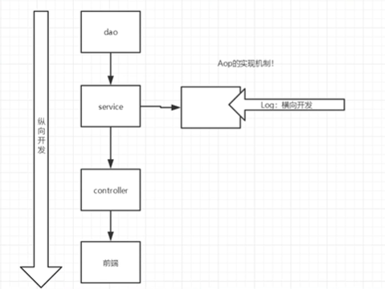

# spring精简

## 1.spring简介

spring是一个开源的轻量级的框架，以IOC（inverse of control）和AOP为核心

现代Java开发


## 2.IOC

控制反转（spring的ioc对象由spring来创建，管理，装配）


## 3.依赖注入

依赖  bean对象的创建依赖于容器

注入  bean对象的所有属性由容器来注入

1.set方法

```
 <bean id="userDao" class="cn.gsxt.mapper.impl.userDaoImpl"></bean>
 <bean id="userService" class="cn.gsxt.service.impl.UserServiceImpl">
  	<property name="userDao" ref="userDao"></property>
 </bean>
 
 把容器内部的userDao通过UserService中的setUserDAO方法注给service,name指的是set方法的属性值，ref指要注入的对象在配置文件中的唯一标识ID
```

2.构造方法


```
第三种   引用
<bean id="userDao" class="com.itheima.dao.impl.UserDaoImpl"/>
<bean id="userService" class="com.itheima.service.impl.UserServiceImpl">      		   	<constructor-arg name="userDao" ref="userDao"></constructor-arg>
</bean>
  name为构造方法的参数名，ref为xml中bean的唯一标识id
```

3.p命名空间（相当于properties属性）和c命名空间（相当于构造器注入）

（注意点  p和c命名空间需要导入约束）


### Bean的依赖注入的数据类型

除了对象的引用可以注入，普通数据类型，集合等都可以在容器中进行注入

普通数据类型

xml文件property标签中用value来接收值

引用数据类型

集合数据类型

Spring的重点配置

```
<bean>标签
	id属性 在容器中Bean实例的唯一标识，不允许重复
	class属性  在容器中Bean实例的全路径名
	scope属性  Bean实例的作用范围 Singleton(默认) prototype
	<proterty>标签 属性注入 set方法的依赖注入
		name属性:属性名称  set方法后面的值的第一个字母小写
		value属性 注入的普通属性值
		ref属性 注入的对象的引用值  bean注入
		<list>标签    
		<map>标签
		<properties> 标签
	<constructor-arg>  有参构造方法设置依赖注入
		name属性:属性名称  set方法后面的值的第一个字母小写
		value属性 注入的普通属性值
		ref属性 注入的对象的引用值
		<list>标签
		<map>标签
		<properties> 标签
	<import>标签 导入其他spring的分配置文件
	
	
	
```


## 4.spring配置

alias   别名 （）给bean取别名


import  引入其他配置文件


## 5.Bean的作用域


singleton(单例)


​			singleton  容器中存在唯一一个对象

​			prototype  容器存在多个对象

### 对象Bean的创建时机

​	singleton  配置文件加载的时候，创建Spring容器的时候，就创建Bean对象

​	prototype 在使用容器getBean获取对象的时候才创建


3.其他的作用域只有在web开发中


## bean的属性装配

显式装配

注解装配

隐式装配

autowire  


## 6.spring注解开发

是一种趋势,提高开发效率

@

### 原始注解


  使用xml配置的方式,setattr方法需要写,因为是spring通过反射调用,注解配置不需要,通过反射直接为属性赋值


@VALUE属性

```
 @Value("${jdbc.driver}") //xml配置文件已加载properties
  private String lyy;
  从容器中获取jdbc.driver对应的值注入给lyy
```


## 7.java类来做配置

### @Configuration


### spring新注解


## 8.代理模式


### 静态代理

角色分析

​	抽象角色：一般使用接口和抽象类来解决

​	真是角色  被代理的角色

​	代理角色 代理真实角色，代理真实角色后，我们一般会做一些附属操作

​	客户： 访问代理对象的人

接口

```
public interface Rent {
    public void rent();
}
```

真实角色

```
package cn.gsxt.demo01;

//房东  真实角色
public class Host implements Rent {
    public void rent() {
        System.out.println("房东要出租房屋");
    }
}
```

代理角色

```
package cn.gsxt.demo01;

public class Proxy {
    private Host host;

    public Proxy(){

    }

    public Proxy(Host host){
     this.host = host;
    }

    public void rent(){
        seeHouse();
        host.rent();
        fare();
    }

    public void seeHouse(){
        System.out.println("中介带看房子");
    }

    public void fare(){
        System.out.println("收中介费");
    }


}
```

真实用户

```
public class Client {
    public static void main(String[] args) {
        Host host = new Host();
        Proxy proxy = new Proxy(host);
        proxy.rent();


    }
}
```

代理模式的好处

1.可以使真实角色的的操作更加纯粹，不用去关注一些公共的业务

2.公共业务就交给代理角色，实现角色的分工

3.公共业务发生扩展的时候，方便集中管理


开发流程的理解



### 	动态代理

动态代理和静态代理角色一样

动态代理的代理类是动态生成的，不是我们直接写好的

动态代理的两大类

​	1.基于接口------   JDK动态代理

​	2.基于类----cglib

两个类

```
InvocationHandler
Proxy
```

## 9.AOP


2）Spring AOP使用的动态代理，所谓的动态代理就是说AOP框架不会去修改字节码，而是每次运行时在内存中临时为方法生成一个AOP对象，这个AOP对象包含了目标对象的全部方法，并且在特定的切点做了增强处理，并回调原对象的方法。 

spring整合mybatis

1.配置

```
<dependency>
    <groupId>org.mybatis</groupId>
    <artifactId>mybatis-spring</artifactId>
    <version>2.0.2</version>
</dependency>
```


spring和mybatis整合的两种方式

1.一种是传统的   

```
sqlSessionFactory是由spring来管理的  但是我们要通过sqlSession来获取mapper
```


mapper的实现类  获取sqlSession获取mapper


2.另一种是sqlSessionFactory和mapper的实现类都由spring来给我们管理

```
 <!--  加载properties文件  -->
    <context:property-placeholder location="classpath:jdbc.properties"></context:property-placeholder>
    <!--    配置数据源-->
    <bean id="dataSource" class="com.alibaba.druid.pool.DruidDataSource">
        <property name="driverClassName" value="${jdbc.driver}"/>
        <property name="url" value="${jdbc.url}"/>
        <property name="username" value="${jdbc.username}"/>
        <property name="password" value="${jdbc.password}"/>
    </bean>
    <!--  配置mybatis层要使用的sqlSessionFactory  -->
    <bean id="sqlSessionFactory" class="org.mybatis.spring.SqlSessionFactoryBean">
        <!--  spring帮助我们创建sqlsessionFactory工厂  内部需要数据源 需要mybatis的核心配置文件-->
        <property name="dataSource" ref="dataSource"></property>
        <!-- 加载绑定mybatis的核心文件  因为SqlSessionFactoryBean 本质上是操作mybatis层的-->
        <property name="configLocation" value="classpath:mybatis-config.xml"></property>
    </bean>
    <!--    加载mapper所在的包 为mapper创建实现类,放入spring容器中 我们需要使用的时候,
    直接注入  不用再sqlSession获取mapper-->
    <bean class="org.mybatis.spring.mapper.MapperScannerConfigurer">
        <property name="basePackage" value="cn.gsxt.mapper"></property>
    </bean>
    
    
    
    我们在service层直接注入mapper
    直接mapper调用方法就可以
```

# 使用bean的方式

```
应用上下文对象是通过new ClasspathXmlApplicationContext(spring配置文件) 方式获取的，但是每次从容器中获得Bean时都要编写new ClasspathXmlApplicationContext(spring配置文件) ，这样的弊端是配置文件加载多次，应用上下文对象创建多次。

在Web项目中，可以使用ServletContextListener监听Web应用的启动，我们可以在Web应用启动时，就加载Spring的配置文件，创建应用上下文对象ApplicationContext，在将其存储到最大的域servletContext域中，这样就可以在任意位置从域中获得应用上下文ApplicationContext对象了。
```


声明式事务

要么都成功 要么都失败

把一组业务当成一个业务来做,确保完整性和一致性

事物的ACID原则

原子性

一致性

隔离性

多个事务可能操作同个资源,防止数据损坏

持久性

事务一旦提交,无论发生什么问题,结果都不会被影响,持久到数据库中


