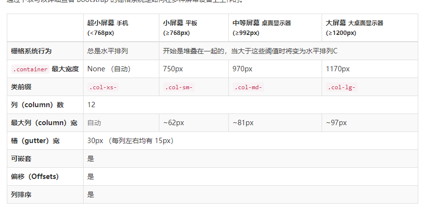
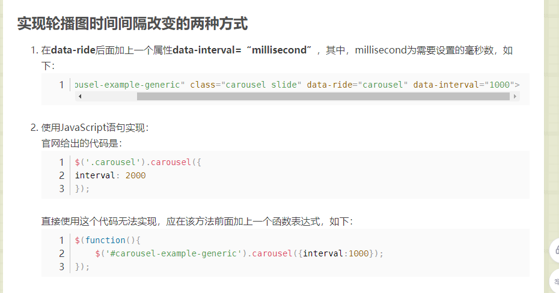

bootstrap

前端框架		一个半成品,在框架基础上进行开发 简化代码

​	定义了很多CSS样式和JS样式 可以使用这些样式和插件得到丰富的页面效果

​	响应式布局

​		同一套页面可以兼容不同分辨率的设备

2.快速入门

​	下载 导包

```
使用bootstrap的模板
<!DOCTYPE html>
<html lang="zh-CN">
<head>
    <meta charset="utf-8">
    <meta http-equiv="X-UA-Compatible" content="IE=edge">
    <meta name="viewport" content="width=device-width, initial-scale=1">
    <title>Bootstrap 101 Template</title>
    <!-- Bootstrap -->
    <link href="css/bootstrap.min.css" rel="stylesheet">
    <script src="js/jquery-3.2.1.min.js"></script>
    <script src="js/bootstrap.min.js"></script>
</head>
<body>
<h1>你好，世界！</h1>

<script src="js/jquery-3.2.1.min.js"></script>
<script src="js/bootstrap.min.js"></script>
</body>
</html>
```

3.响应式布局

​		同一套页面可以兼容不同分辨率的设备

​		使用bootstrap的栅格式布局

​	步骤

​		1.定义容器  相当于之前的table

​			容器分类

​			1.container  每一种设备  两边都会有留白  根据文档来看

​			2.container-fluid  百分百宽度 每一种设备都是占满屏幕

​		2.定义行  相当于之前的tr  样式 row

​		3.定义元素  指定元素在不同的设备上 所占的格子数目

​			样式 col-设备代号-格子数目

​			设备代号    xs  

​	

4.注意事项

​	一行col -xs -num     num代表把整个页面分成12  占了num/12的比例


CSS样式和JS插件

​	全局css样式

​		按钮

​			btn btn-default   default可以修改为其他参数  不同参数效果不同

​			primary  success  info等

​		图片

```

class属性的内容代表图片随着响应式布局调整  在任意尺寸永远都占百分百
class里面加下边三个属性 可以改变图片的形状边框  分别是圆方相框
img-circle
img-rounded  
img-thumbnail

```

​		表格

```
class="table table-striped table-bordered table-hover "都是一些属性 即用即查
```

​		表单

```
class="form-control"
单独的表单控件会被自动赋予一些全局样式。所有设置了 .form-control 类的 <input>、<textarea> 和 <select> 元素都将被默认设置宽度属性为 width: 100%;。 将 label 元素和前面提到的控件包裹在 .form-group 中可以获得最好的排列。

```

​	组件

​		导航条

​		分页条

​			最常用

​			

```
禁用和激活状态
链接在不同情况下可以定制。你可以给不能点击的链接添加 .disabled 类、给当前页添加 .active 类。
比如在第一条  就禁用最前边的  最后一条
```

​	插件

​		轮播图

​	修改bootstrap轮播图间隔时间的两种方式

```
在data-ride后面加上一个属性data-interval=“millisecond”，其中，millisecond为需要设置的毫秒值
data-interval="2000"
官网
```




