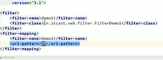
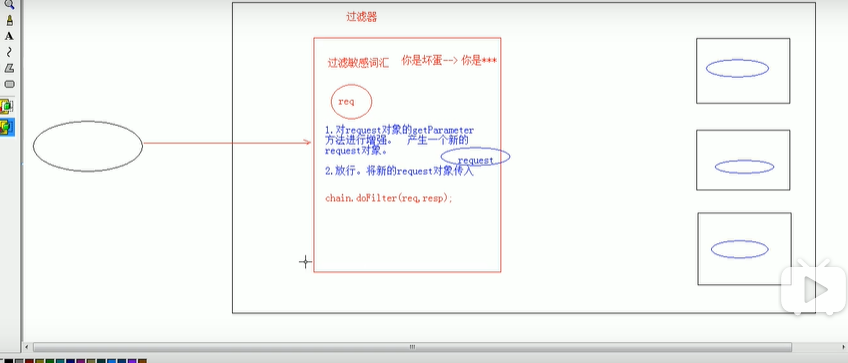

## 过滤器和监听器

### Filter过滤器

#### 1.概念

```
web中的过滤器：当访问服务器的资源的时候，过滤器可以将请求拦截下来，完成一些特殊的功能

过滤器的作用

	一般用于完成通用的操作，例如登陆验证，统一编码，敏感字符过滤（）

	

```

#### 2.快速入门

```
实现接口Filter
重写方法
	一般情况重写doFilter
配置（拦截路径）
	访问什么资源过滤器生效
执行完过滤器之后要考虑是否放行
	filterChain.doFilter(servletRequest, servletResponse);
```

#### 3.过滤器细节

##### 	1.web.xml配置



​		<url-pattern> 拦截路径  那些路径需要进行配置

​		注解配置的源码中

​			values也代表了url-patterns  value = xxx  如果只有一个值，value可以省略  @WebFilter("/*") 类上直接进行注解

##### 	2.过滤器执行流程	

```
	进入到重写的filter类的doFilter方法中，执行相应的操作，然后放行，去访问资源，如果不放行就不会去访问资源，放行完毕之后带着response对象继续从放行之后再执行。放行之后可以对response对象进行增强
放行之前对request对象的请求消息进行增强
放行之后对response对象的响应消息进行增强
```

​		

##### 	3.过滤器生命周期方法

​		三个方法 init()方法

​		doFilter()方法   destroy()方法

```
init方法会在服务器启动后会创建filter对象，调用init方法，服务器自动调用，一般在init方法中，进行资源的加载 正常关闭执行destroy()方法，用来释放资源
dofilter()方法   每一次请求被拦截资源时，会执行，执行多次
```

##### 	4.过滤器配置详解

###### 		拦截路径配置

​		1.具体资源路径  /index.jsp   只有访问index.jsp，过滤器才会被执行

​		2.拦截目录  /user/*  访问/user下的所有资源，过滤器...

​		3.后缀名拦截 *.jsp 访问后缀名过滤器都会被执行

​		4.拦截所有资源   /*  访问所有资源，过滤器会被执行

###### 		拦截方式配置  资源被访问的方式（浏览器直接访问，或转发访问等）

​			注解配置

​			设置 dispatcherTypes属性

​		

```
public enum DispatcherType {
    FORWARD,  //默认值  浏览器直接请求资源
    INCLUDE,   //转发访问资源
    REQUEST,	//包含访问资源
    ASYNC,		//错误跳转资源
    ERROR;		//异步访问资源
    
    @WebFilter(value = "/index.jsp", dispatcherTypes = DispatcherType.REQUEST)
    直接访问index.jsp时，下边的过滤器会被执行
    转发过来的请求便不会被执行
    dispatcherTypes 支持配置多个参数，接收是个list
    dispatcherTypes  = {DispatcherType.REQUEST， DispatcherType.FPRWARD}   转发和直接访问过滤器都可以被执行
```

​				

​			web.xml配置

​			filter-mapping下的dispatcher标签也有五个参数

##### 	5.过滤器链

```
(配置多个过滤器)
		* 执行顺序：如果有两个过滤器：过滤器1和过滤器2
			1. 过滤器1
			2. 过滤器2
			3. 访问资源执行
			4. 过滤器2
			5. 过滤器1 

		* 过滤器先后顺序问题：
			1. 注解配置：按照类名的字符串比较规则比较，值小的先执行
				* 如： AFilter 和 BFilter，AFilter就先执行了。
			2. web.xml配置： <filter-mapping>谁定义在上边，谁先执行
```

​	登陆验证（权限控制）	

过滤敏感词汇



可能在整个项目中有多个页面都需要用户录入信息

所以需要使用过滤器对敏感词汇进行replace，获取用户提交的信息用request.getParameterMap();或者其他两个方法获取到参数，再使用过滤器在过滤器里进行代理模式设计对方法进行增强，因为没有方法往request里设置参数，所以需要使用代理模式或装饰模式 对方法进行封装，产生一个新的request对象，将request对象传入

### Listener监听器