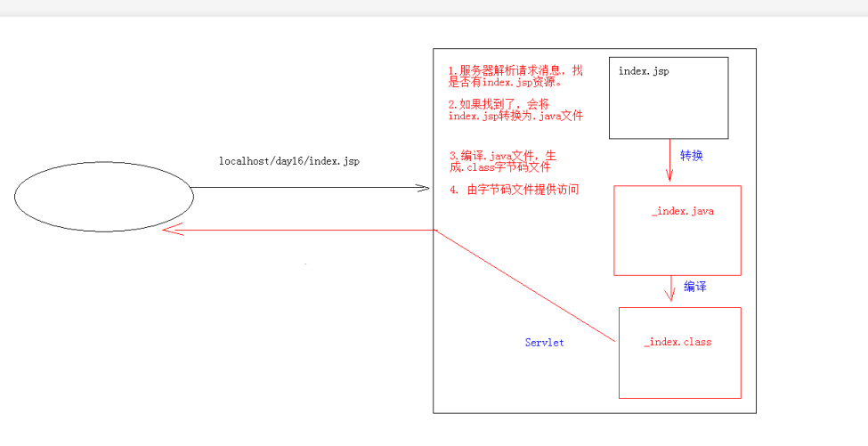
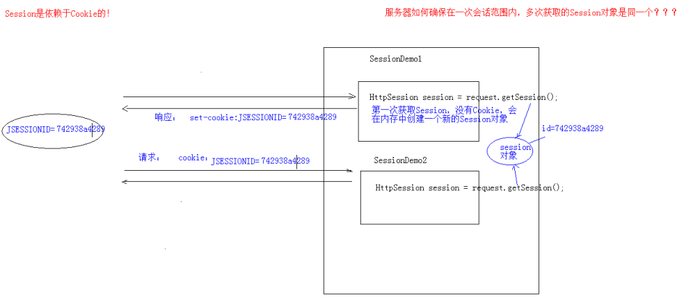
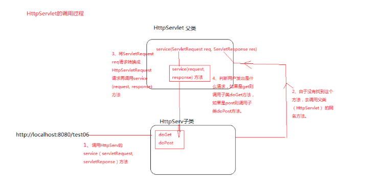

1.会话技术

​	1.Cookie

​	2.Session

2.jsp入门

会话技术

会话  一次会话中包含多次请求和响应

​	一次会话 浏览器第一次给服务器资源发送请求，会话建立，直到有一方断开连接为止

功能  在一次会话的范围内多次请求间，共享数据

方式

​	客户端会话技术 	Cookie

​	服务端会话技术	Session

## cookie

1.Cookie 客户端会话技术，将数据保存在客户端

2.使用步骤

​	1.创建cookie对象

​	Cookie cookie = new Cookie(String name, String value);

​	2.发送cookie对象

​	response.add(Cookie cookie);

​	3.获取Cookie,拿到数据

​	request.getCookies()

3.实现原理

​	基于响应头set-cookie和请求头cookie实现

4.cookie的细节

​	1.一次可不可以发送多个cookie

​		可以

​		可以创建多个cookie对象，使用response多次addCookie（）方法发送即可

​	2.cookie在浏览器默认保存多长时间

​		默认在整个会话结束之前，在浏览器关闭后，自动销毁cookie数据

​		2.如果想要持久化存储

​			setMaxAge(int Seconds)

​			1.正数，想要保存的时间

​			2.负数  默认值

​			3.0  删除之前设置的cookie保存的信息

​	3.cookie能不能设置中文

​		Tomcat8之前不可以，需要将中文数据转码，一般采用URl编码

​		Tomcat8之后可以设置，但是还是不支持特殊字符，建议使用url编码解析，url编码存储

​	4.cookie的共享问题

​		在一个Tomcat服务器下，部署多个项目，cookie的共享问题，默认共享范围是一个项目下  setPath("虚拟路径"） 如果整个服务器下都想共享 那么需要设置  setPath("/")

​		不同的tomcat服务器间的cookie共享问题？

​		参考 百度的  tieba.baidu.com   news.baidu.com

​		setDomain(String path)  如果设置一级域名相同，那么多个服务器之间的cookie可以共享

​		setDomain(".baidu.com")   百度多个服务器之间cookie可以共享

5.cookie的特点和作用

​	1.cookie的存储数据在客户端浏览器

​	2.浏览器对单个cookie有大小限制(4KB)  一个域名下cookie不能超过20个

​	

* 作用：
   1. cookie一般用于存出少量的不太敏感的数据
     2. 在不登录的情况下，完成服务器对客户端的身份识别

​	见文件下下的ServiceTestCookie


jsp入门学习

​	1.概念  java server pages java服务器端页面

​		可以理解为一个特殊的页面里面既可以指定Java代码 也可以书写Html标签

​		简化书写

​	原理

​		jsp的本质就是一个servlet

​	jsp脚本 jsp定义java的方式

​		<% 代码%>  定义的Java代码 在service方法中，service方法中可以定义什么该脚本中就可以定义什么

​		<%! 代码 %>  定义的Java代码  在jsp转换  后的Java类的成员位置    转换成Java class文件的成员变量

​		<%= 代码 %>  定义的Java代码 会输出到页面上，输出的语句中可以定义什么 该脚本就可以定义什么

	

```
4. JSP的内置对象：
	* 在jsp页面中不需要获取和创建，可以直接使用的对象
	* jsp一共有9个内置对象。
	* 今天学习3个：
		* request
		* response
		* out：字符输出流对象。可以将数据输出到页面上。和response.getWriter()类似
			* response.getWriter()和out.write()的区别：
				* 在tomcat服务器真正给客户端做出响应之前，会先找response缓冲区数据，再找out缓冲区数据。
				* response.getWriter()数据输出永远在out.write()之前
			
5. 案例:改造Cookie案例
```

## session

一次会话中的多次请求中共享数据

​	使用

​	1.获取 HttpSession对象

​		HttpSession session = request.getSession()

​	2.使用session

​		设置属性  session.setAttribute(String name, Object value)

​		获取属性

​			session.getAttribute(String name)

​		移除session

​			session.removeAttribute(String name)


session的原理




```

```


```
1.当客户端关闭时 服务器不关闭， 两次获取的session是否是同一个？
	不是，客户端关闭意味着一次会话结束
	如果需要相同，则可以设置为cookie的值
		获取session之后 根据JSESSIONID来设置为键， value为ID
		Cookie cookie = new Cookie("JSESSIONID",session.getId())
		c.setMaxAge(60*60)
		response.addCookie(c)
2.客户端不关闭，服务器关闭后，两次获取的session是否是同一个？
	不是同一个， 因为关闭后，内存就销毁
	要确保数据不丢失的方法是 将session对象序列化持久存储在硬盘里
	session的钝化
		在服务器正常关闭之前，将session对象序列化硬盘上
	session的活化
		在服务器启动后，将session文件转化为内存中的session对象（反序列化）
		idea中无法实现session的钝化和活化，因为session会自动的将work文件夹删除创建新的文件夹
		
3.session的失效时间
	1.服务器关闭
	2.session对象调用invalidate（）
	3.session默认失效时间 30分钟
	选择性配置修改
		<session-config>
		        <session-timeout>30</session-timeout>
		    </session-config>

5. session的特点
	 1. session用于存储一次会话的多次请求的数据，存在服务器端
	 2. session可以存储任意类型，任意大小的数据

	* session与Cookie的区别：
		1. session存储数据在服务器端，Cookie在客户端
		2. session没有数据大小限制，Cookie有
		3. session数据安全，Cookie相对于不安全
```



必须重写dopost和doget方法，因为在源码底层 如果不重写的话会抛异常