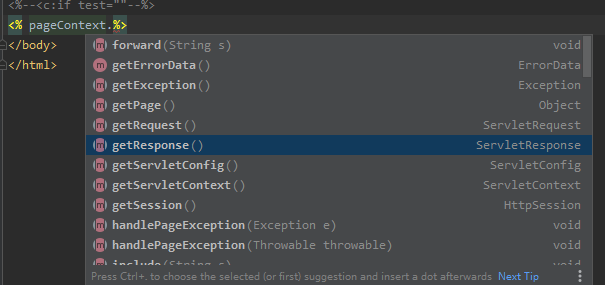
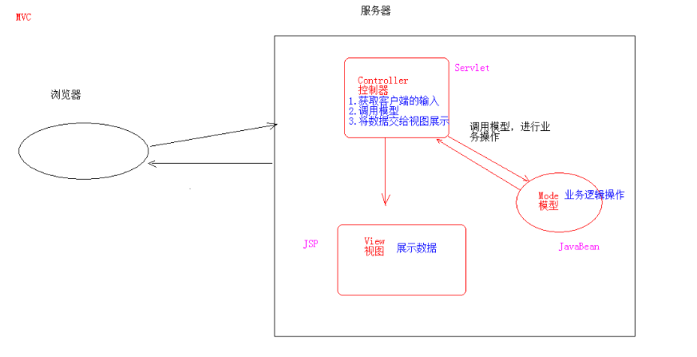
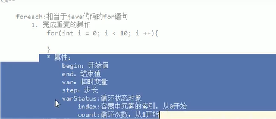

JSP

​	1.指令

​	2.注释

​	3.内置对象

2.MVC开发模式

3.EL表达式

4.JSTL标签

5.三层架构


1.指令

​	作用 用于配置JSP页面，导入资源文件

​	1.page 配置JSP页面的

​	ContentType  作用效果等同于  response.setContentType()

​		设置响应体的MIME类型 以及字符集

​		设置当前页面的编码格式

​		errorPage 当前页面发生异常后，会跳转到指定错误页面

​		isErrorPage  标记当前页面是否错误页面

​			是错误页面，可以使用内置对象Exception

```
String message = exception.getMessage();
        out.print(message);  
```

​			不是设定错误页面，则不可以使用Exception对象

```
<%@ page contentType="text/html;charset=gbk" errorPage="500.jsp"   pageEncoding="GBK" language="java" buffer="16kb" %>

```

​		2.include

​	

```
<% @include file="top.jsp"%> 表示页面包含的，可以导入一些静态不变的标签 类似于代码封装重用
```


​		3.taglib

​		

```
	导入资源

		<%@ taglib prefix="c" uri="http://java.sun.com/jsp/jstl/core" %>   prefix前缀 自定义的 方便使用默认是c

```

​	注释

​		

```
2. 注释:
	1. html注释：
		<!-- -->:只能注释html代码片段
	2. jsp注释：推荐使用
		<%-- --%>：可以注释所有
```

JSP内置对象

```
在jsp页面中不需要创建，可以直接使用的对象
变量名            真实类型               作用
pageContext       PageContext        当前页面共享数据，还可以获取其他八个内置对象  
session			 HttpSession       一次会话的多个请求间共享数据
request            HttpServerRequest    一次请求访问的多个资源
application		  ServletContext       所有用户共享数据				
response           HttpServletResponse      响应对象
page			  Object               当前页面的(Servlet)对象
out				  JspWriter            输出对象，数据输出到页面上
config			  ServletConfig          Servlet的配置对象
Exception            Throwable            异常对象，iserrorPage为True的时候
```




MVC开发模式


```
1.早期只有Servlet，只能使用response输出标签数据，非常麻烦

	2.后来有了JSP，简化了servlet,过度使用，页面杂乱，Java，html各种文件都有，难于维护

	3.Javaweb开发 借鉴mvc开发模式，使得程序设计更加合理性

2.MVC
MODEL  模型   JavaBean
	完成具体的业务操作，，查询数据库，封装对象
VIEW  视图  JSP
	展示数据
Controller  控制器  servlet
	获取用户输入
	调用模型
	将数据交给视图进行展示
* 优缺点：
		1. 优点：
			1. 耦合性低，方便维护，可以利于分工协作
			2. 重用性高

		2. 缺点：
			1. 使得项目架构变得复杂，对开发人员要求高
	

```





MVC模式下


```
JSP页面尽量只做展示层，但是还是需要在jsp页面下写Java代码 ，所以引入了EL 和jstl替换

EL(表达式语言)  Expression Language

作用 替换jsp页面的java语言

语法 ${表达式}

	某些情况下    忽略表达式

1. 设置jsp中page指令中：isELIgnored="true" 忽略当前jsp页面中所有的el表达式
   1. ${表达式} ：忽略当前这个el表达式

使用
	1.运算
		算术运算
		逻辑运算
		比较运算
		空运算 
			功能  用于判断字符串，集合，数组对象是否为null
			* ${empty list}:判断字符串、集合、数组对象是否为null或者长度为0
				* ${not empty str}:表示判断字符串、集合、数组对象是否不为null 并且 长度>0


```

EL获取值(EL表达式只能获取域对象里存储的数据)

```
域名称
	pageScope     PageContext
	requestScope   request
	sessionScope    session
	applicationScope    application（ServletContext）
	
	<h1>el表达式只能从域对象中获取值</h1>
<h1> ${域名称.键名} 从指定域中获取指定键的值</h1>

<%
    //在域中存储数据
    request.setAttribute("name", "张三");
    session.setAttribute("name", "张三");
%>
<h3>el获取值</h3>
${requestScope.name}
${sessionScope.name}

${键名}  表示依次从最小的域中开始查找是否有该键对应的值，查找到为止
	
	
```

EL获取获取对象、List集合、Map集合的值

```
3. 获取对象、List集合、Map集合的值
				1. 对象：${域名称.键名.属性名}
					* 本质上会去调用对象的getter方法

				2. List集合：${域名称.键名[索引]}

				3. Map集合：
					* ${域名称.键名.key名称}
					* ${域名称.键名["key名称"]}
```

JSTL   javaServer pages Tag Library   JSP标准标签库

​	开源的免费的jsp标签

作用

​	用于简化和替换jsp页面的Java代码

三个常用标签  if  choose  foreach

```
<c:if test="3<4">
    
</c:if>
test为必须属性，添加boolean  如果为真，在页面上显示标签体内容，不为真不显示，可以在if标签里嵌套html标签
和EL一起使用
判断request域中的list集合是否为空，不为空遍历
<c:if test="${not empty list}">
遍历集合操作...
</c:if>
c:if没有else标签 是能再做c:if判断
```

```
choose标签   类似于Java的switch
<h1>choose标签做一个类似于switch标签 数字案例对应星期几</h1>
<%
request.setAttribute("number", 3);
%>
<c:choose>
    <c:when test="${number == 1}"> 星期一</c:when>
    <c:when test="${number == 2}"> 星期二</c:when>
    <c:when test="${number == 3}"> 星期三</c:when>
    <c:when test="${number == 4}"> 星期四</c:when>
    <c:when test="${number == 5}"> 星期五</c:when>
    <c:when test="${number == 6}"> 星期六</c:when>
    <c:when test="${number == 7}"> 星期天</c:when>
</c:choose>

```

```
foreach标签
1.完成重复性的操作

<c:forEach begin="1" end="10" var="i" step="1" varStatus="s">
${i}<br>
    ${s.index}<br>
    ${s.count}<br>
</c:forEach>
index 遍历元素的索引
count  循环元素的次数
2.遍历容器
List<User> list;
for(User user: list){
    
}
//属性 items 容器对象  相当于list
var  容器中元素的临时变量   相当于user

```

