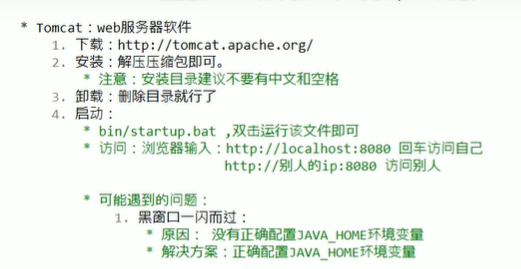
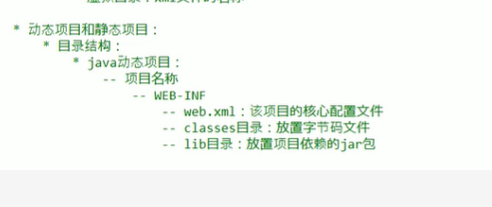
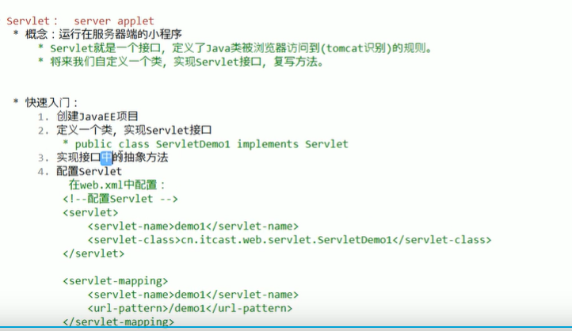
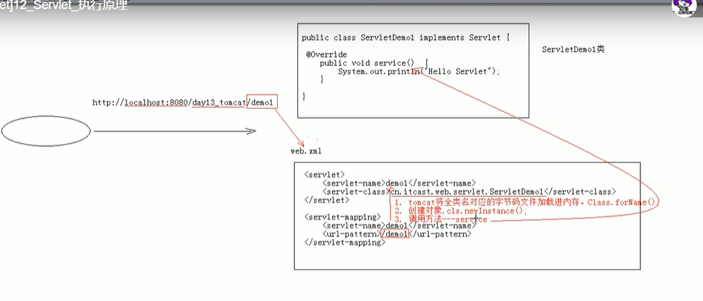
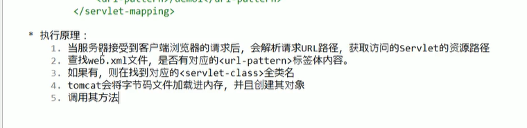

tomcat_demo1

tomcat的相关知识



​		tomcat部署项目的方式

​		

```
1.直接将项目放在webapps目录下
	/hello  项目的访问路径   虚拟目录
	简化步骤  将项目打成一个war包  再将这个war包放在webapps下,war包会自动解压缩
2.配置conf/server.xml文件
	在<Host>标签体中设置
	<Context docBase="D:\hello" path="/hehe">
	docBase  项目真正存放的磁盘路径
	path  访问时的虚拟路径
3.在conf/catalina/localhost下创建任意名称的xml文件,在文件中编写
	<Context docBase="D:/hello">  访问的时候虚拟目录就是写的任意的xml文件的名字
```









servlet的声明周期方法

​	1.被创建 执行init,只执行一次

​	servlet什么时候被创建?

​			默认情况下,第一次被访问时,servlet被创建

​			可以配置servlet的创建时间

```
	<!--        指定servlet被创建的时机
    1.第一次被访问时创建  load-on-startup值为负数的时候 默认的是-1
    
    2.在服务器启动的时候创建,  设置为0-10正整数
    配置在servlet标签下
	-->

        <load-on-startup></load-on-startup>
    servlet的init方法,只执行一次,说明一个servlet在内存中只存在一个对象,servlet是单例的
    	多个用户同时访问可能存在线程安全问题,不能对方法加锁和同步代码块  
    		解决方案  尽量不要在service中定义成员变量 即使定义了成员变量也不要对其进行修改
```

2.提供服务

​			执行service方法,执行多次

3.被销毁

​			执行destory方法,只执行一次,服务器关闭时 servlet被销毁,只有在正常关闭才会执行


servlet3.0标准

​	支持竹节配置  可以使用web.xml也可以注解配置

​	步骤

​		1.创建javaee项目,选择servlet3.0以上的版本,可以不创建web.xml

​		2.定义一个类,实现servlet接口

​		3.复写方法

​		4.在类上使用@webServlet注解,进行配置

​		

```
@WebServlet(urlPatterns = {"/demo"})
//如果只有一个注解  可以 @WebServlet("/demo")
"/demo"  资源路径
```

IDEA与tomcat的相关配置

​	1.idea会为每一个tomcat部署的项目单独建立一份配置文件

​				查看控制台         Using CATALINA_BASE:       C:\Users\yang\.IntelliJIdea2019.3\system\tomcat\Tomcat_8_5_31_java_web_2

​	2.项目分为工作空间项目和tomcat配置的web项目

​			tomcat真正访问的是"tomcat部署的web项目" tomcat部署的web项目对应着工作空间项目 的web目录下的所有资源 

​			web-inf目录下的资源不能直接被浏览器访问

​	3.断点调试

​			使用小虫子启动debug启动