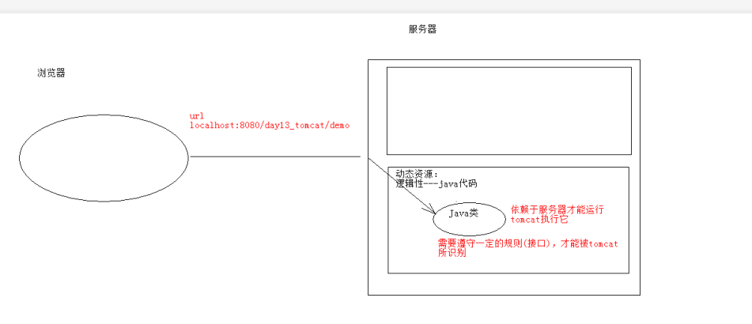
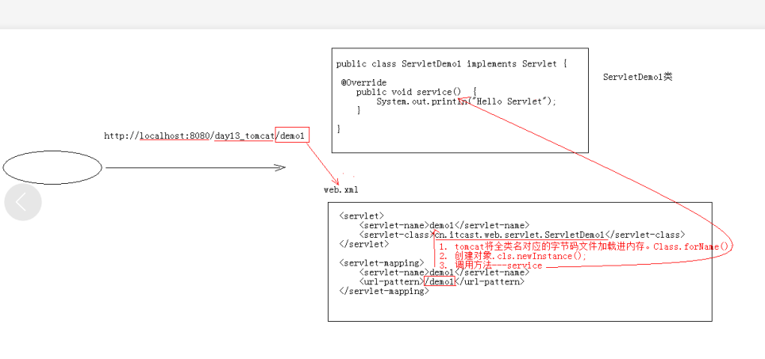

servlet&&response

servlet的一些原理





## http协议

```
响应
	响应行
		协议/版本 响应状态码 
		响应状态吗  响应状态码：服务器告诉客户端浏览器本次请求和响应的一个状态。
		常见状态吗
		1. 状态码都是3位数字 
				2. 分类：
					1. 1xx：服务器就收客户端消息，但没有接受完成，等待一段时间后，发送1xx多状态码
					2. 2xx：成功。代表：200
					3. 3xx：重定向。代表：302(重定向)，304(访问缓存)
					4. 4xx：客户端错误。
						* 代表：
							* 404（请求路径没有对应的资源） 
							* 405：请求方式没有对应的doXxx方法
					5. 5xx：服务器端错误。代表：500(服务器内部出现异常)
	响应头
		格式  头名称：值
		常见响应头
			content-type服务器告诉客户端本次响应体的数据格式格式和编码格式
			Content-disposition:服务端告诉客户端以什么格式打开响应体数据
				in-line默认在当前页面打开
				attachment;filename=xxx;以附件形式打开响应体，文件下载
			
		
	响应空行
	
	响应体
		* 响应字符串格式
		HTTP/1.1 200 OK
		Content-Type: text/html;charset=UTF-8
		Content-Length: 101
		Date: Wed, 06 Jun 2018 07:08:42 GMT

		<html>
		  <head>
		    <title>$Title$</title>
		  </head>
		  <body>
		  hello , response
		  </body>
		</html>
		
	
```

Response对象

```
功能：设置响应消息
	1.设置响应行
		1.格式 HTTP/1.1 200 OK
		2.设置状态吗  setStatus(int sc)
	2.设置响应头 setHeader(String name, String value)
		//访问/responseDemo1，会自动跳转到/responseDemo2资源
       /* //1. 设置状态码为302
        response.setStatus(302);
        //2.设置响应头location
        response.setHeader("location","/day15/responseDemo2");*/
      3.设置响应体
      使用步骤
      	1.获取输出流
      		字符输出流 PrintWriter getWriter()
      		字节输出流 ServletOutputStream  getOutPutStream()
      	2.使用输出流 将数据输出到客户端浏览器
```

​		response提供的重定向

```
response.sendRedirect("/serveltResponse/ResponseDemo2");
//servletResponse为我项目的虚拟目录
重定向和转发的区别
	重定向
		url发生改变，跳转
		两次请求，不能使用request来共享数据
		可以访问其他服务器的资源
	转发
		url不发生改变
		一次请求，可以使用request.setAttribute() getAttributr()来共享资源
		只能访问当前服务器下的资源
		
```

目录

```
	1. 路径分类
				1. 相对路径：通过相对路径不可以确定唯一资源
					* 如：./index.html
					* 不以/开头，以.开头路径

					* 规则：找到当前资源和目标资源之间的相对位置关系
						* ./：当前目录
						* ../:后退一级目录
				2. 绝对路径：通过绝对路径可以确定唯一资源
					* 如：http://localhost/day15/responseDemo2		/day15/responseDemo2
					* 以/开头的路径

					* 规则：判断定义的路径是给谁用的？判断请求将来从哪儿发出
						* 给客户端浏览器使用：需要加虚拟目录(项目的访问路径)
							* 建议虚拟目录动态获取：request.getContextPath()
							* <a> , <form> 重定向...
						* 给服务器使用：不需要加虚拟目录
							* 转发路径
```

服务器输出字节/字符数据到浏览器

```
步骤
	1.获取输出字符流
		response.getOutPutStream()
```

ServletContext对象

```
1.概念
	代表整个web应用，可以和程序的容器（服务器）来通信
2.获取
	1.通过request获取
		request.getServerContext()
	2.通过httpServlet获取
		this.getServletContext()
3.功能
	1.获取MIME类型
		MIME类型在互联网通信过程中定义的一种文件数据类型
		格式 大类型/小类型    text/html  image/jpeg
		
	2.域对象 共享数据
		1.setAttribute(String name, String value)
		2.getAttribute(String name)
		3.removeAttribute(String name)
		****ServletContext的对象范围  所有用户的请求数据，不建议使用
	3.获取真实（服务器路径）
	一般三个路径下  src下  WEB-INF下  web下
	web下
	ServletContext context = request.getServletContext()
		context.getRealPath("文件名")
	WEB-INF 下
		context.getRealPath("/WEB-INF/文件名")
	src下
		context.getRealPath("/WEB-INF/classes/文件名")
```

