web笔记小综合

# 今日内容

```
1. web相关概念回顾
2. web服务器软件：Tomcat
3. Servlet入门学习
```


## web相关概念回顾

```
1. 软件架构
	1. C/S：客户端/服务器端
	2. B/S：浏览器/服务器端

2. 资源分类
	1. 静态资源：所有用户访问后，得到的结果都是一样的，称为静态资源.静态资源可以直接被浏览器解析
		* 如： html,css,JavaScript
	2. 动态资源:每个用户访问相同资源后，得到的结果可能不一样。称为动态资源。动态资源被访问后，需要先转换为静态资源，在返回给浏览器
		* 如：servlet/jsp,php,asp....
```

```
3. 网络通信三要素
	1. IP：电子设备(计算机)在网络中的唯一标识。
	2. 端口：应用程序在计算机中的唯一标识。 0~65536
	3. 传输协议：规定了数据传输的规则
		1. 基础协议：
			1. tcp:安全协议，三次握手。 速度稍慢
			2. udp：不安全协议。 速度快
```

## web服务器软件：

```
* 服务器：安装了服务器软件的计算机
* 服务器软件：接收用户的请求，处理请求，做出响应
* web服务器软件：接收用户的请求，处理请求，做出响应。
	* 在web服务器软件中，可以部署web项目，让用户通过浏览器来访问这些项目
	* web容器
```

```
* 常见的java相关的web服务器软件：
	* webLogic：oracle公司，大型的JavaEE服务器，支持所有的JavaEE规范，收费的。
	* webSphere：IBM公司，大型的JavaEE服务器，支持所有的JavaEE规范，收费的。
	* JBOSS：JBOSS公司的，大型的JavaEE服务器，支持所有的JavaEE规范，收费的。
	* Tomcat：Apache基金组织，中小型的JavaEE服务器，仅仅支持少量的JavaEE规范servlet/jsp。开源的，免费的。
```

```
* JavaEE：Java语言在企业级开发中使用的技术规范的总和，一共规定了13项大的规范

* Tomcat：web服务器软件
	1. 下载：http://tomcat.apache.org/
	2. 安装：解压压缩包即可。
		* 注意：安装目录建议不要有中文和空格
	3. 卸载：删除目录就行了
	4. 启动：
		* bin/startup.bat ,双击运行该文件即可
		* 访问：浏览器输入：http://localhost:8080 回车访问自己
						  http://别人的ip:8080 访问别人
		
		* 可能遇到的问题：
			1. 黑窗口一闪而过：
				* 原因： 没有正确配置JAVA_HOME环境变量
				* 解决方案：正确配置JAVA_HOME环境变量

			2. 启动报错：
				1. 暴力：找到占用的端口号，并且找到对应的进程，杀死该进程
					* netstat -ano
				2. 温柔：修改自身的端口号
					* conf/server.xml
					* <Connector port="8888" protocol="HTTP/1.1"
		               connectionTimeout="20000"
		               redirectPort="8445" />
					* 一般会将tomcat的默认端口号修改为80。80端口号是http协议的默认端口号。
						* 好处：在访问时，就不用输入端口号
	5. 关闭：
		1. 正常关闭：
			* bin/shutdown.bat
			* ctrl+c
		2. 强制关闭：
			* 点击启动窗口的×
	6. 配置:
		* 部署项目的方式：
			1. 直接将项目放到webapps目录下即可。
				* /hello：项目的访问路径-->虚拟目录
				* 简化部署：将项目打成一个war包，再将war包放置到webapps目录下。
					* war包会自动解压缩

			2. 配置conf/server.xml文件
				在<Host>标签体中配置
				<Context docBase="D:\hello" path="/hehe" />
				* docBase:项目存放的路径
				* path：虚拟目录

			3. 在conf\Catalina\localhost创建任意名称的xml文件。在文件中编写
				<Context docBase="D:\hello" />
				* 虚拟目录：xml文件的名称
		
		* 静态项目和动态项目：
			* 目录结构
				* java动态项目的目录结构：
					-- 项目的根目录
						-- WEB-INF目录：
							-- web.xml：web项目的核心配置文件
							-- classes目录：放置字节码文件的目录
							-- lib目录：放置依赖的jar包
```

```
		* 将Tomcat集成到IDEA中，并且创建JavaEE的项目，部署项目。
```


## Servlet：  server applet

```
* 概念：运行在服务器端的小程序
	* Servlet就是一个接口，定义了Java类被浏览器访问到(tomcat识别)的规则。
	* 将来我们自定义一个类，实现Servlet接口，复写方法。
```

```
* 快速入门：
	1. 创建JavaEE项目
	2. 定义一个类，实现Servlet接口
		* public class ServletDemo1 implements Servlet
	3. 实现接口中的抽象方法
	4. 配置Servlet
		 在web.xml中配置：
	    <!--配置Servlet -->
	    <servlet>
	        <servlet-name>demo1</servlet-name>
	        <servlet-class>cn.itcast.web.servlet.ServletDemo1</servlet-class>
	    </servlet>
	
	    <servlet-mapping>
	        <servlet-name>demo1</servlet-name>
	        <url-pattern>/demo1</url-pattern>
	    </servlet-mapping>

* 执行原理：
	1. 当服务器接受到客户端浏览器的请求后，会解析请求URL路径，获取访问的Servlet的资源路径
	2. 查找web.xml文件，是否有对应的<url-pattern>标签体内容。
	3. 如果有，则在找到对应的<servlet-class>全类名
	4. tomcat会将字节码文件加载进内存，并且创建其对象
	5. 调用其方法

* Servlet中的生命周期方法：
	1. 被创建：执行init方法，只执行一次
		* Servlet什么时候被创建？
			* 默认情况下，第一次被访问时，Servlet被创建
			* 可以配置执行Servlet的创建时机。
				* 在<servlet>标签下配置
					1. 第一次被访问时，创建
                		* <load-on-startup>的值为负数
		            2. 在服务器启动时，创建
		                * <load-on-startup>的值为0或正整数
```

```
		* Servlet的init方法，只执行一次，说明一个Servlet在内存中只存在一个对象，Servlet是单例的
			* 多个用户同时访问时，可能存在线程安全问题。
			* 解决：尽量不要在Servlet中定义成员变量。即使定义了成员变量，也不要对修改值

	2. 提供服务：执行service方法，执行多次
		* 每次访问Servlet时，Service方法都会被调用一次。
	3. 被销毁：执行destroy方法，只执行一次
		* Servlet被销毁时执行。服务器关闭时，Servlet被销毁
		* 只有服务器正常关闭时，才会执行destroy方法。
		* destroy方法在Servlet被销毁之前执行，一般用于释放资源

* Servlet3.0：
	* 好处：
		* 支持注解配置。可以不需要web.xml了。

	* 步骤：
		1. 创建JavaEE项目，选择Servlet的版本3.0以上，可以不创建web.xml
		2. 定义一个类，实现Servlet接口
		3. 复写方法
		4. 在类上使用@WebServlet注解，进行配置
			* @WebServlet("资源路径")
```

```
			@Target({ElementType.TYPE})
			@Retention(RetentionPolicy.RUNTIME)
			@Documented
			public @interface WebServlet {
			    String name() default "";//相当于<Servlet-name>
			
			    String[] value() default {};//代表urlPatterns()属性配置
			
			    String[] urlPatterns() default {};//相当于<url-pattern>
			
			    int loadOnStartup() default -1;//相当于<load-on-startup>
			
			    WebInitParam[] initParams() default {};
			
			    boolean asyncSupported() default false;
			
			    String smallIcon() default "";
			
			    String largeIcon() default "";
			
			    String description() default "";
			
			    String displayName() default "";
			}
```


## IDEA与tomcat的相关配置

```
1. IDEA会为每一个tomcat部署的项目单独建立一份配置文件
	* 查看控制台的log：Using CATALINA_BASE:   "C:\Users\fqy\.IntelliJIdea2018.1\system\tomcat\_itcast"

2. 工作空间项目    和     tomcat部署的web项目
	* tomcat真正访问的是“tomcat部署的web项目”，"tomcat部署的web项目"对应着"工作空间项目" 的web目录下的所有资源
	* WEB-INF目录下的资源不能被浏览器直接访问。
3. 断点调试：使用"小虫子"启动 dubug 启动
```


# 今日内容：

```
1. Servlet
2. HTTP协议
3. Request
```


## Servlet：

```
1. 概念
2. 步骤
3. 执行原理
4. 生命周期
5. Servlet3.0 注解配置
6. Servlet的体系结构	
	Servlet -- 接口
		|
	GenericServlet -- 抽象类
		|
	HttpServlet  -- 抽象类

	* GenericServlet：将Servlet接口中其他的方法做了默认空实现，只将service()方法作为抽象
		* 将来定义Servlet类时，可以继承GenericServlet，实现service()方法即可

	* HttpServlet：对http协议的一种封装，简化操作
		1. 定义类继承HttpServlet
		2. 复写doGet/doPost方法

7. Servlet相关配置
	1. urlpartten:Servlet访问路径
		1. 一个Servlet可以定义多个访问路径 ： @WebServlet({"/d4","/dd4","/ddd4"})
		2. 路径定义规则：
			1. /xxx：路径匹配
			2. /xxx/xxx:多层路径，目录结构
			3. *.do：扩展名匹配
```

## HTTP：

```
* 概念：Hyper Text Transfer Protocol 超文本传输协议
	* 传输协议：定义了，客户端和服务器端通信时，发送数据的格式
	* 特点：
		1. 基于TCP/IP的高级协议
		2. 默认端口号:80
		3. 基于请求/响应模型的:一次请求对应一次响应
		4. 无状态的：每次请求之间相互独立，不能交互数据

	* 历史版本：
		* 1.0：每一次请求响应都会建立新的连接
		* 1.1：复用连接

* 请求消息数据格式
	1. 请求行
		请求方式 请求url 请求协议/版本
		GET /login.html	HTTP/1.1

		* 请求方式：
			* HTTP协议有7中请求方式，常用的有2种
				* GET：
					1. 请求参数在请求行中，在url后。
					2. 请求的url长度有限制的
					3. 不太安全
				* POST：
					1. 请求参数在请求体中
					2. 请求的url长度没有限制的
					3. 相对安全
	2. 请求头：客户端浏览器告诉服务器一些信息
		请求头名称: 请求头值
		* 常见的请求头：
			1. User-Agent：浏览器告诉服务器，我访问你使用的浏览器版本信息
				* 可以在服务器端获取该头的信息，解决浏览器的兼容性问题

			2. Referer：http://localhost/login.html
				* 告诉服务器，我(当前请求)从哪里来？
					* 作用：
						1. 防盗链：
						2. 统计工作：
	3. 请求空行
		空行，就是用于分割POST请求的请求头，和请求体的。
	4. 请求体(正文)：
		* 封装POST请求消息的请求参数的

	* 字符串格式：
		POST /login.html	HTTP/1.1
		Host: localhost
		User-Agent: Mozilla/5.0 (Windows NT 6.1; Win64; x64; rv:60.0) Gecko/20100101 Firefox/60.0
		Accept: text/html,application/xhtml+xml,application/xml;q=0.9,*/*;q=0.8
		Accept-Language: zh-CN,zh;q=0.8,zh-TW;q=0.7,zh-HK;q=0.5,en-US;q=0.3,en;q=0.2
		Accept-Encoding: gzip, deflate
		Referer: http://localhost/login.html
		Connection: keep-alive
		Upgrade-Insecure-Requests: 1
		
		username=zhangsan	
```

```
* 响应消息数据格式
```


## Request：

```
1. request对象和response对象的原理
	1. request和response对象是由服务器创建的。我们来使用它们
	2. request对象是来获取请求消息，response对象是来设置响应消息

2. request对象继承体系结构：	
	ServletRequest		--	接口
		|	继承
	HttpServletRequest	-- 接口
		|	实现
	org.apache.catalina.connector.RequestFacade 类(tomcat)

3. request功能：
	1. 获取请求消息数据
		1. 获取请求行数据
			* GET /day14/demo1?name=zhangsan HTTP/1.1
			* 方法：
				1. 获取请求方式 ：GET
					* String getMethod()  
				2. (*)获取虚拟目录：/day14
					* String getContextPath()
				3. 获取Servlet路径: /demo1
					* String getServletPath()
				4. 获取get方式请求参数：name=zhangsan
					* String getQueryString()
				5. (*)获取请求URI：/day14/demo1
					* String getRequestURI():		/day14/demo1
					* StringBuffer getRequestURL()  :http://localhost/day14/demo1

					* URL:统一资源定位符 ： http://localhost/day14/demo1	中华人民共和国
					* URI：统一资源标识符 : /day14/demo1					共和国
				
				6. 获取协议及版本：HTTP/1.1
					* String getProtocol()

				7. 获取客户机的IP地址：
					* String getRemoteAddr()
				
		2. 获取请求头数据
			* 方法：
				* (*)String getHeader(String name):通过请求头的名称获取请求头的值
				* Enumeration<String> getHeaderNames():获取所有的请求头名称
			
		3. 获取请求体数据:
			* 请求体：只有POST请求方式，才有请求体，在请求体中封装了POST请求的请求参数
			* 步骤：
				1. 获取流对象
					*  BufferedReader getReader()：获取字符输入流，只能操作字符数据
					*  ServletInputStream getInputStream()：获取字节输入流，可以操作所有类型数据
						* 在文件上传知识点后讲解

				2. 再从流对象中拿数据
```

​				

```
	2. 其他功能：
		1. 获取请求参数通用方式：不论get还是post请求方式都可以使用下列方法来获取请求参数
			1. String getParameter(String name):根据参数名称获取参数值    username=zs&password=123
			2. String[] getParameterValues(String name):根据参数名称获取参数值的数组  hobby=xx&hobby=game
			3. Enumeration<String> getParameterNames():获取所有请求的参数名称
			4. Map<String,String[]> getParameterMap():获取所有参数的map集合

			* 中文乱码问题：
				* get方式：tomcat 8 已经将get方式乱码问题解决了
				* post方式：会乱码
					* 解决：在获取参数前，设置request的编码request.setCharacterEncoding("utf-8");
```

​					

```
		2. 请求转发：一种在服务器内部的资源跳转方式
			1. 步骤：
				1. 通过request对象获取请求转发器对象：RequestDispatcher getRequestDispatcher(String path)
				2. 使用RequestDispatcher对象来进行转发：forward(ServletRequest request, ServletResponse response) 

			2. 特点：
				1. 浏览器地址栏路径不发生变化
				2. 只能转发到当前服务器内部资源中。
				3. 转发是一次请求
```

```
		3. 共享数据：
			* 域对象：一个有作用范围的对象，可以在范围内共享数据
			* request域：代表一次请求的范围，一般用于请求转发的多个资源中共享数据
			* 方法：
				1. void setAttribute(String name,Object obj):存储数据
				2. Object getAttitude(String name):通过键获取值
				3. void removeAttribute(String name):通过键移除键值对

		4. 获取ServletContext：
			* ServletContext getServletContext()
```


## 案例：用户登录

```
* 用户登录案例需求：
	1.编写login.html登录页面
		username & password 两个输入框
	2.使用Druid数据库连接池技术,操作mysql，day14数据库中user表
	3.使用JdbcTemplate技术封装JDBC
	4.登录成功跳转到SuccessServlet展示：登录成功！用户名,欢迎您
	5.登录失败跳转到FailServlet展示：登录失败，用户名或密码错误
```

```
* 分析

* 开发步骤
	1. 创建项目，导入html页面，配置文件，jar包
	2. 创建数据库环境
		CREATE DATABASE day14;
		USE day14;
		CREATE TABLE USER(
		
			id INT PRIMARY KEY AUTO_INCREMENT,
			username VARCHAR(32) UNIQUE NOT NULL,
			PASSWORD VARCHAR(32) NOT NULL
		);

	3. 创建包cn.itcast.domain,创建类User
		package cn.itcast.domain;
		/**
		 * 用户的实体类
		 */
		public class User {
		
		    private int id;
		    private String username;
		    private String password;
```

​			

```
		    public int getId() {
		        return id;
		    }
		
		    public void setId(int id) {
		        this.id = id;
		    }
		
		    public String getUsername() {
		        return username;
		    }
		
		    public void setUsername(String username) {
		        this.username = username;
		    }
		
		    public String getPassword() {
		        return password;
		    }
		
		    public void setPassword(String password) {
		        this.password = password;
		    }
		
		    @Override
		    public String toString() {
		        return "User{" +
		                "id=" + id +
		                ", username='" + username + '\'' +
		                ", password='" + password + '\'' +
		                '}';
		    }
		}
	4. 创建包cn.itcast.util,编写工具类JDBCUtils
		package cn.itcast.util;

		import com.alibaba.druid.pool.DruidDataSourceFactory;
		
		import javax.sql.DataSource;
		import javax.xml.crypto.Data;
		import java.io.IOException;
		import java.io.InputStream;
		import java.sql.Connection;
		import java.sql.SQLException;
		import java.util.Properties;
		
		/**
		 * JDBC工具类 使用Durid连接池
		 */
		public class JDBCUtils {
		
		    private static DataSource ds ;
		
		    static {
		
		        try {
		            //1.加载配置文件
		            Properties pro = new Properties();
		            //使用ClassLoader加载配置文件，获取字节输入流
		            InputStream is = JDBCUtils.class.getClassLoader().getResourceAsStream("druid.properties");
		            pro.load(is);
		
		            //2.初始化连接池对象
		            ds = DruidDataSourceFactory.createDataSource(pro);
		
		        } catch (IOException e) {
		            e.printStackTrace();
		        } catch (Exception e) {
		            e.printStackTrace();
		        }
		    }
		
		    /**
		     * 获取连接池对象
		     */
		    public static DataSource getDataSource(){
		        return ds;
		    }
```

​			

```
		    /**
		     * 获取连接Connection对象
		     */
		    public static Connection getConnection() throws SQLException {
		        return  ds.getConnection();
		    }
		}
	5. 创建包cn.itcast.dao,创建类UserDao,提供login方法
		
		package cn.itcast.dao;

		import cn.itcast.domain.User;
		import cn.itcast.util.JDBCUtils;
		import org.springframework.dao.DataAccessException;
		import org.springframework.jdbc.core.BeanPropertyRowMapper;
		import org.springframework.jdbc.core.JdbcTemplate;
		
		/**
		 * 操作数据库中User表的类
		 */
		public class UserDao {
		
		    //声明JDBCTemplate对象共用
		    private JdbcTemplate template = new JdbcTemplate(JDBCUtils.getDataSource());
		
		    /**
		     * 登录方法
		     * @param loginUser 只有用户名和密码
		     * @return user包含用户全部数据,没有查询到，返回null
		     */
		    public User login(User loginUser){
		        try {
		            //1.编写sql
		            String sql = "select * from user where username = ? and password = ?";
		            //2.调用query方法
		            User user = template.queryForObject(sql,
		                    new BeanPropertyRowMapper<User>(User.class),
		                    loginUser.getUsername(), loginUser.getPassword());
```

​			

```
		            return user;
		        } catch (DataAccessException e) {
		            e.printStackTrace();//记录日志
		            return null;
		        }
		    }
		}
	
	6. 编写cn.itcast.web.servlet.LoginServlet类
		package cn.itcast.web.servlet;

		import cn.itcast.dao.UserDao;
		import cn.itcast.domain.User;
		
		import javax.servlet.ServletException;
		import javax.servlet.annotation.WebServlet;
		import javax.servlet.http.HttpServlet;
		import javax.servlet.http.HttpServletRequest;
		import javax.servlet.http.HttpServletResponse;
		import java.io.IOException;
```

​			

```
		@WebServlet("/loginServlet")
		public class LoginServlet extends HttpServlet {
```

​			

```
		    @Override
		    protected void doGet(HttpServletRequest req, HttpServletResponse resp) throws ServletException, IOException {
		        //1.设置编码
		        req.setCharacterEncoding("utf-8");
		        //2.获取请求参数
		        String username = req.getParameter("username");
		        String password = req.getParameter("password");
		        //3.封装user对象
		        User loginUser = new User();
		        loginUser.setUsername(username);
		        loginUser.setPassword(password);
		
		        //4.调用UserDao的login方法
		        UserDao dao = new UserDao();
		        User user = dao.login(loginUser);
		
		        //5.判断user
		        if(user == null){
		            //登录失败
		            req.getRequestDispatcher("/failServlet").forward(req,resp);
		        }else{
		            //登录成功
		            //存储数据
		            req.setAttribute("user",user);
		            //转发
		            req.getRequestDispatcher("/successServlet").forward(req,resp);
		        }
		
		    }
		
		    @Override
		    protected void doPost(HttpServletRequest req, HttpServletResponse resp) throws ServletException, IOException {
		        this.doGet(req,resp);
		    }
		}

	7. 编写FailServlet和SuccessServlet类
		@WebServlet("/successServlet")
		public class SuccessServlet extends HttpServlet {
		    protected void doPost(HttpServletRequest request, HttpServletResponse response) throws ServletException, IOException {
		        //获取request域中共享的user对象
		        User user = (User) request.getAttribute("user");
		
		        if(user != null){
		            //给页面写一句话
		
		            //设置编码
		            response.setContentType("text/html;charset=utf-8");
		            //输出
		            response.getWriter().write("登录成功！"+user.getUsername()+",欢迎您");
		        }
```

​			

```
		    }		
```

```
		@WebServlet("/failServlet")
		public class FailServlet extends HttpServlet {
		    protected void doPost(HttpServletRequest request, HttpServletResponse response) throws ServletException, IOException {
		        //给页面写一句话
		
		        //设置编码
		        response.setContentType("text/html;charset=utf-8");
		        //输出
		        response.getWriter().write("登录失败，用户名或密码错误");
		
		    }
		
		    protected void doGet(HttpServletRequest request, HttpServletResponse response) throws ServletException, IOException {
		        this.doPost(request,response);
		    }
		}
```


```
	8. login.html中form表单的action路径的写法
		* 虚拟目录+Servlet的资源路径

	9. BeanUtils工具类，简化数据封装
		* 用于封装JavaBean的
		1. JavaBean：标准的Java类
			1. 要求：
				1. 类必须被public修饰
				2. 必须提供空参的构造器
				3. 成员变量必须使用private修饰
				4. 提供公共setter和getter方法
			2. 功能：封装数据
```

```
		2. 概念：
			成员变量：
			属性：setter和getter方法截取后的产物
				例如：getUsername() --> Username--> username
```

```
		3. 方法：
			1. setProperty()
			2. getProperty()
			3. populate(Object obj , Map map):将map集合的键值对信息，封装到对应的JavaBean对象中
```


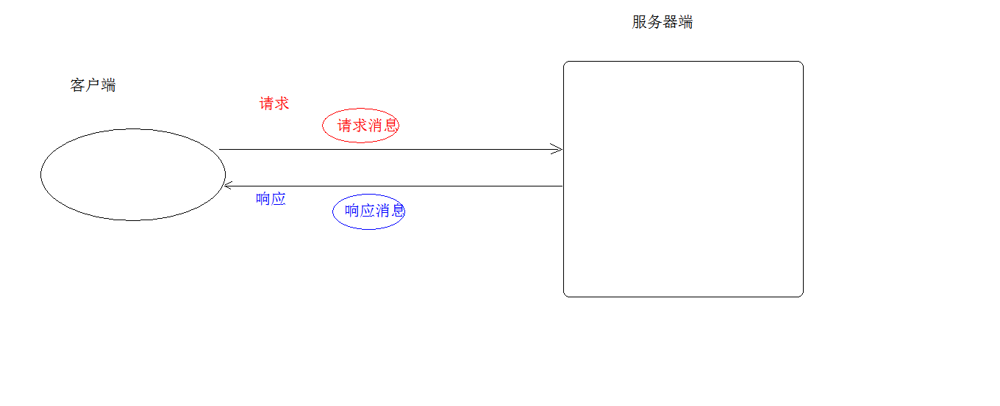


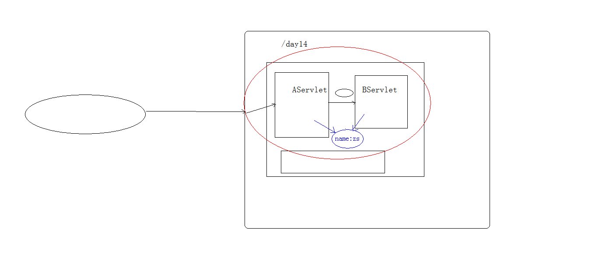


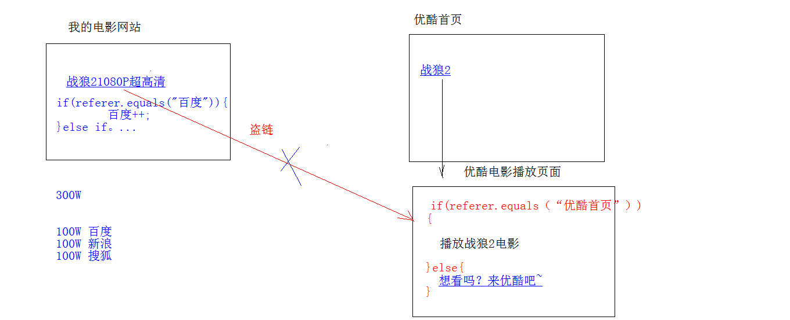


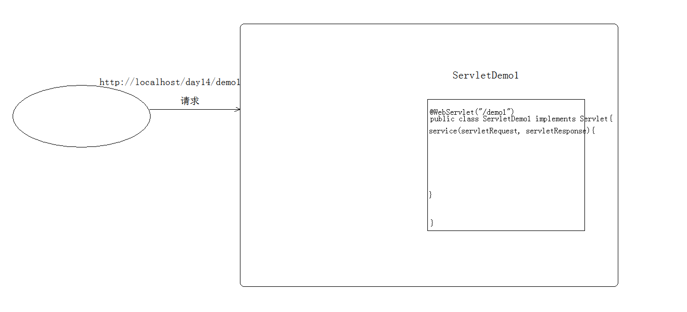


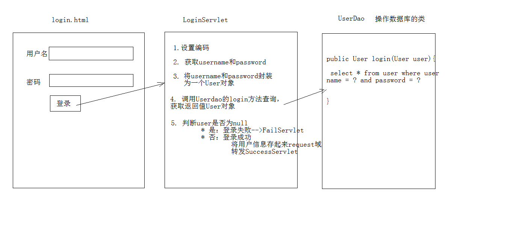

# 今日内容

```
1. HTTP协议：响应消息
2. Response对象
3. ServletContext对象
```

## HTTP协议：

```
1. 请求消息：客户端发送给服务器端的数据
	* 数据格式：
		1. 请求行
		2. 请求头
		3. 请求空行
		4. 请求体
2. 响应消息：服务器端发送给客户端的数据
	* 数据格式：
		1. 响应行
			1. 组成：协议/版本 响应状态码 状态码描述
			2. 响应状态码：服务器告诉客户端浏览器本次请求和响应的一个状态。
				1. 状态码都是3位数字 
				2. 分类：
					1. 1xx：服务器就收客户端消息，但没有接受完成，等待一段时间后，发送1xx多状态码
					2. 2xx：成功。代表：200
					3. 3xx：重定向。代表：302(重定向)，304(访问缓存)
					4. 4xx：客户端错误。
						* 代表：
							* 404（请求路径没有对应的资源） 
							* 405：请求方式没有对应的doXxx方法
					5. 5xx：服务器端错误。代表：500(服务器内部出现异常)
```

​					

```
		2. 响应头：
			1. 格式：头名称： 值
			2. 常见的响应头：
				1. Content-Type：服务器告诉客户端本次响应体数据格式以及编码格式
				2. Content-disposition：服务器告诉客户端以什么格式打开响应体数据
					* 值：
						* in-line:默认值,在当前页面内打开
						* attachment;filename=xxx：以附件形式打开响应体。文件下载
		3. 响应空行
		4. 响应体:传输的数据
```

```
	* 响应字符串格式
		HTTP/1.1 200 OK
		Content-Type: text/html;charset=UTF-8
		Content-Length: 101
		Date: Wed, 06 Jun 2018 07:08:42 GMT

		<html>
		  <head>
		    <title>$Title$</title>
		  </head>
		  <body>
		  hello , response
		  </body>
		</html>
```


## Response对象

```
* 功能：设置响应消息
	1. 设置响应行
		1. 格式：HTTP/1.1 200 ok
		2. 设置状态码：setStatus(int sc) 
	2. 设置响应头：setHeader(String name, String value) 
		
	3. 设置响应体：
		* 使用步骤：
			1. 获取输出流
				* 字符输出流：PrintWriter getWriter()

				* 字节输出流：ServletOutputStream getOutputStream()

			2. 使用输出流，将数据输出到客户端浏览器
```

```
* 案例：
	1. 完成重定向
		* 重定向：资源跳转的方式
		* 代码实现：
			//1. 设置状态码为302
	        response.setStatus(302);
	        //2.设置响应头location
	        response.setHeader("location","/day15/responseDemo2");
```

```
	        //简单的重定向方法
	        response.sendRedirect("/day15/responseDemo2");

		* 重定向的特点:redirect
			1. 地址栏发生变化
			2. 重定向可以访问其他站点(服务器)的资源
			3. 重定向是两次请求。不能使用request对象来共享数据
		* 转发的特点：forward
			1. 转发地址栏路径不变
			2. 转发只能访问当前服务器下的资源
			3. 转发是一次请求，可以使用request对象来共享数据
		
		* forward 和  redirect 区别
			
		* 路径写法：
			1. 路径分类
				1. 相对路径：通过相对路径不可以确定唯一资源
					* 如：./index.html
					* 不以/开头，以.开头路径

					* 规则：找到当前资源和目标资源之间的相对位置关系
						* ./：当前目录
						* ../:后退一级目录
				2. 绝对路径：通过绝对路径可以确定唯一资源
					* 如：http://localhost/day15/responseDemo2		/day15/responseDemo2
					* 以/开头的路径

					* 规则：判断定义的路径是给谁用的？判断请求将来从哪儿发出
						* 给客户端浏览器使用：需要加虚拟目录(项目的访问路径)
							* 建议虚拟目录动态获取：request.getContextPath()
							* <a> , <form> 重定向...
						* 给服务器使用：不需要加虚拟目录
							* 转发路径
```

​						
​						

```
	2. 服务器输出字符数据到浏览器
		* 步骤：
			1. 获取字符输出流
			2. 输出数据

		* 注意：
			* 乱码问题：
				1. PrintWriter pw = response.getWriter();获取的流的默认编码是ISO-8859-1
				2. 设置该流的默认编码
				3. 告诉浏览器响应体使用的编码

				//简单的形式，设置编码，是在获取流之前设置
    			response.setContentType("text/html;charset=utf-8");
	3. 服务器输出字节数据到浏览器
		* 步骤：
			1. 获取字节输出流
			2. 输出数据

	4. 验证码
		1. 本质：图片
		2. 目的：防止恶意表单注册
```


## ServletContext对象：

```
1. 概念：代表整个web应用，可以和程序的容器(服务器)来通信
2. 获取：
	1. 通过request对象获取
		request.getServletContext();
	2. 通过HttpServlet获取
		this.getServletContext();
3. 功能：
	1. 获取MIME类型：
		* MIME类型:在互联网通信过程中定义的一种文件数据类型
			* 格式： 大类型/小类型   text/html		image/jpeg

		* 获取：String getMimeType(String file)  
	2. 域对象：共享数据
		1. setAttribute(String name,Object value)
		2. getAttribute(String name)
		3. removeAttribute(String name)

		* ServletContext对象范围：所有用户所有请求的数据
	3. 获取文件的真实(服务器)路径
		1. 方法：String getRealPath(String path)  
			 String b = context.getRealPath("/b.txt");//web目录下资源访问
	         System.out.println(b);
	
	        String c = context.getRealPath("/WEB-INF/c.txt");//WEB-INF目录下的资源访问
	        System.out.println(c);
	
	        String a = context.getRealPath("/WEB-INF/classes/a.txt");//src目录下的资源访问
	        System.out.println(a);
```


## 案例：

```
* 文件下载需求：
	1. 页面显示超链接
	2. 点击超链接后弹出下载提示框
	3. 完成图片文件下载
```

```
* 分析：
	1. 超链接指向的资源如果能够被浏览器解析，则在浏览器中展示，如果不能解析，则弹出下载提示框。不满足需求
	2. 任何资源都必须弹出下载提示框
	3. 使用响应头设置资源的打开方式：
		* content-disposition:attachment;filename=xxx
```

```
* 步骤：
	1. 定义页面，编辑超链接href属性，指向Servlet，传递资源名称filename
	2. 定义Servlet
		1. 获取文件名称
		2. 使用字节输入流加载文件进内存
		3. 指定response的响应头： content-disposition:attachment;filename=xxx
		4. 将数据写出到response输出流
```

```
* 问题：
	* 中文文件问题
		* 解决思路：
			1. 获取客户端使用的浏览器版本信息
			2. 根据不同的版本信息，设置filename的编码方式不同
```


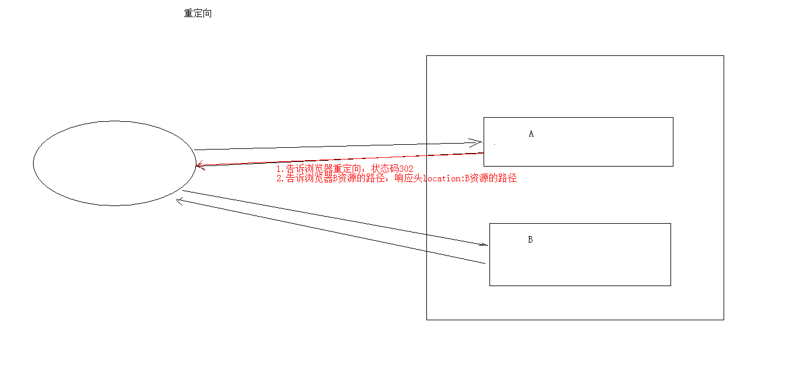


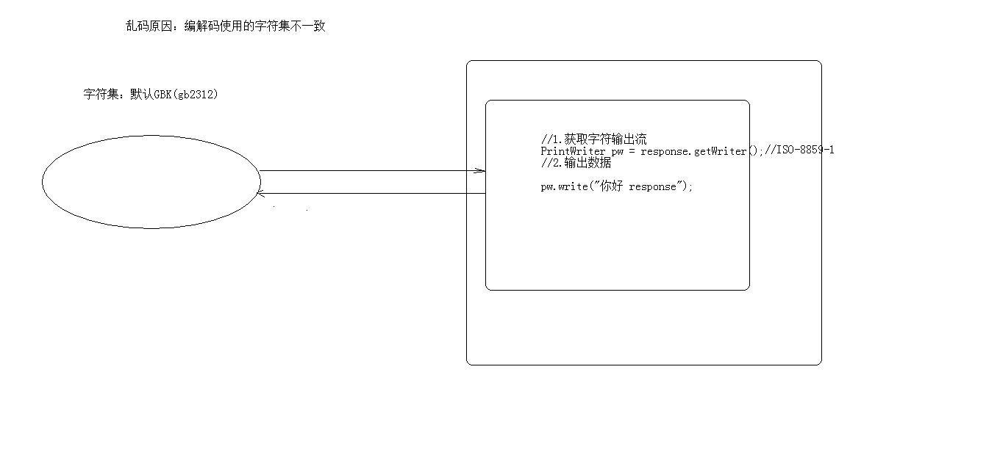

# 今日内容

```
1. 会话技术
	1. Cookie
	2. Session
2. JSP：入门学习
```


## 会话技术

```
1. 会话：一次会话中包含多次请求和响应。
	* 一次会话：浏览器第一次给服务器资源发送请求，会话建立，直到有一方断开为止
2. 功能：在一次会话的范围内的多次请求间，共享数据
3. 方式：
	1. 客户端会话技术：Cookie
	2. 服务器端会话技术：Session
```

## Cookie：

```
1. 概念：客户端会话技术，将数据保存到客户端

2. 快速入门：
	* 使用步骤：
		1. 创建Cookie对象，绑定数据
			* new Cookie(String name, String value) 
		2. 发送Cookie对象
			* response.addCookie(Cookie cookie) 
		3. 获取Cookie，拿到数据
			* Cookie[]  request.getCookies()  
```

```
3. 实现原理
	* 基于响应头set-cookie和请求头cookie实现

4. cookie的细节
	1. 一次可不可以发送多个cookie?
		* 可以
		* 可以创建多个Cookie对象，使用response调用多次addCookie方法发送cookie即可。
	2. cookie在浏览器中保存多长时间？
		1. 默认情况下，当浏览器关闭后，Cookie数据被销毁
		2. 持久化存储：
			* setMaxAge(int seconds)
				1. 正数：将Cookie数据写到硬盘的文件中。持久化存储。并指定cookie存活时间，时间到后，cookie文件自动失效
				2. 负数：默认值
				3. 零：删除cookie信息
	3. cookie能不能存中文？
		* 在tomcat 8 之前 cookie中不能直接存储中文数据。
			* 需要将中文数据转码---一般采用URL编码(%E3)
		* 在tomcat 8 之后，cookie支持中文数据。特殊字符还是不支持，建议使用URL编码存储，URL解码解析
	4. cookie共享问题？
		1. 假设在一个tomcat服务器中，部署了多个web项目，那么在这些web项目中cookie能不能共享？
			* 默认情况下cookie不能共享

			* setPath(String path):设置cookie的获取范围。默认情况下，设置当前的虚拟目录
				* 如果要共享，则可以将path设置为"/"
```

​			

```
		2. 不同的tomcat服务器间cookie共享问题？
			* setDomain(String path):如果设置一级域名相同，那么多个服务器之间cookie可以共享
				* setDomain(".baidu.com"),那么tieba.baidu.com和news.baidu.com中cookie可以共享
```

```
5. Cookie的特点和作用
	1. cookie存储数据在客户端浏览器
	2. 浏览器对于单个cookie 的大小有限制(4kb) 以及 对同一个域名下的总cookie数量也有限制(20个)

	* 作用：
		1. cookie一般用于存出少量的不太敏感的数据
		2. 在不登录的情况下，完成服务器对客户端的身份识别

6. 案例：记住上一次访问时间
	1. 需求：
		1. 访问一个Servlet，如果是第一次访问，则提示：您好，欢迎您首次访问。
		2. 如果不是第一次访问，则提示：欢迎回来，您上次访问时间为:显示时间字符串

	2. 分析：
		1. 可以采用Cookie来完成
		2. 在服务器中的Servlet判断是否有一个名为lastTime的cookie
			1. 有：不是第一次访问
				1. 响应数据：欢迎回来，您上次访问时间为:2018年6月10日11:50:20
				2. 写回Cookie：lastTime=2018年6月10日11:50:01
			2. 没有：是第一次访问
				1. 响应数据：您好，欢迎您首次访问
				2. 写回Cookie：lastTime=2018年6月10日11:50:01

	3. 代码实现：
		package cn.itcast.cookie;

		import javax.servlet.ServletException;
		import javax.servlet.annotation.WebServlet;
		import javax.servlet.http.Cookie;
		import javax.servlet.http.HttpServlet;
		import javax.servlet.http.HttpServletRequest;
		import javax.servlet.http.HttpServletResponse;
		import java.io.IOException;
		import java.net.URLDecoder;
		import java.net.URLEncoder;
		import java.text.SimpleDateFormat;
		import java.util.Date;
```

```
	@WebServlet("/cookieTest")
	public class CookieTest extends HttpServlet {
	    protected void doPost(HttpServletRequest request, HttpServletResponse response) throws ServletException, IOException {
	        //设置响应的消息体的数据格式以及编码
	        response.setContentType("text/html;charset=utf-8");
	
	        //1.获取所有Cookie
	        Cookie[] cookies = request.getCookies();
	        boolean flag = false;//没有cookie为lastTime
	        //2.遍历cookie数组
	        if(cookies != null && cookies.length > 0){
	            for (Cookie cookie : cookies) {
	                //3.获取cookie的名称
	                String name = cookie.getName();
	                //4.判断名称是否是：lastTime
	                if("lastTime".equals(name)){
	                    //有该Cookie，不是第一次访问
	
	                    flag = true;//有lastTime的cookie
	
	                    //设置Cookie的value
	                    //获取当前时间的字符串，重新设置Cookie的值，重新发送cookie
	                    Date date  = new Date();
	                    SimpleDateFormat sdf = new SimpleDateFormat("yyyy年MM月dd日 HH:mm:ss");
	                    String str_date = sdf.format(date);
	                    System.out.println("编码前："+str_date);
	                    //URL编码
	                    str_date = URLEncoder.encode(str_date,"utf-8");
	                    System.out.println("编码后："+str_date);
	                    cookie.setValue(str_date);
	                    //设置cookie的存活时间
	                    cookie.setMaxAge(60 * 60 * 24 * 30);//一个月
	                    response.addCookie(cookie);
```

​		

```
	                    //响应数据
	                    //获取Cookie的value，时间
	                    String value = cookie.getValue();
	                    System.out.println("解码前："+value);
	                    //URL解码：
	                    value = URLDecoder.decode(value,"utf-8");
	                    System.out.println("解码后："+value);
	                    response.getWriter().write("<h1>欢迎回来，您上次访问时间为:"+value+"</h1>");
	
	                    break;
	
	                }
	            }
	        }
```

​		

```
	        if(cookies == null || cookies.length == 0 || flag == false){
	            //没有，第一次访问
	
	            //设置Cookie的value
	            //获取当前时间的字符串，重新设置Cookie的值，重新发送cookie
	            Date date  = new Date();
	            SimpleDateFormat sdf = new SimpleDateFormat("yyyy年MM月dd日 HH:mm:ss");
	            String str_date = sdf.format(date);
	            System.out.println("编码前："+str_date);
	            //URL编码
	            str_date = URLEncoder.encode(str_date,"utf-8");
	            System.out.println("编码后："+str_date);
	
	            Cookie cookie = new Cookie("lastTime",str_date);
	            //设置cookie的存活时间
	            cookie.setMaxAge(60 * 60 * 24 * 30);//一个月
	            response.addCookie(cookie);
	
	            response.getWriter().write("<h1>您好，欢迎您首次访问</h1>");
	        }
```

​		

```
	    }
	
	    protected void doGet(HttpServletRequest request, HttpServletResponse response) throws ServletException, IOException {
	        this.doPost(request, response);
	    }
	}
```

## JSP：入门学习

```
1. 概念：
	* Java Server Pages： java服务器端页面
		* 可以理解为：一个特殊的页面，其中既可以指定定义html标签，又可以定义java代码
		* 用于简化书写！！！
```

```
2. 原理
	* JSP本质上就是一个Servlet

3. JSP的脚本：JSP定义Java代码的方式
	1. <%  代码 %>：定义的java代码，在service方法中。service方法中可以定义什么，该脚本中就可以定义什么。
	2. <%! 代码 %>：定义的java代码，在jsp转换后的java类的成员位置。
	3. <%= 代码 %>：定义的java代码，会输出到页面上。输出语句中可以定义什么，该脚本中就可以定义什么。
```

```
4. JSP的内置对象：
	* 在jsp页面中不需要获取和创建，可以直接使用的对象
	* jsp一共有9个内置对象。
	* 今天学习3个：
		* request
		* response
		* out：字符输出流对象。可以将数据输出到页面上。和response.getWriter()类似
			* response.getWriter()和out.write()的区别：
				* 在tomcat服务器真正给客户端做出响应之前，会先找response缓冲区数据，再找out缓冲区数据。
				* response.getWriter()数据输出永远在out.write()之前
			
5. 案例:改造Cookie案例
```


## Session：主菜

```
1. 概念：服务器端会话技术，在一次会话的多次请求间共享数据，将数据保存在服务器端的对象中。HttpSession
2. 快速入门：
	1. 获取HttpSession对象：
		HttpSession session = request.getSession();
	2. 使用HttpSession对象：
		Object getAttribute(String name)  
		void setAttribute(String name, Object value)
		void removeAttribute(String name)  

3. 原理
	* Session的实现是依赖于Cookie的。
```

​	

```
4. 细节：
	1. 当客户端关闭后，服务器不关闭，两次获取session是否为同一个？
		* 默认情况下。不是。
		* 如果需要相同，则可以创建Cookie,键为JSESSIONID，设置最大存活时间，让cookie持久化保存。
			 Cookie c = new Cookie("JSESSIONID",session.getId());
	         c.setMaxAge(60*60);
	         response.addCookie(c);

	2. 客户端不关闭，服务器关闭后，两次获取的session是同一个吗？
		* 不是同一个，但是要确保数据不丢失。tomcat自动完成以下工作
			* session的钝化：
				* 在服务器正常关闭之前，将session对象系列化到硬盘上
			* session的活化：
				* 在服务器启动后，将session文件转化为内存中的session对象即可。
			
	3. session什么时候被销毁？
		1. 服务器关闭
		2. session对象调用invalidate() 。
		3. session默认失效时间 30分钟
			选择性配置修改	
			<session-config>
		        <session-timeout>30</session-timeout>
		    </session-config>

 5. session的特点
	 1. session用于存储一次会话的多次请求的数据，存在服务器端
	 2. session可以存储任意类型，任意大小的数据

	* session与Cookie的区别：
		1. session存储数据在服务器端，Cookie在客户端
		2. session没有数据大小限制，Cookie有
		3. session数据安全，Cookie相对于不安全
```

## 案例：验证码

```
1. 案例需求：
	1. 访问带有验证码的登录页面login.jsp
	2. 用户输入用户名，密码以及验证码。
		* 如果用户名和密码输入有误，跳转登录页面，提示:用户名或密码错误
		* 如果验证码输入有误，跳转登录页面，提示：验证码错误
		* 如果全部输入正确，则跳转到主页success.jsp，显示：用户名,欢迎您
```

```
2. 分析：
```

​	


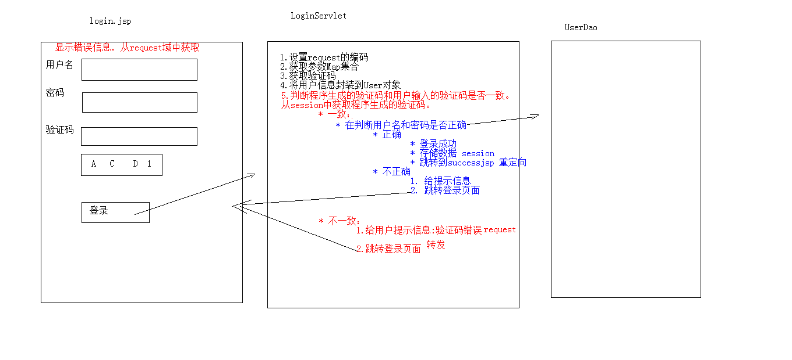


# 今日内容

```
1. Filter：过滤器
2. Listener：监听器
```


## Filter：过滤器

```
1. 概念：
	* 生活中的过滤器：净水器,空气净化器，土匪、
	* web中的过滤器：当访问服务器的资源时，过滤器可以将请求拦截下来，完成一些特殊的功能。
	* 过滤器的作用：
		* 一般用于完成通用的操作。如：登录验证、统一编码处理、敏感字符过滤...

2. 快速入门：
	1. 步骤：
		1. 定义一个类，实现接口Filter
		2. 复写方法
		3. 配置拦截路径
			1. web.xml
			2. 注解
	2. 代码：
		@WebFilter("/*")//访问所有资源之前，都会执行该过滤器
		public class FilterDemo1 implements Filter {
		    @Override
		    public void init(FilterConfig filterConfig) throws ServletException {
		
		    }
		
		    @Override
		    public void doFilter(ServletRequest servletRequest, ServletResponse servletResponse, FilterChain filterChain) throws IOException, ServletException {
		        System.out.println("filterDemo1被执行了....");
```

​			

```
		        //放行
		        filterChain.doFilter(servletRequest,servletResponse);
		
		    }
		
		    @Override
		    public void destroy() {
		
		    }
		}
```

```
3. 过滤器细节：
	1. web.xml配置	
		<filter>
	        <filter-name>demo1</filter-name>
	        <filter-class>cn.itcast.web.filter.FilterDemo1</filter-class>
	    </filter>
	    <filter-mapping>
	        <filter-name>demo1</filter-name>
			<!-- 拦截路径 -->
	        <url-pattern>/*</url-pattern>
	    </filter-mapping>
	2. 过滤器执行流程
		1. 执行过滤器
		2. 执行放行后的资源
		3. 回来执行过滤器放行代码下边的代码
	3. 过滤器生命周期方法
		1. init:在服务器启动后，会创建Filter对象，然后调用init方法。只执行一次。用于加载资源
		2. doFilter:每一次请求被拦截资源时，会执行。执行多次
		3. destroy:在服务器关闭后，Filter对象被销毁。如果服务器是正常关闭，则会执行destroy方法。只执行一次。用于释放资源
	4. 过滤器配置详解
		* 拦截路径配置：
			1. 具体资源路径： /index.jsp   只有访问index.jsp资源时，过滤器才会被执行
			2. 拦截目录： /user/*	访问/user下的所有资源时，过滤器都会被执行
			3. 后缀名拦截： *.jsp		访问所有后缀名为jsp资源时，过滤器都会被执行
			4. 拦截所有资源：/*		访问所有资源时，过滤器都会被执行
		* 拦截方式配置：资源被访问的方式
			* 注解配置：
				* 设置dispatcherTypes属性
					1. REQUEST：默认值。浏览器直接请求资源
					2. FORWARD：转发访问资源
					3. INCLUDE：包含访问资源
					4. ERROR：错误跳转资源
					5. ASYNC：异步访问资源
			* web.xml配置
				* 设置<dispatcher></dispatcher>标签即可
			
	5. 过滤器链(配置多个过滤器)
		* 执行顺序：如果有两个过滤器：过滤器1和过滤器2
			1. 过滤器1
			2. 过滤器2
			3. 资源执行
			4. 过滤器2
			5. 过滤器1 

		* 过滤器先后顺序问题：
			1. 注解配置：按照类名的字符串比较规则比较，值小的先执行
				* 如： AFilter 和 BFilter，AFilter就先执行了。
			2. web.xml配置： <filter-mapping>谁定义在上边，谁先执行
4. 案例：
	1. 案例1_登录验证
		* 需求：
			1. 访问day17_case案例的资源。验证其是否登录
			2. 如果登录了，则直接放行。
			3. 如果没有登录，则跳转到登录页面，提示"您尚未登录，请先登录"。
```

​	

```
	2. 案例2_敏感词汇过滤
		* 需求：
			1. 对day17_case案例录入的数据进行敏感词汇过滤
			2. 敏感词汇参考《敏感词汇.txt》
			3. 如果是敏感词汇，替换为 *** 

		* 分析：
			1. 对request对象进行增强。增强获取参数相关方法
			2. 放行。传递代理对象
```

```
		* 增强对象的功能：
			* 设计模式：一些通用的解决固定问题的方式
			1. 装饰模式
			2. 代理模式
				* 概念：
					1. 真实对象：被代理的对象
					2. 代理对象：
					3. 代理模式：代理对象代理真实对象，达到增强真实对象功能的目的
			 	* 实现方式：
				 	1. 静态代理：有一个类文件描述代理模式
				 	2. 动态代理：在内存中形成代理类
						* 实现步骤：
							1. 代理对象和真实对象实现相同的接口
							2. 代理对象 = Proxy.newProxyInstance();
							3. 使用代理对象调用方法。
							4. 增强方法

						* 增强方式：
							1. 增强参数列表
							2. 增强返回值类型
							3. 增强方法体执行逻辑	
```

## Listener：监听器

```
* 概念：web的三大组件之一。
	* 事件监听机制
		* 事件	：一件事情
		* 事件源 ：事件发生的地方
		* 监听器 ：一个对象
		* 注册监听：将事件、事件源、监听器绑定在一起。 当事件源上发生某个事件后，执行监听器代码
```

```
* ServletContextListener:监听ServletContext对象的创建和销毁
	* 方法：
		* void contextDestroyed(ServletContextEvent sce) ：ServletContext对象被销毁之前会调用该方法
		* void contextInitialized(ServletContextEvent sce) ：ServletContext对象创建后会调用该方法
	* 步骤：
		1. 定义一个类，实现ServletContextListener接口
		2. 复写方法
		3. 配置
			1. web.xml
					<listener>
 					 <listener-class>cn.itcast.web.listener.ContextLoaderListener</listener-class>
```

   						</listener>

```
					* 指定初始化参数<context-param>
			2. 注解：
				* @WebListener
```


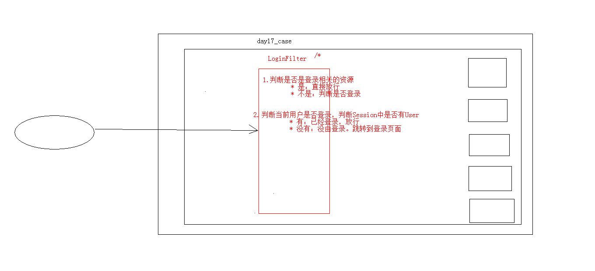


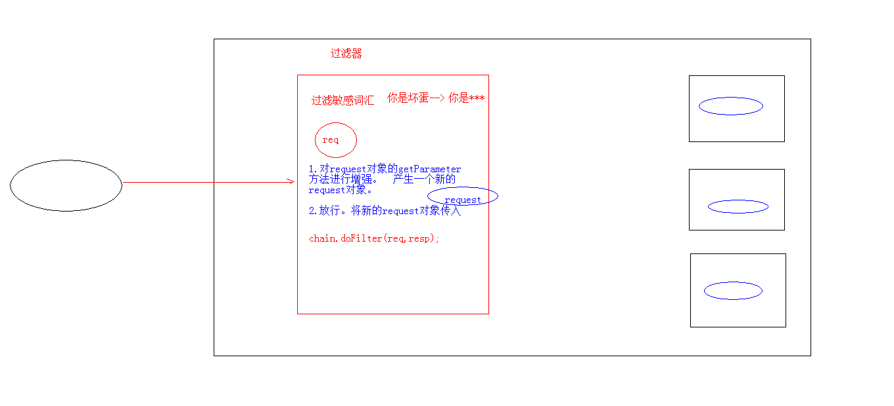


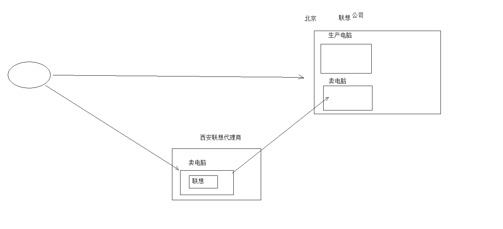


# 今日内容

```
1. AJAX：
2. JSON
```


## AJAX：

```
1. 概念： ASynchronous JavaScript And XML	异步的JavaScript 和 XML
	1. 异步和同步：客户端和服务器端相互通信的基础上
		* 客户端必须等待服务器端的响应。在等待的期间客户端不能做其他操作。
		* 客户端不需要等待服务器端的响应。在服务器处理请求的过程中，客户端可以进行其他的操作。

		Ajax 是一种在无需重新加载整个网页的情况下，能够更新部分网页的技术。 [1] 
		通过在后台与服务器进行少量数据交换，Ajax 可以使网页实现异步更新。这意味着可以在不重新加载整个网页的情况下，对网页的某部分进行更新。
		传统的网页（不使用 Ajax）如果需要更新内容，必须重载整个网页页面。

		提升用户的体验

2. 实现方式：
	1. 原生的JS实现方式（了解）
				 //1.创建核心对象
	            var xmlhttp;
	            if (window.XMLHttpRequest)
	            {// code for IE7+, Firefox, Chrome, Opera, Safari
	                xmlhttp=new XMLHttpRequest();
	            }
	            else
	            {// code for IE6, IE5
	                xmlhttp=new ActiveXObject("Microsoft.XMLHTTP");
	            }
	
	            //2. 建立连接
	            /*
	                参数：
	                    1. 请求方式：GET、POST
	                        * get方式，请求参数在URL后边拼接。send方法为空参
	                        * post方式，请求参数在send方法中定义
	                    2. 请求的URL：
	                    3. 同步或异步请求：true（异步）或 false（同步）
	
	             */
	            xmlhttp.open("GET","ajaxServlet?username=tom",true);
	
	            //3.发送请求
	            xmlhttp.send();
	
	            //4.接受并处理来自服务器的响应结果
	            //获取方式 ：xmlhttp.responseText
	            //什么时候获取？当服务器响应成功后再获取
	
	            //当xmlhttp对象的就绪状态改变时，触发事件onreadystatechange。
	            xmlhttp.onreadystatechange=function()
	            {
	                //判断readyState就绪状态是否为4，判断status响应状态码是否为200
	                if (xmlhttp.readyState==4 && xmlhttp.status==200)
	                {
	                   //获取服务器的响应结果
	                    var responseText = xmlhttp.responseText;
	                    alert(responseText);
	                }
	            }
	2. JQeury实现方式
		1. $.ajax()
			* 语法：$.ajax({键值对});
			 //使用$.ajax()发送异步请求
	            $.ajax({
	                url:"ajaxServlet1111" , // 请求路径
	                type:"POST" , //请求方式
	                //data: "username=jack&age=23",//请求参数
	                data:{"username":"jack","age":23},
	                success:function (data) {
	                    alert(data);
	                },//响应成功后的回调函数
	                error:function () {
	                    alert("出错啦...")
	                },//表示如果请求响应出现错误，会执行的回调函数
	
	                dataType:"text"//设置接受到的响应数据的格式
	            });
		2. $.get()：发送get请求
			* 语法：$.get(url, [data], [callback], [type])
				* 参数：
					* url：请求路径
					* data：请求参数
					* callback：回调函数
					* type：响应结果的类型

		3. $.post()：发送post请求
			* 语法：$.post(url, [data], [callback], [type])
				* 参数：
					* url：请求路径
					* data：请求参数
					* callback：回调函数
					* type：响应结果的类型
```


## JSON：

```
1. 概念： JavaScript Object Notation		JavaScript对象表示法
	Person p = new Person();
	p.setName("张三");
	p.setAge(23);
	p.setGender("男");

	var p = {"name":"张三","age":23,"gender":"男"};

	* json现在多用于存储和交换文本信息的语法
	* 进行数据的传输
	* JSON 比 XML 更小、更快，更易解析。

2. 语法：
	1. 基本规则
		* 数据在名称/值对中：json数据是由键值对构成的
			* 键用引号(单双都行)引起来，也可以不使用引号
			* 值得取值类型：
				1. 数字（整数或浮点数）
				2. 字符串（在双引号中）
				3. 逻辑值（true 或 false）
				4. 数组（在方括号中）	{"persons":[{},{}]}
				5. 对象（在花括号中） {"address":{"province"："陕西"....}}
				6. null
		* 数据由逗号分隔：多个键值对由逗号分隔
		* 花括号保存对象：使用{}定义json 格式
		* 方括号保存数组：[]
	2. 获取数据:
		1. json对象.键名
		2. json对象["键名"]
		3. 数组对象[索引]
		4. 遍历
				 //1.定义基本格式
		        var person = {"name": "张三", age: 23, 'gender': true};
		
		        var ps = [{"name": "张三", "age": 23, "gender": true},
		            {"name": "李四", "age": 24, "gender": true},
		            {"name": "王五", "age": 25, "gender": false}];
```

​			
​			
​			

```
		        //获取person对象中所有的键和值
		        //for in 循环
		       /* for(var key in person){
		            //这样的方式获取不行。因为相当于  person."name"
		            //alert(key + ":" + person.key);
		            alert(key+":"+person[key]);
		        }*/
		
		       //获取ps中的所有值
		        for (var i = 0; i < ps.length; i++) {
		            var p = ps[i];
		            for(var key in p){
		                alert(key+":"+p[key]);
		            }
		        }
```

```
3. JSON数据和Java对象的相互转换

	* JSON解析器：
		* 常见的解析器：Jsonlib，Gson，fastjson，jackson
	
	1. JSON转为Java对象
		1. 导入jackson的相关jar包
		2. 创建Jackson核心对象 ObjectMapper
		3. 调用ObjectMapper的相关方法进行转换
			1. readValue(json字符串数据,Class)
	2. Java对象转换JSON
		1. 使用步骤：
			1. 导入jackson的相关jar包
			2. 创建Jackson核心对象 ObjectMapper
			3. 调用ObjectMapper的相关方法进行转换
				1. 转换方法：
					* writeValue(参数1，obj):
	                    参数1：
	                        File：将obj对象转换为JSON字符串，并保存到指定的文件中
	                        Writer：将obj对象转换为JSON字符串，并将json数据填充到字符输出流中
	                        OutputStream：将obj对象转换为JSON字符串，并将json数据填充到字节输出流中
	                * writeValueAsString(obj):将对象转为json字符串

				2. 注解：
					1. @JsonIgnore：排除属性。
					2. @JsonFormat：属性值得格式化
						* @JsonFormat(pattern = "yyyy-MM-dd")

				3. 复杂java对象转换
					1. List：数组
					2. Map：对象格式一致
```

# 案例：

```
* 校验用户名是否存在
	1. 服务器响应的数据，在客户端使用时，要想当做json数据格式使用。有两种解决方案：
		1. $.get(type):将最后一个参数type指定为"json"
		2. 在服务器端设置MIME类型
			response.setContentType("application/json;charset=utf-8");
```


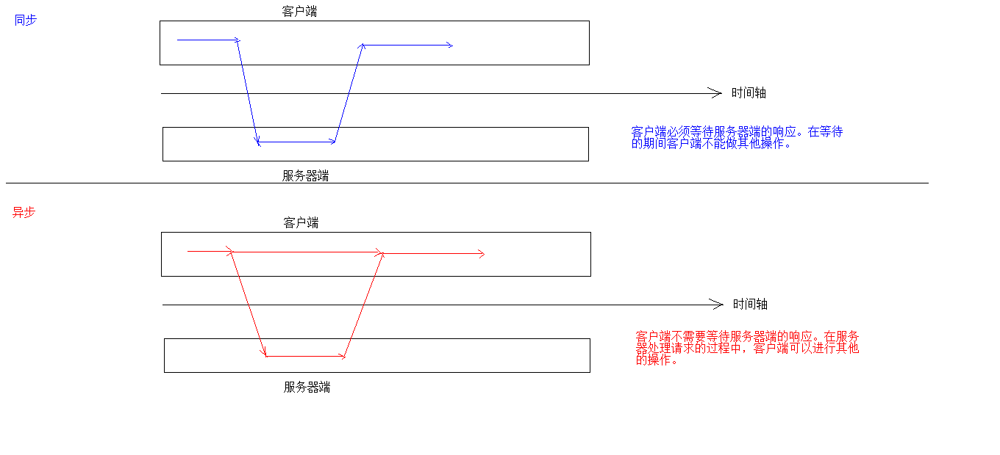


# 今日内容

```
1. redis
	1. 概念
	2. 下载安装
	3. 命令操作
		1. 数据结构
	4. 持久化操作
	5. 使用Java客户端操作redis
```


