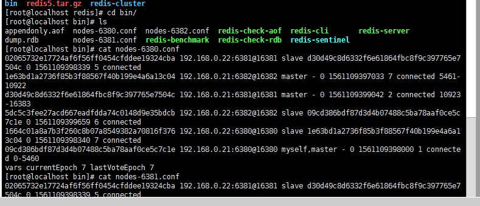
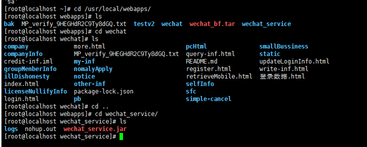

redis

nodes-6380.conf

```
02065732e17724af6f56ff0454cfddee19324cba 192.168.0.22:6381@16381 slave d30d49c8d6332f6e61864fbc8f9c397765e7504c 0 1561109398339 5 connected
1e63bd1a2736f85b3f88567f40b199e4a6a13c04 192.168.0.21:6382@16382 master - 0 1561109397033 7 connected 5461-10922
d30d49c8d6332f6e61864fbc8f9c397765e7504c 192.168.0.21:6381@16381 master - 0 1561109399042 2 connected 10923-16383
5dc5c3fee27acd667eadfdda74c0148d9e35bdcb 192.168.0.22:6382@16382 slave 09cd386bdf87d3d4b07488c5ba78aaf0ce5c7c1e 0 1561109399659 6 connected
1664c01a8a7b3f260c8b07a8549382a70816f376 192.168.0.22:6380@16380 slave 1e63bd1a2736f85b3f88567f40b199e4a6a13c04 0 1561109398340 7 connected
09cd386bdf87d3d4b07488c5ba78aaf0ce5c7c1e 192.168.0.21:6380@16380 myself,master - 0 1561109398000 1 connected 0-5460
vars currentEpoch 7 lastVoteEpoch 7

```

```
02065732e17724af6f56ff0454cfddee19324cba 192.168.0.22:6381@16381 slave d30d49c8d6332f6e61864fbc8f9c397765e7504c 0 1561109398339 5 connected
d30d49c8d6332f6e61864fbc8f9c397765e7504c 192.168.0.21:6381@16381 myself,master - 0 1561109398000 2 connected 10923-16383
5dc5c3fee27acd667eadfdda74c0148d9e35bdcb 192.168.0.22:6382@16382 slave 09cd386bdf87d3d4b07488c5ba78aaf0ce5c7c1e 0 1561109399659 6 connected
1664c01a8a7b3f260c8b07a8549382a70816f376 192.168.0.22:6380@16380 slave 1e63bd1a2736f85b3f88567f40b199e4a6a13c04 0 1561109398339 7 connected
1e63bd1a2736f85b3f88567f40b199e4a6a13c04 192.168.0.21:6382@16382 master - 0 1561109399042 7 connected 5461-10922
09cd386bdf87d3d4b07488c5ba78aaf0ce5c7c1e 192.168.0.21:6380@16380 master - 0 1561109398037 1 connected 0-5460
vars currentEpoch 7 lastVoteEpoch 7

```




nodes-6382.conf

```
[root@localhost bin]# cat nodes-6382.conf 
d30d49c8d6332f6e61864fbc8f9c397765e7504c 192.168.0.21:6381@16381 master - 0 1561109399000 2 connected 10923-16383
09cd386bdf87d3d4b07488c5ba78aaf0ce5c7c1e 192.168.0.21:6380@16380 master - 0 1561109399342 1 connected 0-5460
1664c01a8a7b3f260c8b07a8549382a70816f376 192.168.0.22:6380@16380 slave 1e63bd1a2736f85b3f88567f40b199e4a6a13c04 0 1561109398341 7 connected
1e63bd1a2736f85b3f88567f40b199e4a6a13c04 192.168.0.21:6382@16382 myself,master - 0 1561109397000 7 connected 5461-10922
5dc5c3fee27acd667eadfdda74c0148d9e35bdcb 192.168.0.22:6382@16382 slave 09cd386bdf87d3d4b07488c5ba78aaf0ce5c7c1e 0 1561109399659 6 connected
02065732e17724af6f56ff0454cfddee19324cba 192.168.0.22:6381@16381 slave d30d49c8d6332f6e61864fbc8f9c397765e7504c 0 1561109398347 5 connected
vars currentEpoch 7 lastVoteEpoch 0

```


21服务器上的nginx配置

```
[root@localhost conf]# cat nginx.conf
#user  nobody;
worker_processes  2;

error_log  logs/error.log;
error_log  logs/error.log  notice;
error_log  logs/error.log  info;

pid        logs/nginx.pid;

events {
    worker_connections  1024;
}

http {
    include       mime.types;
    default_type  application/octet-stream;

    log_format  main  '$remote_addr - $remote_user [$time_local] "$request" '
                      '$status $body_bytes_sent "$http_referer" '
                      '"$http_user_agent" "$http_x_forwarded_for"';

    access_log  logs/access.log  main;

    sendfile        on;
    #tcp_nopush     on;

    keepalive_timeout  65;

    gzip  on;
    #关闭版本显示
    server_tokens off;

    upstream ftp_server {                                         
        fair;
        server 192.168.0.23:8000 max_fails=3 fail_timeout=30s weight=1;
        server 192.168.0.24:8000 max_fails=3 fail_timeout=30s weight=10;
    }

    upstream search_server {
        fair;
        server 192.168.0.25:8001 max_fails=3 fail_timeout=30s;
	server 192.168.0.25:8002 max_fails=3 fail_timeout=30s;
	server 192.168.0.25:8003 max_fails=3 fail_timeout=30s;
	server 192.168.0.25:8004 max_fails=3 fail_timeout=30s;
	server 192.168.0.25:8005 max_fails=3 fail_timeout=30s;
	server 192.168.0.26:8001 max_fails=3 fail_timeout=30s;
        server 192.168.0.26:8002 max_fails=3 fail_timeout=30s;
        server 192.168.0.26:8003 max_fails=3 fail_timeout=30s;
        server 192.168.0.26:8004 max_fails=3 fail_timeout=30s;
        server 192.168.0.26:8005 max_fails=3 fail_timeout=30s;
    }

    upstream annual_report_server {
        fair;
        server 192.168.0.21:8001 max_fails=3 fail_timeout=30s;
        server 192.168.0.21:8002 max_fails=3 fail_timeout=30s;
        server 192.168.0.21:8003 max_fails=3 fail_timeout=30s;
        server 192.168.0.21:8004 max_fails=3 fail_timeout=30s;
	#server 192.168.0.22:8000 max_fails=3 fail_timeout=30s;
	server 192.168.0.22:8001 max_fails=3 fail_timeout=30s;
        server 192.168.0.22:8002 max_fails=3 fail_timeout=30s;
        server 192.168.0.22:8003 max_fails=3 fail_timeout=30s;
        server 192.168.0.22:8004 max_fails=3 fail_timeout=30s;
    }

    upstream wechat_pages {
        fair;
        server 192.168.0.27:80 max_fails=3 fail_timeout=30s;
    }


    server {
        listen       9000;
        server_name  localhost;

        charset utf-8;

        access_log  logs/host.access.log  main;

	#公示、年报、其它信息查询
        location / {
            proxy_redirect 	    off;
            proxy_set_header 	    Host $host;
            proxy_set_header 	    X-Real-IP $remote_addr;
            proxy_set_header 	    X-Forwarded-For $proxy_add_x_forwarded_for;
            proxy_connect_timeout   300;
            proxy_send_timeout      300;
            proxy_read_timeout      300;
            client_max_body_size    10m;
            proxy_pass 		    http://annual_report_server;
        }

	#搜索
        location /api/v1/p/search.json {
            proxy_redirect 	    off;
            proxy_set_header 	    Host $host;
            proxy_set_header 	    X-Real-IP $remote_addr;
            proxy_set_header 	    X-Forwarded-For $proxy_add_x_forwarded_for;
            proxy_connect_timeout   300;
            proxy_send_timeout      300;
            proxy_read_timeout      300;
            client_max_body_size    10m;
            proxy_pass 		    http://search_server;
        }

	#微信
        location ~ /wechat/* {
	    proxy_redirect          off;
            proxy_set_header        Host $host;
            proxy_set_header        X-Real-IP $remote_addr;
            proxy_set_header        X-Forwarded-For $proxy_add_x_forwarded_for;
            proxy_connect_timeout   300;
            proxy_send_timeout      300;
            proxy_read_timeout      300;
            client_max_body_size    10m;
	    access_log logs/access_wechat.log main;
            proxy_pass http://wechat_pages;
        }
	#微信_service
        location /jssdk/getAPIID {
	    access_log logs/access_wechat_service.log main;
            proxy_pass              http://192.168.0.27:81;
        }
	#微信_service
        location /weixin {
            access_log logs/access_wechat_service.log main;
            proxy_pass              http://192.168.0.27:81;
        }


	#图标
        location ~ /icon/*  {
            root /usr/local/webapps/mobile_img;
        }
        #领航页+技术支持+其它图片
        location ~ /app_images/*  {
            root /usr/local/webapps/mobile_img;
        }


	# apk
	location /apk/gsxt_ha.apk {
	    root /usr/local/webapps;
        }


        #代理ftp服务器上的文件
        location ~ /casefiles/*  {
            access_log logs/access_ftp.log;
	    #允许cros跨域访问
            add_header 'Access-Control-Allow-Origin' '*'; 
            proxy_pass http://ftp_server; 
            proxy_set_header Host   $host;
            proxy_set_header X-Real-IP      $remote_addr;
            proxy_set_header X-Forwarded-For $proxy_add_x_forwarded_for;
        }
        location ~ /scfiles/*  {
            access_log logs/access_ftp.log; 
            proxy_pass http://ftp_server; 
            proxy_set_header Host   $host;
            proxy_set_header X-Real-IP      $remote_addr;
            proxy_set_header X-Forwarded-For $proxy_add_x_forwarded_for;
        }
	location ~ /tmfiles/*  {
            access_log logs/access_ftp.log;
            proxy_pass http://ftp_server;
            proxy_set_header Host   $host;
            proxy_set_header X-Real-IP      $remote_addr;
            proxy_set_header X-Forwarded-For $proxy_add_x_forwarded_for;
        }
	location ~ /feedback/*  {
            access_log logs/access_ftp.log;
            proxy_pass http://ftp_server;
            proxy_set_header Host   $host;
            proxy_set_header X-Real-IP      $remote_addr;
            proxy_set_header X-Forwarded-For $proxy_add_x_forwarded_for;
        }
	location ~ /noticeinfo/*  {
            access_log logs/access_ftp.log;
            proxy_pass http://ftp_server;
            proxy_set_header Host   $host;
            proxy_set_header X-Real-IP      $remote_addr;
            proxy_set_header X-Forwarded-For $proxy_add_x_forwarded_for;
        }
        location ~ /noticeinfo/images/*  {
            access_log logs/access_ftp.log;
            proxy_pass http://ftp_server;
            proxy_set_header Host   $host;
            proxy_set_header X-Real-IP      $remote_addr;
            proxy_set_header X-Forwarded-For $proxy_add_x_forwarded_for;
        }
        location ~ /noticeinfo/videoes/*  {
            access_log logs/access_ftp.log;
            proxy_pass http://ftp_server;
            proxy_set_header Host   $host;
            proxy_set_header X-Real-IP      $remote_addr;
            proxy_set_header X-Forwarded-For $proxy_add_x_forwarded_for;
        }


    }

}

```

27/28服务器对应文档2.2.5



nginx.conf

```
[root@localhost conf]# ls
fastcgi.conf          fastcgi_params.default  mime.types          nginx.conf.default   uwsgi_params
fastcgi.conf.default  koi-utf                 mime.types.default  scgi_params          uwsgi_params.default
fastcgi_params        koi-win                 nginx.conf          scgi_params.default  win-utf
[root@localhost conf]# cat nginx.conf
worker_processes  3;

error_log  logs/error.log;
error_log  logs/error.log  notice;
error_log  logs/error.log  info;

pid        logs/nginx.pid;

events {
    worker_connections  1024;
}

http {
    include       mime.types;
    default_type  application/octet-stream;

    log_format  main  '$remote_addr - $remote_user [$time_local] "$request" '
                      '$status $body_bytes_sent "$http_referer" '
                      '"$http_user_agent" "$http_x_forwarded_for"';

    access_log  logs/access.log  main;

    sendfile        on;
    #tcp_nopush     on;

    keepalive_timeout  65;

    gzip  on;

    server {
        listen       80;
        server_name  localhost;

        charset utf-8;

        access_log  logs/host.access.log  main;

	location ~ /wechat/* {
	    access_log  logs/wechat.access.log  main;
	    root '/usr/local/webapps/';
	    index  index.html;
        }
    }
}

```

