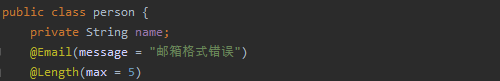
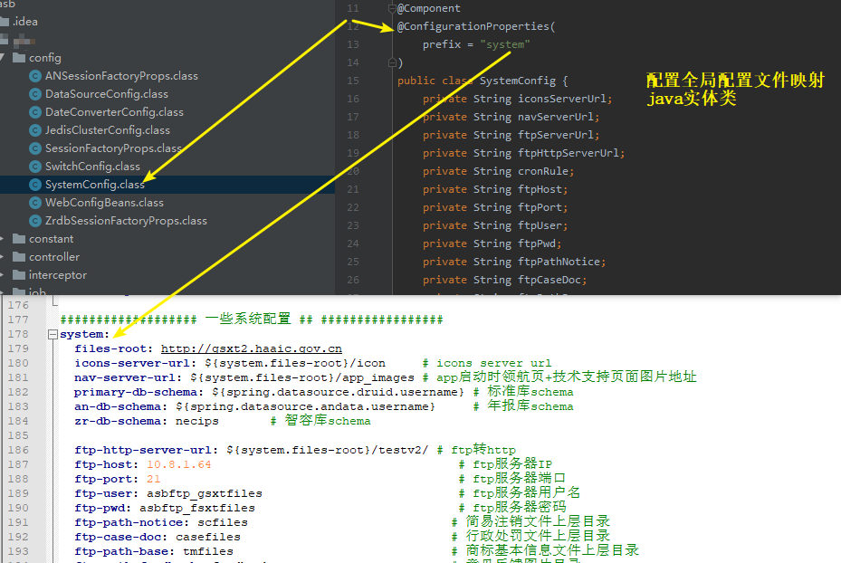

# 1.spring-boot深入学习

业务

service: userService  分布式情况下  业务放分开发那么这个服务就要独立放 提供接口


微服务的文章(汉译)

https://www.cnblogs.com/liuning8023/p/4493156.html

<<<<<<< HEAD
# springboot目前最重要的知识点

```
1.JSR303校验
2.配置文件的优先级
3.多环境切换(dev test pro(生产环境))
```

# springboot的认知和了解

内置tomcat提供了自动配置,搭建spring应用的脚手架,解决复杂的配置,混乱的依赖关系


@RestController  == @Controller + @ResponseBody

## SpringBoot的注解

```

```


### springboot的配置文件

全局配置文件

​	application.properties

​		key=value

​	application.yml(重点)


```xml
server:
  port: 8082

#对象
person:
  name: lyy
  age: 23
#行内写法
students: {name: lyy,age: 23}

#数组
pets:
  - cat
  - dog
  - pig
#数组的行内写法
pets1: [cat, dog, pig]
```

### yaml可以给实体类赋值

```
@ConfigurationProperties(prefix = "person")
通过这个注解给实体类注入yml文件中的值
yml文件中的配置

person:
  name: lyy
  age: 23
  happy: false
  birth: 2019/11/02
  maps:
    k1: v1
    k2: v2
  lists: [code, music, dog]
  dog:
    name: 旺财
    age: 2

pojo实体类
@Component  //spring容器来管理
@ConfigurationProperties(prefix = "person")
//将配置文件中的配置注入到这个实体类(单例)
public class person {
    private String name;
    private Integer age;
    private Boolean happy;
    private Date bitrh;
    private Map<String, Object> maps;
    private List<Object> lists;
    private Dog dog;

测试类中测试
    @Autowired
    private Dog dog;
    @Autowired
    private person person;
    @Test
    void contextLoads() {
        System.out.println(dog);
        System.out.println(person);
    }

```


```
person:
  name: djj
  age: 23
  happy: false
  birth: 2019/11/02
  maps:
    k1: v1
    k2: v2
  lists: [code, music, dog]
  dog:
    name: ${person.name:szj}_de_dog    //判断如果存在person.name使用person.name  如果不存在使用  szj  类似三元运算符
    age: 2
```

@PropertySource(value = "classpath:mainType.properties")

加载指定的配置文件,给变量赋值的时候只能使用@Value()


mainType.properties文件中存储properties格式

#### yml和properties的区别


#### 小结

```
1、@ConfigurationProperties只需要写一次即可 ， @Value则需要每个字段都添加

2、松散绑定：这个什么意思呢? 比如我的yml中写的last-name，这个和lastName是一样的，java的pojo实体类的变量为lastName就可以匹配到 - 后面跟着的字母默认是大写的。这就是松散绑定。但是如果使用@Value不可以这样写什么就绑定什么

3、JSR303数据校验 ， 这个就是我们可以在字段是增加一层过滤器验证 ， 可以保证数据的合法性

4、复杂类型封装，yml中可以封装对象 ， 使用value就不支持

结论：

配置yml和配置properties都可以获取到值 ， 强烈推荐 yml；

如果我们在某个业务中，只需要获取配置文件中的某个值，可以使用一下 @value；

如果说，我们专门编写了一个JavaBean来和配置文件进行一一映射，就直接@configurationProperties，不要犹豫！
```


### JSR303校验


常用的注解




    Property: person.email
    Value: 1234567
    Origin: class path resource [application.yml]:7:10
    Reason: 长度需要在0和5之间
    
    Property: person.email
    Value: 1234567
    Origin: class path resource [application.yml]:7:10
    Reason: 邮箱格式错误


## 配置文件的优先级

项目目录下的  config/application.yml  > 项目目录下的application.yml > resources根目录下的config/application.yml  >resources下的application.yml

我们默认的是resources下的application.yml 优先级最低

## 多文件环境配置


### 同文件配置


# 2.springboot的web开发

静态资源  数据库读写 异常处理  路由

springboot到底帮助我们配置了什么?我们能不能修改?能修改哪些东西?能不能扩展?

​	1.xxxAutoConfiguration  向容器中自动配置组件

​	2.xxxproperties类 自动配置类装配配置文件中自定义的一些内容


## 静态资源


html页面放置在template下  css等放置在static下


url映射  自定义mvcConfig    访问main.html/映射到dashboard.html页面

```
@Configuration
public class MyMvcConfig implements WebMvcConfigurer {

    @Override
    public void addViewControllers(ViewControllerRegistry registry) {
        registry.addViewController("/main.html").setViewName("dashboard");
    }
}
```

登陆成功重定向到main页面(标准  虚拟的)

```
public String login(@RequestParam("username") String username,
                    @RequestParam("password") String password,
                    Model model){
    if(!StringUtils.isEmpty(username) && "123456".equals(password)){
        return "redirect:/main.html";
    }
    else{
        //
        model.addAttribute("msg","登陆失败，请重新登录");
        return "index";
    }
```

拦截器


# (重点)springboot在项目中相关技术的使用

## 1.@ConfigurationProperties项目中使用在哪里

@ConfigurationProperties可以设置全局变量(注解直接映射,动态配置文件.方便更改)



配置文件中使用el表达式


## 2.JSR303项目中如何使用的

```
@NotBlank(
    message = "请输入统一社会信用代码/注册号"
)
@Length(
    max = 18,
    message = "[统一社会信用代码/注册号]最大不能超过{max}个字符"
)
private String NO;
@NotBlank(
    message = "请输入企业（个体、农专）名称"
)
@Length(
    max = 100,
    message = "[企业（个体、农专）名称]最大不能超过{max}个字符"
)
private String MAINBODY_NAME;
@NotBlank(
    message = "请输入工商联络员身份证号码"
)
private String IDCARD_NO;
@NotBlank(
    message = "请输入工商联络员姓名"
)
@Length(
    max = 100,
    message = "[工商联络员姓名]最大不能超过{max}个字符"
)
```

## 3.权限控制(redis来做)


## 4.拦截器


## 5.定时任务

开发环境的配置  日志保留三个月的


```
################### 端口+上下文 ###################
server:
  port: 8000
  context-path: /
  display-name: 国家企业信用信息公示系统(河南)--正式
  compression:
    enabled: true
  tomcat:
    max-connections: 2500
    max-threads: 1000
    max-http-header-size: 8192

################### Log4j2配置 ###################
logging:
  config: classpath:log4j2/log4j2-prod.yml

################### spring配置 ###################
spring:
  output:
    ansi:
      enabled: DETECT
  http:
    multipart:
      max-request-size: 50MB     # 最大请求大小
      max-file-size: 50MB        # 最大文件大小
      file-size-threshold: 2048KB
      location: /upload/

  datasource:
    #浪潮库
    druid:
      url: jdbc:oracle:thin:@//10.8.0.17:1521/gx
      username: AP_SBDZ
      password: AP_SBDZ_1903041130
      driver-class-name: oracle.jdbc.driver.OracleDriver
      # 以下是druid连接池配置
      initial-size: 10
      min-idle: 10
      max-active: 30
      max-wait: 60000
      time-between-eviction-runs-millis: 80000
      min-evictable-idle-time-millis: 300000
      max-evictable-idle-time-millis: 600000
      validation-query: SELECT 'x' FROM DUAL
      validation-query-timeout: 10000
      test-while-idle: true
      test-on-borrow: true
      test-on-return: false
      pool-prepared-statements: true
      max-pool-prepared-statement-per-connection-size: 50
      remove-abandoned: true         # 是否自动回收超时连接
      remove-abandoned-timeout: 60  # 超时时间(以秒数为单位)
      # 智容库
    zrdb:
        url: jdbc:oracle:thin:@//10.12.3.148:1521/jsxt
        username: shibo
        password: shibo0921
        driver-class-name: oracle.jdbc.driver.OracleDriver
        # 以下是druid连接池配置
        initial-size: 10
        min-idle: 10
        max-active: 30
        max-wait: 60000
        time-between-eviction-runs-millis: 80000
        min-evictable-idle-time-millis: 300000
        max-evictable-idle-time-millis: 600000
        validation-query: SELECT 'x' FROM DUAL
        validation-query-timeout: 10000
        test-while-idle: true
        test-on-borrow: true
        test-on-return: false
        pool-prepared-statements: true
        max-pool-prepared-statement-per-connection-size: 50
        remove-abandoned: true         # 是否自动回收超时连接
        remove-abandoned-timeout: 60  # 超时时间(以秒数为单位)

    # 年报控制库
    andata:
      url: jdbc:oracle:thin:@//10.8.0.125:1521/nbsjk
      username: nbkzk
      password: nbkzk
      driver-class-name: oracle.jdbc.driver.OracleDriver
      # 以下是druid连接池配置
      initial-size: 10
      min-idle: 10
      max-active: 30
      max-wait: 60000
      time-between-eviction-runs-millis: 80000
      min-evictable-idle-time-millis: 300000
      max-evictable-idle-time-millis: 600000
      validation-query: SELECT 'x' FROM DUAL
      validation-query-timeout: 10000
      test-while-idle: true
      test-on-borrow: true
      test-on-return: false
      pool-prepared-statements: true
      max-pool-prepared-statement-per-connection-size: 50
      remove-abandoned: true         # 是否自动回收超时连接
      remove-abandoned-timeout: 60  # 超时时间(以秒数为单位)
    # mongodb
    mongodb:
      casedata:  #行政处罚
        host: 10.8.0.45
        port: 25221
        database: casefile
        userName: AP_SBDZ
        passWord: AP_SBDZ_1903041130
        min-connections-per-host: 10
        max-connections-per-host: 100
        threads-allowed-to-block-for-connection-multiplier: 5
        server-selection-timeout: 30000
        max-wait-time: 120000
        max-connection-idel-time: 0
        max-connection-life-time: 0
        connect-timeout: 10000
        socket-timeout: 0
        socket-keep-alive: false
        ssl-enabled: false
        ssl-invalid-host-name-allowed: false
        always-use-m-beans: false
        heartbeat-socket-timeout: 20000
        heartbeat-connect-timeout: 20000
        min-heartbeat-frequency: 500
        heartbeat-frequency: 10000
        local-threshold: 15
        authentication-database: testDb

      tmdata:  #商标信息
        host: 10.8.0.45
        port: 25221
        database: tmfile
        userName: AP_SBDZ
        passWord: AP_SBDZ_1903041130
        min-connections-per-host: 10
        max-connections-per-host: 100
        threads-allowed-to-block-for-connection-multiplier: 5
        server-selection-timeout: 30000
        max-wait-time: 120000
        max-connection-idel-time: 0
        max-connection-life-time: 0
        connect-timeout: 10000
        socket-timeout: 0
        socket-keep-alive: false
        ssl-enabled: false
        ssl-invalid-host-name-allowed: false
        always-use-m-beans: false
        heartbeat-socket-timeout: 20000
        heartbeat-connect-timeout: 20000
        min-heartbeat-frequency: 500
        heartbeat-frequency: 10000
        local-threshold: 15
        authentication-database: testDb
  aop:
    proxy-target-class: true

  redis:
    password: 123456
    cluster-nodes: 192.168.0.21:6380,192.168.0.21:6381,192.168.0.21:6382,192.168.0.22:6380,192.168.0.22:6381,192.168.0.22:6382
    expire-seconds: 120     #键的过期时间(秒)
    so-timeout: 1000        #读取数据超时时间
    max-attempts: 3         #出现异常最大重试次数
    timeout: 10000
    pool:
      max-active: 5000  #最大连接数
      max-idle: 30      #最大空闲连接数
      min-idle: 5       #最小空闲连接数
      max-wait: 3000    #获取连接最大等待时间 ms  #default -1


################### sessionFactory ###################
sessionFactory:
  packages-to-scan: com.asb.gsxt.module
  dialect: org.hibernate.dialect.Oracle10gDialect
  show-sql: false
  format-sql: false
  jdbc-batch-size: 1000
  current-session-context-class: org.springframework.orm.hibernate5.SpringSessionContext
  # ehcache
  use-second-level-cache: true
  use-query-cache: true
  cache-region-factory-class: org.hibernate.cache.ehcache.SingletonEhCacheRegionFactory
  cache-region-prefix: hibernate
  generate-statistics: false
  use-structured-entries: false
  provider-configuration-file-resource-path: ehcache.xml
andatasessionFactory:
  packages-to-scan: com.asb.gsxt.nbkzk.module
  dialect: org.hibernate.dialect.Oracle10gDialect
  show-sql: false
  format-sql: true
  hbm2ddl-auto: none
  jdbc-batch-size: 100
  current-session-context-class: org.springframework.orm.hibernate5.SpringSessionContext
  # ehcache
  use-second-level-cache: true
  use-query-cache: true
  cache-region-factory-class: org.hibernate.cache.ehcache.SingletonEhCacheRegionFactory
  cache-region-prefix: hibernate
  generate-statistics: false
  use-structured-entries: false
  provider-configuration-file-resource-path: ehcache.xml
zrdbsessionFactory:
  packages-to-scan: com.asb.gsxt.zrdb.module
  dialect: org.hibernate.dialect.Oracle10gDialect
  show-sql: true
  format-sql: true
  hbm2ddl-auto: none
  jdbc-batch-size: 100
  current-session-context-class: org.springframework.orm.hibernate5.SpringSessionContext
  # ehcache
  use-second-level-cache: false
  use-query-cache: false
  cache-region-factory-class: org.hibernate.cache.ehcache.SingletonEhCacheRegionFactory
  cache-region-prefix: hibernate
  generate-statistics: false
  use-structured-entries: false
  provider-configuration-file-resource-path: ehcache.xml
################### Id生成器 ###################
idWorker:
  worker-id: 0
  datacenter-id: 0

################### 一些开关配置 ###################
switch:
  interceptor: true

################### 一些系统配置 ###################
system:
  files-root: http://gsxt2.haaic.gov.cn
  icons-server-url: ${system.files-root}/icon     # icons server url
  nav-server-url: ${system.files-root}/app_images # app启动时领航页+技术支持页面图片地址
  primary-db-schema: ${spring.datasource.druid.username}   # 标准库schema
  an-db-schema: ${spring.datasource.andata.username}       # 年报库schema
  zr-db-schema: sjtbk                                      # 智容库schema

  ftp-http-server-url: ${system.files-root}/           # ftp转http
  ftp-host: 192.168.0.24                               # ftp服务器IP
  ftp-port: 21                                         # ftp服务器端口
  ftp-user: xftpadmin                                  # ftp服务器用户名
  ftp-pwd: 123456                                      # ftp服务器密码
  ftp-path-notice: scfiles                             # 简易注销文件上层目录
  ftp-case-doc: casefiles                              # 行政处罚文件上层目录
  ftp-path-base: tmfiles                               # 商标基本信息文件上层目录
  ftp-path-feedback: feedback                          # 意见反馈图片目录
  ftp-path-noticeinfo: noticeinfo                      # 公告信息
  ftp-path-objection: objectionAccept                  # 经营异常异议
  ftp-path-out: outAccept                              # 经营异常移出
  http-path-template: nbws                             # 模板下载目录
  template-suffix: .doc                                # 模板下载后缀
  auth-url: http://172.24.1.173:8001/api/v1/qrCheck    # 电子营业执照登录请求报文
  ca-login-url: http://172.24.1.173:8001/api/v1/svsCa  # CA登录请求报文
  sms-url: http://172.24.1.173:8001/api/v1/sendSMS     # 短信服务器地址
  sms-login-valid-time: 8                              # 登录短信验证码有效时间(分钟)
  ########## 本地内网文件系统地址 ##############
  lan-file-system-host: 192.168.0.24:8000
  ########## 智容ftp配置 ##############
  # ftp转http(下载文件使用)
  zr-ftp-http-server-url: ${system.files-root}/gsxtfiles/
  # ip
  zr-ftp-host: 10.8.1.64
  # 端口
  zr-ftp-port: 21
  # 用户名
  zr-ftp-user: "asbftp_gsxtfiles"
  # 密码
  zr-ftp-pwd: "asbftp_gsxtfiles"
  # 经营异常异议文件目录
  zr-ftp-path-objection: /
  # 经营异常移出文件目录
  zr-ftp-path-out: /
  zr-opinion-ftp-user: "asbftp_from_ywgl"                   #意见反馈ftp用户名
  zr-opinion-ftp-pwd: "asbftp_from_ywgl321"                 #意见反馈ftp密码
  zr-opinion-ftp-path: /
  ########## 智容ftp配置end ##############
  year-start-qy: 2013   # 企业年报填报开始年份
  year-start-nz: 2014  # 农专年报填报开始年份
  year-start-gt: 2013  # 个体年报填报开始年份
  ######### 集团成员接口地址 ##############
  group-number-domain: http://172.16.13.10:9999
  group-number-suffix: /api/EnterQuery/EntIndexInfoByCon
  group-number-app-key: henan_api
  group-number-secret-key: henan$1442
  ##############营业执照作废声明签名密钥######################
  license-nullify-key: 789LICE36gsT45FDG724gSENUL6R
  ###############企业、农专、个体年报截止时间#####################
  report-month-end-qy: 6
  report-month-end-nz: 6
  report-month-end-gt: 12
  report-day-end-qy: 30
  report-day-end-nz: 30
  report-day-end-gt: 31
  ##############校验年报信息标识##################

```
=======
## 静态文件的导入

1.springboot中可以以下方式处理静态资源

​	webjars   localhost:8080/webjars/

​	resources下配置的这三个目录  pulic static resources下  存放的资源可以直接ip:port/资源名称   访问

```
webjars(一个)
以maven坐标的方式导入静态文件

```


同名文件resources优先级大于static大于public

resources>static(默认)>public

一般在public下放一些公共的资源,比如都会访问的js,static下放一些静态资源,比如说图片,resources下放一些上传的文件

## template下的所有页面,只能通过controller来跳转,需要模板引擎thymeleaf的支持

resources>static(默认)>public   下的index.html


一般都放在template下   只能通过controller访问到这个文件夹

springboot2.0版本设置网址图标


index文件

```
<!DOCTYPE html>
<html  lang="en" xmlns:th="http://www.thymeleaf.org" >
<head>
    <title>主页</title>
    <link rel="icon" href="favicon.ico" >
    <!-- <link rel="icon" th:href="@{favicon.ico}" >  <!-- thymeleaf方式-->
</head>
<body>
<h2>This is a homepage!!</h2>
</body>
</html>

```


# thymeleaf模板引擎


## 结论

​	只要需要使用thymeleaf,只需要导入对应的依赖即可,我们将html页面放在我们的template下即可

## 使用thymeleaf

1.导入命名空间

2.在html页面取值

​	$取变量

所有的html元素都可以被thymeleaf替换接管   th:元素名

```
<div th:text="${message}"></div> 
java类中
model.addAttribute("message","hello,lyy");
return "test";
```


### thymeleaf基础语法


### test和untest(将含有html标签的内容转义)

```
 model.addAttribute("message","<h1>hello,springBoot<h1>");
 return "test";

<div th:text="${message}"></div>
<div th:utext="${message}"></div>
```


### 遍历的两种方式

```
 model.addAttribute("users", Arrays.asList("lyy","hht"));
 return "test";
<h3 th:each="user:${users}" th:text="${user}"></h3>
<h3 th:each="user:${users}">[[${user}]]</h3>
```


国际化

i18n

*i18n*（其来源是英文单词 internationalization的首末字符i和n，18为中间的字符数）是“国际化”的简称。

k8s

*k8s*全称kubernetes,这个名字大家应该都不陌生,*k8s*是为容器服务而生的一个可移植容器的编排管理工具,越来越多的公司正在拥抱*k8s*,并且当前*k8s*已经主导了云业务流程
>>>>>>> f9fd40f4c31d53558e4845256b28d8f2a46378b2

# [Spring之 JDBCTemplate和 HibernateTemplate区别](https://www.cnblogs.com/Hibara/p/8493546.html)

JDBCTemplate是Spring对jdbc的封装，但sql需要自己写，增加了灵活性和复杂性，但是不利于跨数据库使用。
若使用HibernateTemplate则不用关心底层的数据库是哪个数据库，在编程方面，也更对象化了


如何来写一个网站

1.前端

​	模板 别人写好的 我们来改

​	框架 组件 自己手动组合拼接  bootstrap  


非spring官方写的用框架名开头

例如   mybatis_-spring-boot-stater


## springboot的主要特性


