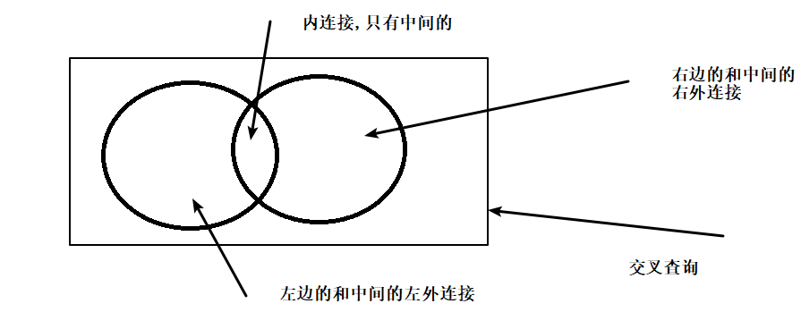
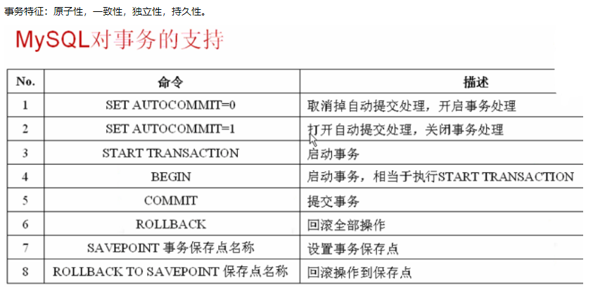
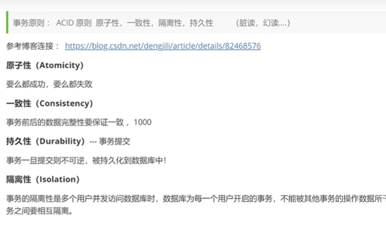
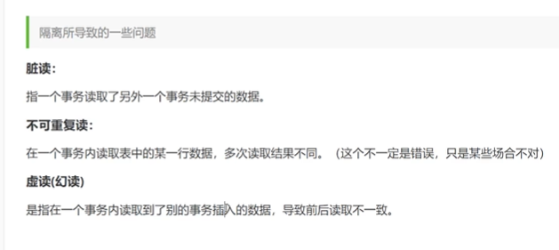
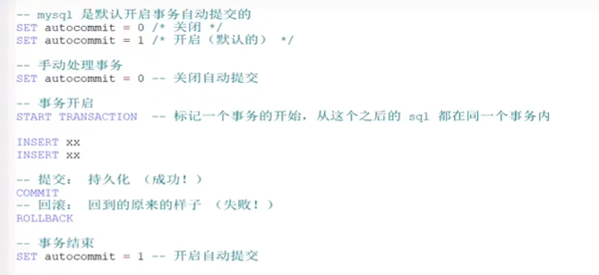
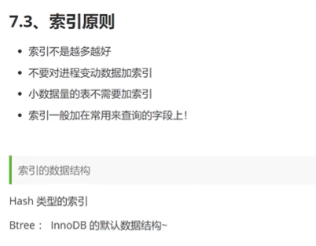
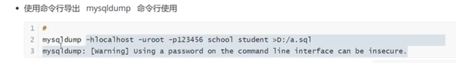
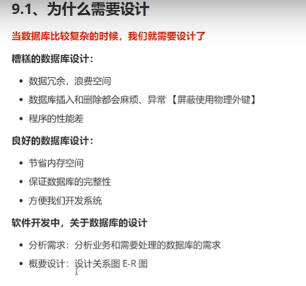
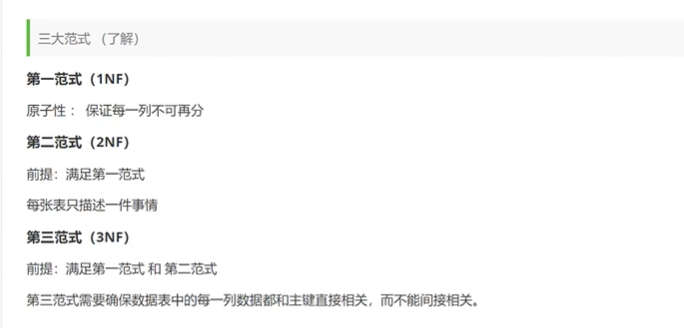

delete和truncate表 数据的删除

​	delete from 表名 where 条件;

​	truncate table  表名; 

delete是属于DML语言,可以回退(可以将数据找回来),可以有条件的删除

truncate是属于DDL语言,无法回退(不可以将数据找回来),默认所有的表内容都删除,删除速度比delete快.

select e.PRIPID as PRIPID,e.REGSTATE as REGSTATE,e.NAME as NAME,p.CERNO as CERNO ,e.uniscid
 from E_PB_BASEINFO@jsxt_lc e,E_PB_OPERATOR@jsxt_lc p 
 where (e.UNISCID = '91410102599107196E' or e.REGNO = '410223601879743') 
 and p.PRIPID = e.PRIPID and e.NAME =p.NAME
 and (p.DATA_STATUS='1' or p.DATA_STATUS is null)
 and regstate='1';

多表查询

​	1.交叉查询,两张表的数据做连接,会出现错误数据,

​		比如 主表三条数据  从表九条数据  会查询出27条

​		select * from table_a, table_b;

​	2.内连接查询

​		隐式内连接 

​			条件是主表的主键必须等于从表的外键	

​			select * from table_a, table_b where table_a_cid = table_b_cid;

​		显式内连接

​			inner join

​	3.外连接查询

​		左外连接

​		右外连接

# 多表查询

1.交叉查询   返回两张表的笛卡尔积(会返回每两条数据的连接,A表的每一条数据都对应B表的每一条数据,会生成错误数据)

2.内连接

​	显式内连接  inner join   on  

​	隐式内连接

3.外连接   

​	左外连接  left  join   on  

​	右外连接  right join  

a> inner join：理解为“有效连接”，两张表中都有的数据才会显示

left join：理解为“有左显示”，比如on a.field=b.field，则显示a表中存在的全部数据及a\\b中都有的数据，A中有、B没有的数据以null显示

b> right join：理解为“有右显示”，比如on a.field=b.field，则显示B表中存在的全部数据及a\\b中都有的数据，B中有、A没有的数据以null显示

子查询

​	一条sql语句当做另一条sql语句的判断条件

​	一天sql语句作为另一张表  和其他表进行隐式内连接查询

# 数据库的引擎

## INNODB (现在默认使用) 和 MYISAM(以前的版本使用)

| 引擎区别   | MYISAM | INOODB   |
| ---------- | ------ | -------- |
| 事务支持   | 不支持 | 支持     |
| 数据行锁定 | 不支持 | 支持     |
| 外键约束   | 不支持 | 支持     |
| 全文索引   | 支持   | 不支持   |
|            | 较小   | 约为两倍 |

常规使用操作

MYISAM    节约空间,速度较快

INNODB  安全性较高 事物的处理 多表多用户的操作

## 修改表

alter

重命名表名和字段名

### 表名

   alter table  表名   rename as 新表名

### 字段名

alter table 表名 change 字段名  新字段名

### 修改表的字段modify

alter table 表名 modify 字段名 字段类型

## modify和change的区别

modify不能修改列名,可以用来修改字段类型和列约束 而change不能用来修该列约束,只能用来修改列名

### 增加表的字段

alter table 表名 add 字段名 列约束

### 删除表的字段

alter table 表名 drop 字段名

## DML语言(database manage language ) 数据库管理语言(增删改)

### insert 

插入语句,如果不写要插入的字段,那么后面的values要与数据库的表一一对应,

如果写了要插入的字段,那么id啊这类自增和非空的字段就可以不用写了

如果要一条语句插入多条数据的值,那么values('值1','值2'),('值1','值2');

#### 语法

  insert into 表名 (`字段1`,`字段2`) values ('值1','值2');

### delete

### update(修改)

update 表名 set 操作 where条件;

不指定条件的情况下,会改动所有表.

## select  DQL(数据库查询语句)

### 去重

### 模糊查询

## 条件查询

 比较运算符

逻辑运算符  between  and   in

## 分页和排序查询

升序  asc

降序  desc

order by 字段名 asc/desc;

分页

缓解数据库压力,给人的体验更好,例如瀑布流.(百度的图片展示,可以一直往下拉)

limit 1,5   当前页和每页显示的条数   

(1-0)*5

select完整的语法

## mysql的聚合函数(对聚合函数进行过滤用having)

count()

count()的一个面试题

有主键的时候,用count(主键)  查询效率最快

sum()

avg()

max()

min()

## MD5()  加密

mysql中有个关于MD5加密的函数是个sql的函数

# 事务

# Mysql的索引

mysql官方对索引的定义为: 索引(index)是帮助Mysql高效获取数据的数据结构

提取句子主干,就可以得到索引的本质:索引的本质是数据结构

索引的分类

## 主键索引(primary key)

唯一的标识,主键不可重复,只能有一个列作为主键

### 唯一标识(unique key)

避免重复的列出现,唯一索引可以重复,一个表中多个列都可以标识为唯一索引

### 常规索引(key/index)

默认的,index,key关键字来设置

## 全文索引(fullText)

在特定的数据库引擎下才有,MyIsam

快速定位数据

## 索引的作用

索引在小数据量的时候,用处不大,但是在大数据量的时候,会极大减少查询时间,区别十分明显

# 数据库备份

1.为什么要备份

保证重要的数据不丢失

数据转移

2.mysql数据备份的方式

直接拷贝物理文件

可视化工具中导出

使用命令行导出

## 设计数据库

## 数据库的三大范式

